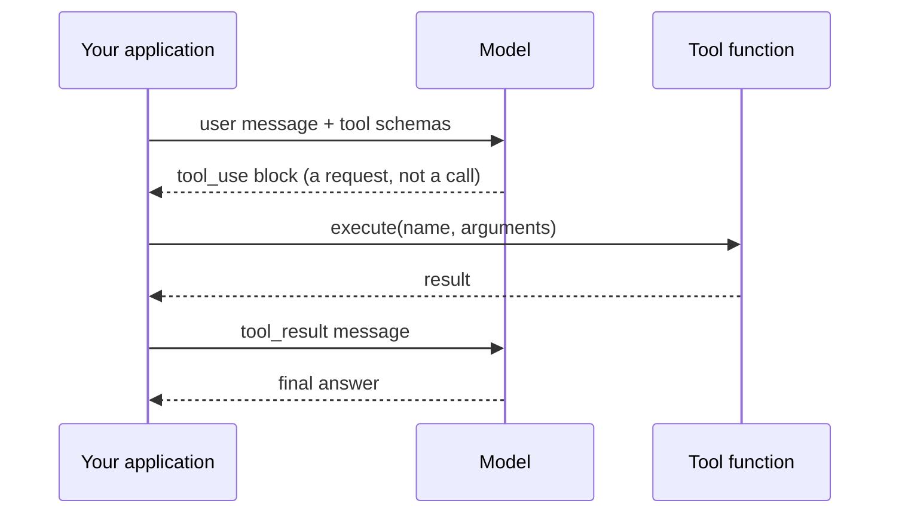

# 第 01 章 — 一次工具调用

## TL;DR

一次工具调用 (tool call) 是每个 agent 的原子单位。模型发出一个结构化请求,描述要用什么参数调用哪个函数;你的代码运行它;结果作为另一条消息回送;模型写出最终回答。还没有循环、没有内存、没有编排 —— 就是一次往返。本章讲的就是如何把这次往返做对。课程其余部分都是建立在这同一个机制之上的变种与堆叠。

---

## 为什么这件事重要

问模型 "4,892,769 的平方根是多少",它会给你一个近似值。问它 "东京现在的天气怎么样",它会编造。这不是 bug —— 对于一个没有计算器、没有联网的 next-token 预测器来说,这就是正确行为。

函数调用 (function calling) 不会让模型变得更聪明。它给模型一种方式去**向你的代码索取**那些它自己做不到的东西。模型决定 *何时* 索取、*用什么参数* 索取;真正的工作发生在你可以保证正确性的地方 —— 你的代码里。一旦这个分工进入你的脑子,你写出的工具会更好,坏掉的 agent 会更少。

---

## 概念

### 模型写需求单,你的代码做事

想象一位主厨,他能读懂餐厅里的客人需要什么,但自己不下厨。主厨写一张单子 —— "两个鸡蛋,炒,干吐司" —— 把它递给后厨。后厨执行。盘子端回来。主厨摆盘出菜。

一个带工具的语言模型就是这个主厨。它的"单子"是一个结构化的块,里面写着 *调用哪个工具*、*用什么参数*。它自己跑不了那个函数 —— 它什么都跑不了。你的应用就是后厨。

出问题的时候,问题就变成了一个诊断问题:是主厨写错了订单,还是后厨做错了菜?两种不同的故障,两种不同的修法。一旦你能在脑子里把它们分开,debug 就不再像变魔术了。

### 四步周期



1. **描述工具。** 把用户消息和一份工具定义列表一起发送 —— 名称、描述、参数的 JSON schema。
2. **模型发出请求。** 如果模型认为需要一个工具,响应里会包含一个结构化块 —— 在 Anthropic 风格的 API 里叫 `tool_use`,在 OpenAI 风格的 API 里叫 `tool_calls` —— 带有唯一的 `id`、工具名和参数。
3. **你执行。** 按名字查到函数,根据 schema 验证参数,运行它,拿到结果。
4. **把结果回送。** 发一条 `tool_result` 消息,引用同一个 `id`。模型现在拿到了答案,写出它的最终回复。

```jsonc
// What the model emits in step 2 — a request, not a call.
{ id: "call_abc", name: "get_weather", input: { city: "Tokyo" } }

// What you send back in step 4 — same id, your result as content.
{ tool_use_id: "call_abc", content: "18°C, partly cloudy" }
```

无论工具是去拿天气、查你的数据库,还是跑一条 shell 命令,协议都是一样的。线上的格式不在乎工具具体做什么;你才在乎。

### Schema 就是契约

工具定义有三个部分是模型能看见的:

- **Name** —— 模型调用它时用的标识符。
- **Description** —— 用自然语言告诉模型 *什么时候用它、什么时候不用、它返回什么*。这是模型唯一的指引。一个含糊的描述 ("get weather") 会让模型在错误的时机调用它;一个精确的描述 ("返回单个城市的当前天气情况;不要用于历史数据") 会显著减少误用。
- **Input schema** —— 每个参数的 JSON Schema:名字、类型、是否必填、每个字段的描述。

```jsonc
// What a tool definition looks like — shape, not a specific SDK.
{
  name: "get_weather",
  description: "Returns current conditions for a single city. \
                Use for weather questions; do not use for historical data.",
  input_schema: {
    type: "object",
    properties: { city: { type: "string", description: "e.g. 'Tokyo'" } },
    required: ["city"]
  }
}
```

让你的 agent 用你自己的语言和技术栈写第一个工具定义。它会写的。读一下它产出的东西,检查 description 是不是同时告诉了模型 *什么时候* 调用这个工具、*什么时候* 不调用。生产环境里 agent 一半的 bug 都能追溯到 description 没有写 "不要用于 X"。

### Schema 和函数必须一起改

工具调用里最常见的静默故障是 schema 漂移 (schema drift)。你把代码里一个参数从 `city` 改名为 `location`,但 schema 仍然写着 `city`。模型忠实地发出 `{ "city": "Tokyo" }`。你的派发代码把它传给一个期望 `location` 的函数。函数在运行时炸掉 —— 而看 schema 的模型完全不知道为什么。

Schema 是你与模型签订的契约。打破契约,模型没法察觉。把 schema 和 handler 当作同一个单元;改一个就在同一次提交里改另一个。Sebastian Raschka 的编码 agent 教程里把这一点讲得特别透 —— 如果你对 schema 和 handler 的关系仍然觉得模糊,值得一读。

### 错误输入和异常是消息,不是抛出来的东西

模型发出的参数 *大多数时候* 与 schema 匹配。有时它会把字符串当整数发过来,有时它会漏掉一个标记为可选但你的代码实际上需要的字段,有时它会发出一个不在允许枚举里的值。函数本身也可能在运行时失败 —— 文件找不到、网络超时、权限被拒。这些都不应该把对话搞崩。

每一个生产系统都会收敛到的模式:

- 在执行之前用 schema 验证参数。
- 如果验证失败,把错误作为 `tool_result` 返回。不要 throw。
- 如果函数在运行时失败,*同样* 把它作为 `tool_result` 返回 —— 写一条对模型有用的消息,而不是一段堆栈跟踪。

模型对它能读到的错误恢复得出奇地好。它无法从把进程干掉的错误中恢复。把异常包装成 tool result,就是优雅重试的 agent 与在任务中途默默停下的 agent 之间的差别。

### 工具结果是有形状的

关于结果有两件事,在你交付过一个之前不会注意到。

**`id` 往返是强制的。** 每个 `tool_use` 块都有一个 `id`。你的 `tool_result` 必须引用同一个 `id`。丢掉这个关联,模型就没法把结果对应到请求 —— 对话会以让人困惑的方式崩坏。这是机械性的、容易漏的,值得写一个单元测试。

**大的结果不能放在 inline 里。** 一次返回 50 KB 的 grep,或者一次返回 2 MB 的 file read,会撑爆你的 context window、毁掉你的 prompt cache、让之后每一轮都变慢。生产中的做法:如果一个结果超过某个阈值,给模型发一段摘要加一个指针,把完整内容存到某个模型需要时可以再取的位置。OpenCode 把它封装在一个专门的 truncation service 里;Hermes Agent 强制每个工具的 result-size 上限。你的 agent 能在十分钟内为你的技术栈搭出等价物。

### 几个值得了解的厂商特有旋钮

四步周期是通用的。厂商在它之上叠了一些控制项和模式,用来以有用的方式改变这个周期的行为。在上生产之前值得了解六个:

- **`tool_choice`。** 对单次请求控制模型 *必须* 调用一个工具、*可以* 调用任意工具、*不可以* 调用工具、还是 *必须调用某个特定工具*。当你知道答案必须依赖工具(比如路由层)时用 *must-call-X*;当你想要纯文本时用 *none*。Anthropic、OpenAI、Bedrock、Gemini 都以某种形式支持。
- **并行工具调用。** 现代 provider 允许模型在一次响应里发出多个 `tool_use` 块。OpenAI 提供一个按请求生效的 `parallel_tool_calls: false` 开关,可以在下游无法乱序处理时把它关掉。第 02 章会讲循环如何分发多次调用;开关在这里。
- **Strict schema 模式。** OpenAI 的 `strict: true`(以及其他厂商的等价物)保证模型产出的参数严格匹配 JSON schema。打开 strict,你可以省掉一半的验证代码;关闭它,你必须在派发边界做防御。取舍:strict 模式会限制 schema 能表达的内容(支持的 JSON Schema 特性更少)。
- **结构化输出 (Structured outputs)。** 工具调用的近亲。不是 *用这些参数调用这个工具*,而是告诉模型 *按这个 schema 返回 JSON*。同样的 JSON-schema 纪律;不同的机制(用 `response_format` 字段而不是工具定义)。当模型的最终输出是数据而不是动作时使用。
- **托管(内置)工具。** Provider 自己提供并执行的工具,不是你执行 —— web search、code execution、file search、computer use。线上的 schema 和 tool-use 形态看起来一样,但结果回来时你的派发代码并没有跑。取舍:集成更简单,对运行什么和如何计费的控制更少。
- **拒答与内容过滤。** 模型可能基于安全原因拒绝调用某个工具(或任何工具)。Anthropic 通过一个 `refusal` 块返回;OpenAI 通过一个独立的 content type 或 finish reason 返回。把 refusal 当作普通的 tool result 来处理 —— 记录它、把它呈现给用户、让循环继续。第 18 章会讲更深的威胁模型;这一章只要你知道 refusal 是存在的。

线上的格式和确切字段名会变;概念是稳定的。在你接入这些任何一个的当天,让你的 agent 拉一下当前 provider 的文档。

### Provider 之间不同,概念相同

Anthropic 用 `tool_use` 和 `input`。OpenAI 用 `tool_calls` 和 `arguments`。Bedrock 有自己的形态。更高层的 SDK(Vercel AI SDK、LangChain、Hermes Agent 和 OpenCode 里自己写的 adapter)会把它们归一化。字段名换来换去。机制 —— 模型发出结构化请求、代码执行、结果回送 —— 在所有地方都是一样的。如果你能读懂某一家 provider 的文档,五分钟之内就能读懂另一家。

如果你是认真在做,把线上格式藏到一个小 adapter 后面,这样你的工具不会在乎你上周用的是哪家 provider。OpenCode 和 Hermes Agent 都正是这么做的;让你的 agent 给你的技术栈搭一个脚手架。

---

## 真实系统笔记

- **OpenCode** 用一个小小的 `Tool.define` helper 包装的类型化 schema 来定义工具,把每次调用作为一个类型化的生命周期对象来追踪,并通过专门的 service 截断大输出。是 "干净的工具注册表长什么样" 的强参考。
- **Hermes Agent** 用 `ToolEntry` 对象把 schema、handler 和每个工具的 result-size 上限打包在一起,并把工具错误分成可恢复 (recoverable) 与致命 (fatal) 两类,这样循环就知道要不要重试。
- **OpenClaw** 和 **Paperclip** 表明 "工具" 不一定是本地函数。Channel adapter、工作流步骤、shell 命令,甚至对其他 agent 的调用,只要遵循同样的 name + schema + result 契约,都可以变成模型能调用的工具。

---

## 与你的 agent 结对

几个在本章上效果很好的 prompt:

- *"用我的语言和技术栈定义我项目里的一个工具。让描述既告诉模型何时使用,也告诉它何时不要使用。然后给我看模型调用它时会发出的精确 JSON。"*
- *"在 handler 里重命名一个字段,但不动 schema。Mock 一次模型调用,准确地告诉我故障会如何出现,以及我应该在哪里捕获它。"*
- *"包装我的工具,让任何抛出的异常都变成模型能读、能重试的 `tool_result` 错误。给我看修改前后的对照。"*
- *"实现结果截断:如果工具返回超过 4 KB,给模型发一份摘要,并把完整结果写入模型可以请求的临时文件。"*
- *"带我走一遍 OpenCode 如何定义和派发一个工具,然后用我的技术栈写出等价版本 —— 保留同样的形态,但用我的习惯写法。"*

---

## 下一步

一次工具调用是原子。第 02 章把它放进一个带停止条件、重试、以及把调用串成多步工作的循环里。那就是 chatbot 结束、agent 开始的分界线。
