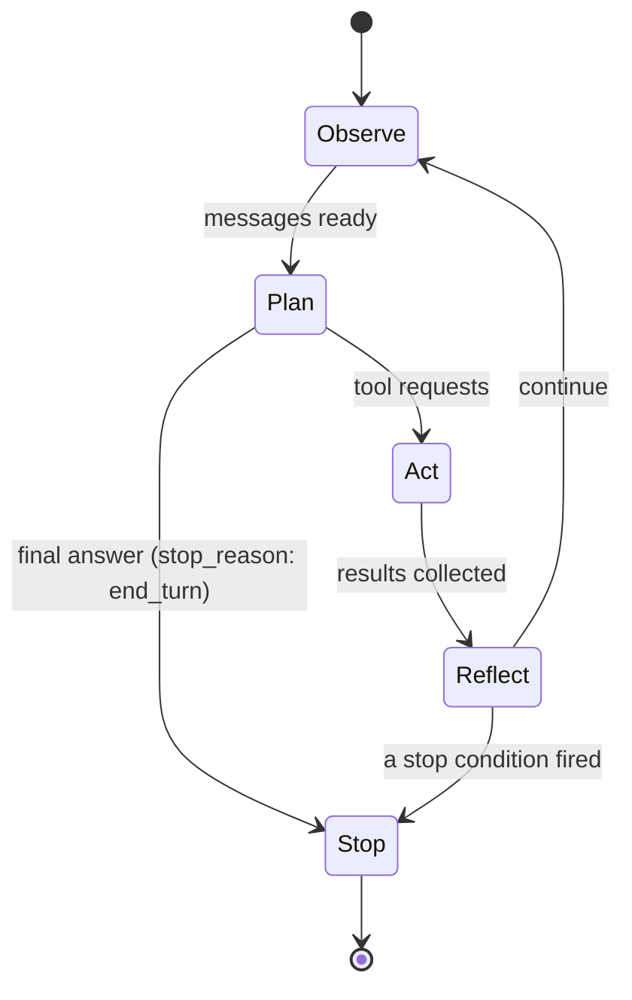
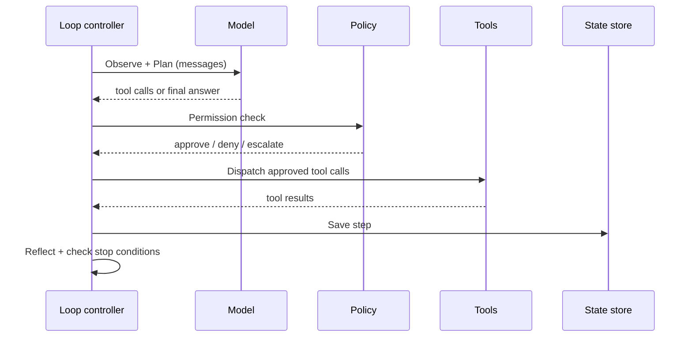

# 第 02 章 — Agent 循环

## TL;DR

第 01 章是一次工具调用。本章把那次调用包进一个循环里。模型发出工具请求,你的代码执行它,结果回送,模型 *再次* 决定是再调一个工具还是停下来。难的不是循环体;难的是停。把停止条件搞错,你要么造出一个对话到一半就退出的 chatbot,要么造出一个一直跑到把账单打爆的 agent。本章讲循环的形态、各种停下来的方式构成的频谱、藏在里面的失败模式,以及每一种生产能力 —— 持久性、可观测性、权限、审批、压缩 —— 最终都会挂在上面的那个 step 边界。

---

## 为什么这件事重要

同事递给你一个 agent,告诉你它 "demo 里能跑,生产里永远不停"。你读代码。循环在。模型发出工具调用。工具结果回来。但没有任何东西告诉模型该什么时候停,也没有任何东西告诉循环:如果模型从不说自己做完了该怎么办。你加一行 `if step > 20: break`。循环退出了 —— 但现在它在回答一半的时候退出。你把 break 移到模型回复之后。大部分时候它干净地退出,但偶尔模型在看起来已经是最终回答之后又发出一个工具调用,你就默默地漏掉了结果。你为此花了一天。

修法不是再加代码。修法是理解:循环有 *好几种* 结束方式,它们都得在场,而模型自己的 `stop_reason` 才是首要信号 —— 不是一个行数计数器。

---

## 概念

### 一次工具调用通常不够

一个简单问题 —— "东京天气怎么样" —— 一次调用就够了。一个真实问题 —— "这个周末东京适合野餐吗?如果适合,我周六日历有空吗?" —— 至少需要一次天气查询、一次日历查询和一次对比。两次调用,可能互相依赖,可能还要第三次去做澄清。你没法事先决定到底需要几次;模型必须在每一步根据它当下已经学到的东西来决定。

这就是 agent 循环:第 01 章的周期重复发生,每一轮之后有一个决策点 —— 继续,还是停下?

### 五个阶段

想象一间忙碌的厨房在出餐高峰期。大厨(模型)喊出订单,后厨(你的工具)执行,大厨尝一尝回来的东西然后喊下一轮 —— 直到菜摆好盘送出去。二厨(你的循环控制器)不决定菜什么时候做好。大厨决定。但如果大厨突然沉默,或者菜已经从传菜口出去之后还在继续喊单,二厨就需要一个备份方案 —— 一个预算、一个计时器、一只手按在铃上 —— 让厨房不至于滑进混乱。

不管你怎么叫这个循环 —— ReAct、plan-and-execute、think-act-observe —— 底下都是同样五个阶段:

- **Observe(观察)。** 收集模型需要的一切:用户消息、system prompt、之前的工具结果、检索到的 context。在实践里,这就是不断增长的消息数组。
- **Plan(规划)。** 调用模型。它返回的是工具请求、最终回答,或者一个反问。这里你的代码不做决定;模型做决定。
- **Act(行动)。** 执行工具请求。一次调用或多次 —— 跟你在第 01 章写的派发逻辑一样,现在放进循环里。
- **Reflect(反思)。** 把工具结果附加到消息数组,并匹配 `id`。模型现在能看到刚才发生了什么。
- **Stop(停止)。** 检查是否有任何停止条件触发。如果有,返回。如果没有,回到 Observe。



### 循环实际上携带的东西

循环不只是在走消息数组。它在两次迭代之间还持有:

- **到目前为止花掉的 token** —— 用于预算检查。
- **Step 计数** —— 用于迭代上限。
- **最近几次工具调用的简短历史** —— 用于检测 doom loop(下文)。
- **一个 abort token** —— 让用户或系统的另一部分可以中途取消。
- **System prompt** —— 在迭代之间保持字节稳定 (byte-stable),让前缀缓存继续命中(第 04 章解释为什么)。

只有当你第一次试图从崩溃中 *恢复* 一个循环时,才会意识到它携带了多少东西。那是第 08 章的问题。眼下,只需要知道消息数组并不是故事的全部。

### 停止条件是一个频谱,不是一张 checklist

每个生产循环都会用好几个停止条件,从最软到最硬层层叠加:

- **模型驱动的停止 (model-driven stop)。** 模型返回没有工具调用,finish reason 是 `end_turn`(或 OpenAI 风格 API 里的 `stop`)。这是首要信号 —— 模型认为自己做完了。
- **显式 `final_answer` 工具。** 在 registry 里加一个 `final_answer(text)` 工具。把它做成模型提交结果的唯一合法方式。这强制了有意识的结束、防止模型在答案已经存在之后还漂到多余的调用上,并给你一个干净、规范的输出可以记录。
- **Grace call(宽限调用)。** 一些系统在预算几乎耗尽时给模型最后一轮机会,在 prompt 里留一句:"你还剩一轮,赶紧收尾"。模型通常会干净地收掉。没有这个,硬上限会把对话切在思考中间。OpenClaw 是这个模式最清晰的参考。
- **Step 上限。** 一个迭代次数的硬天花板 —— 通常 10–50,在长时间运行的助理系统里有时到 90 左右。这是兜底网,不是首要停止机制。如果你的循环大多数时候停在这里,那说明上游有问题。
- **Token 或成本上限。** 当总 token 或累计成本越过阈值时退出。把已经产出的东西标记为 partial 返回。

线上的形态:

```ts
// Minimal loop — the shape, not your final code.
for (let step = 0; step < MAX_STEPS && totalTokens < TOKEN_BUDGET; step++) {
  const response = await llm.complete({ messages, tools });
  totalTokens += response.usage.totalTokens;

  // Model-driven stop or explicit final_answer.
  if (isFinalAnswer(response)) return finalize(response);

  // Act + Reflect.
  for (const call of response.toolCalls) {
    const result = await dispatch(call.name, call.args);
    messages.push(toolResult(call.id, result));
  }
}
return partialResult(messages, "budget_exhausted");
```

让你的 agent 把这个翻译到你的技术栈,然后加上 grace-call 行为,这样你就不会在思考中途被默默切断。

### 有时正确答案是压缩 (compact),不是继续或停下

每一步之后,循环实际上有三种选择,不是两种:继续下一轮迭代、因为某个条件触发而停止,或者 *compact* —— 暂停,把消息数组缩小,然后继续。当 context window 快被填满时会触发压缩;OpenCode 的 session processor 监视一个 usable-context 计算,Hermes Agent 通过 token-overflow 检查触发它。机制 —— 剪掉什么、总结什么、原文保留什么 —— 属于第 05 章。属于 *这一章* 的是:认识到循环有第三个杠杆,不只是开/关开关,而 step 边界就是它被拉动的地方。

### 错误也是 turn

当工具失败或者模型发出一个格式有误的工具调用时,正确做法 —— 几乎总是 —— 是把错误作为 `tool_result` 附加进去,然后继续循环。模型很擅长读一条错误然后要么用纠正后的参数重试,要么换一种思路。从循环里抛出异常几乎从来不是答案。

两类错误重要:

- **Transient(瞬时)。** 网络抖动、限流、模型过载。带退避地重试(生产系统的调度从几秒到两小时不等)。在反复失败之后,降级到一个 *兼容* 的模型 —— 一个支持相同工具 schema、至少能容纳这一轮所需 context window、并满足任务推理与内容政策要求的模型。如果一个 fallback 缺少主模型的工具格式、context 容量或政策对等性,它就不是 fallback —— 而是另一种失败模式。Hermes Agent 和 OpenClaw 都自带可配置的 fallback chain;兼容性就在 chain 的定义里声明。
- **Permanent(永久)。** 凭据错误、schema 验证失败、registry 里没有这个工具。立刻浮出。再怎么重试都修不好。

每个值得研究的系统最终都收敛到同样的形状:先对错误分类,再路由到 retry、fallback 或浮出。让你的 agent 把 `classify_error(err) → action` 接到你的循环里,并写出证明每个类别都被正确路由的测试。

### Doom loop 以及如何抓到它

最常见的失控模式是 *doom loop*:模型连续三四次用相同参数调用相同工具,得到同样无用的结果,却没注意到自己卡住了。OpenCode 和 Hermes Agent 都自带显式检测 —— 常规规则是 "如果最近三次工具调用的名字和参数完全一致,暂停并请求继续的许可"。

逐字节相等捕获了大多数情况。它捕获不到调用形态在变但实际并没有进展的慢循环 —— `read(file, offset=0)` → `read(file, offset=100)` → `read(file, offset=200)` —— 模型一直在 "看" 但始终找不到。对这种情况,你要么需要一个能追踪自己进度的工具,要么需要一个启发式:消息数组增长了多少却没产出有用输出。多数团队的做法是从逐字节比对起步,加一个 step 上限,然后接受 "成本预算会兜住更细微的卡死状态" 这件事。

### 一轮中的并行工具调用

现代 provider 允许模型在一次响应里发出多个工具请求。如果工具相互独立且可以并发安全地运行,你就该并行 —— 这能大幅压缩 wall-clock 延迟。OpenClaw 和 Hermes Agent 的模式:把每个工具标记为 `concurrency_safe: true | false`,安全的在 worker 池(常见上限 8 个)上跑,其余的串行化。只读工具是安全的。任何写入、发送或付款的都不是。

### 流式、增量 delta 与拒答

现代 provider 把响应分块流回来:文本 token、reasoning 块、tool-use 块、finish reason,有时还有 refusal 或安全停止。循环必须先把这些拼成一幅一致的图,然后再行动。只在流式模式里才会出现的五个关切:

- **工具调用参数是增量到达的。** OpenAI 风格的流会把工具调用参数作为 JSON 字符串 delta 跨多个事件发出来 —— `{"city"`,然后 `: "Tok`,然后 `yo"}`。循环必须把同一个 tool-call `id` 的所有 delta 累积起来,才能解析并派发。在部分片段上派发是流式模式最常见的 bug。
- **参数里 JSON 格式错误。** 即使在累积之后,模型也可能发出无法解析的 JSON —— 多一个逗号、未终止的字符串、有 key 没有 value。把它当成任何其他可恢复错误来处理:返回一个 `tool_result` 说 *"你的参数没解析过,这是错误,再试一次"*,让下一轮去纠正。当被告知 parse 错误时,模型很擅长修自己的 JSON。
- **拒答作为终止 turn。** 模型可能基于安全原因拒绝调用某个工具(或任何工具)。Anthropic 发出一个 `refusal` 块;OpenAI 用一个不同的 content type 或 finish reason 浮出。对循环来说,refusal 用一条拒答消息结束这一 turn,而不是 tool result。记录它;呈现给用户;不要盲目用同一个 prompt 重试。
- **流中途被安全策略截断。** 响应可能被 provider 的内容过滤切短 —— stream 以 `finish_reason: content_filter`(OpenAI)或等价物结束。把它当成这一 turn 的终止失败;如果部分输出有用就浮出;不要盲目重试(同样的过滤会在同样的输入上再触发一次)。
- **流中途取消。** 下一小节讲的 abort token 也适用于流,不只是下一个 turn 边界。一次干净的取消会停止从 provider 读取、关闭连接,并且不提交任何半成型的工具调用。已经派发出去的会拿到一个 *"user cancelled"* 的 tool_result。

线上的格式各 provider 不同;循环对响应形态的处理 —— 累积、验证、派发或浮出 —— 各家都是一样的。

### 中断与取消

用户按 Ctrl-C、超时触发、父进程认为循环跑得太久 —— 这些都需要向内传播。模式是:每个循环都持有一个 abort token,每个长时间运行的步骤都检查它,被触发的 token 会干净地展开为一个 partial 结果,而不是把整个进程拉倒。"中断到达时正好在工具调用中" 值得单独考虑:让工具跑完(或者让工具自己检查 token),而不要把一个半完成的写入丢成孤儿。

### Step 边界是一切挂载的地方

Act 与 Reflect 之间的过渡 —— 结果收集完毕、还未附加之前 —— 是天然的 checkpoint。在那一刻,循环持有一个完整的工作单元:一个 plan、一组工具调用、一组结果。生产能力的五大类都挂在这个边界上:

- **持久性 (Durability)。** 保存状态。在不重复昂贵工作的情况下从崩溃中存活。→ 第 08 章。
- **可观测性 (Observability)。** 每一步发出一个结构化 trace:调用了哪些工具、用了多少 token、延迟、错误计数。→ 第 16 章。
- **权限检查 (Permission checks)。** 在派发之前 gate Act 阶段。→ 第 03 章、第 12 章。
- **Human approvals(人工审批)。** 在高风险动作之前暂停并等待签字。→ 第 12 章。
- **Context 压缩 (Context compression)。** 截断过大的结果、去重、总结更早的 turn。→ 第 05 章。



循环体很小。它周围的边界才是生产系统真正生活的地方。

---

## 真实系统笔记

- **OpenCode** 把循环跑在 `SessionProcessor` 里,为每一步的每一部分流式发出事件,通过 worker 池派发工具,并在 context window 开始填满时触发 compaction。
- **Hermes Agent** 在 `run_conversation` 里跑一个相似的循环,max-iterations 上限接近 90,带一个在限流错误上轮换 API key 的凭据池,以及一个用于 context-overflow 恢复的 fallback model chain。
- **OpenClaw** 是 graceful-stop 行为最清晰的参考:它计数迭代,在预算只剩一轮时给模型一次 *grace call*,然后才强制硬停。
- **Paperclip** 自己不跑内层循环 —— adapter 跑。它的工作是跑在循环 *周围* 的循环:调度、心跳、从几分钟到几小时的重试策略、liveness review、持久化的 run log。

---

## 与你的 agent 结对

几个在本章上效果很好的 prompt:

- *"把最小循环伪代码翻译到我的技术栈。加入 grace-call 行为和另外四种停止条件。指给我看每一个是在哪触发的。"*
- *"实现 doom-loop 检测:对最近三次工具调用做逐字节相等。带我走一遍一个真实卡住的模式被抓到的测试用例,以及一个它漏掉的用例。"*
- *"把这些错误分类为 transient 还是 permanent —— 限流、schema 验证失败、tool-not-found、模型过载、凭据过期 —— 把 `classify_error → action` 接到我的循环里,并写测试。"*
- *"在我的循环里串一个 abort token。给我看用户在工具调用中途取消 vs 在模型调用中途取消会发生什么,以及 partial 结果是什么样。"*
- *"带我走一遍 OpenCode 的 SessionProcessor 如何在 continue、compact、stop 之间做决定。然后在我的技术栈里写出等价版本 —— 保持同样的形态,用我的习惯写法。"*

---

## 下一步

你有了一个循环。循环接下来需要的是它能信任的工具。第 03 章讲 schema 之外的契约 —— 参数验证、副作用分类、幂等性、可恢复错误和致命错误的区别,以及为什么安全的路径比安全的代码更重要。
