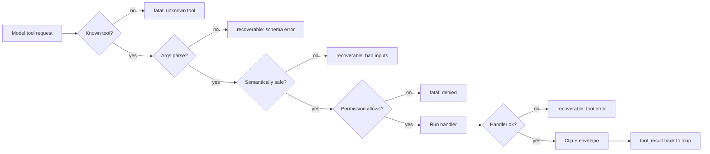

# 第 03 章 — Agent 可以信任的工具

## TL;DR

工具的 schema(第 01 章)是模型看到的东西。Schema 之外的契约才是循环需要的。一个生产级工具还携带元数据 (metadata) —— 只读还是有破坏性、是否可并行、是否幂等、是否 open-world —— 循环会在派发之前读取这些信息。它会按特定顺序走一条验证流水线:已知 → 类型正确 → 语义安全 → 已授权 → 可执行。它返回一个 result envelope(结果信封),让失败变成 turn 而不是崩溃。它为模型截断输出,同时不丢失给你看的完整版本。本章讲的就是那一组小小的不变量,它们把一个工具从 "模型能调用的函数" 变成 "agent 可以被托付的函数"。

---

## 为什么这件事重要

三个简短的场景。

你给 agent 一个 shell 工具。模型把 `rm -rf` 写到了错误的路径上。没有权限闸门、没有沙箱、你也没办法在它跑之前检查这条命令。Agent 干的事就是你让它干的:调用工具。

你给 agent 一个 email 工具。一次瞬时网络抖动让第一次调用超时了。循环重试。客户收到了两封邮件。"发送" 不是幂等的。

你给 agent 一个 deploy 工具。它很快返回 `"ok"`。模型假定成功并继续。三小时后你发现 deploy 从未真的到过集群 —— API 默默地把请求丢了,工具返回了它乐观的默认值。

这些都不是模型故障。是工具系统故障。修法是把工具边界当作一个契约来对待 —— 元数据、验证、错误、结果,全都有刻意的形状。

---

## 概念

### 工具同时也是模型思考的方式

工具是模型的手。不那么显眼的是,工具同时也是模型的 *词汇*。一个叫 `edit_file(path, new_content)` 的工具教模型按编辑来推理。一个叫 `run_shell(command)` 的工具教它按 bash 来推理。一个叫 `book_meeting(participants, when)` 的工具教它按排日程来推理。

所以设计工具不只是一个接口决定 —— 它也是一个 prompt 决定。每个工具名和 schema 每一轮都坐在 system prompt 里(第 04 章解释为什么这对缓存很重要)。模型读它们、内化它们、伸手去用它们。一组少量但命名精到、schema 干净的工具,会产出比大量泛用工具更锐利的推理。*手更少,但更利。*

OpenCode 把这件事做得很具体:`explore` agent 拿到只读工具(search、read、glob);`build` agent 加上写入;专家 agent 再进一步定制工具集。模型不是因为被塞了更多工具而变聪明 —— 它是因为被塞了 *对的* 工具而变聪明。

### 验证流水线

每一次工具调用在触及真实副作用之前都要走五个阶段:



顺序重要。便宜的检查先跑 —— *known* 先于 *typed*,*typed* 先于 *semantic*,*semantic* 先于 *permission*,*permission* 先于 *execute*。在解析了一大块 JSON 之后才拒绝权限会浪费 token。在 handler 已经打开文件之后再去做语义检查(路径是不是在 workspace 里)就太晚了。参考里的每个系统都收敛到大致这个顺序,即使它们对阶段的命名不同。

每个阶段都决定该失败是可恢复 (recoverable)(模型能读这条错误并再试 —— schema 错、路径错、文件找不到)还是致命 (fatal)(循环应该停下或上报 —— 未知工具、权限被拒、凭据过期)。这种 recoverable/fatal 二分正是第 02 章的循环要读的东西。

### 工具元数据 —— 循环读的,不是模型读的

除了模型能看到的 schema,每个工具还携带一小组循环要消费的 flag:

```ts
// Tool definition — schema is the model's view; the rest is the loop's view.
{
  name: "edit_file",
  description: "Replace the contents of a single file in the workspace.",
  input_schema: { /* model's view */ },

  // Loop's view.
  read_only:        false,
  destructive:      true,    // permission gate + approval (Ch.12)
  concurrency_safe: false,   // cannot run parallel with siblings (Ch.02)
  idempotent:       true,    // safe to retry on transient failure
  open_world:       false    // result is deterministic given args
}
```

每个 flag 让什么变得可能:

- **`read_only`** —— 适用于受限模式的 agent(比如不能改状态的 `explore` agent)。
- **`destructive`** —— 触发权限询问或人工审批(第 12 章)。
- **`concurrency_safe`** —— 适用于第 02 章的并行派发 worker 池。
- **`idempotent`** —— 循环可以在瞬时失败时重试同一次调用,不需要显式的幂等键。
- **`open_world`** —— 结果在多次调用之间会变(web fetch、时间、随机数);harness 不能像对 `read_file` 那样去缓存或去重它。

OpenCode 把等价物编码在它的 `Tool.Def` 接口上;Hermes Agent 在注册时附上类似的 flag;OpenClaw 和 Paperclip 都按副作用分类来给工具打标,以驱动它们的审批和重试策略。具体名字各不一样;*想法* —— schema 是给模型看的,元数据是给循环看的 —— 是普适的。

### 派发契约:工具可以假设什么

上面的元数据是循环 *从* 工具读到的。还有对称的一条:工具能 *从* 循环读到什么。当你的 handler 被调用时,dispatcher 已经在验证流水线的阶段 1–4 完成了工作。Handler 可以信赖它。工具收到一个 `ToolContext`(或 `ToolUseContext`),其中携带:

- **Workspace root** 和已配置的沙箱路径 —— 已经解析过了。
- **调用方 agent 的身份**(这样工具知道自己是在 `explore` 还是 `build` 之下运行,可以相应地调整行为)。
- **循环遵守的 abort token** —— 长时间运行的工具应该周期性地检查它。
- **Logger 和 tracer**,预先配置好当前的 step、tool name 和 call id,这样工具发出的每一行日志都能挂回到 trace 上(第 16 章)。
- **Harness 强制的每工具预算**(每会话最大调用次数、最大返回字节数、单次最大 wall-clock)。

工具依赖这些。它不重新做权限检查、不重新解析路径、不发明自己的 logging 文件。这种分工 —— *dispatcher 负责边界,工具负责工作本身* —— 是让两边都可以独立测试的关键。OpenCode 的 `Tool.Def` 和 Hermes Agent 的 `ToolEntry` 都显式编码了这一点;OpenClaw 和 Paperclip 通过它们的 hook 接口传递等价的 context。

一个判断边界是否干净的有用测试:你能不能直接在单元测试里调用 `send_message({to, body}, ctx)`,而不用启动循环?如果可以,你的契约形状是好的。如果不行,工具就绕过 dispatcher 去拿了它本该从 `ctx` 里拿到的东西 —— 你有一处泄漏,最终你会为它付出代价。

### 在验证之前先做 sanitize

在 schema parser 看到模型的参数之前,有几个便宜的清洗步骤值得跑一下。模型可能发出技术上是合法 JSON 但运行时危险的字节:零散的 null byte、被截断的流里残留的孤立 surrogate pair、从工具结果里贴进来的 ANSI escape 序列、BOM、混乱的行尾。Hermes Agent 的对话循环在入口处把这些剥掉;参考系统里生产级的 shell 工具直接拒绝任何包含 `\0` 的参数。

经验法则:*入口处 sanitize,出口处 escape,顺序绝不能反。* 入口处,你在保护流水线的其余部分不被怪字节伤害。出口处 —— 把字符串传给子进程、shell、SQL driver、模板引擎 —— 你在保护这个世界免受模型刚刚发出的东西伤害,不管它看起来多干净。

### 验证不止 "JSON 能 parse"

Schema 验证是必要的,但不充分。模型可以发出 parse 干净却仍然错的 JSON:

- 一个像 `../../etc/passwd` 的路径,字符串前缀能匹上 workspace,但 resolve 之后就跑出去了。
- 一个指向 `localhost:25` 的 URL,你的 URL allowlist 本该拒绝。
- 一个 `limit: 100000` 作为正整数能 parse,但会撑爆你的 context window。
- 一个像 `user_id: "self"` 的标识符,模型是从训练数据里编出来的,不是从你的 domain 里来的。

模式是:*semantic* 检查和 *schema* 检查并列,在 handler 之前就跑。最经典的例子是路径安全 —— 永远不要靠字符串前缀来判断一个路径是不是在 workspace 里,也永远不要只信任 *文本式* 解析。`path.resolve` 是纯词法的:它看不到 `workspace/innocent_link` 是一个指向 `/etc/passwd` 的符号链接。一个不跟踪符号链接(没有 `realpath`、没有逐组件的 `openat` 配 `O_NOFOLLOW`、或者你平台上的等价物)的 workspace 检查会让错误的路径穿过去,handler 就会兴高采烈地在边界之外读或写:

```ts
// Resolve symlinks, then compare structurally. Textual resolution alone is not safe.
async function resolveInsideWorkspace(workspaceRoot, requestedPath) {
  // Resolve symlinks on the root itself — sometimes the workspace is reached via a link.
  const root = await fs.realpath(workspaceRoot);

  const joined = path.resolve(root, requestedPath);

  // If the target exists, resolve its symlinks fully.
  // If it does not exist yet (about to be created), resolve symlinks on the
  // deepest existing ancestor; never operate on an unresolved path.
  const real = await realpathOrParent(joined);

  const relative = path.relative(root, real);
  if (relative.startsWith("..") || path.isAbsolute(relative)) {
    return { ok: false, fatal: true,
             error: `Path is outside the workspace: ${requestedPath}` };
  }
  return { ok: true, value: real };
}
```

同样的形态也适用于 URL allowlist(解析到一个 host *并* 在重定向之后再检查,绝不信任输入的 URL 本身)、shell 工具(allowlist 程序本身,绝不 `bash -c`)、以及标识符(在你信任值之前先在 domain 里查它)。这个教训可以推广:任何在 *字符串形式* 的名字 —— 路径、URL、表、标识符 —— 上做的检查,在你把名字解析到它实际指向的东西之前都是不完整的。生产 agent 里每一个 workspace 逃逸 bug 都能追溯到一个 `startsWith` 或一个缺失的 `realpath`。

### Dry-run 是一种验证模式,而不只是审批 UI

对于一个会改世界的工具,*"你能不能描述一下你打算做什么,但先别做?"* 本身就是一种验证模式。一个带 `dry_run: true` 参数的 `delete_file` 工具,返回 *"would delete /workspace/foo.txt (143 bytes, last modified 2 weeks ago)"* 而不实际删除,可以在错误真正发生之前抓到它 —— 既包括人类的错误(你在审批对话里看错了参数),也包括模型的错误(模型从陈旧记忆里猜了错的路径)。

生产系统用这个来做审批 UX(第 12 章讲对话框),但底层机制 —— *工具能预览自己造成的后果* —— 是一个验证原语。把它一次性建好,你一次拿到四样东西:更清晰的审批 UI、模型在做破坏性动作前自检的路径、一个好用的 debug 表面、以及测试的脚手架。不是每个工具都需要它。读操作不需要。任何破坏性的都该有。

### 错误作为消息回来,带一个 hint

第 02 章引入了 "错误是 turn 而非异常" 的规则。这个 turn 的形状重要。循环从一个 tool result 里读三件事:

```ts
// Result envelope — what the loop sees, regardless of success or failure.
type ToolResult =
  | { ok: true,  content: string,
                 meta?: { duration_ms, file_hash, exit_code } }
  | { ok: false, recoverable: boolean,
                 code: string, message: string, hint?: string };
```

`hint` 字段是杀手锏。一条干巴巴的错误信息 —— `"file not found"` —— 会把模型送进瞎猜。一条带 hint 的错误 —— `"file not found; available files in this directory: src/index.ts, src/util.ts"` —— 指向了下一步。Hermes Agent 的工具错误就带这种结构化引导,生产里头部的编码 agent 也都这么做。代价几乎为零,显著缩短循环。

什么算 *fatal* 取决于 harness 的恢复能力,不是错误的标签。*权限被拒* 当有人在场可以接到时可以是一个审批闸门(第 12 章)。*未知工具* 当工具是动态加载的、或模型刚好猜了一个接近真实工具的名字时,可以触发一次 registry 刷新。*凭据过期* 当 harness 有刷新路径时可以是一次凭据修复。工具汇报它知道的 —— 错误码和它够不到的资源。循环来决定是上报、询问、修复还是停下。把 `recoverable: false` 留给残余:只留给 harness 没有恢复手段的那部分。其余的 —— 包括你眼里大部分 "看起来像错误" 的东西 —— 都是可恢复的,而模型在收到一条形态好的消息时,恢复得出奇地好。

### 幂等性是契约的一部分

在 agent 系统里重试是正常的(第 02 章讲了瞬时错误和 fallback chain)。任何有副作用的东西都需要可以安全重试。标准做法是从调用里派生出一个幂等键 (idempotency key):

```ts
// Scope the key by operation intent — not just tool name and args.
const key = sha256(JSON.stringify({
  tool: "send_message",
  args,
  version: 1,
  // Scope: a deliberate repeat at a different turn must hash differently.
  // Prefer a downstream idempotency token when the API exposes one;
  // otherwise scope by the unit of work the user thinks they are doing.
  scope: args.idempotency_key ?? ctx.turn_id ?? ctx.run_id
})).slice(0, 32);

async function send_message(args, ctx) {
  const cached = await ctx.idempotency.get(key);
  if (cached) return ok(cached.result);

  const result = await ctx.messageClient.send(args);
  await ctx.idempotency.put(key, { result });
  return ok(result.messageId);
}
```

读操作天然幂等 —— 调用 `read_file` 两次返回同样的字节。写、发送、付款、评论、工作流转移都需要显式的键。如果一个工具的元数据是 `idempotent: true` *并且* 用了像这样的键,循环就可以在任何瞬时失败时重试,不需要先问你。

一个会让团队措手不及的小细节:键编码的是 *意图*,不是 *投递次数*。对参数做哈希,这样同一次调用的重试会命中缓存。对操作的范围 —— turn、run 或下游的幂等 token —— 做哈希,这样在不同 turn 上 *故意* 的重复(用户说 *"再把同一条消息发一次,我就是故意的"*)会产出不同的键并真的发出去。只对 tool + args 做哈希粒度太粗:它会把一次有意的再发当成重复给吞掉。如果下游系统有自己的幂等 header(Stripe、大多数现代 HTTP API、每个搭得好的队列),把它穿过去,让下游做真理来源,而不是在它之上再算一个。

### 模型看到的 vs 你保存的

工具结果有两个受众。模型需要紧凑、结构化、不带噪声的东西。你 —— 以及之后某个人工审计员 —— 需要完整的版本。

模式是:*为模型截短,完整地持久化。* OpenCode 的 truncation service 把完整输出写到临时文件,返回一段摘要加一个指针;Hermes Agent 强制每工具的最大结果大小;Paperclip 把长 adapter 输出切成 64-KB 的 blob 存进它的 event store。形态都一样:消息数组是 *显示* 表面,不是 *存储* 表面。

随之而来的三个习惯:

- **在 content 旁边带上元数据。** `read_file` 的结果带 byte count 和 hash;一条 shell 命令带 exit code 和 duration;一次网络调用带 status code。模型常常和从 body 里推理一样多地从这些里推理。
- **让截断可见。** 静默剪掉会教给模型一个错误的世界观。插入一个清晰的标记 —— `...[120 KB clipped; full result at <ref>]...` —— 让模型知道它没拿到完整的东西,可以再要。
- **当心 "静默成功" 陷阱。** 工具返回 `"ok"` 并不能证明真的发生了什么。如果你可以验证(回显那一行、对文件做 hash、再读一次资源),就在工具内部做,把证据放进元数据。开篇那个 deploy 工具如果返回的是集群对资源的视图而不是乐观默认值,它本可以抓到自己的失败。

### 输出 schema、版本化和溯源

第 01 章里的 schema 描述工具的 *输入*。一个生产工具还会声明一个 *输出 schema* —— 它返回什么的形状 —— 以及围绕它的几个小契约,这些契约在你重放一次会话、升级一个工具、或审计一个结果的那一刻就开始回本。

- **输出 schema。** 把结果形状和输入 schema 并列声明。在截断之前用它校验 handler 的返回值。如果一个下游 API 悄悄从 `{ id, status }` 变成了 `{ id, state }`,你想要的是在工具边界拿到一个可恢复的验证错误,而不是一次默默放行,模型之后再误读。输出 schema 也让一个工具的结果干净地喂进另一个工具的输入 —— 模型在知道有哪些字段会出现时推理得更好。
- **Schema 版本化。** 每个工具都有一个版本。在输入 *或* 输出 schema 任何破坏性变更上 bump 一次。版本流入幂等键(上文)、prompt-cache 指纹(第 04 章)和 eval baseline(第 16 章),这样旧的 run 仍然引用旧契约,而不会静默地被认成新版本。重命名参数是破坏性的。新增一个带默认值的可选参数不是。
- **依赖风险。** 一个工具的代码不是封闭系统 —— 它 import 了库、和下游 API 对话、有时还会 shell out 到系统二进制。这每一个都是模型推理不到的失败面:上游降级或库回归会变成一条让人摸不着头脑的错误,agent 在上面打转。在 registry 条目上声明外部依赖(哪个 API、哪个库版本、哪个二进制),把它们 pin 住,把依赖故障映射到一个清晰的 code,比如 `upstream_unavailable`,这样 `hint` 读起来是 *"下游服务降级中,过几分钟再试"*,而不是堆栈跟踪片段。
- **结果溯源 (Provenance)。** 每个结果至少带上:工具名和版本、时间戳、产出它的下游资源(API endpoint、文件路径、DB query)、以及所用的身份或 scope。模型很少需要全部;但审计会话的人、重放它的工程师、以及在下次部署前做 gate 的 eval pipeline 都需要。完整地持久化;在给模型看的版本里截短。

OpenCode 的工具生命周期对象在每次派发上都带版本和耗时。Paperclip 的 run log 按 step 编码等价物 —— adapter、版本、下游调用、duration。Hermes Agent 把工具版本印在每个由内存撑起的结果上,这样 curator(第 07 章)在产出工具的契约已经更新时可以重新派生一个 memory。一旦系统被审计过或重放过一次,这套模式就是普适的。

### Hook 包住每一次派发

派发路径是所有想观察或修改工具执行的东西的咽喉。各系统的模式 —— OpenCode 的 bus 事件、Hermes Agent 的 `pre_tool_call` / `post_tool_call` hook、OpenClaw 的 plugin 生命周期、Paperclip 的 adapter hook —— 都是一样的:每次调用周围一组有序的小回调。

团队几乎一定会通过 hook 来接线的五样东西:

- **Tracing。** 在每次调用周围发出一个 span:工具名、参数、duration、result size、错误。第 16 章活在这里。
- **Redaction(脱敏)。** 在记录或展示之前,从参数和结果里把 PII、密钥、凭据擦掉。
- **Transform-input。** 注入默认值(`cwd`、locale、当前用户),归一化路径,追加安全的 flag。
- **Transform-output。** 从终端输出里剥掉 ANSI escape、概括二进制、附上算出来的元数据(hash、byte count)。
- **成本和预算跟踪。** 计算结果消耗的 token、强制每工具的调用预算、记录到第 17 章的成本账本。

两条小规则之后会回本:pre-hook 应该按注册顺序跑,post-hook 反向(像 middleware 一样),这样清理与设置配对;任何会改参数或结果的 hook 都该在名字里显式说明(`redact_secrets_in_result`,不是 `process_result`)。第一天你什么都不需要。第二周你会都要伸手去用。提前把接缝预留好;它们比事后加要容易拆得多。

### 验证失败也是信号

你返回给模型的每一条可恢复错误 —— schema 失败、路径逃逸、缺少参数、未知枚举 —— 都是一个数据点。这些失败随时间的形态告诉你:哪些工具描述不清楚、模型对哪些参数感到困惑、模型在错的场景里去伸手够哪些工具。带结构地记录它们(工具名、失败阶段、模型发出的参数、错误码),你就免费拿到了一个评估表面。

一个小例子:如果 `read_file` 每天两次失败,报 *"file not found"*,而模型一直在一个 entry point 是 `app.ts` 的项目里要 `src/index.js`,那不是模型故障 —— 是 *描述* 故障。工具描述应该提到这个项目的 entry-point 约定,或者你该加一个 `find_entry_point` helper。没有这条结构化日志,你根本不会注意到。

第 16 章会完整讲 trace pipeline。验证边界是它最丰富的信号源之一,也是最便宜的起点。从第一天就开始。

### 工具更少,推理更利

值得再说一遍,因为这是大多数团队忽略的最便宜的改进:带十二个利落工具的 agent 比带三十个泛用工具的 agent 表现更好。多出来的每一个工具都是模型够错东西的一次机会、是模型必须扫一遍的一段 system prompt、是一项你得想清楚的权限。拿不准时,减。

OpenCode 的 per-agent 工具裁剪是最清晰的参考:`explore` agent 干脆就没有 `edit` 工具 —— 它做不了错事,因为错事根本不在桌上。按 agent profile 定义你的工具集,而不是一次性全局定义。循环挑 agent;agent 挑工具。

二阶收益:当你的工具按 agent 裁剪时,你的验证表面也跟着缩。`explore` agent 的工具都是 `read_only: true` 和 `concurrency_safe: true`,这意味着它可以六个并行派发,完全不用权限检查。`build` agent 用更严的 gating 为它更宽的能力付费。这种不对称是好设计,不是摩擦。

---

## 真实系统笔记

- **OpenCode** 是编码 agent 场景下工具契约最强的参考:类型化 schema、per-agent registry、驱动并行和权限的元数据 flag、专门用于结果的 truncation service、围绕每次派发的 bus 事件。如果你只读一份生产代码来学本章的模式,就读它。
- **Hermes Agent** 用一个 `ToolEntry` 携带 handler、schema、async flag 和每工具的 size 上限;在边界把错误分类为 recoverable/transient/fatal;在对话循环里 sanitize 入站文本;为可并发的工具跑一个线程池。
- **OpenClaw** 在每次派发周围插入 `pre_tool_call`、`post_tool_call` 以及好几个其他 hook 点 —— 是学习生产系统如何把遥测、redaction、权限 UX 都接进一个边界的好材料。
- **Paperclip** 是把这些契约推到更高一层的例子:adapter 是工具,run log 是结果,审批是权限闸门,分块的事件存储就是 "为模型截短,完整地持久化" 被推到编排尺度上的版本。

---

## 与你的 agent 结对

几个在本章上效果很好的 prompt:

- *"给我的工具定义加上元数据 flag(read_only、destructive、concurrency_safe、idempotent、open_world)。给我看我的循环应该如何在每个 flag 上分支,并为每个写一个小测试。"*
- *"我的工具接受来自模型的路径。用我的语言实现 `resolveInsideWorkspace`,然后写测试覆盖 `..` 穿越、符号链接逃逸、绝对路径、以及带 NUL byte 的路径。"*
- *"用本章的 envelope 形状(包括 `hint` 字段)包住每一个工具结果。重写我现有的三个工具,让它们的错误消息给模型一些可以继续做的事。"*
- *"为我的 `send_message` 工具定义一个幂等键。给我看原始调用和一次重试,验证第二次调用是 no-op。然后稍微改一下参数,展示键现在不同了。"*
- *"给我的破坏性工具加一个 `dry_run: true` 模式。给我看预览输出长什么样,以及审批 UI 会如何渲染它。"*
- *"带我走一遍 OpenCode 的 per-agent 工具裁剪是怎么做的。然后为我的项目设计两个 agent profile —— 一个只读、一个完整 —— 告诉我每一个拿到哪些工具,以及为什么。"*

---

## 下一步

你现在有了循环能信任的工具。再往上一层是这些工具所在的 prompt。第 04 章讲 system prompt 是如何被组装的、为什么它的逐字节稳定性 (byte-for-byte stability) 是 "每一轮都为每个 token 付费" 与 "付一次就够" 之间的差别,以及 compaction(第 05 章)为了不破坏这种稳定性必须做什么。
