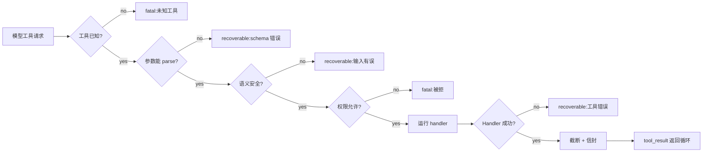

# 第 03 章 — Agent 可以信任的工具

## TL;DR

工具的 schema(第 01 章)是模型看到的东西。而循环真正需要的,是 schema 之外的那份契约。一个生产级工具还携带一组元数据 (metadata) —— 只读还是有破坏性、能否并行、是否幂等、是否 open-world —— 循环会在派发之前读取这些信息。它会按一个固定顺序走一条验证流水线:先确认工具已知,再确认类型正确,再确认语义安全,再确认已授权,最后才可执行。它返回一个 result envelope(结果信封),让失败变成一个 turn 而不是一次崩溃。它为模型截断输出,但不会丢掉留给你看的完整版本。本章讲的,就是这样一组小小的不变量 —— 正是它们把工具从 "模型能调用的函数" 变成了 "可以放心交给 agent 的函数"。

---

## 为什么这件事重要

三个简短的场景。

你给 agent 一个 shell 工具。模型把 `rm -rf` 写到了错误的路径上。没有权限闸门、没有沙箱,你也没机会在它执行前检查这条命令。Agent 做的恰恰就是你让它做的事:调用工具。

你给 agent 一个 email 工具。一次瞬时网络抖动让第一次调用超时了。循环重试。客户收到了两封邮件。"发送" 不是幂等的。

你给 agent 一个 deploy 工具。它很快返回 `"ok"`。模型认定成功,继续往下走。三小时后你发现这次部署根本没到过集群 —— API 默默丢掉了请求,工具返回的是它那个一厢情愿的默认值。

这些都不是模型的故障,而是工具系统的故障。解法是把工具边界当成一份契约来对待 —— 元数据、验证、错误、结果,每一项都经过刻意设计、各有其形。

---

## 概念

### 工具同时也是模型思考的方式

工具是模型的手。不那么显眼的是,工具同时也是模型的 *词汇*。一个叫 `edit_file(path, new_content)` 的工具教模型按编辑来推理。一个叫 `run_shell(command)` 的工具教它按 bash 来推理。一个叫 `book_meeting(participants, when)` 的工具教它按排日程来推理。

所以设计工具不只是一个接口决策 —— 它同时也是一个 prompt 决策。每个工具名和 schema 每一轮都待在 system prompt 里(第 04 章会解释这对缓存为什么重要)。模型读它们、内化它们,然后伸手去用。一小组命名精准、schema 干净的工具,带来的推理比一大堆泛用工具更锐利。*手越少,越利。*

OpenCode 把这件事落到了实处:`explore` agent 拿到只读工具(search、read、glob);`build` agent 在此之上加入写入;专家 agent 再进一步定制工具集。模型不会因为塞给它更多工具而变聪明 —— 而是因为塞给它 *对的* 工具才变聪明。

### 验证流水线

每一次工具调用在触及真实副作用之前都要走五个阶段:



顺序很重要。便宜的检查先跑 —— *known* 先于 *typed*,*typed* 先于 *semantic*,*semantic* 先于 *permission*,*permission* 先于 *execute*。在解析完一大块 JSON 之后才拒绝权限,就白白浪费了 token。在 handler 已经把文件打开之后再来做语义检查(路径在不在 workspace 里),就为时已晚。各参考系统最终都收敛到了大致这个顺序,哪怕它们给各阶段起的名字不尽相同。

每个阶段都要判定这次失败是可恢复 (recoverable) 的(模型能读懂错误再试一次 —— schema 错、路径错、文件找不到),还是致命 (fatal) 的(循环应当停下或上报 —— 未知工具、权限被拒、凭据过期)。这种 recoverable/fatal 的二分,正是第 02 章那个循环所依据的东西。

### 工具元数据 —— 循环读的,不是模型读的

除了模型能看到的 schema,每个工具还携带一小组供循环读取的 flag:

```ts
// Tool definition — schema is the model's view; the rest is the loop's view.
{
  name: "edit_file",
  description: "Replace the contents of a single file in the workspace.",
  input_schema: { /* model's view */ },

  // Loop's view.
  read_only:        false,
  destructive:      true,    // permission gate + approval (Ch.12)
  concurrency_safe: false,   // cannot run parallel with siblings (Ch.02)
  idempotent:       true,    // safe to retry on transient failure
  open_world:       false    // result is deterministic given args
}
```

每个 flag 各自解锁什么能力:

- **`read_only`** —— 可用于受限模式的 agent(比如不能改动状态的 `explore` agent)。
- **`destructive`** —— 触发权限询问或人工审批(第 12 章)。
- **`concurrency_safe`** —— 可进入第 02 章的并行派发 worker 池。
- **`idempotent`** —— 循环可以在瞬时失败时重试同一次调用,无需显式的幂等键。
- **`open_world`** —— 结果在多次调用之间会变(web fetch、时间、随机数);harness 不能像对待 `read_file` 那样去缓存或去重它。

OpenCode 把等价物编码在它的 `Tool.Def` 接口上;Hermes Agent 在注册时附上类似的 flag;OpenClaw 和 Paperclip 都按副作用类别给工具打标,以此驱动各自的审批和重试策略。具体名字各家不同;但那个 *核心思路* —— schema 给模型看,元数据给循环看 —— 是普适的。

### 派发契约:工具可以假设什么

上面的元数据是循环 *从* 工具读到的。反过来还有对称的一面:工具能 *从* 循环读到什么。等到你的 handler 被调用时,dispatcher 已经在验证流水线的阶段 1–4 把活干完了,handler 可以放心依赖这一点。工具会收到一个 `ToolContext`(或 `ToolUseContext`),其中携带:

- **Workspace root** 和已配置的沙箱路径 —— 已经解析过了。
- **调用方 agent 的身份**(这样工具知道自己是在 `explore` 还是 `build` 之下运行,可以相应地调整行为)。
- **循环遵守的 abort token** —— 长时间运行的工具应该周期性地检查它。
- **Logger 和 tracer**,已预先配置好当前的 step、tool name 和 call id,这样工具发出的每一行日志都能挂回到对应的 trace 上(第 16 章)。
- **Harness 强制的每工具预算**(每会话最大调用次数、最大返回字节数、单次调用最大 wall-clock)。

工具依赖这些东西。它不会重新做权限检查、不会重新解析路径、不会自己另起一个 logging 文件。这种分工 —— *dispatcher 负责边界,工具负责干活本身* —— 正是让两边都能各自独立测试的关键。OpenCode 的 `Tool.Def` 和 Hermes Agent 的 `ToolEntry` 都显式编码了这一点;OpenClaw 和 Paperclip 则通过各自的 hook 接口传递等价的 context。

有一个判断边界是否干净的好办法:你能不能直接在单元测试里调用 `send_message({to, body}, ctx)`,而不必把整个循环跑起来?如果能,说明你的契约形状是对的。如果不能,那就是工具绕过 dispatcher 去拿了本该从 `ctx` 里收到的东西 —— 这是一处泄漏,你迟早要为它买单。

### 在验证之前先做 sanitize

在 schema parser 看到模型的参数之前,有几个便宜的清洗步骤值得先跑一遍。模型可能发出一些技术上是合法 JSON、但在运行时很危险的字节:散落的 null byte、被截断的流里残留的孤立 surrogate pair、从工具结果里粘进来的 ANSI escape 序列、BOM、错乱的行尾。Hermes Agent 的对话循环会在入口处把这些剥掉;参考系统里的生产级 shell 工具则直接拒绝任何含 `\0` 的参数。

经验法则:*入口处 sanitize,出口处 escape,这个顺序绝不能反。* 在入口处,你保护的是流水线后续环节,不让怪字节进来作乱。在出口处 —— 把字符串交给子进程、shell、SQL driver 或模板引擎时 —— 你保护的是外部世界,不让它受模型刚刚发出的东西所害,无论那东西看上去多干净。

### 验证不止 "JSON 能 parse"

Schema 验证是必要的,但不充分。模型可以发出能干净 parse、却依然是错的 JSON:

- 一个像 `../../etc/passwd` 的路径,字符串前缀能匹上 workspace,但一经 resolve 就跑到外面去了。
- 一个指向 `localhost:25` 的 URL,你的 URL allowlist 本该拒绝它。
- 一个 `limit: 100000`,作为正整数它能 parse,但会撑爆你的 context window。
- 一个像 `user_id: "self"` 的标识符,是模型从训练数据里编出来的,而非来自你的 domain。

模式是:让 *语义* 检查和 *schema* 检查并列在一起,都在 handler 之前跑。最经典的例子是路径安全 —— 永远不要靠字符串前缀来判断一个路径是否在 workspace 里,也永远不要只信任 *文本层面* 的解析。`path.resolve` 是纯词法的:它看不出 `workspace/innocent_link` 其实是一个指向 `/etc/passwd` 的符号链接。一个不跟踪符号链接的 workspace 检查(没用 `realpath`、没用逐组件的 `openat` 配 `O_NOFOLLOW`、或你所在平台的等价手段)会把错误的路径放行过去,于是 handler 就会乐呵呵地在边界之外读写:

```ts
// Resolve symlinks, then compare structurally. Textual resolution alone is not safe.
async function resolveInsideWorkspace(workspaceRoot, requestedPath) {
  // Resolve symlinks on the root itself — sometimes the workspace is reached via a link.
  const root = await fs.realpath(workspaceRoot);

  const joined = path.resolve(root, requestedPath);

  // If the target exists, resolve its symlinks fully.
  // If it does not exist yet (about to be created), resolve symlinks on the
  // deepest existing ancestor; never operate on an unresolved path.
  const real = await realpathOrParent(joined);

  const relative = path.relative(root, real);
  if (relative.startsWith("..") || path.isAbsolute(relative)) {
    return { ok: false, fatal: true,
             error: `Path is outside the workspace: ${requestedPath}` };
  }
  return { ok: true, value: real };
}
```

同样的套路也适用于 URL allowlist(解析到具体 host *并* 在重定向之后再检查,绝不信任输入的 URL 本身)、shell 工具(只 allowlist 程序本身,绝不 `bash -c`)、以及标识符(在信任某个值之前,先去 domain 里把它查出来)。这个教训可以推而广之:任何针对名字的 *字符串形式* —— 路径、URL、表、标识符 —— 所做的检查,在你把这个名字解析到它实际指向的对象之前,都是不完整的。生产 agent 里每一个 workspace 逃逸 bug,根子都能追到一个 `startsWith`,或一个缺失的 `realpath`。

### Dry-run 是一种验证模式,而不只是审批 UI

对于一个会改动世界的工具,*"你能不能先描述一下你打算做什么、但先别真做?"* 本身就是一种验证模式。一个带 `dry_run: true` 参数的 `delete_file` 工具,只返回 *"would delete /workspace/foo.txt (143 bytes, last modified 2 weeks ago)"* 而不真的删除,就能在错误发生之前把它拦下来 —— 既拦人的错误(你在审批对话框里看错了参数),也拦模型的错误(模型凭一段过时的记忆猜错了路径)。

生产系统拿它来做审批 UX(第 12 章讲对话框),但其底层机制 —— *工具能预览自己将造成的后果* —— 本身就是一个验证原语。把它一次性建好,你能一举得到四样东西:更清晰的审批 UI、一条让模型在破坏性动作前自检的路径、一个好用的 debug 入口、以及一套测试的脚手架。不是每个工具都需要它:读操作不需要,但凡是破坏性的都该有。

### 错误作为消息回来,带一个 hint

第 02 章引入了 "错误是 turn 而非异常" 这条规则。而这个 turn 长什么样很重要。循环从一个 tool result 里读三样东西:

```ts
// Result envelope — what the loop sees, regardless of success or failure.
type ToolResult =
  | { ok: true,  content: string,
                 meta?: { duration_ms, file_hash, exit_code } }
  | { ok: false, recoverable: boolean,
                 code: string, message: string, hint?: string };
```

`hint` 字段是杀手锏。一条干巴巴的错误信息 —— `"file not found"` —— 会把模型逼进瞎猜。一条带 hint 的错误 —— `"file not found; available files in this directory: src/index.ts, src/util.ts"` —— 则给模型指明了下一步。Hermes Agent 的工具错误就带这种结构化引导,生产里第一梯队的编码 agent 也都这么做。代价几乎为零,却看得见地缩短了循环。

什么算 *fatal*,取决于 harness 有哪些恢复手段,而不是取决于错误的标签。*权限被拒*,在有人可以应答时,可以变成一道审批闸门(第 12 章)。*未知工具*,在工具动态加载、或模型只是猜了个跟真实工具很接近的名字时,可以触发一次 registry 刷新。*凭据过期*,在 harness 有刷新路径时,可以变成一次凭据修复。工具只汇报它所知道的 —— 错误码,以及它够不到的那个资源。是上报、询问、修复还是停下,由循环来决定。把 `recoverable: false` 留给最后的残余:只留给 harness 完全没有恢复手段的那部分。其余的 —— 包括在你看来大多数 "像是错误" 的情况 —— 都是可恢复的,而只要消息形态足够好,模型恢复得出奇地好。

### 幂等性是契约的一部分

在 agent 系统里,重试是常态(第 02 章讲了瞬时错误和 fallback chain)。任何带副作用的操作都必须能安全地重试。标准做法是从调用本身派生出一个幂等键 (idempotency key):

```ts
// Scope the key by operation intent — not just tool name and args.
const key = sha256(JSON.stringify({
  tool: "send_message",
  args,
  version: 1,
  // Scope: a deliberate repeat at a different turn must hash differently.
  // Prefer a downstream idempotency token when the API exposes one;
  // otherwise scope by the unit of work the user thinks they are doing.
  scope: args.idempotency_key ?? ctx.turn_id ?? ctx.run_id
})).slice(0, 32);

async function send_message(args, ctx) {
  const cached = await ctx.idempotency.get(key);
  if (cached) return ok(cached.result);

  const result = await ctx.messageClient.send(args);
  await ctx.idempotency.put(key, { result });
  return ok(result.messageId);
}
```

读操作天然幂等 —— 调用 `read_file` 两次返回同样的字节。而写入、发送、付款、评论、工作流状态转移都需要一个显式的键。如果一个工具的元数据标了 `idempotent: true` *并且* 用了像这样的键,循环就可以在任何瞬时失败时重试,无需先来问你。

有个会让团队措手不及的小细节:键编码的是 *意图*,而不是 *投递次数*。对参数做哈希,这样同一次调用的重试会命中缓存;再对操作的范围 —— turn、run 或下游的幂等 token —— 做哈希,这样在另一个 turn 上 *故意* 的重复(用户说 *"再把那条消息发一次,我就是故意的"*)会算出不同的键,从而真的发出去。只对 tool + args 做哈希,粒度太粗:它会把一次有意的再发当成重复给吞掉。如果下游系统自带幂等 header(Stripe、大多数现代 HTTP API、每个搭得好的队列都有),就把它一路传下去,让下游成为真相来源,而不是在它之上再自己算一个。

### 模型看到的 vs 你保存的

工具结果有两类受众。模型需要的是紧凑、结构化、没有噪声的东西;而你 —— 以及日后某位人工审计员 —— 需要的是完整版本。

模式是:*给模型截短,完整地持久化。* OpenCode 的 truncation service 把完整输出写进临时文件,只返回一段摘要外加一个指针;Hermes Agent 强制每个工具的结果不超过某个上限;Paperclip 把过长的 adapter 输出切成 64-KB 的 blob 存进它的 event store。形态如出一辙:消息数组是一个 *展示* 表面,而不是一个 *存储* 表面。

随之而来有三个习惯:

- **在 content 旁边带上元数据。** `read_file` 的结果带上 byte count 和 hash;一条 shell 命令带上 exit code 和 duration;一次网络调用带上 status code。模型从这些信息里做的推理,常常和从正文里做的一样多。
- **让截断可见。** 静默地剪掉内容,会让模型形成一个错误的认知。插入一个清晰的标记 —— `...[120 KB clipped; full result at <ref>]...` —— 让模型知道自己拿到的并不完整,还可以再要。
- **当心 "静默成功" 陷阱。** 工具返回 `"ok"` 并不能证明真的发生了什么。如果你能验证(回显那一行、对文件取 hash、把资源再读一遍),就在工具内部做掉,把证据放进元数据。开篇那个 deploy 工具,如果返回的是集群眼中那个资源的实际状态、而不是一个一厢情愿的默认值,它本可以自己抓到这次失败。

### 输出 schema、版本化和溯源

第 01 章里的 schema 描述的是工具的 *输入*。一个生产工具还会声明一个 *输出 schema* —— 也就是它返回结果的形状 —— 以及围绕它的几个小契约;这些契约,在你重放一次会话、升级一个工具、或审计一个结果的那一刻,就开始回本。

- **输出 schema。** 把结果形状与输入 schema 并列声明出来。在截断之前,用它校验 handler 的返回值。如果某个下游 API 悄悄从 `{ id, status }` 改成了 `{ id, state }`,你希望的是在工具边界处就拿到一个可恢复的验证错误,而不是默默放行、等模型事后误读。输出 schema 还能让一个工具的结果干净地喂进另一个工具的输入 —— 模型一旦知道会出现哪些字段,推理就更顺。
- **Schema 版本化。** 每个工具都带一个版本号。只要输入 *或* 输出 schema 发生任何破坏性变更,就把它 bump 一次。版本会流入幂等键(上文)、prompt-cache 指纹(第 04 章)和 eval baseline(第 16 章),这样旧的 run 始终引用旧契约,不会被默默当成新版本。重命名一个参数,是破坏性变更;新增一个带默认值的可选参数,则不是。
- **依赖风险。** 一个工具的代码并非封闭系统 —— 它 import 库、跟下游 API 通信、有时还会 shell out 到系统二进制。这其中每一项都是模型推理不到的失败面:上游降级或某个库的回归,会变成一条让人摸不着头脑的错误,agent 就在上面原地打转。在 registry 条目上声明清楚外部依赖(哪个 API、哪个库版本、哪个二进制),把它们 pin 住,再把依赖故障映射到一个清晰的错误码,比如 `upstream_unavailable`,这样 `hint` 读起来就是 *"下游服务降级中,过几分钟再试"*,而不是一段堆栈跟踪的碎片。
- **结果溯源 (Provenance)。** 每个结果至少带上:工具名和版本、时间戳、产出它的下游资源(API endpoint、文件路径、DB query)、以及所用的身份或 scope。模型很少需要这一整套;但审计会话的人、重放它的工程师、以及在下次部署前把关的 eval pipeline,都需要。完整地持久化;在给模型看的那一份里把它截短。

OpenCode 的工具生命周期对象在每次派发时都带上版本和耗时。Paperclip 的 run log 按 step 编码等价信息 —— adapter、版本、下游调用、duration。Hermes Agent 则把工具版本印在每个由记忆撑起的结果上,这样当产出该结果的工具其契约已经变了时,curator(第 07 章)仍能据此重新派生出一条记忆。一套系统只要被审计过或重放过一次,这个模式就显出它的普适性。

### Hook 包住每一次派发

派发路径是个咽喉要道:一切想观察或修改工具执行的东西都得从这里过。各系统的模式 —— OpenCode 的 bus 事件、Hermes Agent 的 `pre_tool_call` / `post_tool_call` hook、OpenClaw 的 plugin 生命周期、Paperclip 的 adapter hook —— 都是同一套:在每次调用前后挂一组有序的小回调。

团队几乎都会最终通过 hook 接进来的五样东西:

- **Tracing。** 在每次调用前后发出一个 span:工具名、参数、duration、result size、错误。第 16 章就讲这个。
- **Redaction(脱敏)。** 在记录或展示之前,把参数和结果里的 PII、密钥、凭据擦掉。
- **Transform-input。** 注入默认值(`cwd`、locale、当前用户),归一化路径,追加安全的 flag。
- **Transform-output。** 从终端输出里剥掉 ANSI escape、概括二进制内容、附上算出来的元数据(hash、byte count)。
- **成本和预算跟踪。** 统计结果消耗的 token、强制执行每个工具的调用预算、记入第 17 章的成本账本。

有两条小规则日后会回本:pre-hook 应按注册顺序跑,post-hook 则反向跑(像 middleware 那样),好让清理动作和设置动作一一配对;任何会改动参数或结果的 hook,都该在名字里把这点说明白(用 `redact_secrets_in_result`,而不是 `process_result`)。第一天你一样都用不上,可到第二周你就会样样都想伸手去用。趁早把这些接缝预留好 —— 留好的接缝要拆掉,总比事后再补容易得多。

### 验证失败也是信号

你返回给模型的每一条可恢复错误 —— schema 失败、路径逃逸、缺参数、未知枚举 —— 都是一个数据点。这些失败随时间累积出的形态会告诉你:哪些工具描述写得不清楚、模型对哪些参数犯迷糊、以及模型在哪些不该用某工具的场景里偏偏去够它。把它们带结构地记下来(工具名、失败阶段、模型发出的参数、错误码),你就白捡了一个评估表面。

举个小例子:如果 `read_file` 每天报两次 *"file not found"*,而模型在一个 entry point 其实是 `app.ts` 的项目里一直要 `src/index.js`,那就不是模型的故障 —— 而是 *描述* 的故障。要么工具描述里应当点明这个项目的 entry-point 约定,要么你该加一个 `find_entry_point` 的 helper。没有那条结构化日志,你压根不会注意到。

第 16 章会完整讲 trace pipeline。验证边界是它信号最丰富的来源之一,也是最省力的切入点 —— 从第一天就开始记。

### 工具更少,推理更利

这点值得再说一遍,因为它是大多数团队忽视的、最省力的一项改进:一个带十二个利落工具的 agent,胜过一个带三十个泛用工具的 agent。多出来的每一个工具,都是模型抓错工具的一次机会、是模型不得不扫一遍的一段 system prompt、是一项你得费心去想的权限。拿不准时,就减。

OpenCode 的 per-agent 工具裁剪是最清晰的参考:`explore` agent 干脆就没有 `edit` 工具 —— 它做不了错事,因为那件错事压根不在它的牌面上。按 agent profile 来定义工具集,而不是一次性全局定义。循环挑 agent,agent 挑工具。

还有一层二阶收益:当工具按 agent 裁剪后,你的验证表面也跟着缩小。`explore` agent 的工具全是 `read_only: true` 加 `concurrency_safe: true`,这意味着它可以一口气并行派发六个,完全不用做权限检查。`build` agent 则以更严的 gating 来换取它更宽的能力。这种不对称是好设计,不是摩擦。

---

## 真实系统笔记

- **OpenCode** 是编码 agent 场景下工具契约最强的参考:类型化 schema、per-agent registry、驱动并行与权限的元数据 flag、专用于结果的 truncation service、围绕每次派发的 bus 事件。要是你只读一份生产代码来学本章的模式,就读它。
- **Hermes Agent** 用一个 `ToolEntry` 来承载 handler、schema、async flag 和每个工具的 size 上限;在边界处把错误分为 recoverable/transient/fatal;在对话循环里 sanitize 入站文本;并为可并发的工具跑一个线程池。
- **OpenClaw** 在每次派发前后插入 `pre_tool_call`、`post_tool_call` 以及另外好几个 hook 点 —— 是研究生产系统如何把遥测、redaction、权限 UX 都接进同一个边界的好材料。
- **Paperclip** 则是把这些契约整体上推一层的例子:adapter 就是工具,run log 就是结果,审批就是权限闸门,而分块的事件存储,正是 "给模型截短、完整地持久化" 被搬到编排尺度上的那个版本。

---

## 与你的 agent 结对

几个在本章上效果很好的 prompt:

- *"给我的工具定义加上元数据 flag(read_only、destructive、concurrency_safe、idempotent、open_world)。给我看我的循环应该如何在每个 flag 上分支,并为每个写一个小测试。"*
- *"我的工具接受来自模型的路径。用我的语言实现 `resolveInsideWorkspace`,然后写测试覆盖 `..` 穿越、符号链接逃逸、绝对路径、以及带 NUL byte 的路径。"*
- *"用本章的 envelope 形状(包括 `hint` 字段)把每一个工具结果包起来。重写我现有的三个工具,让它们的错误消息能给模型指出下一步可以做什么。"*
- *"为我的 `send_message` 工具定义一个幂等键。给我看原始调用和一次重试,验证第二次调用是 no-op。然后稍微改一下参数,展示键现在不同了。"*
- *"给我的破坏性工具加一个 `dry_run: true` 模式。给我看预览输出长什么样,以及审批 UI 会如何渲染它。"*
- *"带我走一遍 OpenCode 的 per-agent 工具裁剪是怎么做的。然后为我的项目设计两个 agent profile —— 一个只读、一个完整 —— 告诉我每个各拿到哪些工具,以及为什么。"*

---

## 接下来

现在你有了循环可以信任的工具。再往上一层,就是这些工具栖身其中的 prompt。第 04 章讲 system prompt 是如何被组装出来的、为什么它的逐字节稳定性 (byte-for-byte stability) 决定了你是 "每一轮都为每个 token 付费" 还是 "只付一次",以及 compaction(第 05 章)为了不破坏这种稳定性必须做些什么。
