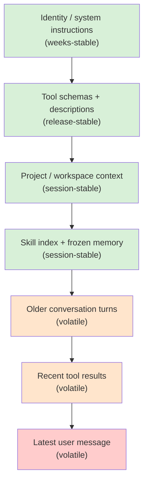

# 第 04 章 — Prompt、context,以及为它埋单的 cache

## TL;DR

System prompt 不是一个字符串。它是一个组装出来的结构,有两半:一个稳定前缀 (stable prefix),它在两轮之间不该变(系统规则、工具 schema、项目 context、被冻结的内存快照),以及一个易变尾部 (volatile tail),它会变(最新一条用户消息、最近的工具结果)。Provider 会缓存这个前缀,所以一个稳定的前缀只在第一次付费,在之后每一轮都被复用 —— 而一个哪怕只差一个字节的前缀,每一轮都要付全价。本章讲如何组装 prompt 让缓存真的命中、是什么把它破坏掉(几乎总是你没注意到的某件事)、以及如何设计 builder 让内存更新、工具变更和 compaction 不会静默地把你刚买下的一切作废。

---

## 为什么这件事重要

你交付了一个 agent。它跑得挺好。两周后你的账单变成了预期的四倍。你翻 model usage 日志,发现 `cache_read_input_tokens` 接近零,而 `cache_creation_input_tokens` 是满的。Prompt 每一轮都在从头重建。你检查 system prompt —— 在顶部你看到了 `Date.now()`,那是你之前为了 "让助手知道当前时间" 而加上去的好心好意。每一轮时间戳都不同,每一轮都是 cache miss,每一轮都付全价。

修法是一行代码。教训更大:缓存收益在被打破之前都是看不见的,而 prompt 有半打种方式可以静默地把它打破。本章讲如何设计 prompt 让这件事不发生。

---

## 概念

### Prompt 是一个组装出来的结构

一个有用的心智模型:prompt 是一摞分层,从最不可能变的在顶部,排到最可能变的在底部。



稳定与易变之间的那条线,大致就是可缓存与不可缓存之间的线。设计 prompt 大部分时候就是把东西放到正确的一侧并把它们留在那里。

OpenCode、Hermes Agent、OpenClaw,以及头部的商业编码 agent 都大致按这个顺序构建 system prompt,并用确定性合并 (deterministic merge) 让字节序列在没有有意义变化时跨调用完全一致。

### 不可变规则

最让人意外的规则,也是大多数团队是靠违反它学会的:*system prompt 一旦构建就被冻结。*

如果一个工具在循环中途运行并写入 `MEMORY.md`,正在运行的 system prompt 不会改变。这个更新会在 *下一个 session* 体现出来,而不是这一个。Hermes Agent 显式地强制这一点 —— 文件支持的内存更新有意不反映到运行中的 prompt 里。头部编码 agent 也一样。原因是机械的:对前缀字节序列的任何改变都会让之后每一轮的缓存作废。

这条规则有两个值得吸收的后果:

- **你可以让 prompt cache 在长会话中保持 warm**,前提且只要没有东西在中途重写前缀。后台的内存写入要落盘;它们在下次 session 启动时被读取。
- **"实时" prompt 比冻结的 prompt 贵很多**,常常贵一大截。如果某个功能感觉需要实时 prompt 更新(比如 "在每一轮里把当前时间显示给模型"),把它放到易变尾部,不要放到稳定前缀里。

### 缓存,用 provider 中立的话说

Provider 实际上缓存的是你消息流的一个 *前缀*。如果下一次请求的前缀与上一次请求的前缀逐字节匹配,provider 会跳过重新处理那些 token,以正常价格的一小部分给你计费。机制各 provider 不同:

- **OpenAI 风格的 API** 自动缓存前缀。没有标记 —— 你的 token 只要和一次更早的请求匹配,就拿到折扣。
- **Anthropic 风格的 API** 需要显式的 `cache_control` 块。你可以最多标四个 breakpoint;provider 独立缓存到每一个 breakpoint。
- **其他 provider**(Bedrock、Gemini、Vertex)介于两者之间,通常通过你的 SDK 的归一化层暴露。

不管怎样,你 prompt builder 的规则都一样:让前缀的字节保持完全一致,把变化放在末尾。Provider 之间的差别只是你能多激进地塑造缓存、以及如何度量命中。

```ts
// Anthropic-style explicit caching — mark a breakpoint at the end of the stable prefix.
{
  system: [
    { type: "text", text: identitySection },
    { type: "text", text: toolSchemas },
    { type: "text", text: projectContext,
      cache_control: { type: "ephemeral" } }  // ← cache up to here
  ],
  messages: [ ...volatileTurns ]
}
```

### 四块滑动窗口

Anthropic 的缓存允许你在 *消息* 上放 breakpoint,不只是在 system 块上。一个跨多个生产系统出现的模式是 *四块滑动窗口*:在 system prompt 末尾放一个 breakpoint,在最近几条 user/assistant 消息上再放三个。Hermes Agent 的 `apply_anthropic_cache_control` 正是这么做的;头部商业编码 agent 也是这个形态。

这买到的是:一段长对话让 system prompt 永远 warm,*同时* 每一轮重新缓存最近的两三个 turn,这样下一轮的有效新 token 成本大致就是用户刚刚输入的内容加上最新一次的工具结果。没有这个,五十轮对话每一步都要重新处理一段越来越大的近期历史;有了它,近期历史的开销大致是个常数。

第一天你不需要它。当你第一次看到成本随着对话长度超线性增长时,你会去伸手要它。

### Cache TTL:短、长,以及预热

缓存条目不会永远活下去。截至 2026 年中,Anthropic 的 ephemeral cache 默认每个 breakpoint 大约存活五分钟,可以选择性地延长到大约一小时,代价是每 token 单价更高;OpenAI 风格的自动缓存用一个相似的 provider 管理的窗口。在你调优之前先查当前 provider 的定价 —— 这些数字会变。但架构上的取舍是稳定的:

- **短 TTL** 适合活跃 session,连续 turn 之间间隔几秒到几分钟。每次命中都刷新条目,所以繁忙的对话从不会看到过期。
- **长 TTL** 在 session 突发时值得那点预付溢价 —— 用户问一个问题,走开半小时,回来。没有更长的 TTL,整个前缀在他们回来时都得重新付费。
- **Cache warming** 是一个小众但有用的模式,适合网关式系统:在 session 创建后(或者从盘上恢复后)发一个小小的 no-op 请求,在用户的真实首条消息之前预热缓存。一些生产网关会对高价值 session 透明地做这件事。

正确的设置来自看你真实流量里实际的 *turn 之间间隔*。如果你的 p50 turn 间隔小于一分钟,默认 TTL 就够。如果你的 p90 超过十分钟,长 TTL 溢价几乎一定比让缓存冷却然后在每次回来时重新付全价更便宜。这个决定是数据驱动的 —— 让你的 agent 把直方图拉出来挑阈值;不要拍脑袋。

### 什么破坏缓存

几乎所有诱人的东西都危险。常见的罪魁,具体地说:

- **`Date.now()` 或前缀里任何时间戳。** 每一轮都是新的值。每一轮都是 cache miss。
- **工具 registry 的变化。** 加或减一个工具就改变了 schema 字节,这些字节坐在前缀靠前的位置。按 (agent, model) 组合 memoize schema 数组,但要明白 registry 变更是昂贵的。
- **非确定性顺序。** 如果你用 `Object.entries()` 或一次文件系统遍历来组装 prompt 而不排序,顺序可能因 runtime 版本、OS、心情而变。OpenClaw 用一个静态的 `CONTEXT_FILE_ORDER` map;Hermes Agent 用一个固定的 section 列表。挑一个顺序并 pin 住。
- **后台内存写入更新了正在运行的 prompt。** 已经在不可变规则里讲过 —— 再说一遍,因为这是最容易意外引入的一个。
- **共享前缀里被注入了用户特定数据。** 如果多个用户打同一个 agent,per-user 的数据属于尾部;前缀应该是用户无关的。
- **空白和格式漂移。** 多一个换行算 miss。如果你用模板写 prompt,把空白锁死。
- **Locale 相关的格式化**(对数字调 `toLocaleString()`、对日期调 `format()`)在不同机器上产出不同字节。
- **包含 session ID 的 "session start" 横幅。** 看起来没害,却杀掉跨 session 的缓存。
- **磁盘上的 prompt 模板被自动格式化工具或 linter 改写。** 一个 reformat-on-save 工具插入一个尾部换行或归一化引号,会在 service 下次部署时静默地把每一份被缓存的前缀都作废。
- **高精度数字格式。** 把分数或价格用完整浮点精度渲染进前缀,可能在不同机器或库版本上产出不同的末位。

最短的 debug 路径是在每次请求里记录一个指纹 —— 渲染后前缀的 SHA —— 然后跨 turn 观察这个值。如果在没有任何有意义变化时指纹也变了,你就有泄漏。本章后面我们还会再用到这个指纹两次。

### 当前缀漂移时,做分层指纹

单一的整个前缀指纹能抓到漂移;它告诉不了你 *漂移来自哪里*。便宜的升级是为前缀的每一层都记录一个指纹,和整体的并排:

```ts
debug: {
  prefixFingerprint:   sha(prefix.bytes).slice(0, 12),
  identityFingerprint: sha(prefix.identity).slice(0, 12),
  toolsFingerprint:    sha(prefix.toolSchemas).slice(0, 12),
  contextFingerprint:  sha(prefix.projectContext).slice(0, 12),
  memoryFingerprint:   sha(prefix.frozenMemory).slice(0, 12)
}
```

当整体哈希漂移时,各层哈希定位原因。一次部署后 tool hash 变化,通常是启用工具的变动或描述的修改。Session 中途 context hash 变化,通常是 workspace 遍历顺序乱了,或一份 context 文件在磁盘上被改写。Session 内 memory hash 变化,就是不可变规则被违反了。这种分层视图把 *"缓存在某处坏了"* 变成一行日志里的 *"有人改了一条工具描述"*。

对于那些 per-layer hash 把嫌疑缩小但没指明字节的情况,把最近一次成功渲染的前缀存到磁盘(或者一个小的内存 ring)上,把当前这次和它 `diff` 一下。一个零散的换行、一个重排的 key、一个高精度数字 —— 都会立刻显形。OpenCode 和 Hermes Agent 出于其他原因(compaction、session resume)本来就已经持久化渲染的前缀;把它变成一个 debug 表面是几行代码,不是一个新系统。

这是当缓存命中率掉了、却 *"什么都没变"* 时你伸手要的工具。

### 工具 schema 是前缀的一部分

工具定义住在 prompt 顶部附近,而且它们往往很大。它们变得也比人们以为的更频繁 —— 启用一个新工具、调一下描述、收紧一个枚举、加一个参数,都会改变字节。各生产系统的模式:

- **按 agent profile memoize 工具 schema 数组。** OpenCode 按 (agent, model) 组合做这件事,让相同的 agent 共享相同的 schema 字符串。
- **Pin 住顺序。** 工具每次都该按同样顺序出现。按字母排序,或者用一个保序的 registry,但绝不要遍历一个无序 hash。
- **把工具描述编辑当作前缀变更对待。** 它们 *就是* 前缀变更。在 session 边界推它,不要在 session 中途推。

这也是为什么第 03 章 "工具更少,推理更利" 的那点会有第二份回报:工具更少 = 前缀字节更少 = 缓存复用更多。

### Compaction 是一次缓存的不连续点

第 02 章把 compaction 介绍为一种和 continue、stop 并列的每轮迭代结果,具体技术推迟到第 05 章。值得 *在这里* 标记的一点是:compaction 在它触发的那一轮会破坏消息级缓存 —— 消息数组被重写了,provider 从那一点开始看到一个新的前缀。

一个有用的设计选择:在历史的 *尾部* 做 compaction(把最旧的 turn 总结成摘要,留下近期的 turn),而不是在中间。尾部 compaction 牺牲的是反正快要滚出去的内容的缓存;中间 compaction 让 compaction 点之后的一切都作废,而那可能是对话的大部分。OpenCode 的 `SessionCompaction.Service` 和 Hermes Agent 的 `ContextCompressor` 都这么做 —— 它们保护一段近期 turn 的窗口,只重写更早的内容。

Compaction 的触发本身也是一个缓存敏感的决定。激进地 compact(每五轮)经常烧缓存;响应式地 compact(只在快溢出时)让缓存保持 warm 更久。多数系统收敛到响应式。

### 不让 cache 爆炸的 per-agent prompt 变体

多 agent 系统(第 10 章、第 14 章)每个 agent 的 prompt 不同 —— explore、build、plan、compaction、titler、summarizer。朴素地做,这意味着 N 个不同的 system prompt 和 N 个不同的缓存。让缓存可共享的模式:

- **真正共享的部分放最前面** —— 通用规则、基础工具 registry、项目 context。
- **Agent 特有的覆盖放在第二段** —— 额外工具、权限规则、agent persona、role 特定指令。
- **在两半之间做缓存** boundary。

OpenCode 正是这个形状:一个两段 system 数组,前半段是 model-family 规则,后半段是 agent 特有的。前半段在一个 session 里对所有 agent 都保持 warm;只有切换 agent(比如从 `explore` 切到 `build`)时,后半段才付一次 cache miss。收益是复利的:在一个频繁切换 agent 的 session 里(编码工作流里很常见),共享的前半段可以命中缓存几千次。

### 项目 context 从某处来

图里 "project / workspace context" 这一层不是凭空出现的。生产 agent 通过一个在 session 启动时跑一次的固定流水线发现它:

- **从工作目录向上走** 找 context 文件(`AGENTS.md`、项目级指令文件、`README.md`、仓库 root 标记)。头部编码 agent 通常在第一个 git root 或文件系统边界停下来。
- **按确定的顺序读。** OpenClaw 的 `CONTEXT_FILE_ORDER` 是一个静态 map(`soul.md`、`identity.md`、`AGENTS.md`、`MEMORY.md`、`README.md` 在固定位置);Hermes Agent 在 `build_system_prompt` 里用一个固定的 section 列表。把顺序 pin 住,这样同一个项目跨多次运行的字节一致。
- **限制大小。** 把一个 50 KB 的 `README.md` 塞进前缀,是第一次 50 KB 的 cache miss,以及永远要 warm 在那里的 50 KB 负载。截短,或者用便宜模型在 session 启动时总结一次并把摘要缓存到磁盘。
- **快照,然后冻结。** 在 session 启动时磁盘上有什么,正在运行的 prompt 看到的就是什么,就这样。Session 中途对这些文件的编辑影响下一个 session,不是这一个 —— 和内存一样的不可变规则。
- **尊重隐私边界。** 多用户 agent 必须不能把用户特定的文件读进共享前缀。要么按用户来缩小缓存(每个用户不同的缓存线),要么把用户数据留在尾部。

OpenCode 通过 per-project 的缓存解析项目级状态,这样两个项目不会把 context 漏到对方的 prompt 里。各系统的通用规则:*发现也是 builder 的一部分,而 builder 是你指纹覆盖的对象。* 如果 workspace 遍历找到了新文件,或者一份文件在 session 之间在磁盘上被改了,你的指纹就该变,并且你应该预期(并接受)一次 cache miss。Pin 住顺序和限制大小的意义就在于:确保仅有的 cache miss 都是 *真实* 的 —— 不是文件系统遍历顺序的副产品。

### 快照 vs. 实时:内存何时进入 prompt

到了第 05–07 章,大多数系统至少有两种内存源:

- **文件支持的内存**(MEMORY.md、USER.md、skill 文件)—— 在 session 启动时读取,*烤进* system prompt,冻结。
- **外部或查询式内存**(vector DB、知识库、检索文档、新鲜的搜索结果)—— 按 turn 拉取,活在 *易变尾部* 里,不在前缀里。

这种切分 *正是因为* 缓存才存在。任何需要新鲜查询的东西都没法被安全地缓存;任何可以加载一次就稳定持有的东西可以。Hermes Agent 把这种区分显式化:`MemoryManager.prefetch_all()` 在循环开始之前跑一次,它返回的内容被折进冻结的前缀;循环中途的内存查询作为 tool result 加到尾部。

规则是:如果你的内存层想坐进前缀,就冻结它。如果它想实时,就接受尾部。试图两者兼得 —— 对一个 "稳定" 前缀做实时更新 —— 是团队意外摧毁自己缓存命中率最常见的方式。

### Cache 和 resume 按钮其实是同一件事

一个值得注意的副作用:让缓存保持 warm 的纪律,和让 session resume 可工作的纪律,是同一个。冻结的前缀、确定性的构建、稳定的字节序列 —— 这些正好是你从磁盘里复活一个 agent 并无意外地继续所需要的。

如果你能证明你的前缀指纹在进程重启之后一致,你就能在一个 warm 缓存上 resume。Hermes Agent 在 `SessionDB` 里持久化 system prompt 就是为此 —— 网关可以停掉再重启 agent 而不用为它自己的前缀重新付费。Paperclip 的 adapter session codec 在栈的更高一层服务于同样的目的:编排器把不透明的状态存起来,这样下一次心跳从上次停下的地方逐字节地拾起来。

这就是为什么跳过第 04 章纪律的团队会付两次费:他们的缓存命中率差 *并且* resume 故事脆弱。这两件事是同一个问题的两个角度,它们共享一个修复。我们在第 08 章会接着讲。

### 缓存命中率就是可观测性

一个你不度量的缓存就是一个你不能信任的缓存。Provider 在每次响应上返回 usage 字段;追踪它们,并随时间观察它们的比例:

```ts
// Cache hit ratio — what fraction of input tokens came from the cache.
type Usage = {
  input_tokens: number;
  cache_read_input_tokens?: number;     // a hit
  cache_creation_input_tokens?: number; // first time, paid full
  output_tokens: number;
};

function cacheHitRatio(usages: Usage[]) {
  const cached  = sum(usages.map(u => u.cache_read_input_tokens     ?? 0));
  const created = sum(usages.map(u => u.cache_creation_input_tokens ?? 0));
  const fresh   = sum(usages.map(u => u.input_tokens));
  return cached / Math.max(cached + created + fresh, 1);
}
```

按 session 和按 agent 把这个数画出来。一个稳定多轮工作流的合理值通常在 60% 到 95% 之间。当它掉下来,先查上一小节的前缀指纹;再查是不是有一次发布改了某个工具描述、某条指令或某个 context 文件。

这个指标属于第 16 章的 trace pipeline。越早接进去,越早抓到下一个相当于 `Date.now()` 的东西,在账单来之前。

### Prompt-builder 契约

一个干净的 prompt builder 有两个方法和一个 debug helper:

```ts
type PromptBuilder = {
  buildStablePrefix(session: Session): Promise<StablePrefix>;
  buildVolatileTail(run: RunState):   Promise<Message[]>;
};

async function buildRequest(s: Session, r: RunState, b: PromptBuilder) {
  const prefix = await b.buildStablePrefix(s);
  const tail   = await b.buildVolatileTail(r);
  return {
    system:   prefix.blocks,
    messages: tail,
    debug:    { prefixFingerprint: prefix.sha256 }  // log on every request
  };
}
```

契约强制了纪律。稳定的走一边、易变的走另一边;任何溜到错的一半的东西会被类型系统或指纹抓到。指纹是当某个东西静默漂移时的那把冒烟的枪 —— 一行日志,抓到了一个单元测试根本抓不到的回归。

Hermes Agent 再多走一步,把渲染后的前缀持久化到它的 SessionDB。当网关把内存里的 agent 驱逐,而下一条用户消息把它重建时,*同样的字节* 被重放,缓存跨越驱逐继续命中。对于那种 agent 不常驻内存的网关式架构,这是黄金标准。如果你没法持久化完整前缀,至少持久化指纹和产出它的输入 —— 这样当缓存 miss 时,你能证明这是 builder 的 bug 还是合法的变化。

---

## 真实系统笔记

- **OpenCode** 用一个两段 system 数组(model-family 规则 + agent 特有覆盖),为 Anthropic 缓存跨调用保留,按 (agent, model) 组合 memoize 工具 schema,并且有一个 `SessionCompaction.Service`,在总结更早的历史时保护近期 turn 的窗口。
- **Hermes Agent** 是端到端 cache-aware 设计最强的参考:文件支持的内存是 session 启动时烤进 prompt 的冻结快照、system prompt 被持久化在 `SessionDB` 里以扛过 agent 驱逐,以及一个四块滑动窗口的 `cache_control` breakpoint(system + 最近三条消息)让近期 turn 可以重新缓存。
- **OpenClaw** 通过一个静态 `CONTEXT_FILE_ORDER` map 维持缓存稳定性,用于确定性文件合并(`soul.md`、`identity.md`、`AGENTS.md`、`MEMORY.md`、`README.md` 总在同样位置),并隔离 provider 特有的 prompt 文件,让一次 model-family 变更不会让其他 provider 的缓存作废。
- **Paperclip** 自己不构建内层 system prompt —— adapter 构建 —— 但它不透明地持久化 session 参数,以便 adapter 跨心跳重放。编排层的教训:prompt 连续性是状态管理问题,不是字符串构建问题。

---

## 与你的 agent 结对

几个在本章上效果很好的 prompt:

- *"审计我当前的 system prompt。找出每一处可能在调用之间变化的部分 —— 时间戳、locale 格式、非确定性顺序、用户特定数据、session ID —— 重写 builder 让前缀字节稳定。"*
- *"在每一条请求日志里加上我渲染后稳定前缀的 SHA-256 指纹。跑一段真实的十轮 session,把每一轮的指纹给我看。如果它漂移了,找出原因。"*
- *"实现四块滑动窗口模式:在我的 system prompt 末尾一个 `cache_control` breakpoint,在最近的 user/assistant 消息上再放三个。然后在二十轮对话里画出 `cache_read_input_tokens` vs `cache_creation_input_tokens`。"*
- *"把我的 prompt 组装重构成一个两段 system 数组 —— model-family 规则在前、agent 特有覆盖在后。加上第二个 agent profile,给我看缓存前半段在两个 agent 之间共享了。"*
- *"我的 agent 有一个 session 中途会更新的 `MEMORY.md`。改循环让更新写到磁盘但运行中的 system prompt 保持冻结。用指纹验证内存写入后前缀字节没变。"*
- *"带我走一遍 Hermes Agent 如何在 SessionDB 里持久化 system prompt 并在 agent 被驱逐后逐字节重放它。然后在我的技术栈里实现等价物 —— 哪怕是一个能扛过进程重启的最小版本。"*
- *"拉一个我最近五十次 session 里 turn-to-turn 时间间隔的直方图。用 p50 和 p90 推荐 cache TTL 设置,并给出数学解释 —— 比较长 TTL 溢价的成本和冷返回时重新缓存的成本。"*

---

## 下一步

你现在有一个为保持 warm 与可复现而设计的 prompt。下一个问题是它所坐的易变尾部 —— 每一轮都在增长的对话历史、工具结果和工作记忆。第 05 章讲如何不破坏你刚搭好的缓存就让这条尾巴不爆炸;第 06–07 章讲长期内存,它会回流进 *下一个* session 的前缀,而本章的纪律也在那里开始回报你。
