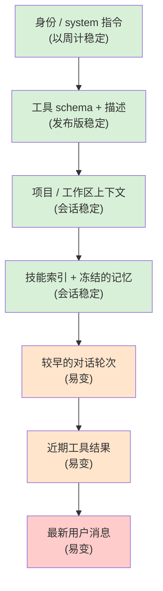

# 第 04 章 — Prompt、context,以及为它埋单的 cache

## TL;DR

System prompt 不是一个字符串。它是一个组装出来的结构,分两半:一半是稳定前缀 (stable prefix),它在两轮之间不该变(系统规则、工具 schema、项目 context、冻结的记忆快照);另一半是易变尾部 (volatile tail),它会变(最新一条用户消息、最近的工具结果)。Provider 会缓存这个前缀,所以稳定的前缀只在第一次付费,之后每一轮都被复用 —— 而前缀哪怕只差一个字节,每一轮都要付全价。本章讲的是:如何组装 prompt 让缓存真的命中、是什么把它破坏掉(几乎总是你没注意到的某件事)、以及如何设计 builder,让记忆更新、工具变更和 compaction 不会悄无声息地把你刚买下的一切作废。

---

## 为什么这件事重要

你交付了一个 agent。它跑得挺好。两周后,你的账单变成了预期的四倍。你翻 model usage 日志,发现 `cache_read_input_tokens` 接近零,而 `cache_creation_input_tokens` 是满的——prompt 每一轮都在从头重建。你检查 system prompt,在顶部赫然看到一个 `Date.now()`:那是你当初为了 "让助手知道当前时间" 而好心加上去的。结果每一轮的时间戳都不同,每一轮都是 cache miss,每一轮都付全价。

修复只要一行代码。但教训要大得多:缓存的收益在它被破坏之前一直是隐形的,而 prompt 有好几种方式能悄无声息地破坏它。本章讲的就是如何设计 prompt,让这件事不发生。

---

## 概念

### Prompt 是一个组装出来的结构

一个有用的心智模型:prompt 是一摞分层结构,顶部放最不可能变的,底部放最可能变的。



稳定与易变之间的那条线,大致就是可缓存与不可缓存之间的线。设计 prompt,多数时候就是把每样东西放到这条线正确的一侧,并让它们留在那里。

OpenCode、Hermes Agent、OpenClaw,以及头部的商业编码 agent,都大致按这个顺序构建 system prompt,并用确定性合并 (deterministic merge) 保证:只要没有发生有意义的变化,字节序列在多次调用之间完全一致。

### 不可变规则

最让人意外的规则,也是大多数团队靠"撞上去"才学会的一条:*system prompt 一旦构建就被冻结。*

如果一个工具在循环中途运行并写入 `MEMORY.md`,正在运行的 system prompt 不会改变。这个更新会在 *下一个 session* 才体现出来,而不是当前这个。Hermes Agent 把这一点显式地强制住 —— 文件支持的记忆更新被刻意设计成不反映到运行中的 prompt 里。头部编码 agent 也是如此。原因很机械:对前缀字节序列的任何改动,都会让其后每一轮的缓存作废。

这条规则有两个值得记牢的推论:

- **你能让 prompt cache 在长会话中持续保持 warm**,当且仅当没有任何东西在中途重写前缀。后台的记忆写入只落盘,等下次 session 启动时才被读取。
- **"实时" prompt 比冻结的 prompt 贵得多**,常常贵出好几倍。如果某个功能看起来需要实时更新 prompt(比如 "每一轮都把当前时间展示给模型"),那就把它放进易变尾部,而不是稳定前缀。

### 缓存,用 provider 中立的话说

Provider 真正缓存的,是你消息流的一段 *前缀*。如果下一次请求的前缀与上一次请求的前缀逐字节匹配,provider 就会跳过对那些 token 的重新处理,只按正常价格的一小部分给你计费。各家 provider 的机制不同:

- **OpenAI 风格的 API** 自动缓存前缀,无需任何标记 —— 只要你的 token 和某次更早的请求匹配上,就拿到折扣。
- **Anthropic 风格的 API** 需要显式的 `cache_control` 块。你最多可以标四个 breakpoint;provider 会独立地缓存到每一个 breakpoint 为止。
- **其他 provider**(Bedrock、Gemini、Vertex)介于两者之间,通常通过你 SDK 的归一化层暴露出来。

无论哪种,对你的 prompt builder 来说规则都一样:让前缀的字节保持完全一致,把变化放在末尾。Provider 之间的差别,只在于你能多激进地塑造缓存、以及如何度量命中。

```ts
// Anthropic-style explicit caching — mark a breakpoint at the end of the stable prefix.
{
  system: [
    { type: "text", text: identitySection },
    { type: "text", text: toolSchemas },
    { type: "text", text: projectContext,
      cache_control: { type: "ephemeral" } }  // ← cache up to here
  ],
  messages: [ ...volatileTurns ]
}
```

### 四块滑动窗口

Anthropic 的缓存允许你把 breakpoint 放在 *消息* 上,而不只是 system 块上。有一个模式在多个生产系统里反复出现 —— *四块滑动窗口*:在 system prompt 末尾放一个 breakpoint,在最近几条 user/assistant 消息上再放三个。Hermes Agent 的 `apply_anthropic_cache_control` 正是这么做的;头部商业编码 agent 也是同样的形态。

它换来的是:一段长对话能让 system prompt 永远保持 warm,*同时* 每一轮还重新缓存最近的两三个 turn,于是下一轮真正算作新 token 的成本,大致就等于用户刚输入的内容加上最新一次工具结果。没有它,五十轮对话每走一步都要重新处理一段越来越大的近期历史;有了它,近期历史的开销大致保持恒定。

第一天你用不上它。等你第一次看到成本随对话长度超线性增长时,自然会想到它。

### Cache TTL:短、长,以及预热

缓存条目不会永远存在。截至 2026 年中,Anthropic 的 ephemeral cache 每个 breakpoint 默认大约存活五分钟,可选择性地延长到约一小时,代价是每 token 单价更高;OpenAI 风格的自动缓存用的是一个相似的、由 provider 管理的时间窗。调优之前先查一下当前 provider 的定价 —— 这些数字会变。但架构层面的取舍是稳定的:

- **短 TTL** 适合活跃 session,连续 turn 之间只隔几秒到几分钟。每次命中都会刷新条目,所以繁忙的对话永远不会撞到过期。
- **长 TTL** 在 session 呈突发式访问时,值得那一点预付溢价 —— 用户问一个问题,走开半小时,再回来。若没有更长的 TTL,整个前缀都得在他回来时重新付费。
- **Cache warming(缓存预热)** 是一个小众但有用的模式,适合网关式系统:在 session 创建后(或被驱逐后从盘上恢复后)发一个微小的 no-op 请求,在用户真正发出首条消息之前先把缓存焐热。一些生产网关会对高价值 session 透明地做这件事。

正确的设置,取决于你真实流量里 *相邻 turn 之间的实际间隔*。如果你的 p50 turn 间隔小于一分钟,默认 TTL 就够用。如果你的 p90 超过十分钟,那么长 TTL 的溢价几乎一定比"让缓存冷掉、每次回来再重新付全价"更划算。这是个数据驱动的决定 —— 让你的 agent 把直方图拉出来,据此挑阈值,别凭感觉拍脑袋。

### 什么破坏缓存

几乎所有诱人的做法都很危险。常见的罪魁祸首,具体来说:

- **`Date.now()`,或前缀里任何时间戳。** 每一轮都是新值,每一轮都是 cache miss。
- **工具注册表 (tool registry) 的变化。** 加一个或减一个工具,就改变了 schema 的字节,而这些字节位于前缀靠前的位置。按 (agent, model) 组合把 schema 数组 memoize 起来,但要清楚:改动注册表是昂贵的。
- **非确定性顺序。** 如果你用 `Object.entries()` 或一次文件系统遍历来组装 prompt 却不排序,那么顺序可能随 runtime 版本、操作系统、乃至运气而变。OpenClaw 用一个静态的 `CONTEXT_FILE_ORDER` map;Hermes Agent 用一个固定的 section 列表。挑定一个顺序,把它 pin 死。
- **后台记忆写入更新了正在运行的 prompt。** 不可变规则里已经讲过 —— 这里再强调一遍,因为它是最容易被无意间引入的一个。
- **共享前缀里被注入了用户特定的数据。** 如果多个用户访问同一个 agent,那么 per-user 的数据应归入尾部;前缀本身应当与用户无关。
- **空白与格式的漂移。** 多出一个换行就算 miss。如果你用模板拼 prompt,就把空白锁死。
- **依赖 locale 的格式化**(对数字调 `toLocaleString()`、对日期调 `format()`),会在不同机器上产出不同的字节。
- **包含 session ID 的 "session start" 横幅。** 看着人畜无害,却会扼杀跨 session 的缓存。
- **磁盘上的 prompt 模板被自动格式化工具或 linter 改写。** 一个 reformat-on-save 工具插入一个末尾换行、或把引号归一化,就会在服务下次部署时悄无声息地让每一份被缓存的前缀全部作废。
- **高精度的数字格式化。** 把分数或价格以完整浮点精度渲染进前缀,可能在不同机器或不同库版本上产出不同的末位数字。

最短的 debug 路径,是在每次请求里记录一个指纹 —— 渲染后前缀的 SHA —— 然后跨 turn 观察这个值。如果在没有任何有意义变化时指纹也变了,说明有泄漏。这个指纹本章后面我们还会再用到两次。

### 当前缀漂移时,做分层指纹

单个覆盖整个前缀的指纹能抓到漂移,却告诉不了你 *漂移从哪一层来*。一个廉价的升级,是为前缀的每一层各记一个指纹,与整体指纹并排:

```ts
debug: {
  prefixFingerprint:   sha(prefix.bytes).slice(0, 12),
  identityFingerprint: sha(prefix.identity).slice(0, 12),
  toolsFingerprint:    sha(prefix.toolSchemas).slice(0, 12),
  contextFingerprint:  sha(prefix.projectContext).slice(0, 12),
  memoryFingerprint:   sha(prefix.frozenMemory).slice(0, 12)
}
```

当整体哈希漂移时,各层哈希能帮你定位原因。一次部署后 tools 哈希变了,通常是启用的工具发生了增删,或某条描述被改过。Session 中途 context 哈希变了,通常是 workspace 遍历顺序乱了,或某份 context 文件在磁盘上被改写。Session 期间记忆哈希变了,那就是不可变规则被违反了。这种分层视图,把 *"缓存在某处坏了"* 这样的模糊判断,变成一行日志里的 *"有人改了一条工具描述"*。

至于那些分层哈希缩小了嫌疑范围、却仍未指明是哪些字节的情况:把最近一次成功渲染的前缀存到磁盘(或一个小的内存环形缓冲)里,再拿当前这次和它 `diff` 一下。一个游离的换行、一个被重排的 key、一个高精度数字 —— 都会立刻现形。OpenCode 和 Hermes Agent 出于别的原因(compaction、session resume)本就已经持久化了渲染后的前缀;把它顺手变成一个 debug 抓手,只需几行代码,而不是一套新系统。

这就是当缓存命中率掉了、人却 *"什么都没改"* 时,你该伸手去拿的工具。

### 工具 schema 是前缀的一部分

工具定义位于 prompt 顶部附近,而且体积往往很大。它们改动的频率也比人们以为的高 —— 启用一个新工具、调一下描述、收紧一个枚举、加一个参数,都会改变字节。各生产系统通用的模式:

- **按 agent profile 把工具 schema 数组 memoize 起来。** OpenCode 按 (agent, model) 组合来做,让相同的 agent 共享同一份 schema 字符串。
- **把顺序 pin 死。** 工具每次都应按同样的顺序出现。按字母排序,或用一个保序的注册表,但绝不要去遍历一个无序的 hash。
- **把"编辑工具描述"当成前缀变更来对待。** 它们 *就是* 前缀变更。要在 session 边界上推这类改动,而不是在 session 中途。

这也正是第 03 章 "工具更少,推理更利" 那一点带来的第二份回报:工具更少 = 前缀字节更少 = 缓存复用更多。

### Compaction 是一次缓存的不连续点

第 02 章把 compaction 介绍为与 continue、stop 并列的一种每轮迭代结果,具体技术推迟到第 05 章。值得 *在这里* 点出的一点是:compaction 会在它触发的那一轮破坏消息级缓存 —— 消息数组被重写了,provider 从那个点开始就看到一个全新的前缀。

一个有用的设计选择:在历史的 *尾端* 做 compaction(把最旧的几个 turn 总结成摘要,保留近期的 turn),而不是在中间动手。尾端 compaction 牺牲掉的,是那些反正快要滚出去的内容的缓存;而中间 compaction 会让 compaction 点之后的一切全部作废,那往往是对话的大部分。OpenCode 的 `SessionCompaction.Service` 和 Hermes Agent 的 `ContextCompressor` 都是这么做的 —— 它们保护一段近期 turn 的窗口,只重写更早的内容。

何时触发 compaction,本身也是一个对缓存敏感的决定。激进地压缩(每五轮一次)会频繁烧掉缓存;响应式地压缩(只在快溢出时才动手)能让缓存保持 warm 更久。多数系统最终都收敛到响应式。

### 不让 cache 爆炸的 per-agent prompt 变体

多 agent 系统(第 10 章、第 14 章)里,每个 agent 的 prompt 各不相同 —— explore、build、plan、compaction、titler、summarizer。最朴素的做法,会变成 N 个不同的 system prompt 和 N 份不同的缓存。让缓存得以共享的模式是:

- **真正共享的部分放最前面** —— 通用规则、基础工具注册表、项目 context。
- **agent 特有的覆盖放第二段** —— 额外工具、权限规则、agent persona、角色专属指令。
- **把缓存 breakpoint 放在两半之间的边界上。**

OpenCode 用的正是这个形态:一个两段式的 system 数组,前半段是 model-family 规则,后半段是 agent 特有的部分。前半段在整个 session 里对所有 agent 都保持 warm;只有当你切换 agent(比如从 `explore` 切到 `build`)时,后半段才付一次 cache miss。收益是复利式的:在一个频繁切换 agent 的 session 里(这在编码工作流里很常见),共享的前半段可以命中缓存数千次。

### 项目 context 从某处来

图里 "project / workspace context" 这一层并非凭空出现。生产 agent 是通过一条在 session 启动时只跑一次的固定流水线来发现它的:

- **从工作目录向上逐级查找** context 文件(`AGENTS.md`、项目级指令文件、`README.md`、仓库 root 标记)。头部编码 agent 通常走到第一个 git root 或文件系统边界就停。
- **按确定的顺序读取。** OpenClaw 的 `CONTEXT_FILE_ORDER` 是一个静态 map(`soul.md`、`identity.md`、`AGENTS.md`、`MEMORY.md`、`README.md` 各占固定位置);Hermes Agent 在 `build_system_prompt` 里用一个固定的 section 列表。把顺序 pin 死,同一个项目多次运行得到的字节才会一致。
- **限制大小。** 把一个 50 KB 的 `README.md` 硬塞进前缀,意味着第一次 50 KB 的 cache miss,以及之后永远要 warm 着的 50 KB 负载。要么截断,要么在 session 启动时用便宜模型总结一次,并把摘要缓存到磁盘。
- **先快照,再冻结。** session 启动时磁盘上是什么,正在运行的 prompt 看到的就是什么,没有例外。session 中途对这些文件的编辑只影响下一个 session,而非当前这个 —— 这和记忆遵循的是同一条不可变规则。
- **尊重隐私边界。** 多用户 agent 绝不能把用户特定的文件读进共享前缀。要么按用户切分缓存(每个用户一条独立的缓存线),要么把用户数据留在尾部。

OpenCode 通过 per-project 的缓存来解析项目级状态,使得两个项目不会把各自的 context 串到对方的 prompt 里。各系统通用的规则是:*发现本身也是 builder 的一部分,而 builder 正是你的指纹所覆盖的范围。* 如果 workspace 遍历发现了新文件,或某个文件在两次 session 之间被改动过,你的指纹就理应改变,你也应当预期(并接受)随之而来的一次 cache miss。pin 死顺序、限制大小,意义恰恰在于:让仅有的 cache miss 都是 *真实* 的变化所致 —— 而不是文件系统遍历顺序带来的副产品。

### 快照 vs. 实时:记忆从何处进入 prompt

到了第 05–07 章,大多数系统至少会有两种记忆来源:

- **文件支持的记忆**(MEMORY.md、USER.md、skill 文件)—— 在 session 启动时读取,*烘焙进* system prompt,然后冻结。
- **外部或查询式记忆**(vector DB、知识库、检索到的文档、新鲜的搜索结果)—— 按 turn 现拉,活在 *易变尾部* 里,不进前缀。

这种切分 *正是因缓存而存在*。任何需要现查的东西都无法被安全地缓存;任何能加载一次、之后稳定持有的东西则可以。Hermes Agent 把这种区分显式化:`MemoryManager.prefetch_all()` 在循环开始之前跑一次,它返回的内容被折进冻结的前缀;而循环中途的记忆查询则作为 tool result 追加到尾部。

规则是:如果你的记忆层想进前缀,就冻结它;如果它想保持实时,就让它待在尾部。试图二者兼得 —— 对一个"稳定"前缀做实时更新 —— 正是团队意外毁掉自己缓存命中率的最常见方式。

### Cache 和 resume 按钮其实是同一件事

一个值得留意的副作用:让缓存保持 warm 所需的纪律,和让 session resume 能正常工作所需的纪律,是同一套。冻结的前缀、确定性的构建、稳定的字节序列 —— 这些恰恰就是你从磁盘里复活一个 agent、并能不出意外地继续下去所需要的东西。

如果你能证明前缀指纹在进程重启后保持一致,你就能在一份 warm 缓存上 resume。Hermes Agent 把 system prompt 持久化在 `SessionDB` 里,正是为此 —— 网关可以停掉再重启 agent,而无需为它自己的前缀重新付费。Paperclip 的 adapter session codec 则在栈的更高一层服务于同样的目的:编排器把不透明的状态存起来,这样下一次心跳就能从上次停下的地方逐字节地接着干。

这正是为什么跳过第 04 章这套纪律的团队会付两遍费:他们的缓存命中率既差,resume 的可靠性也脆弱。这两件事其实是同一个问题的两个侧面,共用同一个修复方案。我们在第 08 章会接着讲。

### 缓存命中率就是可观测性

一个你不去度量的缓存,就是一个你无法信任的缓存。Provider 在每次响应里都会返回 usage 字段;把它们追踪起来,并随时间观察它们的比例:

```ts
// Cache hit ratio — what fraction of input tokens came from the cache.
type Usage = {
  input_tokens: number;
  cache_read_input_tokens?: number;     // a hit
  cache_creation_input_tokens?: number; // first time, paid full
  output_tokens: number;
};

function cacheHitRatio(usages: Usage[]) {
  const cached  = sum(usages.map(u => u.cache_read_input_tokens     ?? 0));
  const created = sum(usages.map(u => u.cache_creation_input_tokens ?? 0));
  const fresh   = sum(usages.map(u => u.input_tokens));
  return cached / Math.max(cached + created + fresh, 1);
}
```

按 session、按 agent 把这个数画出来。一个稳定的多轮工作流,合理值通常落在 60% 到 95% 之间。一旦它掉下来,第一件要查的是上一小节那个前缀指纹;第二件是看是否有某次发布改动了某个工具描述、某条指令或某个 context 文件。

这个指标属于第 16 章的 trace pipeline。你越早把它接进去,就能越早赶在账单到来之前,抓住下一个相当于 `Date.now()` 的坑。

### Prompt-builder 契约

一个干净的 prompt builder,只需两个方法加一个 debug helper:

```ts
type PromptBuilder = {
  buildStablePrefix(session: Session): Promise<StablePrefix>;
  buildVolatileTail(run: RunState):   Promise<Message[]>;
};

async function buildRequest(s: Session, r: RunState, b: PromptBuilder) {
  const prefix = await b.buildStablePrefix(s);
  const tail   = await b.buildVolatileTail(r);
  return {
    system:   prefix.blocks,
    messages: tail,
    debug:    { prefixFingerprint: prefix.sha256 }  // log on every request
  };
}
```

这份契约把纪律强制落地。稳定的走一条路、易变的走另一条;任何溜进错误那一半的东西,都会被类型系统或指纹逮住。当某样东西悄悄漂移时,指纹就是那个铁证 —— 一行日志,抓到一个单元测试根本抓不到的回归。

Hermes Agent 还更进一步,把渲染后的前缀持久化到它的 SessionDB 里。当网关把常驻内存的 agent 驱逐、而下一条用户消息又把它重建出来时,*完全相同的字节* 被重放出来,缓存便跨越这次驱逐继续命中。对于 agent 不常驻内存的网关式架构,这是黄金标准。如果你无法持久化完整前缀,那至少持久化指纹以及产出它的那些输入 —— 这样一旦缓存 miss,你就能判定这究竟是 builder 的 bug,还是一次合理的变化。

---

## 真实系统笔记

- **OpenCode** 用一个两段式 system 数组(model-family 规则 + agent 特有覆盖),为 Anthropic 缓存而跨调用保留;按 (agent, model) 组合 memoize 工具 schema;并有一个 `SessionCompaction.Service`,在总结更早历史时保护近期 turn 的窗口。
- **Hermes Agent** 是端到端 cache-aware 设计最有力的参考:文件支持的记忆是一份在 session 启动时烘焙进 prompt 的冻结快照;system prompt 被持久化在 `SessionDB` 里以扛过 agent 驱逐;还有一个四块滑动窗口的 `cache_control` breakpoint(system + 最近三条消息)让近期 turn 可被重新缓存。
- **OpenClaw** 靠一个静态的 `CONTEXT_FILE_ORDER` map 来维持缓存稳定性,用于确定性的文件合并(`soul.md`、`identity.md`、`AGENTS.md`、`MEMORY.md`、`README.md` 总在相同位置),并把 provider 特有的 prompt 文件隔离开,使一次 model-family 变更不会殃及其他 provider 的缓存。
- **Paperclip** 自己并不构建内层的 system prompt —— 那是 adapter 的事 —— 但它会不透明地持久化 session 参数,好让 adapter 跨心跳重放。这是编排层给出的教训:prompt 的连续性是一个状态管理问题,而非字符串构建问题。

---

## 与你的 agent 结对

几个用在本章效果很好的 prompt:

- *"审计我当前的 system prompt。找出其中每一处可能在两次调用之间变化的部分 —— 时间戳、locale 格式化、非确定性顺序、用户特定数据、session ID —— 并重写 builder,让前缀的字节保持稳定。"*
- *"在每一条请求日志里,加上我渲染后稳定前缀的 SHA-256 指纹。跑一段真实的十轮 session,把每一轮的指纹给我看。如果它漂移了,找出原因。"*
- *"实现四块滑动窗口模式:在我的 system prompt 末尾放一个 `cache_control` breakpoint,在最近的几条 user/assistant 消息上再放三个。然后在一段二十轮的对话里,画出 `cache_read_input_tokens` 与 `cache_creation_input_tokens` 的对比。"*
- *"把我的 prompt 组装重构成一个两段式 system 数组 —— model-family 规则在前、agent 特有覆盖在后。再加一个 agent profile,给我看缓存的前半段确实在两个 agent 之间共享了。"*
- *"我的 agent 有一个会在 session 中途更新的 `MEMORY.md`。改一下循环,让更新只写到磁盘,而运行中的 system prompt 保持冻结。用指纹验证记忆写入之后前缀字节没有变化。"*
- *"带我走一遍:Hermes Agent 是如何在 SessionDB 里持久化 system prompt、并在 agent 被驱逐后逐字节重放它的。然后在我的技术栈里实现一个等价物 —— 哪怕只是一个能扛过进程重启的最小版本。"*
- *"拉出我最近五十次 session 里相邻 turn 时间间隔的直方图。用 p50 和 p90 给我推荐一个 cache TTL 设置,并附上推导 —— 把长 TTL 溢价的成本,和冷返回时重新缓存的成本作比较。"*

---

## 接下来

现在你有了一个为"保持 warm 且可复现"而设计的 prompt。下一个问题,是它所依托的那条易变尾部 —— 每一轮都在增长的对话历史、工具结果和工作记忆。第 05 章会讲:如何在不破坏你刚搭好的缓存的前提下,让这条尾巴不至于爆炸;第 06–07 章讲长期记忆,它会回流进 *下一个* session 的前缀 —— 而本章这套纪律,也正是在那里开始回报你。
