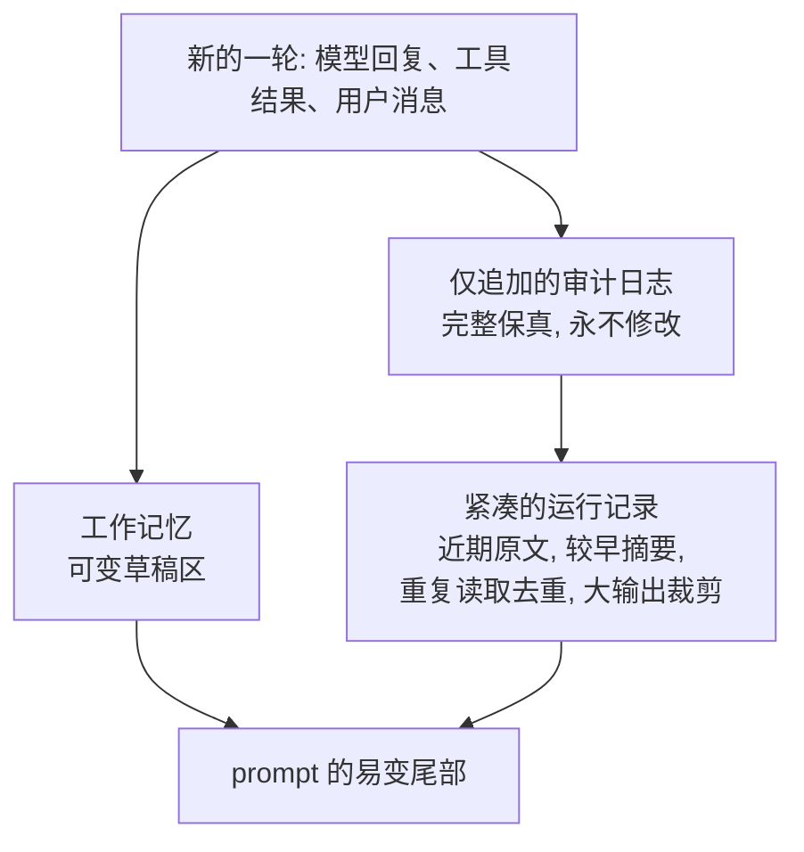

# 第 05 章 — 短期记忆

## TL;DR

短期记忆 (short-term memory) 是第 04 章那个 prompt 易变尾部里的一切——对话记录、最近的工具结果，以及 agent 用来追踪当前任务的一小块草稿区 (scratchpad)。它是每一轮都会增长的那一层，也是循环跑久了最先崩掉的那一层。本章讲的是这块记忆的三种视角（仅追加的审计、紧凑的运行视图、可变的草稿区），以及生产系统用来把运行视图压小、又不丢掉模型所需信息的那六七种技术：裁剪工具输出、对重复读取去重、不对称缩减、回合中途摘要、先折叠后压缩的两阶段做法、按工具区分的处置规则。

---

## 为什么这件事重要

你的 agent 已经跑了四十轮。每一次读文件、每一次 grep、每一次 web fetch、每一个模型回合——全都堆在 prompt 里。每轮的成本在线性增长。然后模型返回了 `prompt_too_long`。你加了一步，把旧回合摘要掉。下一轮成功了。再下一轮，摘要本身又太长了。你又加了一步，把那段摘要再摘要一次。现在模型已经丢掉了原始任务，agent 正在解决三轮之前的那个问题。

短期记忆做得差，在它爆炸之前都看不出问题；短期记忆做得好，则始终看不出问题，因为它根本不会爆炸。本章讲的就是这两者之间的差距。

---

## 概念

### 三个视角，而不是一个

一个生产级的 agent 没有 *一份* 对话记录。它有三份。



- **仅追加的审计日志 (append-only audit log)** 是真相。每一个模型回合、每一次工具调用、每一个工具结果，全部完整保留。你永远不去编辑它。它是支撑 resume（第 08 章）的东西，也是审计员日后会想看的东西。
- **紧凑的运行记录 (compact operating transcript)** 是模型在下一轮实际看到的东西。每次组装 prompt 时都从审计日志重新构建——裁剪、去重、摘要。它是一个 *视图*，不是一个 *存储*。
- **工作记忆 (working memory)** 是 agent 为当前任务维护的一小块可变草稿区——目标、当前计划、已读过的文件、未解的疑问。每一步都可以被覆写。

把这三者分开，正是让本章其余所有内容都能成立的设计。改了审计日志，你的 resume 就坏了；让运行记录无限增长，你的循环就死了；让工作记忆变成又一份对话记录，你就把同一个问题造了两遍。

OpenCode 把这种拆分显式编码出来：用 `SessionTable` 和 `PartTable` 做审计日志，再用一个压缩服务按需生成运行视图。Hermes Agent 用带 FTS5 的 SQLite `messages` 表做审计，用 `ContextCompressor` 生成紧凑视图。形态是一样的。

### 在边界处裁剪工具输出

杠杆最大的一个动作：在大块工具输出进入运行记录 *之前* 就把它裁剪掉。一个 50 KB 的 grep 结果，从此刻起直到对话结束，每一轮都要占 50 KB 的上下文。

```ts
// 用可见的省略标记裁剪。无声截断会让模型形成错误认知。
function clip(text: string, maxChars = 2_000): string {
  if (text.length <= maxChars) return text;
  const half = Math.floor(maxChars / 2);
  return [
    text.slice(0, half),
    `\n[... ${text.length - maxChars} chars omitted; full result available via <ref> ...]\n`,
    text.slice(-half),
  ].join("");
}
```

生产中有两条规则：标记必须可见（模型需要知道内容被裁剪过，否则它会当作自己拿到了完整内容来推理），而完整结果必须放在一个模型真要时能取回的地方——临时文件、附件，或独立的检索工具。OpenCode 的截断服务把完整结果写到磁盘，返回一个片段外加一个指针；Hermes Agent 则在工具注册表里为每个条目强制限定 `max_result_size_chars`。两者都是同一形态的变体。这个存放点本身是带有生命周期的持久存储——指针何时过期、附件何时被垃圾回收、模型来要一个已经不在的 `<ref>` 时会怎样——这些是第 08 章的问题，不是本章要管的。

### 去重重复读取

如果模型在第 3 轮和第 17 轮读了同一个文件，运行记录里不需要保留两份。丢掉早的那份，保留最新的：

```ts
// 最新优先去重: 每个 (tool, input) 对只保留最近的那次结果。
// 跳过标记为 open_world 的工具 (第 03 章) ——它们的结果在多次调用之间不稳定。
function dedupeRepeatedReads(messages: TranscriptMessage[], registry) {
  const stable = (m) => m.role === "tool" && !registry[m.toolName]?.open_world;

  const latest = new Map<string, number>();
  messages.forEach((m, i) => {
    if (!stable(m)) return;
    const key = JSON.stringify({ tool: m.toolName, input: m.toolInput });
    latest.set(key, i);
  });
  return messages.filter((m, i) => {
    if (!stable(m)) return true;  // 用户/助手回合, 或开放世界工具: 保留
    const key = JSON.stringify({ tool: m.toolName, input: m.toolInput });
    return latest.get(key) === i;
  });
}
```

关键在于按 (tool, input) 这一对来匹配，而不是按文本——基于文本的启发式既脆弱又有损。它的语义是：用相同参数对同一工具发起的最新调用，取代之前的调用。对于做大量 `read_file` 的编码 agent 来说，这是继裁剪之后最大的一笔节省。

只有当工具的结果 *在给定输入下保持稳定* 时，去重才是安全的。同一个 URL 的 `web_fetch` 在第 3 轮和第 17 轮可能返回不同的字节；一个在两轮之间被改过的文件，`read_file` 的结果就不再和早先那次一致；`now()` 或 `random()` 按定义每次都不同。第 03 章的 `open_world: true` 元数据正是用来标记这类工具的，去重时会跳过它们——对可变内容的早期读取，仍然记录着当时关键的状态。如果你的工具返回可变状态却没标记 `open_world`，那么去重就会悄无声息地丢掉早期快照，而模型会一直以为最新那份从头到尾都成立。

还有一个有用的副作用：去重同时是死循环 (doom-loop) 的信号。连续三次输入完全相同的相同工具调用，正是第 02 章用来检测卡死循环的那种签名。同一次扫描就能同时发现两者——折叠掉重复项，重复太多就暂停。

### 不对称缩减：保护两端，压缩中间

扁平策略（"保留最近 8 轮，其余摘要"）在一定范围内管用，但会漏掉重要信息。生产系统的通用模式是 *不对称的*：原文保真地保留最近回合的一个窗口，同样原文保真地保留 *最早* 回合的一个小窗口，把夹在中间的一切都摘要掉。

- **OpenCode** 用 `DEFAULT_TAIL_TURNS = 2`——最后两轮受保护，不参与任何压缩。
- **Hermes Agent** 的 `ContextCompressor` 保护前 *N* 轮和后 *N* 轮；只摘要中间。
- 每个设计良好的系统，被推过四十轮之后都会浮现出同样的形态。

两端都要保护的原因是：*开头* 承载着模型反复回头参照的任务框架（原始目标、关键约束、用户真正的提问），而 *末尾* 承载着模型此刻正在推理的最新状态。中间是模型已经推理完的部分——事实仍在，原始回合则不必留。

### 回合中途摘要

当裁剪和去重都不够用时，就上摘要。标准做法是用一个便宜的辅助模型，把中间部分压缩成一段简短的参考块：

```ts
// 压缩会插入一个摘要块, 作为模型可读的内容。
async function compactTranscript(messages, opts) {
  const { keepHead = 2, keepTail = 6, summarizer } = opts;
  if (messages.length <= keepHead + keepTail) return messages;

  const head   = messages.slice(0, keepHead);
  const middle = messages.slice(keepHead, -keepTail);
  const tail   = messages.slice(-keepTail);

  const summary = await summarizer.summarize({
    purpose: "Preserve facts needed to continue the task. Reference only.",
    messages: middle,
  });

  return [
    ...head,
    { role: "user",
      content: `[SUMMARY of ${middle.length} earlier turns]\n${summary}` },
    ...tail,
  ];
}
```

实践中重要的三个细节：

- **摘要器是另一个模型。** OpenCode 跑一个专门的 `compaction` agent，不带工具、token 预算固定；Hermes Agent 调用一个 `auxiliary_client`，配置成更便宜更快的模型。压缩是少数几个该跑 *能力更弱* 的模型的场景之一：它在每个长会话里都要跑，质量底线只是"保留事实"，而成本差异会随时间复利累积。
- **摘要目的要写明确。** *"保留继续任务所需的事实"* 产出有用的摘要；*"总结一下对话"* 产出没用的摘要。要告诉辅助模型它在保留什么、它的输出扮演什么角色。
- **摘要是内容，不是元数据。** 模型会在下一轮把它当作 prompt 的一部分来读。一个清晰的标记 (`[SUMMARY of N earlier turns]`) 让模型能够明确意识到自己手上没有原始内容这一事实——*"我没有那些回合的细节；需要的话我可以重新去取。"*

### 什么算一份好摘要

摘要本身是一门小手艺。糟糕的摘要比没有摘要更糟——它用笃定的口气告诉模型一些略有出入的事实，而且无从验证。有用的摘要和有害的摘要，区别在三条属性上：

- **保留具体，丢掉笼统。** *"用户想升级他们的认证库"* 丢掉了依赖名；*"用户正在从 `next-auth@4` 迁移到 `next-auth@5`，且已经更新了 `app/api/auth/[...nextauth]/route.ts`"* 才是模型需要的。事实、文件路径、标识符、日期、决策——这些才是承重的部分。
- **区分标注：哪些是推断的，哪些是观察到的。** 当"测试通过"这个说法来自推断、而非直接的工具结果时，*"agent 尝试运行了测试套件；从记录看不出结果如何"* 胜过 *"测试通过了"*。好的摘要器会把不确定性标出来，而不是抹平它。
- **关键之处保留原话。** 当用户说 *"完全按 Stripe 那套做法来"* 时，摘要该原样引用，而不是转述。转述过的用户意图会在每一次传递中漂移；引用原话则能稳住。
- **把摘要结构化，别只是平铺叙述。** 生产级摘要器都会收敛到三段——*已确立的事实*（文件路径、标识符、已定的结果），*已做的决策*（连同理由），以及 *未解的问题*（agent 没能确认的事、用户还没回答的事）。一段平铺直叙的文字把三者糅在一起，逼着模型重新扫读一遍。结构化的摘要则告诉模型该从哪儿接着干，以及哪些当参考、哪些是待办。

摘要器的 system prompt 比模型选择更重要。一个小而提示得当的摘要器，产出的摘要比一个大而提示拙劣的更紧凑。OpenCode 和 Hermes Agent 都明确地在这个 prompt 上下功夫，而这份投入会在每个长会话里赚回来。

### 压缩触发器：主动与被动

压缩什么时候触发？两种策略，生产中都有：

- **主动式 (token 阈值)。** 每一步之后，把运行记录的 token 数和 `context_limit − max_output − safety_buffer` 作比较。一旦超出，就在下一次调用前先压缩。OpenCode 的 `isOverflow()` 检查在每一步之后运行；安全缓冲通常是几千 token。好处是：压缩永远不会撞在不合适的时机，用户也不必在某一轮的延迟上替它埋单。
- **被动式 (prompt-too-long)。** 先照原样把下一个请求发出去。如果提供方返回 `prompt_too_long`，就捕获它，跑一次更激进的压缩，再重试。好处是：在你真正需要之前，不会为摘要器的调用付费。代价是：触发它的那一轮，用户要多等一会儿。

大多数团队最后会落在主动式为主（图可预测）、被动式 fallback 兜底（图安全）。第三根杠杆——**模型 fallback**——也在同一个抽屉里：当上下文吃紧时，切换到一个上下文窗口更大的模型（路由见第 17 章）。当压缩会丢掉你输不起的信息时，就动用它。

### 压缩边界标记

压缩会在运行记录里插入一个标记——OpenCode 的 `CompactionPart`，Hermes Agent 的 `SUMMARY_PREFIX` 块。这个标记是 *内容*，模型可以读，不是不可见的元数据。这点重要有两个原因：

- 模型能对自己的认知缺口做推理。*"我没有第 5 到第 30 条消息之间的细节，因为它们被压缩了；需要的话我去重新读那个文件。"* 没有这个标记，对话记录里那处突兀的跳跃会让模型犯迷糊——要么彻底无视较早的上下文，要么干脆编造它。
- 这个标记是运行记录与审计日志可以对齐的那道接缝。调试 agent 运行的人，在运行视图里找到标记，再去磁盘上的审计日志里查出原始回合。

标记应当清楚无歧义、且简短——一行说明摘要了什么、跨了多少回合。再长就成了模型每一轮都要扫一遍的噪声。

### 先折叠，再摘要

便宜的动作先做，贵的留到后面。两阶段模式是这样：当上下文开始膨胀时，先跑一遍激进的裁剪和去重（"折叠"）；只有折叠之后 transcript 仍然太大，才动用摘要器。Hermes Agent 和领先的商用编码 agent 都这么做——先做小而机械、免费的操作，再做 LLM 驱动的摘要。

原因在于：折叠是确定性的，没有每轮成本，而且往往就足以彻底解除压力。摘要则要搭上一次额外的模型调用。把摘要器留到真正需要时才用，平均下来压缩成本就压得很低——大多数"压缩事件"根本走不到第二阶段。

### 压缩方法对比

凑近了看，"压缩"不是一种技术，而是一族技术，每一种都有不同的成本/质量权衡。生产中会见到的六种：

| 方法 | 做什么 | 成本 | 损失什么 |
|---|---|---|---|
| **裁剪 (Clipping)** | 截断任何超过大小阈值的单个工具结果；插入可见标记；完整结果留在磁盘上。 | 基本免费，确定性。 | 单条结果内部的细节。模型可以通过指针重新去取。 |
| **最新优先去重** | 丢掉相同 `(tool, input)` 调用的早期副本。 | 基本免费，确定性。 | 没丢掉任何模型还在用的东西——按定义，后一次调用已取代了前一次。 |
| **历史剪除 (History snip)** | 丢掉超过固定深度的整轮（通常是较早的工具结果）；保留模型推理回合。 | 免费。 | 旧工具结果里的细节；周围的推理则保留下来。 |
| **不对称摘要** | 辅助 LLM 把对话中部压缩成单个参考块；头尾回合保持原文。 | 每次压缩一次辅助模型调用。 | 中间部分的细粒度结构；摘要写得好的话，事实会被保留。 |
| **微压缩 (Microcompaction)** | 和摘要相同，只是窗口更小——一次只处理最早的几轮，反复进行。 | 每个长会话几次小的辅助调用。 | 单次损失更少；但多次叠加后漂移的机会更多。 |
| **会话轮转 (Session rotation)** | 用一段移交块开启新会话，由该块总结一切关键内容；通过 `parent_session_id` 串联。 | 一份全新的 prompt cache（第 04 章的成本）；一份新的审计日志。 | 移交块没捕获到的一切。以及第 04 章积累起来的 cache 热度。 |

在生产中，这些并非互相替代，而是一条 *流水线*。长会话的典型序列是：每次插入工具结果时裁剪 → 每次模型调用前去重 → 剪除超过某个深度的较旧回合 → 触及阈值时摘要中部 → 摘要已经跑过两三次后轮转会话。每种方法都为你争取到下一种触发之前的一段时间。

设计上的决策不是"我该选哪一种"，而是"按什么顺序、用什么阈值"。让你的 agent 为你的技术栈写出这条流水线，并记录每次压缩事件触发的是哪种方法——一周真实会话的直方图会告诉你：阈值合不合理、哪种方法在挑大梁、哪种或许可以裁掉。

### 压缩也是一种可观测性

一条你不去测量的压缩流水线，就是一条你无法调优的流水线。每次压缩事件值得记录三件事：

- **触发了哪种方法**——裁剪、去重、剪除、摘要、微压缩，还是轮转。跨一周会话的直方图能告诉你阈值有没有校准好。如果每个长会话都触发摘要、剪除却从不触发，那你的剪除阈值大概太宽松了。如果轮转触发得很频繁，那你的摘要器 prompt 大概太弱了。
- **前后的 token 数**——每种方法的压缩比。它对成本预估有用，也能在有人调了摘要器 prompt、压缩比悄悄变差时及时抓到回归。
- **模型在多少轮之后又回头引用了被摘要掉的内容**——如果模型反复去重新取那些被摘要掉的东西，说明你的摘要漏掉了事实。如果模型从不回头引用被摘要的内容，那可能是你摘要得太急了，可以把阈值往上调。

这条度量流应该和第 04 章的 cache 命中率一道，进入第 16 章的追踪流水线。两者合在一起会告诉你：你的 prompt 架构在生产中究竟有没有带来回报，还是说三个版本之前就悄悄退化了。

### 并非所有工具结果都一样

不同的工具，在运行记录里值得用不同的处置策略：

- **技能 (skill) 结果和结构化工具输出** 通常简短而高信号。原样保留。
- **shell 日志、原始文件转储、网页抓取正文** 一旦被消费就又长又低信号。插入时就激进裁剪；模型往前走了几轮后直接丢掉。
- **补丁和 diff** 属于中等信号，需要在若干轮内保持可见，以支撑后续编辑。一直留到补丁被应用或被拒绝，再丢掉。
- **图片附件** 通常很重，但只在 *恰好一次* 上是高信号。在引用它的那一轮保留，后续几轮要么丢掉，要么压缩成一段文本描述。

OpenCode 的压缩会显式保护技能工具的结果，不让它被丢掉；Paperclip 把适配器输出的块单独存储，再在运行记录里引用它们。一个有用的练习：把你手上的每个工具归类为 `keep_verbatim`、`clip_on_insert` 或 `drop_after_consumed`，并把策略连同第 03 章的元数据一起烘进工具注册表。压缩器读取策略行事，你就不必一轮一轮地纠结"这个该不该丢"了。

### 会话轮转：当对话变成一段新对话

对于非常长的会话，即便是激进的压缩也会丢得太多。再往上一级的手段是：轮转到一个新会话，带上一段 *移交* 块向前推进，由它总结一切关键内容，并用 `parent_session_id` 把新会话链回旧会话。

Hermes Agent 就是这么做的——`ContextCompressor` 可以生成一个新的 session ID，在 SessionDB 里通过 `parent_session_id` 串联起来，于是完整的血脉可追溯。Paperclip 的 `evaluateSessionCompaction()` 依据每会话最大运行数、最大原始输入 token 数和最大会话时长（小时）来决定是否轮转；轮转时，它写一段移交 markdown 块，把前后显式衔接起来。

轮转比压缩更重——新会话有全新的系统 prompt 和全新的 cache（第 04 章的成本）——但对长跑的 agent 来说，它是最干净的一次重置。权衡在于：轮转给了你一张白纸，代价是失去之前积累的 cache 热度。在摘要已经不够用时才用它；一次压缩就能搞定的话，就别用。

### 子 agent 的记忆是它自己的

当父循环把任务委派给一个子 agent (第 10 章) 时，子 agent 会拿到属于它自己的短期记忆。父级 *看不到* 子 agent 的中间回合；子 agent 也只看到父级递给它的 prompt，加上它自己的工具产出的东西。OpenCode 的 `task` 工具会创建一个子会话，里面带着父级上下文的一个过滤切片；OpenClaw 的 `sessions_spawn` 同理。

这是有意为之。一个把自己的工具调用塞满父级 transcript 的子 agent，会让压缩难得多，还会让中间噪声污染父级的推理。子 agent 只返回一个观察——它的最终答案——父级的 transcript 也只记录这一条。

由此推出一个常踩的坑：如果你想让父级知道子 agent 的中间工作，子 agent 就必须把它写进最终答案。凡是子 agent 私藏的东西，父级永远看不到。

### 重申冻结快照

那些住在 *system prompt* 里的记忆文件——`MEMORY.md`、`USER.md`、agent 笔记、技能索引——在会话开始时就被定格，会话中途不再变化。这条规则在第 04 章立过，这里同样适用。易变尾部（本章）是会话中途的变更发生的地方；稳定前缀（第 04 章）是会话开始时的定格发生的地方。两者的分界线就是 cache 断点。

如果你想让某条记忆是动态的，就把它放进尾部（工具结果、工作记忆）。如果你想让它保持 cache 命中，就把它放进前缀（记忆文件、系统指令）。想要两头都占——既动态又被缓存——的结果，是每一轮都换来一次昂贵的 cache miss。这一对——第 04 章的前缀和本章的尾部——就是 prompt 上下文的全部架构。其余都只是记账。

---

## 真实系统笔记

- **OpenCode** 是三视图纪律最强的参考：`SessionTable` 和 `PartTable` 保存仅追加的审计，`Truncate.Service` 在边界处裁剪工具结果，`SessionCompaction.Service` 在 `isOverflow` 触发时主动运行，`CompactionPart` 则是运行记录中那个可见的边界标记。专门的 `compaction` agent（无工具、固定预算）是辅助模型模式的好模板。
- **Hermes Agent** 拥有最干净的回合中途摘要流水线：`ContextCompressor` 保护头尾回合，通过 `auxiliary_client.call_llm()` 摘要中部并附上显式的"仅供参考"标记，还能在仅靠摘要已不够用时，通过 `parent_session_id` 轮转到新会话。一个很长的会话最多跑三轮压缩。
- **OpenClaw** 把每个会话的对话记录存为 JSONL 文件（每会话一份）当作审计日志，并在会话开始时把 MEMORY.md 作为冻结快照注入 prompt——把第 04 章同样的不变性规则套用到了记忆文件上。
- **Paperclip** 是把压缩上提到编排层的例子：`evaluateSessionCompaction()` 盯着最大运行数、最大输入 token 数和会话时长，任一阈值被越过时，就用一段移交 markdown 块轮转 agent 的 session ID。同样的形态，只是上移到了技术栈更高的一层。

---

## 与你的 agent 结对

几条配合本章效果不错的 prompt：

- *"在我的项目里搭起三视图拆分：磁盘上一份仅追加的审计日志、一个按需构建紧凑运行记录的函数、以及循环可读可写的工作记忆结构体。让一次回合流经这三者，演示给我看。"*
- *"给每个工具结果加上带可见标记的裁剪。然后写一个测试，验证模型能通过引用索取完整结果，并原封不动地拿回原始字节。"*
- *"用 (tool name, tool input) 的 JSON 相等来做最新优先去重。把我最近一次二十轮的会话跑一遍，报告 transcript 体积到底降了多少。"*
- *"实现不对称缩减：前 2 轮和后 6 轮保持全保真，中间用一个更便宜的模型摘要掉。让我看到插入 transcript 的边界标记，以及模型下一轮读到它的样子。"*
- *"接一个主动压缩触发器，运行记录达到 `context_limit − max_output − 4 KB` 时触发。再加一个被动 fallback，在遇到 `prompt_too_long` 错误时跑一次更激进的压缩。把每次压缩事件触发的是哪个触发器打印出来。"*
- *"把我注册表里的每个工具归类为 `keep_verbatim | clip_on_insert | drop_after_consumed`。改造运行记录构建器去遵守这些策略，让我看到它在一次真实会话里对体积的影响。"*
- *"我的 agent 偶尔会跑超过 200 轮。实现会话轮转：通过 `parent_session_id` 串联出一个新会话，写一段衔接前后的移交 markdown 块，并在下一条用户消息到来之前把新会话的 prompt cache 预热好。"*
- *"加上压缩可观测性：记录触发了哪种方法（clip / dedupe / snip / summarize / microcompact / rotate）、前后的 token 数，以及模型在多少轮之后第一次又回头引用了被摘要掉的内容。把我上周会话的直方图画出来，告诉我阈值校准得好不好。"*

---

## 接下来

你现在有了一份紧凑、去重、摘要过的运行记录，它不会撑爆 context window。可这里面没有任何东西能活到下一个会话。

第 06 章讲的就是 *能* 活下去的那种记忆——你在多次运行之间持久化什么、模型怎么把它检索回来，以及向量索引、全文搜索和混合检索之间的对比。第 07 章接着讲怎么安全地写入那份记忆——既不污染它，也不让它随时间漂移。
