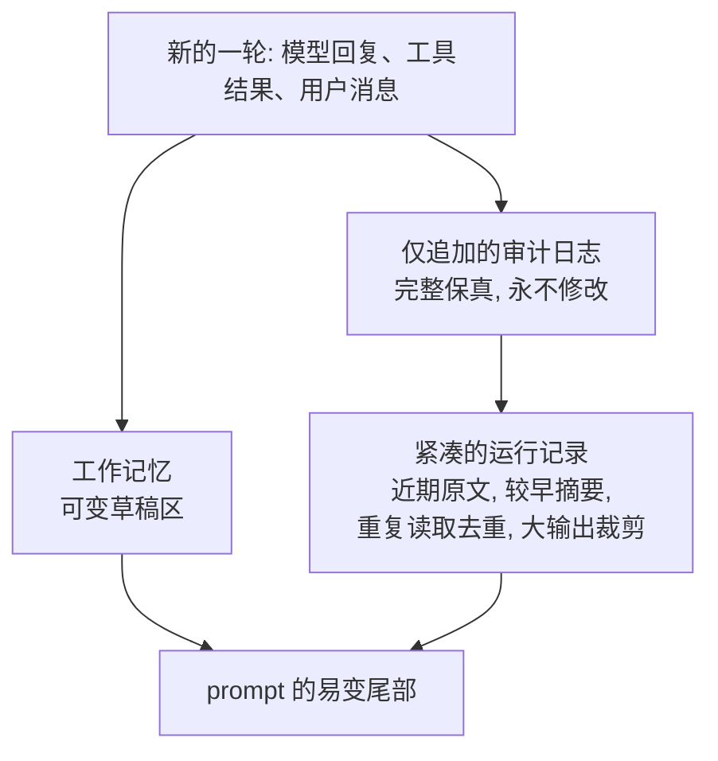

# 第 05 章 — 短期记忆

## TL;DR

短期记忆 (short-term memory) 是第 04 章中提示词易变尾部里的一切——对话记录、最近的工具结果，以及 agent 用来追踪当前任务的一小块草稿区 (scratchpad)。它是每一轮都会增长的层，也是循环跑久了最先崩掉的层。本章讲这块记忆的三个视角（仅追加的审计、紧凑的运行视图、可变的草稿区），以及生产系统用来在不丢失模型所需信息的前提下让运行视图保持小巧的半打技术：裁剪工具输出、去重重复读取、不对称压缩、回合中摘要、两阶段先折叠再压缩、按工具配置的处置规则。

---

## 为什么这件事重要

你的 agent 已经跑了四十轮。每次读文件、每次 grep、每次 web fetch、每次模型回合——所有内容都堆在 prompt 里。每轮的成本线性增长。然后模型返回 `prompt_too_long`。你加了一步去摘要旧回合。下一轮成功了。再下一轮，摘要本身也太长了。你又加了一步去摘要那个摘要。现在模型已经丢掉了原始任务，agent 在解决三轮以前的问题。

短期记忆做得糟糕，问题在爆炸之前都不可见；短期记忆做得好，问题永远不可见，因为它永远不爆炸。本章讲的就是这两者的差距。

---

## 概念

### 三个视角，而不是一个

一个生产级的 agent 没有 *一份* 对话记录。它有三份。



- **仅追加的审计日志 (append-only audit log)** 是真相。每一个模型回合、每一次工具调用、每一个工具结果，全部完整保留。你永远不去编辑它。它是支撑 resume（第 08 章）的东西，也是审计员日后会想看的东西。
- **紧凑的运行记录 (compact operating transcript)** 是模型在下一轮实际看到的东西。每次组装 prompt 时都从审计日志重新构建——裁剪、去重、摘要。它是一个 *视图*，不是一个 *存储*。
- **工作记忆 (working memory)** 是 agent 为当前任务维护的一小块可变草稿区——目标、当前计划、已读过的文件、未解的疑问。每一步都可以被覆写。

把这三者分开是让本章其余所有内容都能成立的设计。改了审计日志，你的 resume 就坏了；让运行记录无限制增长，你的循环就死了；让工作记忆变成又一份对话记录，你就把同一个问题造了两遍。

OpenCode 用 `SessionTable` 和 `PartTable` 显式编码审计日志这一拆分，并通过一个按需生成运行视图的压缩服务来实现。Hermes Agent 用带 FTS5 的 SQLite `messages` 表做审计，用 `ContextCompressor` 生成紧凑视图。形态是一样的。

### 在边界处裁剪工具输出

杠杆最大的单一动作：在大工具输出进入运行记录 *之前* 就裁剪它。一个 50 KB 的 grep 结果，从现在到对话结束，每一轮都是 50 KB 的 context。

```ts
// 用可见的省略标记裁剪。无声截断会让模型形成错误认知。
function clip(text: string, maxChars = 2_000): string {
  if (text.length <= maxChars) return text;
  const half = Math.floor(maxChars / 2);
  return [
    text.slice(0, half),
    `\n[... ${text.length - maxChars} chars omitted; full result available via <ref> ...]\n`,
    text.slice(-half),
  ].join("");
}
```

来自生产的两条规则：标记必须可见（模型需要知道它被裁剪了，否则它会当作自己拿到了完整内容来推理），而完整结果必须放在模型真的需要时可以索取的地方——临时文件、附件、独立的检索工具。OpenCode 的截断服务把完整结果写到磁盘，返回片段加指针；Hermes Agent 在工具注册表里为每个条目强制执行 `max_result_size_chars`。两者都是同一形态的变体。这个存放点是有自己生命周期的持久存储——指针何时过期、附件何时被垃圾回收、模型请求一个已经不存在的 `<ref>` 时会怎样——这些是第 08 章的问题，不是本章的问题。

### 去重重复读取

如果模型在第 3 轮和第 17 轮读了同一个文件，运行记录不需要保留两份。丢掉早的，保留最新的：

```ts
// 最新优先去重: 每个 (tool, input) 对只保留最近的那次结果。
// 跳过标记为 open_world 的工具 (第 03 章) ——它们的结果在多次调用之间不稳定。
function dedupeRepeatedReads(messages: TranscriptMessage[], registry) {
  const stable = (m) => m.role === "tool" && !registry[m.toolName]?.open_world;

  const latest = new Map<string, number>();
  messages.forEach((m, i) => {
    if (!stable(m)) return;
    const key = JSON.stringify({ tool: m.toolName, input: m.toolInput });
    latest.set(key, i);
  });
  return messages.filter((m, i) => {
    if (!stable(m)) return true;  // 用户/助手回合, 或开放世界工具: 保留
    const key = JSON.stringify({ tool: m.toolName, input: m.toolInput });
    return latest.get(key) === i;
  });
}
```

关键是按 (tool, input) 配对，不是按文本——基于文本的启发式既脆弱又有损。语义是：用相同参数对同一工具的最新调用，会取代之前的调用。对于做大量 `read_file` 的编码 agent 来说，这是裁剪之后第二大的节省。

只有当工具的结果 *在给定输入下是稳定的* 时，去重才是安全的。同一个 URL 的 `web_fetch` 在第 3 轮和第 17 轮可能返回不同的字节；一个在这两轮之间被编辑过的文件，`read_file` 的结果就不再匹配早先的读取；`now()` 或 `random()` 按定义就是不同的。第 03 章的 `open_world: true` 元数据就是用来标记这些的，去重时跳过它们——对可变内容的早期读取仍然记录了当时关键的状态。如果你的工具返回可变状态却没有标记为 `open_world`，那么你的去重会无声丢掉早期快照，而模型会以为最新那个一直都是真实的。

一个有用的副作用：去重也是死循环 (doom-loop) 信号。连续三次完全相同输入的相同工具调用，正是第 02 章用来检测卡死循环的同一种签名。同一次扫描可以同时找到两者——折叠重复项，如果重复太多就暂停。

### 不对称压缩：保护两端，压缩中间

扁平策略（"保留最近 8 轮，其余摘要"）在某种程度上可以工作，但会泄漏重要信息。生产系统的通用模式是 *不对称的*：在原文保真度上保留一个最近回合的窗口，再保留一个 *最早* 回合的小窗口，把中间的一切摘要掉。

- **OpenCode** 用 `DEFAULT_TAIL_TURNS = 2`——最后两轮被保护，不参与任何压缩。
- **Hermes Agent** 的 `ContextCompressor` 保护前 *N* 轮和后 *N* 轮；只摘要中间。
- 任何一个设计良好的系统在被推到四十轮以后都会出现同样的形态。

两端都保护的原因：*开头* 承载着模型反复回头参照的任务框架（原始目标、关键约束、用户实际的提问），而 *末尾* 承载着模型此刻正在推理的最近状态。中间是模型已经推理完了的东西——事实还在，但原始回合不需要了。

### 回合中摘要

当裁剪和去重不够用时，你就摘要。标准模式是用一个便宜的辅助模型把中间部分压缩成一段简短的参考块：

```ts
// 压缩会插入一个摘要块, 作为模型可读的内容。
async function compactTranscript(messages, opts) {
  const { keepHead = 2, keepTail = 6, summarizer } = opts;
  if (messages.length <= keepHead + keepTail) return messages;

  const head   = messages.slice(0, keepHead);
  const middle = messages.slice(keepHead, -keepTail);
  const tail   = messages.slice(-keepTail);

  const summary = await summarizer.summarize({
    purpose: "Preserve facts needed to continue the task. Reference only.",
    messages: middle,
  });

  return [
    ...head,
    { role: "user",
      content: `[SUMMARY of ${middle.length} earlier turns]\n${summary}` },
    ...tail,
  ];
}
```

实践中重要的三个细节：

- **摘要器是另一个模型。** OpenCode 跑一个专门的 `compaction` agent，没有工具，固定 token 预算；Hermes Agent 调用配置为更便宜更快的模型的 `auxiliary_client`。压缩是少数几个跑 *能力更弱* 的模型才是正解的地方：它在每个长会话上都会跑，质量底线是"保留事实"，成本差异会复利累积。
- **摘要目的要明确。** *"保留继续任务所需的事实"* 会产生有用的摘要；*"总结对话"* 会产生没用的摘要。告诉辅助模型它在保留什么，它的输出扮演什么角色。
- **摘要是内容，不是元数据。** 模型会在下一轮把它当作 prompt 的一部分来读。一个清晰的标记 (`[SUMMARY of N earlier turns]`) 让模型可以显式地推理它没有原始内容这个事实——*"我没有那些回合的细节；如果需要我可以重新去取。"*

### 什么算一份好摘要

摘要本身是一门小手艺。糟糕的摘要比没有摘要更糟——它用自信的口气告诉模型一些略微错误的事实，而且没法验证。三个属性把有用的摘要和有害的摘要区分开来：

- **保留具体内容，丢掉概括。** *"用户想升级他们的认证库"* 丢掉了依赖名；*"用户在从 `next-auth@4` 迁移到 `next-auth@5`，并已经更新了 `app/api/auth/[...nextauth]/route.ts`"* 才是模型需要的。事实、文件路径、标识符、日期、决策——这些是承重的部分。
- **标注哪些是推断的，哪些是观察到的。** 当"测试通过"这个说法来自推断而不是直接的工具结果时，*"agent 尝试运行测试套件；从记录中无法确定结果"* 比 *"测试通过了"* 要好。好的摘要器会标记不确定性，而不是把它抹平。
- **关键之处保留原话。** 当用户说 *"完全按照 Stripe 的方式做"* 时，摘要应该引用，不要意译。意译过的用户意图在每一次传递中都会漂移；引用的用户意图会保持稳定。
- **给摘要结构化，不要只是叙述。** 生产级摘要器会收敛到三段——*已确立的事实*（文件路径、标识符、已定的结果），*已做的决策*（带原因），以及 *未解的问题*（agent 无法确认的事、用户没回答的事）。一段扁平的文字把三者混在一起，逼着模型重新扫读。结构化的摘要告诉模型从哪儿接着干，以及哪些当参考、哪些是行动项。

摘要器的系统 prompt 比模型选择更重要。一个小但提示得好的摘要器产出的摘要比一个大但提示得差的摘要器更紧凑。OpenCode 和 Hermes Agent 都明确地在这个 prompt 上投入精力，每个长会话都会赚回成本。

### 压缩触发器：主动与被动

压缩什么时候触发？两种策略，生产中都有：

- **主动 (token 阈值)。** 每一步之后，把运行记录的 token 数和 `context_limit − max_output − safety_buffer` 比较。如果超出，下一次调用之前先压缩。OpenCode 的 `isOverflow()` 检查在每一步之后运行；安全缓冲通常是几千 token。优点：压缩永远不会发生在不合适的时刻，用户在回合延迟里不需要为它付费。
- **被动 (prompt-too-long)。** 直接照原样发送下一个请求。如果提供方返回 `prompt_too_long`，捕获它，跑一次更激进的压缩，然后重试。优点：在你真的需要之前，不会为摘要器的调用付费。缺点：触发它的那一轮，用户要等更久。

大多数团队会收敛到以主动为主求可预测性，加被动 fallback 求安全。第三个杠杆——**模型 fallback**——在同一个抽屉里：当 context 紧张时，切换到一个上下文窗口更大的模型（第 17 章覆盖路由）。当压缩会丢掉你输不起的信息时，就用它。

### 压缩边界标记

压缩会在运行记录里插入一个标记——OpenCode 的 `CompactionPart`，Hermes Agent 的 `SUMMARY_PREFIX` 块。这个标记是 *内容*，模型可以读，不是不可见的元数据。这点重要有两个原因：

- 模型可以推理它自己的认知缺口。*"我没有第 5 到第 30 条消息之间的细节，因为它们被压缩了；如果我需要，我去重新读那个文件。"* 没有这个标记，对话记录中看似的跳跃会让模型困惑——要么完全无视较早的 context，要么编造它。
- 这个标记是运行记录和审计日志可以对齐的接缝。调试 agent 运行的人在运行视图里找到这个标记，然后去磁盘上的审计日志里查原始回合。

标记应该清楚无歧义、简短——单行说明摘要了什么、跨多少回合。再长就是模型每一轮都要扫读的噪声。

### 先折叠，再摘要

便宜的动作先做，贵的留后。两阶段模式：当 context 开始膨胀时，先跑激进的裁剪和去重（"折叠"）；只有折叠之后 transcript 仍然太大，才触发摘要器。Hermes Agent 和领先的商用编码 agent 都这么做——先做小、机械、免费的操作；再做 LLM 驱动的摘要。

原因：折叠是确定性的，没有每轮成本，而且常常能完全解除压力。摘要要付出一次额外的模型调用。把摘要器留到真正需要时才用，平均下来压缩成本就低——大多数"压缩事件"根本到不了第二阶段。

### 压缩方法对比

近距离看，"压缩"不是一种技术，而是一族技术，每一种都有不同的成本/质量权衡。生产中出现的六种：

| 方法 | 做什么 | 成本 | 损失什么 |
|---|---|---|---|
| **裁剪 (Clipping)** | 截断任何超过大小阈值的单个工具结果；插入可见标记；完整结果留在磁盘上。 | 基本免费，确定性。 | 单条结果内部的细节。模型可以通过指针重新去取。 |
| **最新优先去重** | 丢掉相同 `(tool, input)` 调用的早期副本。 | 基本免费，确定性。 | 没有模型还在用的东西——按定义后调用取代了早调用。 |
| **历史剪除 (History snip)** | 丢掉超过固定深度的整轮（通常是较早的工具结果）；保留模型推理回合。 | 免费。 | 旧工具结果中的细节；周围的推理被保留下来。 |
| **不对称摘要** | 辅助 LLM 把对话中部压缩成单个参考块；头尾回合保持原文。 | 每次压缩一次辅助模型调用。 | 中间部分的细粒度结构；如果摘要写得好，事实会被保留。 |
| **微压缩 (Microcompaction)** | 与摘要相同，但在更小的窗口上——一次只处理最早的几轮，反复进行。 | 每个长会话几次小的辅助调用。 | 单次损失更少；但多次之后漂移机会更多。 |
| **会话轮转 (Session rotation)** | 用一段移交块开启新会话，移交块总结一切关键内容；通过 `parent_session_id` 串联。 | 一份新的 prompt cache（第 04 章的成本）；新的审计日志。 | 移交块没捕获的所有内容。第 04 章构建起来的 cache 热度。 |

在生产中，这些不是替代关系，而是一条 *流水线*。一个长会话的典型序列：每次工具插入时裁剪 → 每次模型调用前去重 → 剪除超过某个深度的较旧回合 → 阈值触发时摘要中部 → 摘要已经跑过两三次时轮转会话。每种方法都给你争取到下一个触发之前的时间。

设计决策不是"我选哪个"，而是"按什么顺序，用什么阈值"。让你的 agent 为你的技术栈写出这条流水线，并记录每次压缩事件触发了哪种方法——一周真实会话的直方图会告诉你阈值是否合理、哪种方法在做主力工作、哪种你可能可以丢掉。

### 压缩也是一种可观测性

一条你不去测量的压缩流水线，就是一条你无法调优的流水线。每次压缩事件值得记录的三件事：

- **触发了哪种方法**——裁剪、去重、剪除、摘要、微压缩，还是轮转。跨一周会话的直方图告诉你阈值有没有校准。如果每个长会话都触发摘要、剪除从来不触发，你的剪除阈值可能太宽松。如果轮转触发频繁，你的摘要器 prompt 可能太弱。
- **前后 token 数**——每种方法的压缩比。对成本预估有用，也能在某人调整摘要器 prompt 而压缩比悄悄变差时抓到回归。
- **模型在多少轮之后又回头引用了被摘要的内容**——如果模型反复重新取那些被摘要掉的东西，说明你的摘要漏掉了事实。如果模型从不回头引用摘要的内容，可能是你摘要得太急切，可以把阈值往上推。

这条度量流应该和第 04 章的 cache 命中率一起进入第 16 章的追踪流水线。它们合在一起告诉你：你的 prompt 架构在生产中到底有没有产生回报，还是说三个版本之前就悄悄退化了。

### 并非所有工具结果都一样

不同的工具在运行记录里值得不同的处置策略：

- **技能 (skill) 结果和结构化工具输出** 通常短而高信号。原样保留。
- **shell 日志、原始文件转储、网页抓取正文** 一旦被消费就长而低信号。插入时就激进裁剪；模型走远几轮后直接丢掉。
- **补丁和 diff** 中等信号，需要在若干轮内保持可见以支持后续编辑。保留到补丁被应用或拒绝，然后丢掉。
- **图片附件** 通常重，但 *恰好一次* 高信号。在它被引用的那一轮保留，后续轮要么丢掉，要么压缩成文本描述。

OpenCode 的压缩显式保护技能工具的结果不被丢掉；Paperclip 把适配器输出的块单独存储，并在运行记录里引用。一个有用的练习：把你拥有的每个工具分类为 `keep_verbatim`、`clip_on_insert` 或 `drop_after_consumed`，并把策略和第 03 章的元数据一起烘进工具注册表。压缩器读取策略；你就不用一轮一轮地纠结"我该不该丢掉这个"了。

### 会话轮转：当对话变成一段新对话

对于非常长的会话，即使是激进的压缩也丢得太多。下一步：轮转到一个新会话，带着 *移交* 块向前推进，移交块总结一切关键内容，并用 `parent_session_id` 把新会话链回旧会话。

Hermes Agent 这么做——`ContextCompressor` 可以生成一个通过 SessionDB 中 `parent_session_id` 串联的新 session ID，于是完整的血统是可追溯的。Paperclip 的 `evaluateSessionCompaction()` 根据每会话最大运行数、最大原始输入 token 数、以及最大会话时长（小时）来决定是否轮转；轮转时，它写一段移交 markdown 块来显式连接前后。

轮转比压缩重——新会话有全新的系统 prompt 和全新的 cache（第 04 章的成本）——但对于长跑的 agent 来说，它是最干净的重置。权衡：轮转换给你一张干净的白纸，但代价是你失去之前积累的 cache 热度。在摘要不再够用的时候用它；如果一次压缩就能搞定，就不要用。

### 子 agent 的记忆是它自己的

当父循环把任务委托给一个 subagent (第 10 章) 时，subagent 拿到自己的短期记忆。父级 *看不到* subagent 的中间回合；subagent 只看到父级递给它的 prompt 加上它自己的工具产出的东西。OpenCode 的 `task` 工具创建一个子会话，里面带父级 context 的过滤切片；OpenClaw 的 `sessions_spawn` 同样如此。

这是有意为之。一个用自己的工具调用填满父级 transcript 的 subagent 会让压缩难度大大增加，并让中间噪声污染父级的推理。subagent 只返回一个观察——它的最终答案——父级的 transcript 只记录这一个。

由此推论，这是常坑：如果你想让父级知道 subagent 的中间工作，subagent 必须把它包含在最终答案里。subagent 保留私有的任何东西，对父级永远不可见。

### 重申冻结快照

那些活在 *系统 prompt* 里的记忆文件——`MEMORY.md`、`USER.md`、agent 笔记、技能索引——在会话开始时就被捕获，会话过程中不会变。这条规则在第 04 章建立过，这里再次适用。易变尾部（本章）是会话中段变化发生的地方；稳定前缀（第 04 章）是会话开始冻结发生的地方。分界线就是 cache 断点。

如果你想让一条记忆是动态的，把它放进尾部（工具结果、工作记忆）。如果你想要 cache 命中，把它放进前缀（记忆文件、系统指令）。试图两者兼得——既动态又被缓存——的结果是每一轮都付出一次昂贵的 cache miss。这种成对关系——第 04 章的前缀和本章的尾部——就是 prompt context 的完整架构。其余都是记账细节。

---

## 真实系统参考

- **OpenCode** 是三视图纪律最强的参考：`SessionTable` 和 `PartTable` 保存仅追加的审计，`Truncate.Service` 在边界处裁剪工具结果，`SessionCompaction.Service` 在 `isOverflow` 触发时主动运行，`CompactionPart` 是运行记录中可见的边界标记。专门的 `compaction` agent（无工具，固定预算）是辅助模型模式的好模板。
- **Hermes Agent** 拥有最干净的回合中摘要流水线：`ContextCompressor` 保护头尾回合，通过 `auxiliary_client.call_llm()` 摘要中部并加上显式的"仅供参考"标记，并能在仅摘要不够用时通过 `parent_session_id` 轮转到新会话。每个很长的会话最多三轮压缩。
- **OpenClaw** 把每个会话的对话记录存为 JSONL 文件（每会话一份）作为审计日志，并在会话开始时把 MEMORY.md 作为冻结快照注入 prompt——与第 04 章同样的不变性规则，应用到记忆文件上。
- **Paperclip** 是把压缩上推到编排层的例子：`evaluateSessionCompaction()` 监视最大运行数、最大输入 token 数和会话时长，当任何阈值越过时用一段移交 markdown 块轮转 agent 的 session ID。同样的形态，只是在技术栈的更高一层。

---

## 和你的 agent 一起练习

几条在本章上效果不错的 prompt：

- *"在我的项目里搭起三视图拆分：磁盘上的仅追加审计日志、一个按需构建紧凑运行记录的函数、以及循环可读可写的工作记忆结构体。让一次回合流经这三者给我看。"*
- *"给每个工具结果加上可见标记的裁剪。然后写一个测试验证模型可以通过引用请求完整结果，并拿回原始字节不变。"*
- *"用 (tool name, tool input) 的 JSON 相等做最新优先去重。把我最近一次二十轮的会话跑一遍，报告 transcript 体积精确下降了多少。"*
- *"实现不对称压缩：保留前 2 轮和后 6 轮的全保真，通过更便宜的模型摘要中间。让我看到插入 transcript 的边界标记，以及模型下一轮读它。"*
- *"接上一个主动压缩触发器，当运行记录达到 `context_limit − max_output − 4 KB` 时触发。再加一个被动 fallback，在 `prompt_too_long` 错误时跑一次更激进的压缩。打印每次压缩事件触发了哪个触发器。"*
- *"把我注册表里的每个工具分类为 `keep_verbatim | clip_on_insert | drop_after_consumed`。更新运行记录构建器以遵守这些策略，让我看到在一次真实会话里的体积影响。"*
- *"我的 agent 偶尔跑超过 200 轮。实现会话轮转：通过 `parent_session_id` 串联创建新会话，写一段连接两者的移交 markdown 块，并在下一条用户消息之前把新会话的 prompt cache 预热。"*
- *"加上压缩可观测性：记录触发了哪种方法（clip / dedupe / snip / summarize / microcompact / rotate）、前后 token 数、以及模型在多少轮之后第一次又引用了被摘要的内容。把我上周会话的直方图画出来，告诉我阈值校准得好不好。"*

---

## 下一章

你现在有了一份紧凑、去重、摘要过的运行记录，它不会撑爆 context window。其中没有任何东西能活到下一个会话。

第 06 章讲的是 *能* 活下去的那种记忆——你在多次运行之间持久化什么、模型怎么把它检索回来、以及向量索引、全文搜索和混合检索的对比。第 07 章接着讲怎么安全地写入那份记忆——不要污染它，也不要让它随时间漂移。
