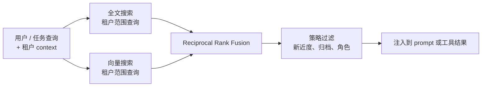

# 第 06 章 — 长期召回

## TL;DR

短期记忆（第 05 章）是模型 *此刻* 看到的东西。长期召回 (long-term recall) 则关乎当前这次运行里有价值的东西如何留存到下一次运行——以及之后你如何重新找到它。检索有三种范式（语义向量搜索、全文搜索、人工策划的知识），检索接入循环有三个位置（在前缀里作为冻结的快照、在易变尾部里作为工具结果、在会话启动时预取），还有一条把它们串到一起的设计约束：任何放进前缀里的东西，每一轮都必须字节稳定，否则你就丢掉了第 04 章的 cache。本章讲的是怎么挑对组合——不是"加个向量库"了事，而是为眼下这个决定选对 context、用对机制检索、注入对地方。

---

## 为什么这件事重要

一个没有长期记忆的 agent，每一轮会话都要把相同的项目事实、用户偏好和过往的失败重新学一遍。一个记忆配错了的 agent 则会悄悄检索到错误的内容——用户问的明明是某个具体错误码，向量搜索却自信地返回一段换了说法的近似内容；关键字搜索则会漏掉所有在会话之间被重新措辞过的东西。两者都是悄无声息地失败，都在拿错误的东西喂模型，而且都很容易被误诊为 *模型不行*。

真正可用的检索，是失败模式看得见的检索。本章讲三种主要机制、它们各自如何失败、以及如何把它们组合起来，让单个失败不至于变成一个无声的错误答案。

---

## 概念

### 长期记忆到底是什么

放眼各类生产系统，"长期记忆"通常是四种东西叠在一起：

- **纯 markdown 文件** —— `MEMORY.md`、`USER.md`、agent 笔记、技能文件。人可读、人可编辑，会话开始时被冻结进系统 prompt。Hermes Agent 和 OpenClaw 都以这种形态为核心。
- **结构化表** —— SQLite（`sessions`、`messages`，带 FTS5 索引），更大的系统里则是 Postgres。作为审计 transcript 时是仅追加的；用来召回时是可查询的。
- **向量索引** —— 可选，通过 `sqlite-vec`、`pgvector` 或专用存储叠加上去。当关键字搜索不够用时，用它来做语义相似匹配。
- **外部提供方** —— Honcho、Mem0、自建检索服务，或者把上述任何一种包装起来的 MCP 工具。

仅凭 markdown 文件就能支撑一个小型的单用户 agent——一个只有单个用户、单台机器、少量笔记的个人助理，用文件就够了。一旦你需要跨会话搜索、审计历史、或者规模超出单个用户，结构化表就成了承重组件——而这正是大多数生产路径的写照。向量索引和外部提供方则是再往上叠的；没有它们也能做出能干的 agent，大多数路径在第一天也并不需要它们。

### 按访问模式选存储形态

| 形态 | 最适合 | 更新方式 | 检索方式 |
|---|---|---|---|
| Markdown 文件 | 身份、用户模型、项目规则、技能内容 | 人类或策展人 | 会话开始时读整文件 |
| 结构化表 (+ FTS) | 审计日志、会话搜索、按 ID 查找 | 仅追加 | SQL 查询、全文 |
| 向量索引 | 语义召回、换种说法的查询 | 追加 + 嵌入 | k 近邻 |
| 外部提供方 | 跨产品记忆、大规模知识 | API 推送 | API 查询 |

第一列也可以反过来当成加一层之前该问的问题：*我的 agent 需要记住的东西里，有哪些是上面那些层还处理不了的？* 如果答案是没有，你就不需要那一层。大多数生产 agent 最终落在"markdown + SQLite+FTS"这一档，只有当换种说法的查询多起来时，才会去动用向量。

### 三种检索范式

你从三种主要技术里挑选，并把它们组合起来：

- **向量搜索 (Vector search)** 把文本嵌入成向量，再检索邻近的向量。它擅长换种说法的提问、相似的历史问题、概念性问题，但在精确标识符上会失手——工单号、错误码、commit 哈希、函数名。
- **全文搜索 (Full-text search)**（BM25 或 FTS5）对精确词项建索引。它擅长 ID、代码、文件名、精确短语，但在换种说法和概念性查询上会失手。
- **人工策划的知识 (Curated knowledge)** 是一小组持续维护的 markdown 页面。当知识集合有边界、值得手工编辑时它最合适，但扛不住规模——处理不了成千上万条事实。

```ts
// 三种范式实现同一种形态——背后是不同的存储。
type Retriever = {
  search(query: string, opts: {
    tenantId: string;
    topK?: number;
    filters?: Record<string, unknown>;
  }): Promise<Array<{
    id: string;
    text: string;
    score: number;
    metadata: Record<string, unknown>;
  }>>;
};
```

单一的 `Retriever` 接口让你可以替换实现，或者把多种实现叠起来用。

`tenantId` 过滤并非可选——检索就是数据访问，一个会把某个用户的记忆召回到另一个用户会话里的 agent，那是一次安全事件，而不是普通 bug。要在存储层强制它（拒绝任何不带租户的查询），而不是在调用点强制（在调用点，它离被某个低级 bug 跳过只有一步之遥）。

### 混合检索，默认配置

对大多数 agent 而言，向量与全文搭配使用，表现都优于其中任何一个单打独斗。标准的合并方式是 reciprocal rank fusion (RRF，倒数排名融合)：



租户限定是一个 *查询时* 的谓词，而不是合并之后再做的过滤——搜索本身就拒绝返回跨租户的行。凡是在合并之后才施加的过滤（新近度加权、归档剔除、基于角色的可见性）都属于策略，而非访问控制。把这两者混为一谈，正是那种典型的 bug 模式：一个摆在检索下游的租户过滤，意味着跨租户的行早已被读进了内存里——按大多数威胁模型来看，这跟一次泄漏没有区别。

```ts
// RRF: 无需训练数据, 让在多个列表中都排名靠前的记录浮出来。
function rrf(rankedLists: Array<Array<{ id: string }>>, k = 60) {
  const scores = new Map<string, number>();
  for (const list of rankedLists) {
    list.forEach((r, idx) => {
      scores.set(r.id, (scores.get(r.id) ?? 0) + 1 / (k + idx + 1));
    });
  }
  return [...scores.entries()]
    .map(([id, score]) => ({ id, score }))
    .sort((a, b) => b.score - a.score);
}
```

RRF 会奖励那些在多个列表里都出现的记录，同时又仍然允许某个单一的强信号把一个结果顶上来。它无需训练，只要两个形态相同的排序列表即可。接入时，并行跑向量和 FTS，把两路输出都喂给融合器——这是整个记忆栈里成本最低的质量提升手段之一。

### 排序不只是相似度

纯相似度分数往往会把错误的条目顶到前面。一条两年前的、语义完美匹配的条目，通常不如上周一条略弱的匹配有用。生产系统在排序时会再借助三个信号：

- **新近度 (Recency)。** 在基础分上施加一个小的线性或指数衰减。在余弦相似度相同的情况下，昨天的条目胜过去年的。Hermes Agent 的会话搜索在汇总结果时会把新近度计入权重；OpenClaw 则在向量和 FTS 命中之上再叠一层新近度加成。
- **置信度 (Confidence)。** 在相似度相同的情况下，标为 `user-confirmed`（用户确认过）的条目排在 `agent-inferred`（agent 推断）之上。这个标签来自第 07 章的写入路径，但真正派上用场是在检索层。
- **访问频率 (Access frequency)。** 这个月被 agent 查阅过三十次的条目，多半比一条没人碰过的更有用。跟踪 `last_accessed_at` 并把它纳入排序，既便宜又有效。

在 RRF 之后加一个小的重排器——新近度 + 置信度 + 访问频率——往往比换掉底层的向量模型更能提升观感质量。让你的 agent 接一个上去，并记录每次查询前后的排名变化；直方图会告诉你哪个信号在真正起作用、哪个只是在拖后腿。

这个重排器同时也是你直接淘汰候选项的地方。一个访问频率为零、置信度为 `agent-inferred`、且存在超过 90 天的条目，几乎一定是噪声。趁它还没进到 prompt 里就丢掉，别留给模型去判断。

### 检索在循环中的位置

检索并不是单一的挂钩点。有三种放置选择，各有不同的取舍：

- **在前缀里，会话开始时（冻结）。** 读取一次，烘进系统 prompt，整个会话期间冻结。cache 始终温热，后续每一轮都便宜。`MEMORY.md`、`USER.md`、技能索引、项目 context 都走这种方式。约束在于：注入到这里的东西在会话中途不能变，否则就会破坏第 04 章的 cache。
- **在易变尾部里，作为工具结果。** 模型在运行时自行决定调用 `search_memory` 或 `session_search` 这类工具。结果作为 tool message 返回。它是实时的、查询时的，且没有 cache 代价（结果本来就落在尾部）。最适合那些取决于对话刚刚发现的内容的查询。
- **会话开始时预取，注入到第一条用户消息里。** 在循环开始之前，harness 先查询外部提供方（Honcho、自建服务）；结果作为一个围栏块进入 *尾部*。Hermes Agent 的 `MemoryManager.prefetch_all()` 就是这种形态。它是个折中——既拿到了新鲜数据，又不必每轮多付一次工具调用，但代价是第一轮要吃一次 cache miss。

大多数生产 agent 三种都用。对每一段记忆，判断标准是：*这东西在会话内部会变吗？不会，就放前缀；会，就放工具结果；如果它来自外部、又慢、但前期就需要，那就预取。*

### 技能索引模式 —— 渐进式披露

前缀里最常见的一类记忆就是 *技能索引 (skill index)*：一份由 `(skill_name, 一行描述)` 配对组成的列表，无论有多少个技能，它都只占几百 token。任何一个技能的完整内容，都通过 `skill_view(name)` 工具按需加载。

这就是渐进式披露 (progressive disclosure)。模型每一轮都看到这份索引（便宜，cache 温热），只有当它真的决定要用某个技能时，才付出加载完整内容的代价。Hermes Agent 和 OpenClaw 都用 `~/.hermes/skills/` 或 `~/.openclaw/skills/` 里的 markdown 文件来实现它；其 YAML frontmatter（`name`、`description`、`version`、`platforms`）就成了索引里的一条条目。

```ts
// 会话开始时 prompt 看到的东西。
function buildSkillIndex(skills: SkillFile[]): string {
  return skills
    .filter(s => !s.archived)
    .map(s => `- ${s.name}: ${s.description}`)
    .join("\n");
}

// 模型想要技能完整正文时调用的东西。
const skillViewTool = {
  name: "skill_view",
  description: "Load the full content of a skill by name.",
  input_schema: {
    type: "object",
    properties: { name: { type: "string" } },
    required: ["name"]
  }
};
```

这种模式可以推广。任何条目带有简短摘要的记忆存储，都可以这样暴露出来——wiki、FAQ 数据库、运行手册（runbook）、项目 README。第 14 章会更深入地讲技能作为一种设计单元；本章讲的是它们所依托的那种 *检索模式*。

### 记忆命名空间

记忆是数据，而数据需要划定范围 (scope)。真实系统沿四个维度来切分它：

- **按用户 / 按租户** —— 最重要的一道边界。跨过它，就会在客户之间泄漏数据。
- **按项目 / 按工作区** —— 编码 agent 通常以项目为范围；调试项目 A 时写下的记忆，不应该在做项目 B 时冒出来。
- **按 agent 角色** —— 探索 agent 和构建 agent 之间可以共享记忆；审计 agent 和生产 agent 之间则不应该。
- **按环境** —— staging 和 production 永远不该共享记忆。staging 里某个写下了误导性事实的测试场景，绝不能在真正的 production 会话里冒出来。

具体机制各不相同。Hermes Agent 用以工作区为范围的 MEMORY.md 文件。OpenCode 通过 `InstanceState` 解析每个项目的状态。Paperclip 则靠一张 `companies` 表、外加其余所有表上的行级范围限定，实现了显式的多租户。真正能扩展的形态是：每一次记忆查询都带上一个 *租户 context* 参数，存储层拒绝返回任何不带它的条目。"默认"命名空间就是一个等着被人钻空子的安全漏洞；不要把它发布出去，哪怕在开发环境里也不行。

除了范围，记忆还有 *生命周期*：条目会因用户请求而被删除、因 TTL 而过期、或被策展人软删除以待审查。检索层必须在查询边界处尊重这些状态——一个从向量索引里返回出来的软删除条目，和租户泄漏属于同一类正确性 bug。第 07 章讲写入侧的机制（策展人生命周期、删除标记、归档）；第 18 章讲用户同意、被遗忘权、保留策略以及审计义务。第 06 章的职责，是拒绝返回那些层已经标记为禁区的东西。

### 记忆在 prompt 中的格式与预算

记忆以什么方式进入前缀，其重要性超出大多数人的预期。常见形态有：

- **带分隔符的 markdown 段。** Hermes Agent 和 OpenClaw 用 `§`（章节符）来分隔 MEMORY.md 的各条目，这样模型不必依赖版式就能识别条目边界。
- **YAML frontmatter。** 技能文件采用 `name`、`description`、`version` 这样的字段块，prompt builder 可以机械地读取。
- **围栏块。** 外部记忆查询的结果常常以 `<memory-context>...</memory-context>` 围栏的形式注入；agent UI 可以把它们从用户可见的界面里剥掉，同时保留在模型的视野中。

大小预算是实打实的约束。一份 50 KB 的 `MEMORY.md` 每个会话都往前缀里塞，那就是 50 KB 始终温热的 cache 载荷——如果它确实承重倒也无妨，但若大半是噪声就太贵了。定一个软上限（前缀里的记忆总量 10–20 KB 是个合理的起点），交给第 07 章的策展人去强制执行。"10 KB 的精炼笔记"和"50 KB 的陈年杂物"之间，agent 唯一能感受到的差别就是延迟和成本——还可能体现在推理质量上，因为前缀里噪声越多，模型每一轮要略读的噪声也越多。

### 外部记忆提供方

凡是超出本地文件和 SQLite 范畴的，都算外部记忆提供方——Honcho、Mem0、云厂商的向量服务，或者你自己的检索 API。各系统通用的模式是：提供方以插件形式注册，从上述三个放置挂钩之一被调用，其结果也遵循同样的 `Retriever` 形态。

Hermes Agent 明确执行着一条很有用的纪律：*每个召回目的只配一个提供方*。把两个提供方用在同一个目的上，往往会产出彼此不一致、互相冲突的召回结果，而模型无从裁决。如果你确实需要在单个目的上做冗余，那就让一个跑主路、另一个作为影子，在日志里跟主路做对比，而不是并行注入。两个提供方服务于真正 *不同* 的目的——一个管用户偏好、一个管组织知识库——则完全没问题；这条纪律是按目的来算的，不是笼统地按会话来算。

延迟同样重要。一个给会话启动加 800 ms 的外部提供方没问题；一个给 *每一轮* 都加 800 ms 的就有问题了。本章前面那条放置规则直接给出了答案：慢的提供方属于预取路径或工具调用路径，绝不能作为模型每轮都得干等着的同步查找。

### 嵌入模型迁移

向量召回绑定在某个特定的嵌入模型上，而这个模型迟早会被替换——厂商出了新版本、你切换到更便宜或自托管的嵌入器、或者旧端点被弃用。一旦嵌入变了，你索引里的每个向量就都落在了错误的空间里，召回质量会悄悄下滑。

行之有效的迁移做法是：

- **在每条记录上盖上嵌入模型的印记**（`model: "text-embedding-3-small@2024-01"`）。否则你根本记不清哪个模型写了哪些向量，而一个混入两种模型的半迁移索引会给出毫无意义的分数。
- **在后台重新嵌入，并双写到新索引。** 在新索引完全填满之前，让旧索引继续服务查询。迁移耗时长一点没关系；但一个一边服务实时查询、一边还没填满的索引可不行。
- **原子地切换查询路径。** 一旦新索引在一组已知良好的查询保留集上验证通过，就翻转读路径。同时把旧索引保留一段恢复窗口期，以防新模型在保留集没覆盖到的地方出现退步。

第一天就要为这件事做好打算——至少把模型版本和每个嵌入一起持久化下来——这样等到某个被弃用的端点熄灯那天，你才不会措手不及。外部提供方（Honcho、Mem0、托管向量存储）会在内部替你处理这件事，这也正是选用它们的一个更充分的理由；而如果你自己跑索引，迁移就得自己扛。

### 检索作为可观测性

一个你不去测量的召回层，它的静默失败你往往只有等到用户抱怨时才会发现。有三项测量值得从第一天就接上，与前几章的 cache 命中和压缩信号并列：

- **空手率 (Empty-hand rate)。** 有多大比例的检索返回了零结果？这个值偏高，说明你的存储太稀疏，或者查询写错了；这个值为零，则可能意味着你在过度注入噪声。
- **触达率 (Reach rate)。** 在你 *注入* 的记忆条目中，有多大比例被模型在下一轮里真正引用了？如果模型从不去碰你注入的东西，那就说明你的检索送进去的是错误的 context。Hermes Agent 和几个领先的编码 agent 都记录 `last_accessed_at`，正是出于这个原因。
- **租户完整性 (Tenant integrity)。** 在租户 A 里发起一条合成查询，它在理论上"本该"命中一条只写在租户 B 里的条目——而正确的结果是 *绝不* 返回它。要在生产里把这一项当作持续测试来跑，而不仅仅在部署时跑一次。

这些指标连同前几章的 cache 命中率、压缩方法直方图一起，归入第 16 章的追踪流水线。它们合在一起，能告诉你：你精心设计的前缀和尾部到底是在真正服务模型——还是只是在白白花 token。

### 子 agent 的召回边界

当父级委派给子 agent（第 10 章）时，召回是其中一项边界决定。常见有三种策略：

- **子 agent 继承父级的命名空间。** 子级看到的是同一份记忆和技能索引。这样做便宜且一致；但如果子 agent 是些短命的实验，其"经验教训"本不该沉淀为永久召回，那就有污染风险。
- **子 agent 拿到一份限定的切片。** 子级只看到为其角色（`explore`、`build`、某个特定技能族）打了标记的记忆。OpenCode 的按 agent 划分的工具集，可以自然地推广到按 agent 划分的记忆集。
- **子 agent 什么都拿不到。** 子级只收到父级递给它的那条 prompt，其余一切都不可见。这对一次性计算很有用；风险是子级会重做一些本可借父级记忆跳过的工作。

要按每个 agent 的具体配置来选，而不是一刀切地全局设定。检索层应当在租户之外再接受一个 *agent 身份*——还是同一个 `Retriever` 接口，只是多加一个过滤维度。

### 索引陈旧与会话连续性

一份在会话开始时还正确的记忆索引，到第十五轮可能就已经陈旧了。有几种情况值得留意：

- **策展人在会话中途归档掉的技能。** 运行中的 prompt 索引里仍然提到它们，但文件已经没了。agent 一调用 `skill_view(name)` 就拿到"未找到"。这要在工具里优雅地处理掉，而不是去重建前缀。
- **本次会话里写入的记忆。** 它已经落到磁盘上，但在运行中的 prompt 里看不见（前缀在会话开始时就冻结了）。它要到下一次会话开始时才可见。别让 agent 误以为情况相反。
- **会话之间外部提供方的更新。** 新条目落地了。下一次会话开始时会取到它们，而当前这次取不到。

这正是 cache 约束的另一面：稳定性给你换来了便宜的轮次，代价则是轻微的陈旧。大多数团队接受这个权衡，选择在工具层优雅地兜底，而不是硬跟它对着干。

### 重申 cache 约束

本章的一切，都被第 04 章的一条规则所塑造：任何你注入到系统 prompt 的东西，都会成为被缓存前缀的一部分，而 cache 要的是逐字节稳定的内容。落到记忆上的实际含义是：

- **前缀里的文件在会话开始时冻结。** 会话中途的写入要到下一次会话才可见，本次不行。第 07 章讲写入路径；之所以把冻结规则放在这里，是因为它约束着你能把什么放到哪。
- **前缀里的外部提供方结果，一旦在会话之间发生变化就会破坏 cache。** 要么接受会话启动时的那次 cache miss（Hermes Agent 就是这么做的），要么改把这些结果作为工具结果推到尾部去。
- **技能索引在文件列表变化之前都是稳定的。** 如果第 07 章的策展人在会话中途归档了某个技能，这一变化要到下一次会话开始时才可见。这是有意为之的设计。

召回层和 prompt builder 层并不是两件分开的事——它们是同一件事的两个视角。如果你从这两章里只内化一条规则，那就让它是这一条。

---

## 真实系统笔记

- **Hermes Agent** 是分层记忆的最佳参考：基于文件的 `MEMORY.md` 和 `USER.md`、SQLite+FTS5 会话存储、通过 `sqlite-vec` 的可选向量索引、通过 Honcho 的可选外部提供方——所有这些都统一在一个 `MemoryManager` 之下，它在循环开始前预取，并暴露一个 `session_search` 工具供实时查询。
- **OpenClaw** 拿出的是同一种形态：每个工作区一份 `MEMORY.md`、JSONL 格式的会话 transcript、一个可选的做语义搜索的 `active-memory` 插件，再加上确定性的文件顺序，从而让被缓存的前缀在多次会话之间保持字节稳定。
- **OpenCode** 以会话存储和项目范围的状态 (`InstanceState`) 为核心，还有一个隐藏的 git 快照仓库，逐步跟踪文件的变化，并以此驱动一个 revert（回退）UI。它给出的启示是：长期召回可以是代码状态，而不只是文本——磁盘上的文件以及它们的 commit 历史，同样是记忆。
- **Paperclip** 是工作流控制平面版本的长期记忆：`issues`、`agents`、`runs`、`approvals`、`cost_events`——全部持久、全部可查、全部按公司划定范围。那是组织流程层面的召回，把同一种形态套用到了一个不同的领域。

---

## 与你的 agent 结对

几条在本章上效果不错的 prompt：

- *"给我搭一个 `Retriever` 接口和三个实现：通过 sqlite-vec 做向量、通过 FTS5 做全文、再加一个 markdown wiki。把它们都接到同一个 RRF 融合器上。让我看到一次查询返回的三个排序列表，以及融合后的输出。"*
- *"挑出我的 agent 需要的三段具体记忆（一个用户偏好、一个上周的错误码、一条项目规则）。告诉我每一段分别该用哪种检索方法处理，又该注入到循环的哪个位置——前缀、工具结果，还是预取。"*
- *"实现技能索引模式：prompt builder 从每个技能文件里读取 YAML frontmatter，产出一份每个技能占一行的索引。模型通过调用 `skill_view(name)` 来加载完整内容。两部分都给我看，然后再补上文件在会话中途被归档的情况。"*
- *"给我的检索层加上租户限定。写一个测试，证明租户 A 的查询在任何情况下——包括故意构造的畸形输入——都无法返回任何由租户 B 写入的条目。"*
- *"统计我系统 prompt 的记忆段在十次会话里的体积。如果平均超过 15 KB，就建议把哪些内容从前缀挪到按需的工具结果模式里，并估算成本差异。"*
- *"带我过一遍 Hermes Agent 的 `MemoryManager.prefetch_all()`。然后在我的技术栈里实现一个等价物：会话开始时做一次外部提供方查询，把结果作为一个围栏块注入到第一条用户消息里。"*
- *"搭起 A/B 日志：用同一组查询，对比仅向量、仅 FTS、以及混合 (RRF) 三种方式。把我上周的会话分别跑这三遍，按查询类型报告哪种策略检索到正确内容的次数最多。"*
- *"加上检索可观测性：空手率、触达率（模型到底有没有真用上我注入的东西？）、以及租户完整性测试。把这三项按天画出来，告诉我哪一项正在退步。"*
- *"在我的混合流水线上加一个重排器，在 RRF 分数之上抬高新近度和用户确认过的条目。记录排名的变动，并告诉我这个重排器是真在干活，还是只是在把并列的分数洗来洗去。"*

---

## 接下来

现在你已经知道记忆存在哪里、怎么把它检索出来、怎么对检索回来的结果排序，以及它如何契合第 04 章的 cache 纪律。

更难的问题在于：一开始究竟该往记忆里写什么——以及怎么防止它烂掉。第 07 章会讲写入模式、记忆边界处的安全过滤器、原子写入与并发写者之间的争用、冲突解决、负责让记忆保持精简的策展人生命周期，以及子 agent 在什么情况下可以、什么情况下不可以写回记忆。
