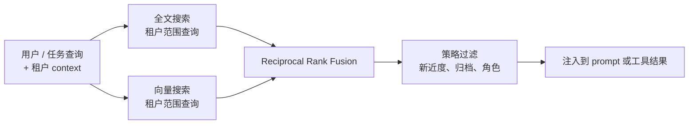

# 第 06 章 — 长期回忆

## TL;DR

短期记忆（第 05 章）是模型 *此刻* 看到的东西。长期回忆 (long-term recall) 是当前运行中任何有用的东西如何活到下一次运行——以及你之后如何找到它。有三种检索范式（语义向量搜索、全文搜索、人工策划的知识），三个检索可以挂入循环的位置（在前缀里当冻结快照、在易变尾部里当工具结果、在会话启动时预取），以及一条把它们都串起来的设计约束：任何放进前缀里的东西，每一轮都必须字节稳定，否则你就丢掉了第 04 章的 cache。本章讲怎么挑对组合——不是"加个向量库"，而是为这个决定选对 context、用对机制检索、注入对地方。

---

## 为什么这件事重要

一个没有长期记忆的 agent，每一轮会话都要重新学一遍相同的项目事实、用户偏好和之前的失败。一个长期记忆错配的 agent 会悄悄检索错误的内容——一次向量搜索在用户问的是某个具体错误码时，自信地返回一段意译；一次关键字搜索遗漏了所有在多次会话间被改写过的内容。两者都悄悄失败，都在教模型错误的东西，而且都容易被误诊为 *模型不行*。

可用的检索是失败模式可见的检索。本章讲三种主要机制、它们如何失败、以及如何组合它们让单个失败不会变成一个无声的错误答案。

---

## 概念

### 长期记忆到底是什么

跨生产系统看，"长期记忆"通常是堆叠在一起的四种东西：

- **纯 markdown 文件** —— `MEMORY.md`、`USER.md`、agent 笔记、技能文件。人类可读、人类可编辑，会话开始时被冻结进系统 prompt。Hermes Agent 和 OpenClaw 都以这种形态为核心。
- **结构化表** —— SQLite（`sessions`、`messages`，带 FTS5 索引）、更大的系统里是 Postgres。审计 transcript 是仅追加；用来回忆时是可查询的。
- **向量索引** —— 可选，通过 `sqlite-vec`、`pgvector` 或专用存储叠加。当关键字搜索不够用时用来做语义相似匹配。
- **外部提供方** —— Honcho、Mem0、自建检索服务，或者把上述任何一种包起来的 MCP 工具。

仅靠 markdown 文件可以支撑一个小型的单用户 agent——一个个人助理，单个用户、单台机器、少量笔记，用文件就行。结构化表在你需要跨会话搜索、审计历史、或者规模超出单个用户时就成为承重组件了——这是大多数生产路径。向量索引和外部提供方是叠加在上面的；不用它们也能构建出能干的 agent，大多数路径在第一天并不需要。

### 按访问模式选存储形态

| 形态 | 最适合 | 更新方式 | 检索方式 |
|---|---|---|---|
| Markdown 文件 | 身份、用户模型、项目规则、技能内容 | 人类或策展人 | 会话开始时读整文件 |
| 结构化表 (+ FTS) | 审计日志、会话搜索、按 ID 查找 | 仅追加 | SQL 查询、全文 |
| 向量索引 | 语义召回、意译查询 | 追加 + 嵌入 | k 近邻 |
| 外部提供方 | 跨产品记忆、大规模知识 | API 推送 | API 查询 |

第一列也是加层之前要问的一个问题：*我的 agent 需要记住什么，是上面那些层处理不了的？* 如果答案是没有，你就不需要那一层。大多数生产 agent 落在"markdown + SQLite+FTS"上，只有当意译查询变多时才会去拿向量。

### 三种检索范式

你从三种主要技术里挑选并组合：

- **向量搜索 (Vector search)** 把文本嵌入并检索附近的向量。在意译、相似的历史问题、概念性问题上获胜。在精确标识符上失败——工单号、错误码、commit 哈希、函数名。
- **全文搜索 (Full-text search)** (BM25 或 FTS5) 索引精确词项。在 ID、代码、文件名、精确短语上获胜。在意译和概念性查询上失败。
- **人工策划的知识 (Curated knowledge)** 是一小组维护中的 markdown 页。当知识集合有边界、值得手编时获胜。在规模上失败——处理不了上千条事实。

```ts
// 三种范式实现同一种形态——背后是不同的存储。
type Retriever = {
  search(query: string, opts: {
    tenantId: string;
    topK?: number;
    filters?: Record<string, unknown>;
  }): Promise<Array<{
    id: string;
    text: string;
    score: number;
    metadata: Record<string, unknown>;
  }>>;
};
```

单一的 `Retriever` 接口让你能替换实现或叠加它们。

`tenantId` 过滤不是可选的——检索是数据访问，一个把一个用户的记忆召回到另一个用户会话里的 agent，那是一次安全事件，不是 bug。在存储层强制它（拒绝不带租户的查询），不要在调用点（那只差一个简单的 bug 就被跳过了）。

### 混合检索，默认配置

对于大多数 agent，向量加全文一起的表现优于任何一个单独使用。标准的合并是 reciprocal rank fusion (RRF)：



租户限定是一个 *查询时* 的谓词，不是合并后的过滤——搜索本身拒绝返回跨租户的行。在合并之后过滤的东西（新近度加权、归档拒绝、基于角色的可见性）是策略，不是访问控制。把两者混在一起就是经典的 bug 模式：一个位于检索下游的租户过滤，已经把跨租户的行加载到了内存里，按大多数威胁模型来说，这等同于一次泄漏。

```ts
// RRF: 无需训练数据, 让在多个列表中都排名靠前的记录浮出来。
function rrf(rankedLists: Array<Array<{ id: string }>>, k = 60) {
  const scores = new Map<string, number>();
  for (const list of rankedLists) {
    list.forEach((r, idx) => {
      scores.set(r.id, (scores.get(r.id) ?? 0) + 1 / (k + idx + 1));
    });
  }
  return [...scores.entries()]
    .map(([id, score]) => ({ id, score }))
    .sort((a, b) => b.score - a.score);
}
```

RRF 奖励在多个列表里出现的记录，同时仍然允许某一个强信号把一个结果送上去。它不需要训练，只需要两个同样形态的排序列表。接线时，并行跑向量和 FTS，把两路输出喂给融合器——这是整个记忆栈里最便宜的质量提升之一。

### 排序不只是相似度

纯相似度分数往往会浮上来错误的条目。一条两年前的语义完美匹配通常没有上周一条略弱的匹配有用。生产系统在排序时会借助三个额外信号：

- **新近度 (Recency)。** 一个小的线性或指数衰减应用到基础分上。在相同余弦相似度下，昨天的条目击败去年的。Hermes Agent 的会话搜索结果在汇总时把新近度加进权重；OpenClaw 在向量和 FTS 命中之上叠加新近度加成。
- **置信度 (Confidence)。** 标为 `user-confirmed`（用户确认过）的条目在相同相似度下排在 `agent-inferred`（agent 推断）之上。这个标签来自第 07 章的写入路径，但在检索层赚到它的工资。
- **访问频率 (Access frequency)。** 这个月 agent 查阅过三十次的条目，可能比一条没人碰过的更有用。跟踪 `last_accessed_at` 并把它折进来既便宜又有效。

在 RRF 之后加一个小的重排器——新近度 + 置信度 + 访问频率——常常比换底层的向量模型更能提升观感质量。让你的 agent 接一个，并记录每次查询的排名变化；直方图会告诉你哪个信号在做事，哪个是死重。

同一个重排器也是你直接拒绝候选项的地方。一个访问频率为零、置信度是 `agent-inferred`、年龄超过 90 天的条目几乎一定是噪声。在它到达 prompt 之前丢掉，不要让模型去判断。

### 检索在循环中的位置

检索不是单一的挂钩点。三种放置选择，每种有不同的取舍：

- **在前缀里，会话开始时（冻结的）。** 读一次，烘进系统 prompt，会话期间冻结。cache 是温热的，后续每一轮都便宜。`MEMORY.md`、`USER.md`、技能索引、项目 context 用这种方式。约束：你注入这里的东西不能在会话中改变，否则会破坏第 04 章的 cache。
- **在易变尾部里，作为工具结果。** 模型在运行时决定调用一个 `search_memory` 或 `session_search` 工具。结果作为 tool message 返回。实时、查询时、没有 cache 代价（结果本来就在尾部）。最适合那些依赖于对话刚刚发现的内容的查询。
- **会话开始时预取，注入到第一个用户消息里。** 在循环开始前，harness 查询外部提供方（Honcho、自建服务）；结果作为一个围栏块进入 *尾部*。Hermes Agent 的 `MemoryManager.prefetch_all()` 就是这种形态。它是个折中——拿到新鲜数据但不用每轮额外的工具调用，但要在第一轮付出一次 cache miss。

大多数生产 agent 同时用这三种。每段记忆的决定：*这东西在会话内会变吗？不会就放前缀。会就放工具结果。如果它是外部的、慢、但前期需要，那就预取。*

### 技能索引模式 —— 渐进式披露

前缀里最常见的一类记忆是 *技能索引 (skill index)*：一份 `(skill_name, 一行描述)` 配对的列表，无论存在多少技能都只占几百 token。任何技能的完整内容通过一个 `skill_view(name)` 工具按需加载。

这就是渐进式披露 (progressive disclosure)。模型每一轮都看到索引（便宜，cache 温热）。它只在真的决定使用某个技能时才付出完整内容的代价。Hermes Agent 和 OpenClaw 都用 `~/.hermes/skills/` 或 `~/.openclaw/skills/` 里的 markdown 文件实现这个；YAML frontmatter (`name`、`description`、`version`、`platforms`) 就成了索引条目。

```ts
// 会话开始时 prompt 看到的东西。
function buildSkillIndex(skills: SkillFile[]): string {
  return skills
    .filter(s => !s.archived)
    .map(s => `- ${s.name}: ${s.description}`)
    .join("\n");
}

// 模型想要技能完整正文时调用的东西。
const skillViewTool = {
  name: "skill_view",
  description: "Load the full content of a skill by name.",
  input_schema: {
    type: "object",
    properties: { name: { type: "string" } },
    required: ["name"]
  }
};
```

这种模式可以泛化。任何条目有简短摘要的记忆存储都可以这样暴露——wiki、FAQ 数据库、运行手册、项目 README。第 14 章会更深入讲技能作为设计单元；本章讲的是它们所搭乘的 *检索模式*。

### 记忆命名空间

记忆是数据，数据需要范围 (scope)。真实系统沿四个轴划分：

- **每用户 / 每租户** —— 最重要的边界。跨过它就在客户之间泄漏数据。
- **每项目 / 每工作区** —— 编码 agent 通常按项目限定范围；调试项目 A 时写的记忆，不应该在项目 B 的工作中浮现。
- **每 agent 角色** —— 探索 agent 和构建 agent 可以共享记忆；审计 agent 和生产 agent 不应该共享。
- **每环境** —— staging 和 production 永远不应该共享记忆。staging 里写下一条误导性事实的测试场景，绝不能在真正的 production 会话里浮现。

机制各有不同。Hermes Agent 用工作区限定的 MEMORY.md 文件。OpenCode 通过 `InstanceState` 解析每个项目的状态。Paperclip 通过 `companies` 表加上其他所有表的行级范围实现了显式的多租户。能扩展的形态是：每一次记忆查询都接受一个 *租户 context* 参数，存储层拒绝返回不带它的条目。"默认"命名空间是一个等着被利用的安全漏洞；不要把它发出去，开发环境里也不行。

除了范围，记忆有 *生命周期*：条目按用户请求被删除、按 TTL 过期、被策展人软删除等待审查。检索层必须在查询边界尊重这些状态——一个从向量索引里返回的软删除条目，和租户泄漏是同一类正确性 bug。第 07 章讲写入侧的机制（策展人生命周期、删除标记、归档）；第 18 章讲同意、被遗忘权、保留策略、以及审计义务。第 06 章的工作是拒绝返回那些层标记为禁区的东西。

### 记忆在 prompt 中的格式与预算

记忆怎么进入前缀比人们预期的更重要。常见形态：

- **带分隔符的 markdown 段。** Hermes Agent 和 OpenClaw 用 `§`（章节符）来分隔 MEMORY.md 条目，让模型不依赖于版式就能识别条目边界。
- **YAML frontmatter。** 技能文件用 `name`、`description`、`version` 块，prompt builder 可以机械地读取。
- **围栏块。** 外部记忆查询结果常常作为 `<memory-context>...</memory-context>` 围栏注入；agent UI 可以从用户可见的显示里把它们剥掉，但保留在模型的视图里。

大小预算是真实存在的。一份 50 KB 的 `MEMORY.md` 每个会话都塞进前缀，那就是 50 KB 的 cache 温热载荷——如果它确实承重就没问题，如果大部分是噪声就贵了。挑一个软上限（前缀里总记忆 10–20 KB 是一个合理的起点），让第 07 章的策展人来强制执行。agent 在"10 KB 集中笔记"和"50 KB 累积杂物"之间唯一能感受到的差别是延迟和成本——以及可能是推理质量，因为前缀里的噪声越多，模型每一轮要扫读的噪声就越多。

### 外部记忆提供方

任何超出本地文件和 SQLite 的，都是外部记忆提供方——Honcho、Mem0、云厂商的向量服务，或者你自己的检索 API。跨系统的模式是：提供方注册成插件，从上面三个放置挂钩之一被调用，它们的结果遵循同样的 `Retriever` 形态。

Hermes Agent 显式强制执行的一条有用纪律：*每个回忆目的一个提供方*。把两个提供方混用于同一个目的，往往会产生不一致、冲突的回忆，模型没法裁决。如果你需要在单个目的上做冗余，让一个跑主路、另一个作为影子在日志里做比较，而不是并行注入。两个提供方服务于真正 *不同* 的目的——一个用于用户偏好、一个用于组织知识库——是可以的；纪律是按目的算，不是按会话整体算。

延迟也重要。一个给会话启动加 800 ms 的外部提供方没问题；一个给 *每一轮* 都加 800 ms 的就有问题了。本章前面的放置规则直接给出了答案：慢的提供方属于预取路径或工具调用路径，永远不能作为模型在等的每轮同步查找。

### 嵌入模型迁移

向量回忆绑定到一个特定的嵌入模型，而那个模型会被替换——厂商新版本、切到更便宜或自托管的嵌入器、端点弃用。当嵌入变化时，你索引里的每个向量都在错误的空间里，召回质量会悄悄下降。

可行的迁移形态：

- **在每条记录上打上嵌入模型印** (`model: "text-embedding-3-small@2024-01"`)。否则你不会记得哪个模型写了哪些向量，一个混着两个模型的半迁移索引会给出无意义的分数。
- **在后台重新嵌入；双写新索引。** 在新索引完全填好之前，让旧索引继续服务查询。漫长的迁移可以；服务实时查询的半填索引不行。
- **原子地切换查询路径。** 一旦新索引在一组已知良好查询的保留集上验证通过，翻转读路径。把旧索引保留一个恢复窗口，以防新模型在保留集没覆盖到的地方退步。

第一天就要为这事做计划——至少把模型版本和每个嵌入一起持久化——这样在某个弃用端点熄灯那天，你不会才发现问题。外部提供方（Honcho、Mem0、托管向量存储）在内部处理这事，这也是使用它们的更好理由之一；如果你自己跑索引，迁移就归你管。

### 检索作为可观测性

一个不去测量的回忆层，是一个你只能在用户抱怨时才发现其静默失败的层。从第一天就值得接上的三个测量，与前几章的 cache 命中和压缩信号并行：

- **空手率 (Empty-hand rate)。** 多少比例的检索返回了零结果？高，说明你的存储稀疏或查询写错了。零，可能说明你在过度注入噪声。
- **触达率 (Reach rate)。** 你 *注入* 的记忆条目中，多少比例被模型在下一轮真的引用了？如果模型从不去取你注入的东西，那你的检索送的是错的 context。Hermes Agent 和领先的编码 agent 都记录 `last_accessed_at`，正是因为这个原因。
- **租户完整性 (Tenant integrity)。** 一个在租户 A 里的合成查询，按理应该匹配上一条只在租户 B 里写的条目——这种情况下应该 *绝不* 返回。在生产中把这当作持续测试跑，不只是在部署时。

这些指标和前几章的 cache 命中率以及压缩方法直方图一起，归入第 16 章的追踪流水线。它们合在一起告诉你：你精心设计的前缀和尾部到底有没有在服务模型——还是只在花 token。

### Subagent 的回忆边界

当父级委托给 subagent（第 10 章）时，回忆是一个边界决定。三种常见策略：

- **subagent 继承父级的命名空间。** 子级看到同样的记忆和技能索引。便宜且一致；如果 subagent 是短命的实验，它的"经验教训"不该变成永久回忆，这就有污染风险。
- **subagent 拿到限定的切片。** 子级只看到为它角色（`explore`、`build`、某个特定技能家族）标记的记忆。OpenCode 的每 agent 工具集自然地泛化到每 agent 的记忆集。
- **subagent 什么都拿不到。** 子级只收到父级递给它的 prompt；其它一切都不可见。对一次性计算有用；风险是子级重做父级记忆本可以跳过的工作。

按 agent 配置来选，不要按全局选。检索层应该在租户之外再接受一个 *agent 身份*——同一个 `Retriever` 接口，多一个过滤维度。

### 索引陈旧与会话连续性

会话开始时正确的记忆索引，到第十五轮可能已经陈旧了。几种值得留意的情况：

- **策展人在会话中段归档的技能。** 运行中的 prompt 索引里仍然提到它们；文件没了。agent 调用 `skill_view(name)` 拿到"未找到"。在工具里优雅地处理，而不是重建前缀。
- **本会话写入的记忆。** 它在磁盘上但在运行中的 prompt 里不可见（会话开始时冻结）。下个会话开始时就可见了。不要让 agent 以为不是这样。
- **会话之间外部提供方的更新。** 新条目落地。下次会话开始时会取到；当前这次不会。

这是 cache 约束的反面：稳定性买给你便宜的回合，代价是温和的陈旧。大多数团队接受这个权衡，并在工具层优雅恢复，而不是和它对抗。

### 重申 cache 约束

本章的一切都被第 04 章的一条规则塑造：任何你注入到系统 prompt 的东西都成为被缓存前缀的一部分，而 cache 想要字节稳定的字节。对记忆的实际含义：

- **前缀里的文件在会话开始时冻结。** 会话中段的写入下个会话可见，不是这个。第 07 章覆盖写入路径；冻结规则放在这里，因为它约束你能把什么放在哪。
- **前缀里的外部提供方结果如果在会话之间变化就破坏 cache**。要么接受会话启动的 cache miss（Hermes Agent 这样做），要么把那些结果作为工具结果推到尾部。
- **技能索引在文件列表变化之前是稳定的。** 如果第 07 章的策展人在会话中段归档了一个技能，这个变化要到下次会话开始才可见。这是有意为之。

回忆层和 prompt builder 层不是分离的关切——它们是同一个关切从两个角度看。如果你从这两章里只内化一条规则，让它就是这条。

---

## 真实系统参考

- **Hermes Agent** 是分层记忆的最强参考：基于文件的 `MEMORY.md` 和 `USER.md`、SQLite+FTS5 会话存储、通过 `sqlite-vec` 的可选向量索引、通过 Honcho 的可选外部提供方，所有这些都统一在一个 `MemoryManager` 之下，它在循环之前预取，并暴露 `session_search` 工具供实时查询。
- **OpenClaw** 出货同样的形态：每个工作区一份 `MEMORY.md`、JSONL 会话 transcript、可选的 `active-memory` 插件做语义搜索，文件顺序是确定性的，让缓存的前缀在多个会话之间保持字节稳定。
- **OpenCode** 以会话存储和项目范围状态 (`InstanceState`) 为核心，有一个隐藏的 git 快照仓库每一步跟踪文件变化，给一个 revert UI 提供动力。教训：长期回忆可以是代码状态，不只是文本——磁盘上的文件和它们的 commit 历史也是记忆。
- **Paperclip** 是工作流控制平面版本的长期记忆：`issues`、`agents`、`runs`、`approvals`、`cost_events`——都持久、都可查、都按公司限定范围。那是在组织流程级别上的回忆，同样的形态应用到不同的领域。

---

## 和你的 agent 一起练习

几条在本章上效果不错的 prompt：

- *"给我搭一个 `Retriever` 接口和三个实现：通过 sqlite-vec 的向量、通过 FTS5 的全文，以及一个 markdown wiki。把它们接到同一个 RRF 融合器里。让我看到一个查询返回三个排序列表和融合后的输出。"*
- *"挑出我 agent 需要的三段具体记忆（一个用户偏好、一个上周的错误码、一条项目规则）。告诉我哪个检索方法处理哪一个，应该注入到循环的哪个位置——前缀、工具结果，还是预取。"*
- *"实现技能索引模式：prompt builder 从每个技能文件读 YAML frontmatter，产出每个技能一行的索引。模型调用 `skill_view(name)` 加载完整内容。两个都给我看，然后加上会话中段文件被归档的情况。"*
- *"给我的检索层加上租户限定。写一个测试证明租户 A 的查询在任何情况下——包括故意构造的恶意输入——都不能返回任何由租户 B 写入的条目。"*
- *"剖析我系统 prompt 的记忆段在十个会话上的体积。如果平均超过 15 KB，建议把哪些从前缀挪到按需工具结果模式里，并估算成本差异。"*
- *"带我过一下 Hermes Agent 的 `MemoryManager.prefetch_all()`。然后在我的栈里实现等价物：会话开始时一次外部提供方查询，结果作为一个围栏块注入到第一条用户消息里。"*
- *"做 A/B 日志：仅向量 vs 仅 FTS vs 混合 (RRF)，用同一组查询。把我上周的会话跑三遍，按查询类型报告哪种策略检索到正确东西的次数最多。"*
- *"加上检索可观测性：空手率、触达率（模型是否真的用了我注入的东西？）、租户完整性测试。把三项按天画出来，告诉我哪一项在退步。"*
- *"在我的混合流水线上加一个重排器，在 RRF 分数之上提升新近度和用户确认的条目。记录排名位移，告诉我重排器是在做真活，还是只是在洗一下并列分。"*

---

## 下一章

你现在知道记忆住在哪里、怎么检索、怎么排序检索回来的东西，以及它如何契合第 04 章的 cache 纪律。

更难的问题是首先该往记忆里写什么——以及怎么不让它腐烂。第 07 章讲写入模式、记忆边界处的安全过滤器、原子写和并发写者争用、冲突解决、保持记忆精简的策展人生命周期，以及 subagent 在什么情况下可以、什么情况下不可以写回。
