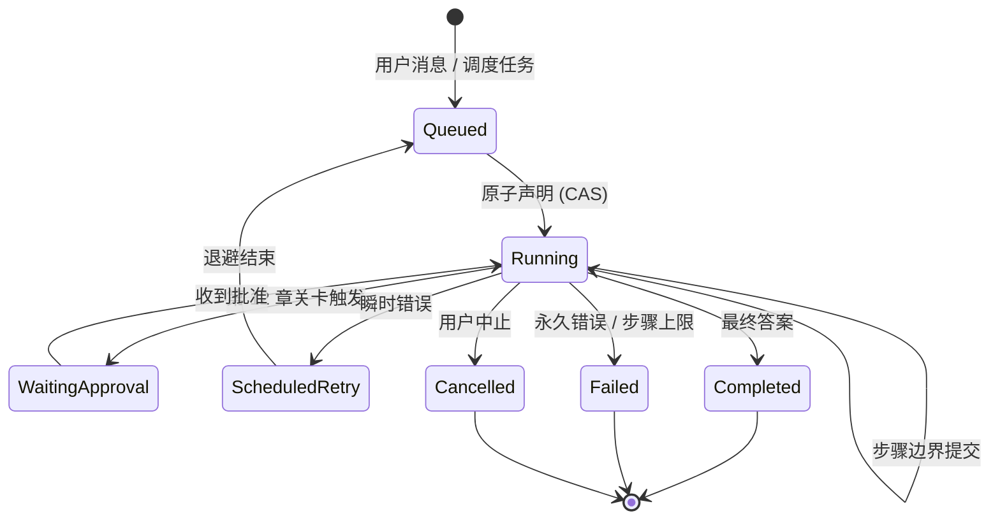
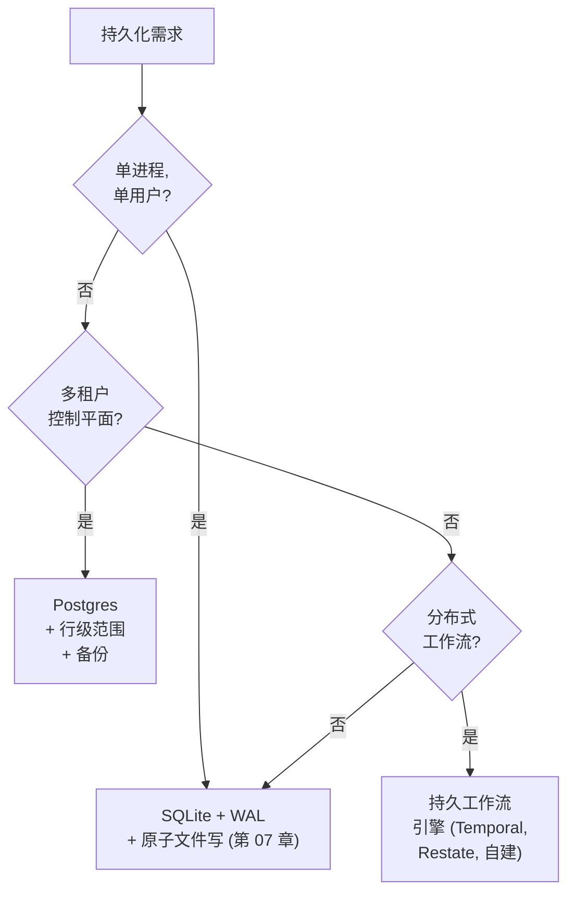

# 第 08 章 — 状态与持久化

## TL;DR

一个长时间运行的 agent 应该能在进程重启、节点故障，或者循环跑到一半时部署的情况下幸存下来——既不重做已经做完的昂贵工作，也不把破坏性操作做两次。本章讲的是持久执行 (durable execution)：运行时哪些东西算作状态（消息数组、进行中的工具调用、abort token、凭据、prompt 指纹），步骤边界的提交点落在哪里，run 状态机和 compare-and-swap 声明如何协调多个进程，心跳与孤儿回收器为挂起的工作做了什么，如何在 SQLite、Postgres 和持久工作流引擎之间做选择，以及崩溃恢复、resume 与用户点击一个写着 "Resume" 的按钮这三者之间的区别。

---

## 为什么这件事重要

一个编码 agent 已经跑了四十分钟。它读了五十个文件，做了十二次编辑，生成了三份 pull request 描述。一次部署上线，进程重启。agent 丢掉了内存里的 abort token，但 checkpoint 记录它正处在第 23 步。重放时你发现 agent 把其中一份 pull request 描述又发了一遍——因为发布描述的那个工具不是幂等的，而 harness 重试了它。你团队的 GitHub 上现在多了一个重复的 PR。模型没问题，agent 的代码也没问题，是持久化层出了漏子。

这一类失败在开发阶段是不会暴露的——它只会在你第一次带负载做真实部署时冒出来。代价要么用可靠性偿还，要么用本章讲的这些细致功夫提前付清。

---

## 概念

### 对 agent 而言 "持久" 到底意味着什么

运行时状态并非铁板一块。动手写代码之前，先做一份清点很有用：

- **消息数组** —— 每个模型回合、每次工具调用、每个工具结果。仅追加、持久，是重放的事实来源。（这就是第 05 章的审计日志，只是换到运行时的视角来看。）
- **工具执行状态** —— 对每次工具调用而言：pending、running、completed、failed。它紧挨着消息存放——在 OpenCode 里是 `ToolPart.status`，Paperclip 里是 `heartbeat_runs.status`，Hermes Agent 里则是就地嵌在结果中。
- **进行中的副作用** —— 那些 *已经发起* 但还没返回的写入、发送、支付。这是最难恢复的一类状态，也最容易判断失误。
- **工作记忆** —— 第 05 章那块小而可变的草稿区。它必须能跨崩溃持久，因为从 transcript 重建未必能精确还原它。
- **abort token** —— 一个进程本地的信号。*重启后不会存活。* 如果失控的运行只能靠 abort token 来叫停，那么一旦崩溃，它们就会继续跑下去。
- **认证 profile 与凭据** —— 必须在启动时重新加载，或者能从凭据池里重建。Hermes Agent 把它们存在 `~/.hermes/agents/<id>/auth-profiles.json`；Paperclip 把加密后的行存在 Postgres 里，再用一个主密钥文件加以保护。
- **prompt 指纹** —— 第 04 章讲的那个 SHA。它必须能在存储里完整往返，好让重建出的 system prompt 与原来字节一致、缓存在重启后还能存活。
- **成本与 token 账本** —— 用于预算上限的累计总额（第 17 章）。Hermes Agent 在 resume 时从消息日志重新计算；Paperclip 出于可审计性，单独持久化在 `cost_events` 表里。如果预算必须 *跨* 重启强制执行，账本就需要自己的持久性——从日志重新计算本来没问题，可一旦日志被部分压缩，就不行了。

所谓持久的运行时，就是上述每一项都有明确策略的运行时：提交前持久、提交后持久、resume 时重建，或是干脆接受丢失。这里没有"默认"答案；逐项做选择、写下来，再让你的 agent 照着这份清单生成持久化代码。

### 步骤边界作为提交点

一步就是循环的一次完整迭代：模型调用 → 分发各项工具 → 反思。提交点落在 Reflect 与 Stop 之间——正是第 02 章指出的"一切都附着于此"的那个边界。一步完成之后、循环让出之前，有三件事应该已经落盘：

- 新消息已追加到审计日志。
- 工具执行状态已转换到它的终态值。
- 工作记忆和各项成本/用量计数器已更新。

OpenCode 在每次 `LLM.stream()` 循环之后 flush；Hermes Agent 用形如 `_flush_messages_to_session_db` 的写入做同样的事；Paperclip 则每写一行 `heartbeat_run_events` 就 commit。这个模式是普适的：让出控制权之前先写盘。一个在写入持久化之前就返回给调用方的步骤，就是一个随时可能丢失的步骤。

```ts
// 步骤边界提交持有什么。
type Checkpoint = {
  sessionId:           string;
  stepIndex:           number;
  status:              "running" | "waiting_for_approval"
                     | "completed" | "failed";
  messageRange:        [number, number];   // 本步骤追加的范围
  workingMemory:       WorkingMemory;
  tokensSpent:         number;
  costSpent:           number;
  promptFingerprint:   string;             // 第 04 章
  lastError?:          string;
  committedAt:         string;
};
```

不要把密钥写进 checkpoint——只存密钥的 *引用*，在运行时再去解析。也不要把重试计数器写进消息日志——它们的归属是 checkpoint，更新也在那里发生。

### Run 状态机

一个 run 就是从一条用户消息（或调度触发器）到它最终答案之间的那个工作单元。每个生产系统都会用一个显式状态机来给它建模。agent 系统里有一半的重复副作用 bug，根源都在隐式转换。



Paperclip 几乎原样实现了这套——`heartbeat_runs.status IN (queued, running, completed, failed, cancelled, scheduled_retry)`。规则如下：

- 每一次依赖当前状态的转换都需要做条件更新——`UPDATE ... WHERE status = <expected>` 是最低要求。最典型的竞态是 `queued → running`（两个 worker 抢同一行），下一小节会详细走一遍这个模式；但同一个 `WHERE` 子句也同样守护着批准 (`running → waiting_approval`)、中止 (`running → cancelled`)、重试转换以及终态写入，防止它们被并发覆盖。如果一次转换所基于的状态在你不知情时已经被改掉了，那就是一次丢失更新——同样的 bug，只是换了个名头。
- `running → terminal` 一旦赢下就 *是幂等的*：在一个已经是终态的行上，再提交一次相同的终态状态，等于一次空操作——这正是 replay 或重试时所期望的行为。
- 终态绝不回退。一个需要重试的 `failed` run，会生出一个 *新* run，用 `parent_run_id` 链回去——绝不是就地复活。

这一层的大多数 agent bug 都是状态机 bug：要么是某个隐式转换让同一份工作发生了两次，要么是缺了某个转换，把 run 卡死在那里。

### 崩溃恢复 vs resume vs "Resume 按钮"

这三个词听起来很像，行为却大相径庭。

- **崩溃恢复 (Crash recovery)** 是 *同一意图、换了个新进程躯壳*。部署导致重启，而用户期待工作继续往下走。system prompt 没变；缓存 *可能* 还是热的——前提是前缀通过磁盘字节一致地往返了，*并且* 提供方的 TTL 还没过期，*并且* 你路由到的是同一个模型和同一个地区（缓存是按提供方、按模型、且往往按地区来算的——细节见第 04 章）。进行中的工具调用则需要仔细甄别。
- **Resume** 是 *同一会话、时间往后挪了一段*。用户关掉标签页，几小时后才回来。缓存可能已经过期（第 04 章讲的 TTL）。system prompt 可能在两次访问之间被改过。审计日志可以干净地 replay，但外部世界可能已经变了样。
- **"Resume 按钮"** 是用户 *主动* 去继续一个已暂停会话的显式动作。用户清楚中间隔了一段；系统因此有更大的余地去请求确认、交代发生了什么，并在合适时重置工作记忆。

把这三者混为一谈，会生出一些隐晦的 bug。对于 *可以安全 replay 的工作*，崩溃恢复应当无声而果断——只读操作、标了 `idempotent: true` 的工具（第 03 章），以及由 outbox 兜底的副作用。除此之外的一切，都走下一小节的进行中甄别流程：把不可 replay 的工具调用摆到用户面前，而不是静默重试。Resume 应当尽量保住缓存，保不住时就认了那份成本。Resume 按钮则应当向用户 *明示* 他们现在在哪儿、即将重跑哪些东西。

### 崩溃中的进行中工具调用

这是整章里最难的一种情况。工具调用发起了，结果却始终没回来，进程就死了。重启时有四个选项，按优先程度排序：

1. **工具被元数据标记为 `idempotent: true`（第 03 章）。** 直接 replay。第二次调用会返回同样的结果。
2. **工具带一个外部 idempotency key。** 用同一个 key replay，下游系统会去重。
3. **工具在执行前已写入一个持久的 outbox。** replay 时先读 outbox：若意图已标为完成，则跳过；否则用同一个 key 重试。
4. **工具不能安全 replay。** 把 run 标为失败，摆到用户面前。一句尴尬的 *"这事儿到底发生了没？"* 也好过一封重复的邮件。

正是第 03 章的那些元数据标志，让 harness 不用费心思就能选中正确的选项。没有这些标志的工具一律默认走 (4)：大声报错、问用户、绝不静默重试。反过来——默认重试——重复 PR 就是这么来的。

### 用 compare-and-swap 做原子声明

任何跨多个进程运行的东西——心跳调度器领取排队中的工作、两个 API 服务器争抢同一个会话——都需要一次原子声明。在各种数据库里，这个模式都一样：在某个状态列上做 compare-and-swap。

```sql
-- 原子地声明一个排队的 run。只有你赢下竞争时才返回这一行。
UPDATE runs
   SET status      = 'running',
       claimed_by  = :worker_id,
       claimed_at  = now()
 WHERE id     = :run_id
   AND status = 'queued'
RETURNING *;
```

如果这条 `UPDATE` 影响了零行，说明另一个 worker 抢先声明了它，那就跳过去做别的。如果影响了一行，那这份工作就归你了，直到你把它转入终态、或你的租约超时为止。Paperclip 在 `heartbeat_runs` 上用的就是这个形态；在 Postgres 风格的技术栈里，事务内的 `SELECT ... FOR UPDATE` 与之等价；在开了 WAL 的 SQLite 里，同样的 `UPDATE ... WHERE status=...` 也照样管用，因为写者本来就是串行化的。

对单进程系统来说（单用户模式下的 Hermes Agent、OpenCode 开发服务器），CAS 是杀鸡用牛刀。但对任何 *可能* 在日后横向扩展的系统，第一天就把它接上——代价不过是一个列加一句 `WHERE`；事后补做的代价要高得多。

### 心跳与孤儿恢复

只声明、不带心跳，就是一处缓慢的泄漏——worker 死了，run 却仍停在 "running" 上，再没有别人会去接手它。生产系统会在声明之外再配两个列：

- **`last_heartbeat_at`** —— 只要 run 还活着，worker 就每隔几秒更新它一次。
- **`lease_expires_at`** —— 超过这个时刻还没见到心跳，这个 run 就被认定为孤儿。

一个回收器（reaper）服务会定期扫描那些 `lease_expires_at < now()` 的 run，要么把它们重新排队（`status → queued`，重新尝试一次），要么在重试次数耗尽后把它们标为失败。Paperclip 的 `reapOrphanedRuns()` 干的就是这件事；它还会在清除租约之前确认操作系统层面的那个 PID 确实已经死了，以应对心跳只是变慢、而非真的没了的情况。

有两个调优常数，背后是实打实的取舍：

- **心跳间隔。** 越短，孤儿检测越快，但写入流量也越大。Paperclip 每隔几秒写一次。
- **租约超时。** 越长，越能容忍慢工具（比如一次 30 分钟的编译）；越短，恢复得越快。Paperclip 默认 6 小时，并允许适配器按各自的工作负载来调。

对分布式 agent 而言，回收器不是锦上添花的东西。它是唯一能阻止单个崩溃的 worker 把工作永久卡死的机制。

回收器自身也需要存活检测。要么把它当作一个独立任务来跑、带上它自己的心跳，否则每个 worker 都会在启动时抢着去当回收器。Paperclip 用与 run 相同的那套 CAS 模式选出唯一的回收器——在一个小小的 `service_locks` 表里占一行，反复声明并刷新它。

### 仅追加事件日志 vs 每步快照

有两种持久化形态在各系统里反复出现，而且常常被组合使用：

- **仅追加事件日志。** 每一步都写入新行；当前状态由按顺序读完全部行来推算。Hermes Agent 的 `messages` 表是这样，Paperclip 的 `heartbeat_run_events` 是这样，OpenCode 的 `PartTable` 大体上也是这样。
- **每步快照。** 每一步都写下 *整个* 状态对象，覆盖前一个。resume 更快（无需 replay），但占盘更大，也更难审计——因为中间值都丢了。

大多数生产级 agent 在审计日志上用仅追加（反正第 05 章本来就需要完整的 transcript），在工作记忆和 checkpoint 元数据上用每步快照（因为它们需要快速随机访问、占用又小）。两者搭配起来运维成本低，既能讲清审计这条线，又能讲清 resume 这条线，而不必把任何一边重复两遍。

### 选择存储



SQLite 扛起的生产负载多得惊人。Hermes Agent 和 OpenCode 都以 SQLite 为底，跑的都是真实负载。原因在于：WAL 模式不用任何配置就给你并发读 + 单写者，`fsync` 保证持久，而那个文件说到底就是一个文件——好复制、好备份、用 CLI 也好查看。

什么时候该越过 SQLite？当 *多个进程* 必须协调写入时、当你需要由数据库来强制实施 *多租户* 的行级隔离时、或者当你需要一个 *调度器* 跨节点唤醒延迟作业时。Paperclip 选 Postgres 正是出于此：它是一个控制平面，这三样都要。再往上一层是持久工作流引擎（Temporal、Restate，或自建的等价物）——当 agent 自身的逻辑最适合表达成一个工作流、其中夹着任意带副作用且必须可 replay 的步骤时，它就派上用场。

WAL 模式并非没有代价。它会在 `.db` 旁边多出一个 `-wal` 和一个 `-shm` 文件，在重度写入阶段磁盘占用大致翻倍。对移动端或边缘 agent，普通的 journal 模式可能才是对的选择。Hermes Agent 的 `apply_wal_with_fallback` 专门处理 WAL 不可用的情形（NFS、SMB），并优雅地回退到 `journal_mode=DELETE`。

### 步骤边界的幂等性，不只是工具的

第 03 章讲过工具级的 idempotency key。步骤级幂等性则是另一种保证：*同一步骤被 replay 之后，必须产生同样的可观察效果。*

```ts
function stepIdempotencyKey(c: {
  sessionId: string; stepIndex: number; action: string;
}) {
  return sha256(`${c.sessionId}:${c.stepIndex}:${c.action}`).slice(0, 32);
}
```

在它之上还架着两种模式：

- **outbox 模式。** 在发出副作用之前，先把 *意图*（连同它的 idempotency key）写进一张持久表。副作用成功之后，再把这个意图标为已完成。replay 时，harness 会先读这张表：已完成的意图直接跳过，未完成的则用同一个 key 重试。这样就把 *决定* 的持久性与 *投递* 的持久性解耦开了。
- **完成标记。** 这是给非分布式系统用的简化版：在 checkpoint 上放一个 `step_complete` 布尔值。一旦置位，这一步就再也不会重跑，哪怕它内部某个子动作根本没返回过值。它有一个不容回避的局限：这个标记只能告诉你 *你自己* 提交了没有，告诉不了你外部世界的情况。假如一个副作用跨过了网络，而进程恰好在"调用落地"和"标记持久化"这两件事之间死掉，那么恢复时根本无从得知这两者哪个先发生了。盲目跳过，可能丢工作；盲目重试，可能重复做。正确的做法是 *对账*——去问下游系统那次调用到底落地没有——而这恰恰就是 outbox 模式存在的意义；也正因如此，副作用一旦离开你的进程，完成标记就不够用了。

大多数生产级 agent 用的是第二种；outbox 模式则出现在副作用要跨越某个你无法完全信任的网络边界时（第三方 API、消息队列，以及那些自己也会崩溃的下游服务）。

### 压缩链遇到 resume

第 05 章介绍过会话轮转：当压缩 (compaction) 也兜不住时，就创建一个新会话，用 `parent_session_id` 链回旧会话。从持久化的角度看，这同时也是一种 *resume 原语*。一个失败的长跑会话，可以被一个全新会话取而代之——新会话以一段移交块开头，把父会话的状态做个总结；审计日志依旧能一路回溯到底，而新会话的缓存是全新预热的，不会被旧会话的臃肿拖累。

由此得出一条推论：绝不要因为子会话 resume 了父会话，就把父会话删掉。可以归档它、把它标记为已被取代，但这条链必须保持完整。Resume、审计、回滚全都依赖它。第 07 章那条"永不修剪审计日志"的规矩在这里同样成立——角度不同，纪律一致。

### 操作存储：备份、恢复、迁移

没有备份的状态，就是迟早会丢的状态。常见做法如下：

- **备份。** Paperclip 自带周期性的 `pg_dump`，保留窗口可配置。基于 SQLite 的系统应当按计划跑一次 `VACUUM INTO` 快照，再把文件复制出来。最低标准是每日一次完整快照；更好的做法是增量 WAL 备份。任何低于"每日"的方案，都只是事故之后才拿出来讲的故事。
- **恢复。** 永远只恢复一个 *一致* 的快照——绝不要把备份里的某些行单独捡出来塞进活跃存储，除非你能证明它们不会破坏状态机。恢复还必须尊重第 07 章的删除标记——凡是按用户请求或保留策略删掉的内容，在旧快照被恢复回来时也要继续保持删除状态，否则你刚刚就把承诺过要删的数据又复活了。恢复这事很少做，所以要在真正需要它之前先演练，最好把它列进部署清单。
- **schema 迁移。** schema 会在一次次部署之间发生变化。OpenCode 和 Paperclip 用 Drizzle migrations；Hermes Agent 则用一行 `schema_version` 来显式给 schema 打版本。前向迁移这条路大家走得很熟，*回退* 那条路几乎没人走过。默认采用加法式迁移（新增带默认值的列），把破坏性迁移留给那些专门做数据清理的部署。
- **跨迁移的进行中 run。** 一个在 schema v3 下写入的 checkpoint，到了 v4 下可能就无法干净地反序列化了——只要 v4 删掉或重命名了某个列就会这样。给每个 checkpoint 都打上写入它时的 schema 版本（`checkpointSchemaVersion: 3`）。让 resume 路径能感知版本——逐版本地施加强制转换，把 checkpoint 往前迁移；一旦转换无法完成，就大声报错，而不是闷声产出一个损坏的 run。对破坏性迁移，要先 *排空* 进行中的 run：停掉队列，等活动中的 run 全部终止或被取消，然后再迁移。停掉五分钟吞吐量，远比花三天去调试一个迁移到一半的 checkpoint 划算。

### "Resume 按钮"实际需要什么

一旦你上线一个写着 *"Resume"* 的按钮，用户期待的就不只是崩溃恢复那么简单了。他们期待一个诚实的回答：*我现在在哪儿，接下来要发生什么？* 具体而言：

- 会话必须能从磁盘完整加载出来——审计日志、checkpoint、工作记忆、成本账本，一路贯通。
- system prompt 必须能字节一致地重建出来，否则就得告知用户：缓存将要承担这次重建的成本（第 04 章）。
- 上次尝试中任何进行中的工具调用都必须先被分类（idempotent / outbox / unsafe），并在循环继续之前摆到台面上。
- 用户应当能看到 *agent 上一步做了什么*、以及 *它接下来打算做什么*——也就是最后完成的那一步和下一个计划中的动作。

这套系统，正是第 05、06、07、08 章 *合在一起* 才成为可能的。记忆在该存的地方存住了，审计日志按正确的顺序 replay，缓存在能保温的地方保了温，于是用户看到的是一幅连贯完整的画面，而不是一句 *"你的 agent 崩了；点这里"*。Resume 按钮只是露在外面的那层皮，底下撑着它的全部内容，正是本章讲的东西。

---

## 真实系统笔记

- **OpenCode** 是编码 agent 场景下嵌入式持久性的最佳参考：SQLite + WAL 搭配 Drizzle migrations、仅追加的 `SessionTable` / `PartTable` / `SyncEvent`、一个为 revert 撑腰的隐藏 git 快照仓库，以及一个每会话的 abort 控制器——它 *不会* 在重启后存活（这是有意为之——中断只属于运行时）。
- **Paperclip** 是控制平面级分布式持久性的参考：Postgres 配 `SELECT ... FOR UPDATE` 做原子声明、一个带显式转换的 `heartbeat_runs` 状态机、会在清除租约前确认 OS PID 是否还活着的 `reapOrphanedRuns` 回收器、每张表上的多租户隔离、带保留策略的定时 `pg_dump` 备份，以及让父进程崩溃时子进程仍能继续运行的适配器进程隔离。
- **Hermes Agent** 是把第 04 章的 cache–resume 对偶应用到本章场景的参考：`SessionDB.sessions.system_prompt` 持久化了字节一致的 prompt，因此一个被驱逐后又恢复的 agent 在 replay 时缓存仍是热的；`apply_wal_with_fallback` 应对 WAL 不友好的文件系统；而 cron 调度器那把基于文件的锁，展示了最简单不过的咨询锁（advisory lock）模式。
- **OpenClaw** 给每个会话存一份 JSONL transcript，外加凭据和记忆状态，演示了一种基于文件的持久化模型——它在单用户、多通道的场景下也撑得住，且无需数据库。这是个很好的提醒：只要工作负载合适，"持久"并不一定要靠 DB。

---

## 与你的 agent 结对

几条在本章上效果不错的 prompt：

- *"逐项清点我的运行时状态——消息数组、工具状态、进行中的副作用、工作记忆、abort token、凭据、prompt 指纹。对每一项，告诉我当前的存储有没有把它持久化，没有的话给出修复方案。"*
- *"实现本章这套 run 状态机，带一个显式的 `status` 列和 CAS 声明。再写一个压力测试，让两个 worker 去抢同一个排队中的 run，验证最终恰好只有一个抢到。"*
- *"给我的 run 加上心跳和孤儿回收器。回收器要在清除卡住的租约之前先确认 OS PID 是否还活着。针对我的工作负载调好心跳间隔和租约超时，并用三个要点说清其中的取舍。"*
- *"按第 03 章的 `idempotent` 标志把我所有的工具分类。然后写出崩溃后 resume 的逻辑，用这个标志来决定是 replay 还是 skip-and-ask。再用一次故意注入的、工具跑到一半时的崩溃来测试它。"*
- *"为一个具体的外部副作用（发送一条 Slack 消息）接上 outbox 模式：写意图、发送、标为已完成。在每两步之间各注入一次崩溃，并验证 resume 后的结果。"*
- *"剖析我十个真实会话的 checkpoint 载荷。如果平均超过 50 KB，建议把哪些内容从每步快照挪到仅追加日志里去。"*
- *"把崩溃恢复、resume、Resume 按钮实现为三条彼此独立的代码路径。让我看清在以下每种情况下分别触发哪一条：部署后进程重启、用户 24 小时后回来、用户在一个失败的 run 上点击 Resume。"*
- *"写一份恢复演练：停掉我的服务、恢复昨天的快照、重新启动、证明状态机仍然一致。端到端计时，好让我知道一次真实事故实际上要耗多久。"*

---

## 接下来

现在你有了一个这样的运行时：它能在重启中存活、能跨进程协调工作、能干净地 resume 而不会把破坏性操作重做一遍。

再往上一层是 *规划*——一个 agent 如何在真正 *执行之前* 就跨多个步骤想好要做什么。第 09 章讲四种规划形态（无计划、checklist、plan-execute-replan、依赖图），每一种在什么时候有帮助、什么时候反而添乱，以及那些看似最省事的选择里藏着的失败模式。
