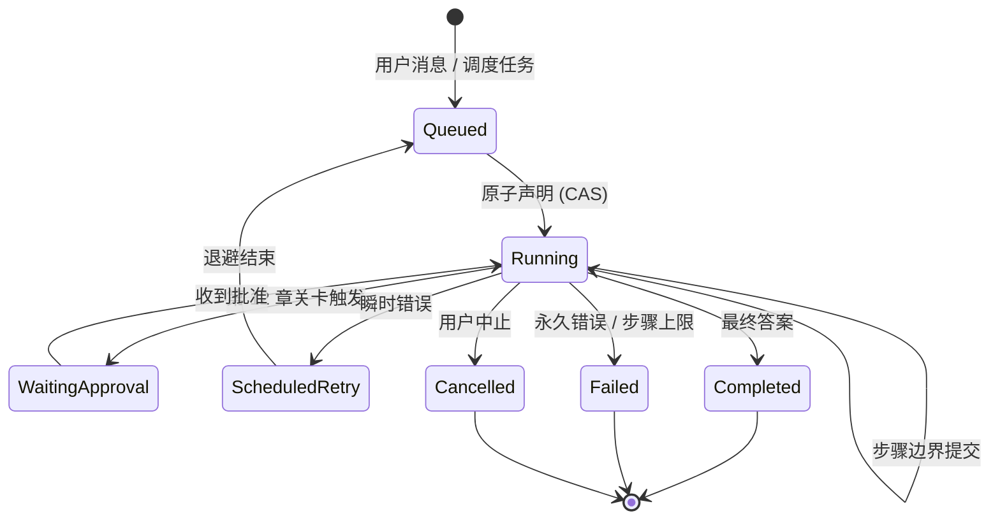
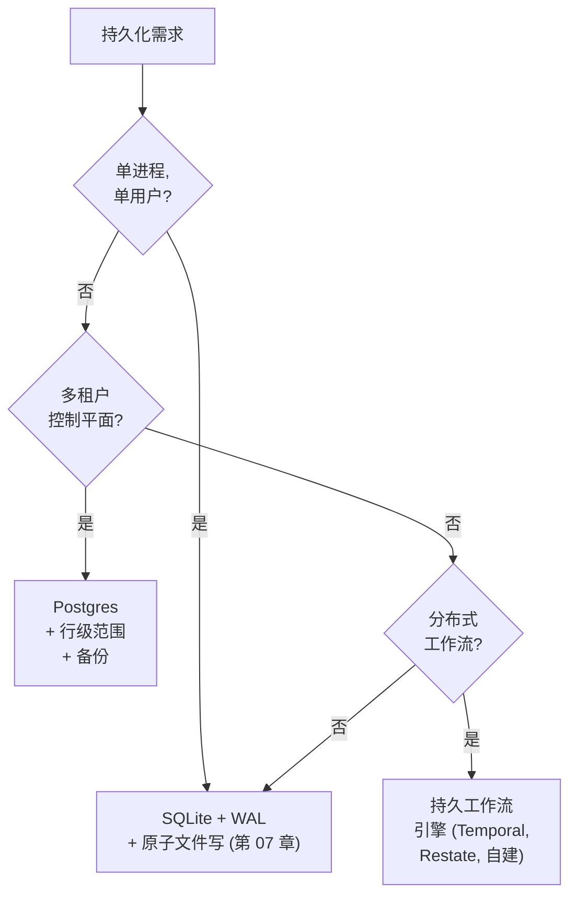

# 第 08 章 — 状态与持久化

## TL;DR

一个长跑 agent 应该在进程重启、节点失败或者循环中段部署后存活下来——既不重做已经做过的昂贵工作，也不把破坏性工作做两次。本章讲持久执行 (durable execution)：运行时哪些算作状态（消息数组、进行中的工具调用、abort token、凭据、prompt 指纹），步骤边界的提交点在哪里，run 状态机和 compare-and-swap 声明如何协调多个进程，心跳和孤儿回收器对挂起工作做什么，如何在 SQLite、Postgres 和持久工作流引擎之间选择，以及崩溃恢复、resume 和用户点击一个写着 "Resume" 的按钮之间的差别。

---

## 为什么这件事重要

一个编码 agent 跑了四十分钟。它读了五十个文件，做了十二次编辑，生成了三份 pull request 描述。一次部署出去。进程重启。agent 在内存里丢了 abort token，但 checkpoint 说它在第 23 步。重放时你发现 agent 重新发送了其中一份 pull request 描述，因为发布述描述的工具不是幂等的，harness 重试了它。你的团队 GitHub 现在多了一个重复的 PR。模型没问题。agent 的代码没问题。持久化层漏了。

这是开发中不会出现的那一类失败——它在你第一次在负载下做真实部署时出现。代价要么以可靠性付出，要么用本章讲的这些细致工作付出。

---

## 概念

### 对 agent 而言 "持久" 到底意味着什么

不是所有运行时状态都是一样的。写任何代码之前，有用的一份清点：

- **消息数组** —— 每个模型回合、每次工具调用、每个工具结果。仅追加、持久，replay 的真理之源。（这是第 05 章的审计日志，从运行时角度看。）
- **工具执行状态** —— 对每次工具调用：pending、running、completed、failed。住在消息旁边——在 OpenCode 的 `ToolPart.status`、Paperclip 的 `heartbeat_runs.status`、Hermes Agent 的就地结果里。
- **进行中的副作用** —— 那些 *开始了* 但还没返回的写入、发送、支付。最难恢复的一块状态；最容易误判的。
- **工作记忆** —— 第 05 章那个小的可变草稿区。必须跨崩溃持久，因为从 transcript 重建可能不能精确再现它。
- **abort token** —— 一个进程本地的信号。*重启后不存活。* 如果失控运行只通过 abort token 停止，崩溃会让它们继续运行。
- **认证 profile 和凭据** —— 必须在启动时重新加载，或者能从凭据池里重建。Hermes Agent 把它们存在 `~/.hermes/agents/<id>/auth-profiles.json` 下；Paperclip 把加密的行存在 Postgres 里，主密钥文件保护。
- **prompt 指纹** —— 第 04 章的 SHA。必须经过存储往返，使重建后的系统 prompt 字节一致、cache 在重启后还能存活。
- **成本和 token 账本** —— 用于预算上限的运行总和（第 17 章）。Hermes Agent 在 resume 时从消息日志重新计算；Paperclip 单独持久在 `cost_events` 表里用于可审计性。如果预算必须 *跨* 重启强制执行，账本需要自己的持久性——从日志重新计算可以，直到日志被部分压缩为止，那时就不行了。

一个持久的运行时是上述每一项都有明确策略的运行时：提交前持久、提交后持久、resume 时重建、或者接受丢失。没有"默认"答案；按项目挑、写下来、让你的 agent 从这份清单生成持久化代码。

### 步骤边界作为提交点

一步是循环的一次完整迭代：模型调用 → 任何工具分发 → 反思。提交点位于 Reflect 和 Stop 之间——也就是第 02 章指出的"一切附着的地方"那个边界。一步完成之后、循环让出之前，三件事应该在磁盘上：

- 新消息追加到审计日志。
- 工具执行状态转换到它的终态值。
- 工作记忆和任何成本/用量计数器已更新。

OpenCode 在每次 `LLM.stream()` cycle 之后 flush；Hermes Agent 在 `_flush_messages_to_session_db` 形状的写入里做同样的事；Paperclip 每个 `heartbeat_run_events` 行就 commit。模式是普适的：让出控制权之前先写。在写入持久化之前就返回给调用方的步骤，就是可能会被丢失的步骤。

```ts
// 步骤边界提交持有什么。
type Checkpoint = {
  sessionId:           string;
  stepIndex:           number;
  status:              "running" | "waiting_for_approval"
                     | "completed" | "failed";
  messageRange:        [number, number];   // 本步骤追加的范围
  workingMemory:       WorkingMemory;
  tokensSpent:         number;
  costSpent:           number;
  promptFingerprint:   string;             // 第 04 章
  lastError?:          string;
  committedAt:         string;
};
```

不要把密钥写进 checkpoint——存储密钥 *引用* 并在运行时解析。不要把重试计数器写进消息日志——它们属于 checkpoint，在那里更新。

### Run 状态机

一个 run 是一个用户消息（或调度触发器）到它最终答案之间的工作单元。每个生产系统都用一个显式的状态机来建模这件事。隐式转换是 agent 系统里一半重复副作用 bug 的来源。



Paperclip 几乎精确地这样编码——`heartbeat_runs.status IN (queued, running, completed, failed, cancelled, scheduled_retry)`。规则：

- 每一次依赖当前状态的转换都需要条件更新——`UPDATE ... WHERE status = <expected>` 是最低要求。经典竞态是 `queued → running`（两个 worker 抢同一行），下一小节会详细走通这个模式，但同样的 `WHERE` 子句也守护批准 (`running → waiting_approval`)、中止 (`running → cancelled`)、重试转换以及终态写入，以防并发覆盖。基于一个在你身下变了的状态做出的转换，就是一次丢失更新——同样的 bug、不同的标签。
- `running → terminal` 在 *赢下之后是幂等的*：在已经是终态的行上重复一次提交相同终态状态，是一次 no-op，这正是 replay 或重试时想要的行为。
- 终态从不转换回去。一个需要重试的 `failed` run 产出一个 *新* run，用 `parent_run_id` 链回去——绝不是就地复活。

这一层的大多数 agent bug 都是状态机 bug：一个隐式转换让同一工作发生两次，或者一个缺失的转换让 run 卡住。

### 崩溃恢复 vs resume vs "Resume 按钮"

这三个听起来相似，行为却非常不同。

- **崩溃恢复 (Crash recovery)** 是 *同一意图、新进程体*。部署重启了；用户期待工作继续。系统 prompt 不变；如果前缀通过磁盘字节一致地往返、*并且* 提供方的 TTL 没过期、*并且* 你路由到同一个模型和地区（cache 是按提供方、按模型、常常按地区算的——第 04 章有细节），cache *可能* 是热的。进行中的工具调用需要细致甄别。
- **Resume** 是 *同一会话、稍晚的时间*。用户关闭标签页几小时之后回来。cache 可能已经过期（第 04 章的 TTL）。系统 prompt 可能在两次访问之间被编辑过。审计日志可以干净地 replay，但世界可能已经向前走了。
- **"Resume 按钮"** 是用户 *显式* 行动去继续一个暂停的会话。用户知道有一段间隔；系统有更多自由去要求确认、揭示发生了什么、并在合适时重置工作记忆。

把这三者混为一谈会产生微妙的 bug。崩溃恢复对 *可安全 replay 的工作* 应该是无声且激进的——只读操作、标了 `idempotent: true` 的工具（第 03 章）、以及由 outbox 支撑的副作用。其它一切都通过下一小节的进行中甄别，把不可 replay 的工具调用浮到用户面前而不是静默重试。Resume 应该尽可能保留 cache，无法保留时就接受成本。Resume 按钮应该向用户 *展示* 他们在哪儿、即将重跑什么。

### 崩溃中的进行中工具调用

整章里最难的情况。一次工具调用开始了；结果从未回来；进程死了。重启时，有四个选项，按偏好排序：

1. **工具被元数据标记为 `idempotent: true` (第 03 章)。** Replay 它。第二次调用返回同样的结果。
2. **工具有一个外部 idempotency key。** 用同样的 key replay；下游系统去重。
3. **工具在执行前写到了一个持久的 outbox。** Replay 时读 outbox；如果意图被标为已完成，跳过；否则用同样的 key 重试。
4. **工具不安全可 replay。** 把 run 标为失败，浮到用户面前。一句尴尬的 *"这真的发生了吗？"* 好过一封重复的邮件。

第 03 章的元数据标志是让 harness 不用思考就能挑出正确选项的东西。没有那些标志的工具默认进入 (4)：大声失败、问用户、绝不静默重试。反过来——默认重试——就是重复 PR 是怎么发生的。

### 用 compare-and-swap 做原子声明

任何跨多个进程跑的东西——心跳调度器拾起排队工作、两个 API 服务器在同一会话上竞争——都需要一次原子声明。跨数据库的模式是一样的：在一个状态列上做 compare-and-swap。

```sql
-- 原子地声明一个排队的 run。只有你赢下竞争时才返回这一行。
UPDATE runs
   SET status      = 'running',
       claimed_by  = :worker_id,
       claimed_at  = now()
 WHERE id     = :run_id
   AND status = 'queued'
RETURNING *;
```

如果 `UPDATE` 影响了零行，另一个 worker 先声明了它；继续走。如果影响了一行，你拥有这工作，直到你把它转到终态或者你的租约超时。Paperclip 在 `heartbeat_runs` 上用这种形态；在 Postgres 风格的栈里，事务内的 `SELECT ... FOR UPDATE` 是等价的；在带 WAL 的 SQLite 里，同样的 `UPDATE ... WHERE status=...` 也能工作，因为写者是串行化的。

对于单进程系统（Hermes Agent 单用户模式、OpenCode 开发服务器），CAS 是杀鸡用牛刀。对于任何 *可能* 之后横向扩展的，第一天就接上——成本是一列加一个 `WHERE` 子句；改造的代价高得多。

### 心跳与孤儿恢复

没有心跳的声明是一次缓慢泄漏——worker 死了，run 还在 "running"，其它什么都不会拾起它。生产系统在声明之外配两列：

- **`last_heartbeat_at`** —— worker 每几秒更新一次，只要 run 还活着。
- **`lease_expires_at`** —— 超过这个时间还没看到心跳，run 被认为孤立。

一个回收器服务定期扫描 `lease_expires_at < now()` 的 run，要么把它们重新排队（`status → queued`，新的尝试），要么在重试次数用尽后把它们标为失败。Paperclip 的 `reapOrphanedRuns()` 就是这个；它还在清除租约前确认 OS PID 已死，处理心跳只是慢而不是没了的情况。

两个调优常数是诚实的权衡：

- **心跳间隔。** 越短孤儿检测越快，但写入流量越多。Paperclip 每几秒写一次。
- **租约超时。** 越长越能容忍慢工具（30 分钟的编译），越短恢复越快。Paperclip 默认 6 小时，并让适配器按工作负载调优。

回收器对分布式 agent 不是奢侈品。它是唯一防止单个崩溃的 worker 永久卡住工作的东西。

回收器自己也需要存活检测。把它作为它自己的任务跑，带它自己的心跳，否则每个其它 worker 都会在启动时抢着当回收器。Paperclip 用与 run 同样的 CAS 模式选出单一回收器——一个小的 `service_locks` 表里的一行，被声明并刷新。

### 仅追加事件日志 vs 每步快照

两种持久化形态跨系统出现，常常组合：

- **仅追加事件日志。** 每一步写新的行；当前状态通过按顺序读全部来计算。Hermes Agent 的 `messages` 表是这样；Paperclip 的 `heartbeat_run_events` 是这样；OpenCode 的 `PartTable` 大体上是这样。
- **每步快照。** 每一步写 *整个* 状态对象，覆盖前一个。resume 更快（不需要 replay）；磁盘上更大；更难审计因为中间值丢了。

大多数生产 agent 在审计日志上用仅追加（因为第 05 章本来就需要完整 transcript），在工作记忆和 checkpoint 元数据上用每步快照（因为它们需要快速随机访问和小占用）。两者结合操作便宜，给你审计故事和 resume 故事而不重复任何一个。

### 选择存储



SQLite 承担了大量的生产负载。Hermes Agent 和 OpenCode 都基于 SQLite，并跑着真实负载。原因：WAL 模式不用配置就给你并发读和单写者，`fsync` 让它持久，而文件就只是文件——容易复制、容易备份、容易用 CLI 检查。

当 *多个进程* 必须协调写入、当你需要数据库强制执行的 *多租户* 行范围、或者当你需要一个 *调度器* 跨节点唤醒延迟作业时，越过 SQLite。Paperclip 选择 Postgres 就是这个：它是一个控制平面，三者都需要。再上一层是持久工作流引擎（Temporal、Restate、自建等价物）——当 agent 自己的逻辑最适合表达为一个工作流，里面有任意带副作用的步骤必须可 replay 时有用。

WAL 模式不是免费的。它在 `.db` 旁边加一个 `-wal` 和 `-shm` 文件，重度写入阶段磁盘大致翻倍。对于移动端或边缘 agent，普通 journal 模式可能是正确选择。Hermes Agent 的 `apply_wal_with_fallback` 处理 WAL 不可用的情况（NFS、SMB），并优雅地回退到 `journal_mode=DELETE`。

### 步骤边界的幂等性，不只是工具的

第 03 章覆盖了工具级的 idempotency key。步骤级幂等性是另一种保证：*同一步骤、replay 之后，必须产生同样可观察的效果。*

```ts
function stepIdempotencyKey(c: {
  sessionId: string; stepIndex: number; action: string;
}) {
  return sha256(`${c.sessionId}:${c.stepIndex}:${c.action}`).slice(0, 32);
}
```

两种模式坐在它上面：

- **outbox 模式。** 在发出副作用之前，把 *意图*（及其 idempotency key）写到一个持久表。副作用成功之后，把意图标为已完成。replay 时，harness 先读表：已完成的意图被跳过；未完成的用相同 key 重试。这把 *决定* 的持久性和 *投递* 的持久性解耦了。
- **完成标记。** 非分布式系统的简化版：checkpoint 上一个 `step_complete` 布尔值。一旦设置，步骤就不再重跑，即使内部某个子动作没返回值。诚实的限制：标记告诉你 *你自己* 的提交，不告诉你世界的。如果一个副作用跨越了网络，而进程在调用落地和标记持久化之间死了，恢复无法知道哪个先发生。盲跳过有丢失工作的风险；盲重试有重做的风险。正确的做法是 *对账*——问下游系统调用是否落地——这正是 outbox 模式存在的原因，也是为什么副作用一旦离开你的进程，完成标记就不够用了。

大多数生产 agent 用第二种；outbox 模式出现在你不能完全信任的网络边界跨越（第三方 API、消息队列、它们自己会崩溃的下游服务）。

### 压缩链遇到 resume

第 05 章介绍了会话轮转：当压缩不再够用时，创建一个新会话，用 `parent_session_id` 链回老的。从持久化角度看，这也是一个 *resume 原语*。一个失败的长跑会话可以被一个以移交块开始的新会话替代，移交块总结父级的状态；审计日志仍一路追溯到底，新会话的 cache 全新预热而不拖累老会话的累赘。

由此推论：永远不要因为子级 resume 了父级会话就删除父级。归档它、标为被取代，但链必须保持完整。Resume、审计、回滚都依赖于它。第 07 章的"永不修剪审计日志"规则在这里也适用——不同的角度，同样的纪律。

### 操作存储：备份、恢复、迁移

没被备份的状态就是会丢失的状态。模式：

- **备份。** Paperclip 出货周期性的 `pg_dump`，带可配置的保留窗口。基于 SQLite 的系统应该按计划跑一次 `VACUUM INTO` 快照并把文件复制出去。最低是每日完整快照；更好是增量 WAL 备份。低于"每日"的是事故之后才会讲的故事。
- **恢复。** 永远恢复一个 *一致* 的快照——绝不要从备份里选择性地把行恢复进活跃存储，除非你能证明它们不违反状态机。恢复还必须尊重第 07 章的删除标记——按用户请求或保留策略移除的内容，在旧快照被恢复时仍然保持移除，否则你就刚刚把你承诺过要删除的数据又复活了。恢复很罕见；在需要它之前演练它，最好作为部署清单的一部分。
- **模式迁移。** 模式在部署之间变化。OpenCode 和 Paperclip 用 Drizzle migrations；Hermes Agent 用一个 `schema_version` 行显式版本化模式。前向路径走得很熟；*回退* 路径几乎从来没走过。默认用加法迁移（带默认值的新列），把破坏性迁移留给显式的数据清理部署。
- **跨迁移的进行中 run。** 一个在 schema v3 下写入的 checkpoint 在 v4 下可能不能干净地反序列化，如果 v4 删除或重命名了一个列。给每个 checkpoint 印上写入它的 schema 版本 (`checkpointSchemaVersion: 3`)。让 resume 路径感知版本——应用按版本的强制转换把 checkpoint 前移，并在转换不可能时大声失败，而不是静默产出一个损坏的 run。对于破坏性迁移，先 *排空* 进行中的 run：停掉队列、等待活动 run 终止或被取消，然后迁移。五分钟暂停吞吐量好过三天调试一个半迁移的 checkpoint。

### "Resume 按钮"实际需要什么

如果你出货一个写着 *"Resume"* 的按钮，用户期待的不只是崩溃恢复。他们期待一个诚实回答 *我在哪儿、即将发生什么？* 具体来说：

- 会话必须能完整从磁盘加载——审计日志、checkpoint、工作记忆、成本账本，全部贯通。
- 系统 prompt 必须字节一致地重建，或者必须告诉用户 cache 会付出重建成本（第 04 章）。
- 上次尝试中任何进行中的工具调用都必须被分类（idempotent / outbox / unsafe），并在循环继续之前浮到表面。
- 用户应该能看到 *agent 上次做了什么* 和 *它即将做什么*——最后完成的步骤和下一个计划的动作。

这是第 05 章、第 06 章、第 07 章和第 08 章 *合在一起* 让其成为可能的系统。记忆在正确的地方存活，审计日志以正确顺序 replay，cache 在能保持温热的地方保持温热，用户看到的是一幅连贯的图景，而不是 *"你的 agent 崩溃了；点这里"*。Resume 按钮是表面；底下的一切就是本章讲的。

---

## 真实系统参考

- **OpenCode** 是嵌入式持久性在编码 agent 场景下最强的参考：SQLite + WAL 配 Drizzle migrations、仅追加的 `SessionTable` / `PartTable` / `SyncEvent`、一个隐藏的 git 快照仓库为 revert 提供动力，以及一个每会话的 abort 控制器 *不* 在重启后存活（有意为之——中断只在运行时）。
- **Paperclip** 是控制平面级分布式持久性的参考：Postgres 加 `SELECT ... FOR UPDATE` 做原子声明、一个带显式转换的 `heartbeat_runs` 状态机、`reapOrphanedRuns` 回收器在清除租约前确认 OS PID 活性、每张表的多租户范围、计划的 `pg_dump` 备份带保留，以及适配器进程隔离让父级崩溃时子进程仍在跑。
- **Hermes Agent** 是把第 04 章的 cache–resume 对偶应用到这里的参考：`SessionDB.sessions.system_prompt` 持久化字节一致的 prompt，所以一个被驱逐然后恢复的 agent 在 replay 时有温热的 cache，`apply_wal_with_fallback` 处理 WAL 不友好的文件系统，cron 调度器的基于文件的锁展示了最简单的咨询锁模式。
- **OpenClaw** 存储每会话的 JSONL transcript 加凭据和记忆状态，展示了一种基于文件的持久化模型，对单用户多通道使用场景能扩展而无需数据库。一个好的提醒：如果工作负载合适，"持久"不需要 DB。

---

## 和你的 agent 一起练习

几条在本章上效果不错的 prompt：

- *"逐项清点我的运行时状态——消息数组、工具状态、进行中副作用、工作记忆、abort token、凭据、prompt 指纹。对每一项，告诉我我当前的存储是否持久化它，并在没有时提出修复方案。"*
- *"实现本章的 run 状态机，带一个显式 `status` 列和 CAS 声明。写一个压测，让两个 worker 抢同一个排队的 run，验证恰好一个赢下。"*
- *"给我的 run 加上心跳和孤儿回收器。回收器应该在清除卡住的租约前确认 OS PID 活性。为我的工作负载调优心跳间隔和租约超时，并用三个要点解释权衡。"*
- *"按第 03 章的 `idempotent` 标志分类我所有的工具。然后写崩溃后 resume 的逻辑，用这个标志决定 replay 还是 skip-and-ask。用一个故意注入的工具中段崩溃来测试它。"*
- *"为一个具体的外部副作用（发送 Slack 消息）接上 outbox 模式。写意图、发送、标为已完成。在每对之间注入一次崩溃，并验证 resume 时的结果。"*
- *"剖析我十个真实会话上的 checkpoint 载荷。如果平均超过 50 KB，提议把哪些从每步快照挪到仅追加日志。"*
- *"把崩溃恢复 vs resume vs Resume 按钮实现为三条不同的代码路径。让我看出每一条在以下情况下触发：部署后进程重启、用户 24 小时后回来、用户在失败 run 上点击 Resume。"*
- *"写恢复演练：停掉我的服务、恢复昨天的快照、重新启动、证明状态机一致。端到端计时，让我知道一次事故实际要多久。"*

---

## 下一章

你现在有了一个能在重启中存活、跨进程协调工作、并干净 resume 而不重复做破坏性工作的运行时。

再上一层是 *规划*——一个 agent 如何在 *执行之前* 跨多步决定做什么。第 09 章讲四种规划形态（无计划、checklist、plan-execute-replan、依赖图），每一种何时帮助、何时伤害，以及最容易的选择里隐藏的失败模式。
