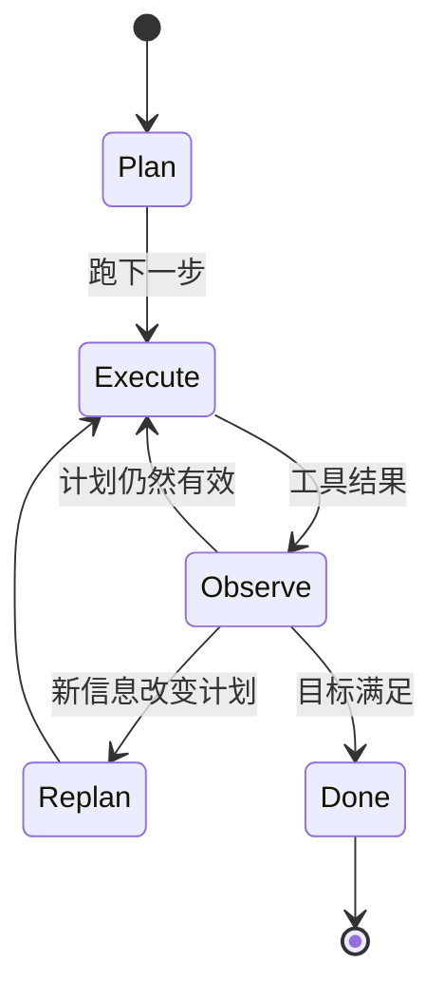

# 第 09 章 — 规划模式

## TL;DR

有的任务模型一步就能答；有的需要三步；有的需要三十步。规划层负责判断你面对的是哪一类任务，并组织好 agent 走通这条路径。本章讲生产中常见的四种规划形态（无计划、checklist、plan-execute-replan、依赖图）、在它们之间取舍的设计决策（隐式 vs 显式、仅规划 vs 构建、谁来编辑计划）、能在 agent 一头扎进陈旧计划之前及时拦住它的 replan 触发条件，以及每种形态各自隐藏的失败模式。目标：为任务选出最简单够用的规划模式——同时识别出任务何时已经需要升一档了。

---

## 为什么这件事重要

没有计划，agent 会原地打转——它会把同一份文件读两遍，在第 4 步拐错了弯却浑然不觉，调一个工具去干前一个工具早就干完的活儿。而计划 *太多* 时，同一个 agent 又会耗掉一半的 token 去提出一份 20 步的蓝图，结果第一个工具结果一推翻它，蓝图就立刻作废。代价体现在 token、延迟上，以及（最糟的）一个信心十足却解错了问题的最终答案上。

解法不是"永远多规划"，而是让规划形态匹配任务，并知道何时该 replan。本章余下的内容就是这四种形态以及围绕它们的那些规则。

---

## 概念

### 四种形态，并排对照

在深入之前，先给一张有用的心智地图：


通常只要问两个问题，就能判断一个任务需要哪种形态：*目标定义得有多清楚？* 以及 *第 1 步的结果有多大可能改变第 2 步的计划？* 目标清晰、路径分歧小的任务适合前两种形态；后两种则用于路径真正不确定、或存在独立分支的任务。

### 形态 1 — 无计划

agent 挑一个工具、运行它，然后要么直接回答、要么再挑下一个工具。这是短问答、一次性查找、简单转换的默认做法。OpenClaw 的反应式流程，以及大多数领先的商用 agent 在 chat 模式下，只要任务规模足够小就用这个——*"安装的是哪个版本的 node？"* 根本不需要计划。

快、便宜、流畅。但碰上任何真正多步的任务，就很容易原地打转。

### 形态 2 — checklist

模型在动手之前先写一份简短的有序清单，边做边打勾。OpenCode 的 `TodoWriteTool` 是最清晰的参考：模型在工作记忆中维护一份 markdown checklist，prompt builder 每一轮都把当前清单注入进来。Hermes Agent 则用 skill 形态的任务笔记达到类似效果。

```ts
// checklist 工具返回什么。这个列表就是模型下一轮读的内容。
type ChecklistPlan = {
  objective: string;
  steps: Array<{
    id:     string;
    text:   string;
    status: "pending" | "in_progress" | "done" | "skipped";
  }>;
};
```

适合：3–8 步的有序流程，模型大体能把整个计划记在脑子里，但有进度跟踪会更有帮助。清单就是记忆；模型对照它来自我纠正。

### 形态 3 — plan-execute-replan

模型先提出一份计划，执行一步或多步，观察结果，如果结果改变了大局，就 *重新* 提出计划。大多数领先的商用 agent 在交互模式下处理非平凡任务时都是这么做的；Paperclip 的 `plan_only` 执行模式正是这一模式中专门负责"现在规划、稍后执行"的那一半。



适合：调查、调试、研究——任何在第 3 步完成之前都说不清第 5 步长什么样的任务。代价是每次触发 replan 都要多一次模型调用；好处是 agent 不会被绑死在一份陈旧的计划上。

### 形态 4 — 依赖图

对于带有独立分支的任务（并行 review 三个文件；从三个源 fetch 后再 merge），把计划表达成一张有向图，并行执行那些可运行的节点。实践中这种形态位于纯规划之上的一层，落在委派（第 10 章）的范畴里——可运行节点通常会变成对子 agent 的调用。

```ts
// Runnable = pending + 所有依赖都完成。简易调度器。
function runnableNodes(nodes: PlanNode[]) {
  const done = new Set(
    nodes.filter(n => n.status === "done").map(n => n.id)
  );
  return nodes.filter(n =>
    n.status === "pending" && n.dependsOn.every(id => done.has(id))
  );
}
```

适合：有显式并行性和汇合点的工作流。不适合：任何本质上是线性的任务——此时上图只是为复杂而复杂。

### 选择形态

| 任务形态 | 规划形态 |
|---|---|
| 一个显而易见的行动 | 无计划 |
| 3–8 个有序步骤 | Checklist |
| 路径不确定；结果改变下一步 | Plan-execute-replan |
| 带汇合的独立分支 | 依赖图 |

有两个要警惕的反模式：一是看着依赖图显得高级就去用它，其实 checklist 就够了；二是在一个明显需要结构的任务上死守"无计划"模式。这两种情况模型都会顺着你来——只能靠你的设计把它扳回去。

### 计划作为记忆，不是飘在消息里的文本

计划说到底就是文本——但放在哪里很重要。它可以待在三个地方：

- **放在工具结果里。** 模型调用 `todo_write`，结果就是新清单，这份清单像任何其它工具结果一样出现在易变尾部。
- **放在工作记忆里**（第 05 章的可变草稿区）。清单是 `WorkingMemory.currentPlan` 的一部分，prompt builder 每一轮都会渲染它。
- **放在用户可编辑的独立文件里**（`plan.md`、OpenCode 的 `plan.ts` 流程）。agent 和用户共享这件制品，任何一方都能修改。

多轮之间把计划固定放在同一个地方，让模型知道去哪儿找。不要时而写进文件、时而当工具结果返回；选定一种。Hermes Agent 把任务计划存在 skill 文件里；OpenCode 存在 todo 工具里；领先的商用 agent 则倾向于存在工作记忆里，每一轮重新渲染进 prompt。

### 仅规划 agent vs 构建 agent

真实生产系统会做一个很有用的区分：负责 *规划* 的 agent 与负责 *构建* 的 agent 用的是不同的工具集。OpenCode 注册了相互独立的 `plan` 和 `build` agent profile；Paperclip 则通过 `planning_mode_directive` 把 issue 路由给规划者或构建者。形态如下：

- **仅规划 agent。** 只读工具，不能编辑、不能用 shell，输出是一份结构化的计划。一个便宜的模型往往就够了。
- **构建 agent。** 拥有完整的工具访问权限，包括写、编辑、shell。昂贵的模型用在这里。

移交方式：规划者的计划经过批准（由用户或某条策略），然后构建 agent 以这份计划作为起始 context 开始运行。当规划者和构建者是不同的 agent 时，这就进入了第 10 章的范畴；在单 agent 的设置里，则是同一个 agent 在多轮之间切换模式。

### 隐式计划 vs 显式计划

有些 agent 从不写计划——它们只是不停地挑下一个工具。另一些则把写计划当作第一个动作。隐式在小任务上更快；显式则能更早暴露"假设太脆弱"这种失败模式。一个有用的默认规则：*如果任务描述里提到了两个或更多交付物，就要求显式计划；否则让模型每轮自行决定。*

往这个方向上最省事的一招：对那些看起来多步的任务，在 system prompt 里加一句 *"先写出你的计划"*。模型通常会照做，而它写出的计划本身就是一个有用的信号——如果模型连计划都说不出来，那说明这个任务规约得还不够清楚。

### 何时 replan

有四种信号意味着"计划已经不再有效"：

- **新信息** —— 某个工具结果推翻了计划所依赖的假设。
- **失败的步骤** —— 某一步报错或返回了出乎意料的输出。要留意第 02 章讲过的 doom loop 特征：同一步骤以同样的方式失败三次，意味着该 replan 了，而不是重试。
- **范围蔓延 (Scope creep)** —— 用户加了新需求，现有计划没覆盖到。
- **陈旧假设** —— 计划写的时候假设文件在 `path/A`，可它现在在 `path/B`。这是最难发现的一种：agent 必须显式地去 *核查* 这个假设，而不能想当然地认为它仍然成立。

```ts
// 便宜的防御: 在每一步之前检查前置条件。
async function preconditionsHold(step: PlanStep, ctx: AgentContext) {
  for (const check of step.preconditions ?? []) {
    if (!(await check(ctx))) return false;
  }
  return true;
}
```

replan 本身并非免费——它要花掉一次模型调用。当犯错代价高时（比如要动生产数据），就积极地 replan；当代价低时（比如一份研究摘要），就放宽些、不急着 replan。

### 计划是状态

计划存放在工作记忆里（第 05 章），并随运行时状态的其余部分一起做 checkpoint（第 08 章）。崩溃之后，resume 应该把计划和已完成步骤的清单接着用下去——*而不是* 凭空造一个新计划、把已经做完的步骤再做一遍。这正是第 08 章的步骤边界提交防止规划层重复执行的方式。

```ts
type PlanningCheckpoint = {
  goal:              string;
  plan:              ChecklistPlan | { nodes: PlanNode[] };
  completedStepIds:  string[];
  lastReplanReason?: string;
  lastReplanAt?:     string;
};
```

接持久化时，把计划放进 checkpoint。接 resume 时，要 *在* 第一次模型调用之前就加载它，这样模型才知道自己是在任务中途接手的。

### 检查再挑 vs 预先规划

"无计划"和"plan-execute-replan"之间的界线本就模糊，这里有个有用的视角：在每一步，agent 要么 *检查* 当前状态再挑下一招（反应式），要么 *锁定* 一个事先规划好的下一招（声明式）。两者并不互斥——大多数生产 agent 都是混合体。

- **检查再挑。** 延迟低、流畅、适合探索。代价：模型可能丢掉高层目标，去追局部最优。
- **预先规划。** 起步延迟更高（写计划要一次模型调用），但 agent 会被锚定在目标上，后续步骤都沿用这个大框架。代价：当现实在计划脚下发生变化时，它会显得僵化。

最常胜出的混合做法是：先预先规划，规划到刚好能勾出工作的 *大致形状*（三到七步），然后在每一步之内再检查再挑。计划是脚手架，每一步的具体决定负责往里填内容。

### 计划的抽象层

50 步的计划是一份规约，不是计划。一步的计划根本算不上计划。正确的粒度落在两种反形态之间：

- **太细。** 四十七步。第一步一失败，整个计划就作废；维护成本压倒一切。
- **太模糊。** *"修 bug。"* 没给出任何 agent 能照着执行的结构。

一条有用的规则：**每个计划步骤应当对应一到两次工具调用。** 如果一步需要 agent 在动手前先想一整段，就把它拆开。如果一步是 *"用参数 Y 调用工具 X"*，那是实现细节，不是计划——交给模型自己推导。大多数生产 agent 在中等复杂度的任务上会收敛到 5–12 步。

拿同一个任务（登录功能回归）来做个具体对比：

| 粒度 | 步骤示例 |
|---|---|
| 太模糊 | *"修登录 bug。"* —— 没指明资源，也没给出结果。agent 无从下手。 |
| 太细 | *"调用 `read_file({path: 'src/auth.ts'})`；定位第 42 行；调用 `write_file(...)` 把 `userId` 改成 `user.id`；调用 `run_shell({cmd: 'npm test'})`。"* —— 这是实现，不是计划；第一步一失败，下面的一切就全部作废。 |
| 可检视的里程碑 | *"对着 dev 服务器重现失败的登录流程；把这个 500 追踪到 `src/auth.ts` 里出问题的那个字段；修正字段引用；重跑认证的单元测试和集成测试。"* —— 每一步都指明了一个结果和一个资源，至于用什么工具由 agent 自己挑。 |

中间那一行是模型 *在运行时被允许做* 的事，而不是计划 *本身该写成* 的样子。最下面那一行才是计划：agent 有足够的结构去行动，你也有足够的结构能在执行过程中检视进展，而不必去读代码。

### 计划修改的 UX

如果用户能在执行中途编辑计划，你会得到一个好得多的反馈循环——这也是保持 agent 不跑偏的最省事的办法之一。做法是：

- 计划放在用户看得见的地方（文件、UI 面板、聊天消息）。
- agent 在每一轮开头都重新读一遍计划。
- 用户的编辑对下一轮可见，并可能触发 replan。

OpenCode 的 `plan.md` 文件就是用户可编辑的。领先的商用 agent 通常会把计划渲染在 UI 里，并接受就地编辑。而在那些计划只存在于模型工作记忆里的系统中，这一点大多是缺失的——一个被错过的机会。只要你能让用户对计划有个抓手，就该给。

### 规划也是可观测性

与前几章里的 cache、压缩、检索、记忆等指标并列，有三项规划度量从第一天起就值得记录：

- **Replan 率** —— 触发了 replan 的步骤占比。太高（>30%）说明计划的抽象层不对；太低（<5%）通常说明 agent 在忽视那些本该触发 replan 的新信息。
- **计划与执行的偏离** —— 会话结束时，把最初提出的计划和实际发生的过程对比一下。偏离大，说明规划者产出的是低价值计划、被执行者无视了；偏离小却结果很糟，说明计划从一开始就是错的。
- **首动作时间 (Time-to-first-action)** —— 从用户发来消息到 agent 调用第一个工具之间隔了多久。如果规划者每次动手前都要花掉两次模型调用，你可能在过度规划小任务；如果它从不规划，你可能在欠规划大任务。

这些指标连同前几章的指标，一起归入第 16 章的追踪流水线。它们合在一起会告诉你：规划形态和你的实际流量是否匹配——又或者，某个团队是不是在 checklist 就够用的时候非要上依赖图。

### 失败模式

| 失败 | 症状 | 修复 |
|---|---|---|
| 过度规划 | 模型花好几轮反复打磨计划，却迟迟不执行 | 限制规划轮数；N 轮之后强制执行 |
| 欠规划 | 跑偏；agent 在解一个错的子问题 | 任务看起来多步就强制要求显式计划 |
| 计划太细 | 一次失败就让整个计划作废 | 拆到每步 1–2 次工具调用 |
| 计划太模糊 | agent 无法据此行动 | 拒绝那些步骤没指明具体结果和资源的计划——要说清 *改什么* 以及 *改在哪*，而不是说要调哪个工具 |
| 计划陈旧 | 计划当初假设 X，X 现在已为假 | 在每步之前加前置条件检查 |
| 计划从不被重读 | 模型凭记忆执行，无视编辑 | 每一轮都把计划渲染进 prompt |

每一项都只是一件要防的小事；但合在一起，就涵盖了你在生产中会遇到的大多数规划 bug。

---

## 真实系统笔记

- **OpenCode** 在编码 agent 场景下提供了显式的规划原语：相互独立、工具集各异的 `plan` 和 `build` agent profile，一个供模型维护 checklist 计划的 `TodoWriteTool`，以及一个用户可编辑、基于文件的 `plan.ts` 流程。
- **Paperclip** 在编排层表达规划：`planning_mode_directive` 在 plan-only 和 build 模式之间切换 issue；恢复用的 issue 还能为窄任务申请更轻的模型。监督者（心跳服务）负责把工作路由给规划者或构建者 agent。
- **Hermes Agent** 把计划保存在 skill 和工作记忆里：长时间运行的任务会变成带步骤清单的 skill 文件；cron 触发的工作则对着一份预先写好的轻量计划、外加第 05 章的持久状态来运行。
- **OpenClaw** 更偏反应式——规划是放在底层 agent 运行时里、而非通道适配器层——这让它成为"无计划"这一极端、以及思考"计划何时纯属多余噪声"的一个好参考。

---

## 与你的 agent 结对

几条在本章上效果不错的 prompt：

- *"看一下我最近二十次 agent run，按它实际采用的四种规划形态（无计划 / checklist / plan-execute-replan / 依赖图）分类。告诉我哪些 run 给任务选错了形态，以及为什么。"*
- *"实现一个 `todo_write` 工具，在工作记忆里维护一份 checklist，并在每一轮 prompt 顶部渲染当前清单。给我演示一次 run，让我看到模型在完成步骤时逐项打勾。"*
- *"给我的计划步骤加上前置条件检查。每一步执行之前，先验证它所依赖的假设——文件还在、测试仍然失败、分支是最新的。一旦失败就触发 replan，并记录原因。"*
- *"把我的 agent 拆成一个 `plan` profile（只读、便宜模型）和一个 `build` profile（完整工具、贵模型）。把移交流程接起来：规划者输出计划、用户批准、构建者执行。给我看这两个 agent 的 system prompt，以及夹在中间的那个批准界面。"*
- *"让我的计划变成用户可编辑：在一个侧栏里渲染它，允许用户当成文本来改；确保 agent 在每一轮开头都重读一遍，并在用户改动后 replan。"*
- *"分析我过去一周会话里的 replan 频率。如果 agent 在超过 30% 的步骤上 replan，说明计划的抽象层不对——提出该怎么把步骤粗化。如果它在不到 5% 的步骤上 replan，可能太僵化了——提出该怎么把它放松一些。"*

---

## 接下来

现在你知道了何时该规划、以及如何把计划表达出来。下一个问题是：当计划里有一部分需要交给 *另一个 agent* 来执行时，该怎么办？第 10 章讲委派——父级递给子 agent 的数据包、回传的结果契约、递归上限、隔离模式，以及委派何时是正确的选择、何时一个工具就够了。
