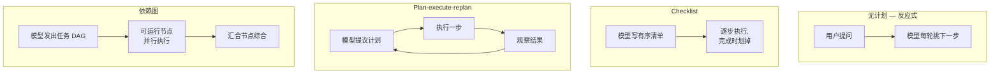
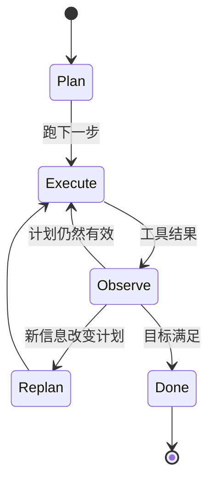

# 第 09 章 — 规划模式

## TL;DR

有的任务模型一招就能答；有的需要三招；有的需要三十招。规划层决定你拿到的是哪一类任务、以及如何组织 agent 穿过它的路径。本章讲生产中出现的四种规划形态（无计划、checklist、plan-execute-replan、依赖图）、在它们之间选择的设计决定（隐式 vs 显式、仅规划 vs 构建、谁编辑计划）、在 agent 提交于陈旧计划之前抓住它的 replan 触发器，以及每种形态隐藏的失败模式。目标：挑出适合任务的最简单规划模式——并识别任务何时在要求下一档。

---

## 为什么这件事重要

没有计划，agent 会乱撞——它会读同一份文件两次，在第 4 步走错了路却没注意到，调用一个工具去做前一个工具已经做过的活儿。计划 *太多* 时，同一个 agent 会花掉一半的 token 提议一个 20 步的蓝图，而蓝图在第一个工具结果反驳它的那一刻就没用了。代价以 token、延迟，以及（最糟糕的）自信地回答了错误问题的最终答案的形式出现。

修复办法不是"永远多规划"。是把规划形态匹配到任务，并知道何时 replan。本章余下的内容是这四种形态以及围绕它们的规则。

---

## 概念

### 四种形态，并排对照

挖进去之前，一份有用的心智地图：



通常通过问两个问题就能判断一个任务需要哪种形态：*目标有多明确定义？* 以及 *第 1 步的结果有多大可能改变第 2 步的计划？* 高定义、低分歧的任务适合前两种形态；后两种用于路径真正不确定或者有独立分支的任务。

### 形态 1 — 无计划

agent 挑一个工具、跑它，要么回答、要么挑下一个工具。这是短问答、一次性查找、简单转换的默认。OpenClaw 的反应式流程和大多数领先的商用 agent 在 chat 模式下，当任务签名足够小时就用这个——*"安装的是哪个版本的 node？"* 不需要计划。

快、便宜、流畅。在任何真正多步的任务上很容易乱撞。

### 形态 2 — checklist

模型在行动之前写一份简短的有序清单，边走边打勾。OpenCode 的 `TodoWriteTool` 是最清晰的参考：模型在工作记忆中维护一份 markdown checklist；prompt builder 每一轮注入当前清单。Hermes Agent 用 skill 形状的任务笔记达到类似效果。

```ts
// checklist 工具返回什么。这个列表就是模型下一轮读的内容。
type ChecklistPlan = {
  objective: string;
  steps: Array<{
    id:     string;
    text:   string;
    status: "pending" | "in_progress" | "done" | "skipped";
  }>;
};
```

适合：3–8 步有序的步骤，模型可以合理地把整个计划放在脑子里，但跟进步进度有帮助。清单就是记忆；模型对照它自我纠正。

### 形态 3 — plan-execute-replan

模型提议一个计划，执行一步或多步，观察结果，如果结果改变了大局就 *重新* 提议计划。大多数领先的商用 agent 在交互模式下对非平凡任务这样做；Paperclip 的 `plan_only` 执行模式是这种模式的专用 "先规划、后执行" 半边。



适合：调查、调试、研究——任何在第 3 步完成之前你不知道第 5 步长什么样的任务。代价是每次 replan 事件多一次模型调用；收获是 agent 不被绑在一个陈旧的计划上。

### 形态 4 — 依赖图

对于有独立分支的任务（并行 review 三个文件；从三个源 fetch 然后 merge），把计划表达为一个有向图，并行执行可运行节点。实际上这种形态住在纯规划之上的一层，住在委托里（第 10 章）——可运行的节点通常变成 subagent 调用。

```ts
// Runnable = pending + 所有依赖都完成。简易调度器。
function runnableNodes(nodes: PlanNode[]) {
  const done = new Set(
    nodes.filter(n => n.status === "done").map(n => n.id)
  );
  return nodes.filter(n =>
    n.status === "pending" && n.dependsOn.every(id => done.has(id))
  );
}
```

适合：有显式并行性和汇合点的工作流。不适合：任何看起来是线性的、图只是为了显得复杂的情况。

### 选择形态

| 任务形态 | 规划形态 |
|---|---|
| 一个显而易见的行动 | 无计划 |
| 3–8 个有序步骤 | Checklist |
| 路径不确定；结果改变下一步 | Plan-execute-replan |
| 带汇合的独立分支 | 依赖图 |

两个要警惕的反模式：因为依赖图看起来高级就去够它而其实 checklist 就够了，以及在一个肉眼可见需要结构的任务上死守在"无计划"模式里。模型会顺着两者来——你的设计必须推回去。

### 计划作为记忆，不是飘在消息里的文本

计划就是文本——但你把它放在哪里很重要。它可以住在三个地方：

- **在一个工具结果里。** 模型调用了 `todo_write`；结果是新清单；清单像任何其它工具结果一样出现在易变尾部。
- **在工作记忆里**（第 05 章的可变草稿区）。清单是 `WorkingMemory.currentPlan` 的一部分，prompt builder 每一轮渲染它。
- **在用户可以编辑的独立文件里**（`plan.md`、OpenCode 的 `plan.ts` 流程）。agent 和用户共享这件制品；任何一方都可以修改。

在多轮之间把计划保持在同一个地方，让模型知道去哪儿找。不要有时写到文件、有时返回为工具结果；挑一个。Hermes Agent 把任务计划存在 skill 文件里；OpenCode 把它们存在 todo 工具里；领先的商用 agent 倾向于把它们存在工作记忆里，每一轮新鲜地渲染进 prompt。

### 仅规划 agent vs 构建 agent

真实生产系统做的一个有用分离：*规划* 的 agent 跑的工具集和 *构建* 的 agent 不同。OpenCode 注册分开的 `plan` 和 `build` agent profile；Paperclip 通过 `planning_mode_directive` 把 issue 路由给规划者或构建者。形态：

- **仅规划 agent。** 只读工具，无编辑、无 shell，输出是结构化的计划。一个便宜的模型常常就够了。
- **构建 agent。** 完整工具访问，包括写、编辑、shell。昂贵的模型住在这里。

移交：规划者的计划被批准（由用户或策略），然后构建 agent 以那份计划作为它的起始 context 跑起来。当规划者和构建者是不同的 agent 时，这是第 10 章的领地；在单 agent 设置里，同一个 agent 在多轮之间切换模式。

### 隐式计划 vs 显式计划

有些 agent 从不写计划——它们只是一直挑下一个工具。其它的把写计划作为它们的第一个动作。隐式在小任务上更快；显式更早抓住脆弱假设的失败模式。一个有用的默认：*如果任务描述提到了两个或以上的交付物，要求显式计划；否则让模型按轮决定。*

这个方向最便宜的轻推：在系统 prompt 里加入对看起来多步的任务的提示 *"先写出你的计划"*。模型通常会照做，它写的计划本身就是一个有用的信号——如果模型说不出计划，那任务就是欠规约的。

### 何时 replan

四种信号意味着"计划不再有效"：

- **新信息** —— 一个工具结果反驳了计划的假设。
- **失败的步骤** —— 一个步骤报错或返回了出乎意料的输出。注意第 02 章的死循环签名：同一步骤同样方式失败三次意味着 replan，不是重试。
- **范围蔓延 (Scope creep)** —— 用户加了新需求；现有计划没覆盖。
- **陈旧假设** —— 计划假设文件在 `path/A`；它现在在 `path/B`。最难检测：agent 必须显式 *检查* 假设，不能只是假设它仍然成立。

```ts
// 便宜的防御: 在每一步之前检查前置条件。
async function preconditionsHold(step: PlanStep, ctx: AgentContext) {
  for (const check of step.preconditions ?? []) {
    if (!(await check(ctx))) return false;
  }
  return true;
}
```

replan 本身不是免费的——它要花一次模型调用。当错的代价高时（触碰生产数据）就急切地 replan；当代价低时（一份研究摘要）就懒惰地 replan。

### 计划是状态

计划住在工作记忆里（第 05 章），并和运行时状态的其余部分一起 checkpoint（第 08 章）。崩溃之后，resume 应该捡起计划和已完成步骤的清单——*而不是* 发明一个新计划并重新执行已完成的步骤。这是第 08 章的步骤边界提交如何阻止规划层重复执行。

```ts
type PlanningCheckpoint = {
  goal:              string;
  plan:              ChecklistPlan | { nodes: PlanNode[] };
  completedStepIds:  string[];
  lastReplanReason?: string;
  lastReplanAt?:     string;
};
```

接持久化时，把计划放进 checkpoint。接 resume 时，*在* 第一次模型调用之前加载它，这样模型知道自己在任务中段。

### 检查再挑 vs 预先规划

对"无计划"和"plan-execute-replan"之间的模糊地带，一个有用的框架：在每一步，agent 可以要么 *检查* 当前状态并挑下一招（反应式），要么 *承诺* 一个已规划的下一招（声明式）。它们不是互斥的——大多数生产 agent 是混合体。

- **检查再挑。** 低延迟、流畅、适合探索。权衡：模型可能丢掉高层目标，去追局部最优。
- **预先规划。** 起步延迟更高（计划要一次模型调用），但 agent 被锚定在目标上；下游步骤继承这种取景。权衡：当世界在计划脚下变化时僵化。

最常获胜的混合体：预先规划到足以建立工作的 *形状*（三到七步），然后在每一步内检查再挑。计划是脚手架；每步的决定填空。

### 计划的抽象层

50 步的计划是一份规约，不是一份计划。一步的计划根本不是计划。正确的粒度坐落在两种反形态之间：

- **太细。** 四十七步。第一步失败整个计划就无效；维护成本压倒一切。
- **太模糊。** *"修 bug。"* 没有提供 agent 可以对照执行的结构。

一条有用的规则：**每个计划步骤应该映射到一到两次工具调用。** 如果一步要求 agent 在行动前思考一整段，把它分解。如果一步是 *"用参数 Y 调工具 X，"* 那是实现，不是计划——让模型自己推导出来。大多数生产 agent 在中等复杂任务上收敛到 5–12 步。

同一任务（登录回归）上具体的对比：

| 粒度 | 步骤示例 |
|---|---|
| 太模糊 | *"修登录 bug。"* —— 没有命名资源，没有结果。agent 无处下手。 |
| 太细 | *"调用 `read_file({path: 'src/auth.ts'})`；定位第 42 行；调用 `write_file(...)` 把 `userId` 改为 `user.id`；调用 `run_shell({cmd: 'npm test'})`。"* —— 是实现，不是计划；第一个失败就让下面的一切失效。 |
| 可检视的里程碑 | *"对着 dev 服务器重现失败的登录流程；把 500 追踪到 `src/auth.ts` 里冒犯的字段；修复字段引用；重跑认证单元和集成测试。"* —— 每一步都命名了一个结果和一个资源；agent 自己挑工具。 |

中间一行是模型 *在运行时被允许做* 的东西，不是计划 *用来做* 什么。底下一行是计划：agent 有足够的结构去行动，你有足够的结构去飞行中检视而不用读代码。

### 计划修改的 UX

如果用户能在中段编辑计划，你会得到一个好得多的反馈循环——而且是保持 agent 诚实的最便宜方式之一。模式：

- 计划住在用户能看到的地方（文件、UI 面板、聊天消息）。
- agent 在每一轮顶部重新读计划。
- 用户的编辑对下一轮可见，并可能触发 replan。

OpenCode 的 `plan.md` 文件是用户可编辑的。领先的商用 agent 通常在 UI 里渲染计划并接受就地编辑。这在那些计划只住在模型工作记忆里的系统里大多缺失——一个错过的机会。如果你能给用户一个对计划的把手，那就给。

### 规划也是可观测性

与前几章 cache、压缩、检索、记忆指标并行，从第一天起就值得记录的三个规划度量：

- **Replan 率** —— 触发 replan 的步骤比例。太高（>30%）意味着计划抽象层错了；太低（<5%）通常意味着 agent 在忽略本应该触发它的新信息。
- **计划与执行的偏离** —— 会话结束时，对比原始提议的计划和实际发生的事。大的偏离是规划者在产出低价值计划被执行者忽略的信号；小的偏离配上糟糕的结果意味着计划从一开始就错了。
- **首动作时间 (Time-to-first-action)** —— 从用户消息到 agent 调用第一个工具有多久。如果规划者总是在做任何事之前花两次模型调用，你可能在过度规划小任务；如果它从不规划，你可能在欠规划大任务。

这些指标和前几章的指标一起，归入第 16 章的追踪流水线。它们合在一起告诉你规划形态和你的流量匹不匹配——还是某个团队在 checklist 就够用的时候在够依赖图。

### 失败模式

| 失败 | 症状 | 修复 |
|---|---|---|
| 过度规划 | 模型花几轮精炼计划，从不执行 | 限制规划轮数；N 轮后强制执行 |
| 欠规划 | 漂移；agent 在解错的子问题 | 任务看起来多步就强制要求显式计划 |
| 计划太细 | 一次失败就让整个计划失效 | 拆解到每步 1–2 次工具调用 |
| 计划太模糊 | agent 无法对其行动 | 拒绝那些步骤没命名具体结果和资源的计划——*什么* 变化以及 *哪里* 变化，而不是要调哪个工具 |
| 计划陈旧 | 计划假设 X；X 现在为假 | 在每步之前加前置条件检查 |
| 计划从不被重读 | 模型凭记忆执行，忽略编辑 | 每一轮把计划渲染进 prompt |

每一项都是一件要防的小事；合在一起就是你在生产中会看到的大多数规划 bug。

---

## 真实系统参考

- **OpenCode** 在编码 agent 场景下出货显式的规划原语：分开的 `plan` 和 `build` agent profile 带不同工具集，一个 `TodoWriteTool` 给模型维护的 checklist 计划，以及一个用户可编辑的基于文件的 `plan.ts` 流程。
- **Paperclip** 在编排层表达规划：`planning_mode_directive` 在 plan-only 和 build 模式之间翻转 issue；恢复 issue 可以请求更轻的模型做窄任务。监督者（心跳服务）把工作路由给规划者或构建者 agent。
- **Hermes Agent** 把计划保留在 skill 和工作记忆里：长跑任务变成带步骤清单的 skill 文件；cron 触发的工作对着一个轻量预写的计划加第 05 章的持久状态跑。
- **OpenClaw** 更偏反应式——规划住在底层 agent 运行时里，而不是通道适配器层——使它成为"无计划"极端和思考一个计划何时是不必要噪声的有用参考。

---

## 和你的 agent 一起练习

几条在本章上效果不错的 prompt：

- *"看一下我最近二十次 agent run。按它实际用的四种规划形态（无计划 / checklist / plan-execute-replan / 依赖图）分类。告诉我哪些 run 给任务用错了形态，为什么。"*
- *"实现一个在工作记忆里维护 checklist 的 `todo_write` 工具。每一轮在 prompt 顶部渲染当前清单。让我看到一次 run，模型在完成步骤时打勾。"*
- *"给我的计划步骤加前置条件检查。每步执行之前，验证它做的假设——文件存在、测试仍在失败、分支是当前的。失败时触发 replan 并记录原因。"*
- *"把我的 agent 拆成一个 `plan` profile（只读、便宜模型）和一个 `build` profile（完整工具、贵模型）。接上移交：规划者输出计划、用户批准、构建者执行。让我看到两个 agent 的系统 prompt，以及它们之间的批准界面。"*
- *"让我的计划用户可编辑。在一个侧栏里渲染它；让用户作为文本编辑；确保 agent 在每一轮顶部重读它，并在用户改变时 replan。"*
- *"剖析我过去一周会话的 replan 频率。如果 agent 在超过 30% 的步骤上 replan，计划抽象层错了——提议如何粗化步骤。如果它在少于 5% 的步骤上 replan，可能太僵化——提议如何减轻它。"*

---

## 下一章

你现在知道何时规划以及如何表达计划。下一个问题是当计划需要 *另一个 agent* 执行它的一部分时该怎么办。第 10 章讲委托——父级递给 subagent 的数据包、回来的结果契约、递归上限、隔离模式，以及委托何时是正确选择 vs 何时一个工具就够了。
