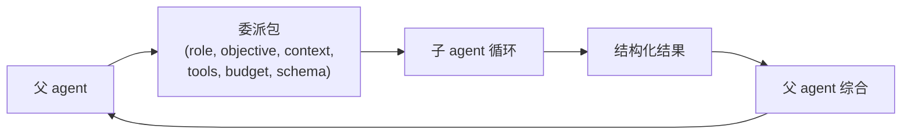
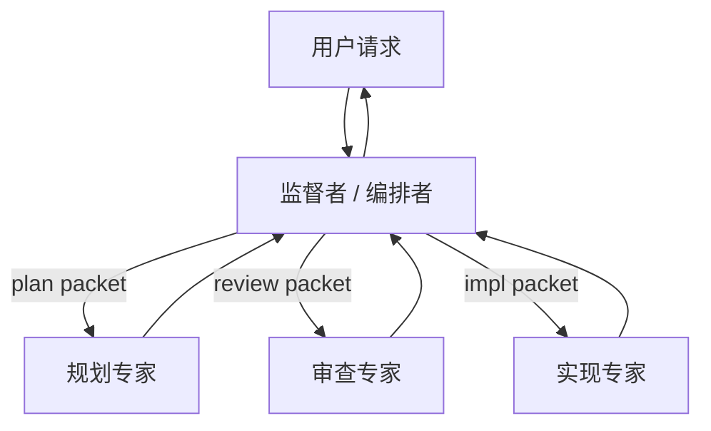

# 第 10 章 — 多代理委派

## TL;DR

多代理系统 (multi-agent system) 就是一个 agent (父 agent) 把另一个 agent (子 agent) 当作一个有边界的工作单元来运行。做好了，它可以隔离子任务，让父 agent 的 context 保持干净，同时让子 agent 用不同的工具集、模型或信任边界。做砸了，你就会得到一个含糊的 *"调查一下这个"*，工具不设限、输出也没有契约，然后你花一周时间调试。本章覆盖委派包 (delegation packet)、结果契约 (result contract)、同步 vs 异步以及顺序 vs 并行模式、递归上限和隔离模式、监督者 vs 专家拓扑结构,以及如何判断委派到底是不是该走的路,还是只是一个更贵的 tool call。

---

## 为什么这件事重要

第一次构建多代理系统时，你会同时发现三件事：子 agent 用的 token 比预期多，返回的文本比想要的长，做的决策你又无法审计。每一项都是一次契约失败。委派包含糊、结果 schema 不存在、审计链路是隐式的。

第二次开始才能享受到学习它的好处：一次设计得当的委派，是让 agent 走向专门化的最便宜方式。父 agent 保持通用；子 agent 拿到一个紧凑的角色、一个小工具集、一个适合任务的模型。整个系统比一个无所不知的单 agent 更便宜、推理也更好。

---

## 概念

### 何时该委派 (何时不该)

至少满足以下一点时再考虑委派：

- 子任务需要 **自己的 context** — 不同的 system prompt、不同的 memory、不同的关注点。
- 子任务应当 **隔离副作用** — 一个 worktree、一个 sandbox、一条独立的信任边界。
- 子任务想用 **不同的模型或工具集** — 便宜模型做一次窄查询，贵模型做深度推理。
- 子任务可以 **安全地** 与其他子任务 **并行执行** — 三个并行 review，再做综合。

*不要* 委派的情况：

- 一个确定性工具就能回答这个问题。
- 一个 skill 就能教会父 agent 怎么做。
- 子 agent 反正也需要父 agent 的全部 context (那 context 成本就付两遍了)。
- 子任务太小，不值得再跑一次模型循环 (委派本身有建立成本 — system prompt、工具列表、包构造)。

大多数团队会跳过的最便宜的改进：问问自己，每次委派是不是在替代一次本来更便宜的 tool call。

### 委派包

父 agent 发给子 agent 的是一个 *包 (packet)*，不是一份对话记录：

```ts
type DelegationPacket = {
  role:            string;       // "researcher" | "reviewer" | "implementer" | ...
  objective:       string;       // the subtask, in prose
  context:         string;       // filtered slice, NOT the full parent transcript
  allowedTools:    string[];     // tighter than parent's
  constraints:     string[];     // "do not write outside /tmp", "max 10 file reads"
  maxSteps:        number;       // hard cap
  budget?:         { tokens?: number; cost?: number };
  outputSchema:    JsonSchema;   // what the result must look like
  remainingDepth:  number;       // delegation depth left (see Recursion caps)
};
```

来自生产的几条规则：

- **不要默认把父 agent 的对话记录全倒过去。** 做摘要，或者挑出子 agent 真正需要的几条消息。整段倒过去会增加 token 成本、扩大 prompt injection 攻击面，也更容易让子 agent 偏离任务。
- **收紧工具列表。** Reviewer 子 agent 只给只读工具。Implementer 拿到写工具，但限定在某个 worktree。外部 researcher 拿到 web 工具，但不给 shell。
- **传递剩余的委派深度。** 每次 spawn 都减一。归零之后，不能再 spawn。



### 结果契约

返回的内容必须可校验。一段裸露的散文就是一个等着炸的契约失败。生产系统通常会落在类似这样的形态：

```ts
type ResearchResult = {
  answer:       string;
  evidence:     Array<{ source: string; quote: string }>;
  uncertainty:  "low" | "medium" | "high";
  followups:    string[];
  toolsUsed:    string[];      // for audit (Ch.16)
  cost?:        number;        // for the parent's budget rollup
};

function validateAgainstSchema(result: unknown, schema: JsonSchema) {
  // Reject the subagent's output if it doesn't match.
  // Bad output is a recoverable error — the parent can retry
  // with a corrective prompt or fail loud.
}
```

结构化输出让父 agent 可以机械地推理：校验 schema、评分置信度、跨兄弟比较、向用户曝光。非结构化输出会逼父 agent 再调一次模型去解读它 — 这是每次委派背后的第二份隐藏成本。

### 同步 vs 异步；顺序 vs 并行

两条正交的轴：

- **同步** — 父 agent 等子 agent。多数生产部署都是这样 (OpenCode 的 `task` 工具、Hermes Agent 的 `delegate_task`)。
- **异步** — 子 agent 在后台线程或进程里跑。Hermes Agent 的 `spawn_background_review_thread` 是典型参考；Paperclip 的 heartbeat 调度在系统层面就是异步的。

- **顺序** — 父 agent 先委派 A，等结果，再委派 B。A 的结果会影响 B。
- **并行** — 父 agent 同时 spawn A、B、C；三个独立运行；都返回后父 agent 来综合。

```ts
// Parallel, when inputs are truly independent.
const [api, ui, db] = await Promise.all([
  delegate(apiReviewPacket, ctx),
  delegate(uiReviewPacket, ctx),
  delegate(dbReviewPacket, ctx),
]);
const final = await synthesize([api, ui, db], ctx);

// Sequential, when one result shapes the next packet.
const investigation = await delegate(investigationPacket, ctx);
const patchPlan      = await delegate(buildPatchPlanPacket(investigation), ctx);
const final          = await synthesize([investigation, patchPlan], ctx);
```

并行省的是墙上时钟时间；顺序保的是推理的次序。混着用 — 收集阶段并行，综合阶段顺序。

### 递归上限与默认深度 1

一个能 spawn 自己子 agent 的子 agent 就是一个等着发生的栈溢出。生产里有三种模式：

- **默认深度 1** (生产里最常见的选择)：父 agent 可以 spawn 子 agent；子 agent 不能再 spawn。最安全、最简单，没有具体需求强迫之前就该从这里开始。
- **有界深度** (OpenClaw 用深度 5)：允许到一个小上限；耗尽就抛错。
- **拓扑上限** (Paperclip)：完全不允许 in-loop spawn；调度器派发；agent 的父子关系作为数据被记录，而不是栈帧。

```ts
function assertCanSpawnChild(ctx: AgentContext) {
  if (ctx.remainingDelegationDepth <= 0) {
    throw new Error("Delegation depth exhausted; flatten or hand off via supervisor");
  }
}
```

一个微妙的坑：深度上限通常是按层数算的，但两个深度 N−1 的子 agent 各自再 spawn 一个孩子，在深度 N 上的有效工作量就翻倍了。如果你更关心成本而不是嵌套层数，就改用 *基于成本* 的上限 — 总 spawn 出去的 token 数，而不是嵌套层数。

### 隔离模式

每个 child 拿到的隔离级别：

| 模式 | 隔离的东西 | 成本 | 何时用 |
|---|---|---|---|
| **同一进程,共享内存** | 只有 system prompt 和工具集 | 最便宜 | 简短的专家查询 |
| **独立 session,共享 store** | Memory 命名空间、审计日志 | 低 | 多数子 agent 使用场景 |
| **Worktree** | 文件系统 (每个子 agent 一个 git worktree) | 中 | 不能动到主分支的代码编辑 |
| **Sandbox** | OS 级隔离 (Docker、Modal、Vercel) | 高 | 不受信任的执行 |
| **独立进程 / 适配器** | 完整进程边界 | 最高 | 不同 runtime;channel adapter 风格 |

OpenCode 支持 worktree 隔离。Hermes Agent 的工具环境 (`tools/environments/`) 在 per-tool 级别支持 Docker、SSH、Modal、Vercel Sandbox。Paperclip 把每个 adapter 跑在独立进程里。这个选择本质是 trust 和预算的权衡：更高的隔离更贵，但能兜住更多。

memory 和 recall 的那一面 — 子 agent 能读什么、能写什么 — 由 Ch.06 (recall 边界) 和 Ch.07 (write-back 边界) 覆盖。两边选一致的答案；混合策略 (子 agent 啥都能读但啥都不能写) 通常能跑；反过来 (能写但不能读) 几乎从来跑不通。

### 在共享产物上并行工作

当子 agent 并行处理相关产物时 (三个 reviewer 同时看同一份代码库，两个 implementer 编辑同一份文档的不同段落)，*在 spawn 之前* 选好协调形态。两种模式覆盖了几乎所有情况：

- **隔离编辑 + 综合时合并。** 每个子 agent 在自己的 worktree、sandbox 或命名空间里工作；父 agent 等所有人都返回后再合并输出。冲突会以合并失败的形式浮出来，在一个单点解决 — 父 agent 的综合步骤 (编辑互不相交时做确定性合并)、reviewer 专家 (重叠且能干净合并时做语义合并)、或用户 (真正冲突时)。这是更安全的默认；把冲突推到一个解决点，而不是让兄弟 agent 在共享状态上竞争。
- **共享 blackboard。** 一个小的结构化 store (一份 JSON 文件、一个 Redis hash、一行数据库记录)，兄弟 agent 在运行中能读能写 — 对 *"我已经检查过 `auth.ts`，跳过"* 这种协调很有用。Blackboard 继承了 Ch.07 (原子写) 和 Ch.08 (CAS 转换) 的锁和 CAS 约束；没有这些的 blackboard 就是个伪装成协调模式的竞态条件。

对编码 agent 来说，worktree 隔离 + 综合后合并是已经确立的模式：每个子 agent 拿到自己的 checkout，父 agent 并排检查 diff，合并要么是确定性的 (没有重叠)，要么浮出去等解决 (检测到重叠)。让并行子 agent 在单一仓库状态上竞争，是最贵的一类多代理编码 bug — 部分性的、互相不一致的编辑，每个文件看着都合理，集成时全炸。多开一个 worktree 的代价比拆这个的代价要小得多。

### 监督者 vs 专家拓扑

两种角色反复出现在各种系统里：

- **监督者 / 编排者 (supervisor / orchestrator)** 决定谁来跑，按什么次序，用什么输入。通常就是主 agent 循环本身。Paperclip 的 heartbeat 服务是控制面级别的监督者。
- **专家 (specialist)** 是一个 scope 紧的子 agent，工具集窄、角色清晰 — `explore`、`review`、`summarize`、`extract`。专家不决定要做什么；监督者决定。



能扩展的模式：给你的专家起名字。每个专家有一个 system prompt、一个工具列表、一个结果 schema 和一句话描述。监督者按名字挑。OpenCode 内置的 agent profile (`build`、`plan`、`general`、`explore`) 是典型参考；通常会按项目添加几个自定义 profile，应对新的专家需求。

### 每个子 agent 的限制

父 agent 加在专家身上的每一条限制，同时也是 Ch.04 的一次胜利。只有三个工具的专家有更短的 system prompt (跨专家的 cache 复用更多)。用便宜模型的专家每次调用更便宜。在大量委派之间，这些节省会复利。

实务里：

- **工具。** 按角色显式白名单；默认拒绝。(Ch.03 的元数据标志告诉监督者哪些工具对哪个专家是安全的。)
- **模型。** 窄任务用便宜快的；真正难的子问题用推理模型。
- **Memory。** 按 Ch.06 做 scope；通常读父 agent 的命名空间，写到自己的。
- **审批门。** 如果专家会做破坏性操作，它继承父 agent 的权限规则 — Ch.12 覆盖了这道门。

### Context 交接

子 agent 最大的成本就是父 agent 传给它的 context。三种模式，从最便宜到最丰富：

- **新鲜的 system prompt + 仅 objective。** 子 agent 从头开始。最便宜。当 objective 已经包含全部 context 时管用。
- **摘要式交接。** 父 agent 的压缩 (Ch.05) 把相关回合总结成一个 `<context>` 块。中等成本；大多数情况合适。
- **过滤后的对话切片。** 父 agent 挑最后 N 个回合，或所有匹配某个过滤器的回合。最贵；留给子 agent 真的需要原始措辞的场景。

Ch.05 里的一条有用规则：父 agent 的 *compact* 操作记录通常比完整审计日志更适合作为交接起点。压缩本身已经选出了重要的东西。

### 子 agent 的输出纪律

一个该用一句话却写好几段的专家就是 token 泄漏。父 agent 要强制：

- **简短的最终答案。** 几句话，或一个结构化对象。再长就是综合失败。
- **没有中间噪声。** 父 agent 默认不应该在自己的 prompt context 里看到子 agent 的 tool call 或推理 — 只看到最终答案。(OpenCode 的 `task` 工具就是这么做的；Hermes Agent 的 `StreamingContextScrubber` 把注入的 memory 从父 agent 视图里隐藏。) 这是一条 *prompt-context* 规则，不是 *审计* 规则：子 agent 的 tool call、推理和中间回合仍然会被记录到审计日志 (Ch.05) 和 trace 管道 (Ch.16)，调试、回放、事后复盘都可查。从父 agent 的 prompt 里隐藏是为了省 token、让父 agent 专注；永远不要对运维隐藏。
- **答案需要时附带证据引用。** 每一条承重的论断都附上父 agent 能复核的来源。

被训练得简短的专家通常和 Ch.05 的 summarizer 是同样的训练方式：system prompt 里明确目的、结构化输出 schema、综合步骤用低 temperature。模型能做到；前提是父 agent 得这么要求。

### 子 agent 的失败处理

子 agent 失败可分三种：

- **可恢复** (例如 schema 校验失败)。父 agent 用纠正性 prompt 重试，上限 1–2 次。
- **永久性** (例如工具不可用、凭据失效)。父 agent 上报失败，要么换一个专家试,要么向上报到用户。
- **静默** (例如输出通过了校验,但答案是错的)。最难。防御措施在结果 schema 里 (置信度字段、引用、结构化字段) 和交叉校验里 (第二个子 agent review 第一个)。

跟踪子 agent 随时间的成功率。一个 30% 时间都在失败的专家，要么 scope 没设好，要么被指派到了错的任务上；不管哪种，都是 Ch.16 早期值得抓住的信号。

### 长跑控制面里的监督者

一种值得单独提的模式，因为它看起来并不像子 agent：一个 *活在* agent 循环 *之外* 的监督者，跨越多次运行。Paperclip 的 heartbeat 服务就是这样。它做调度、重试、看护孤儿、强制预算，把工作派给 agent。它监督的 "agent" 不是进程内子 agent — 是可能持续数分钟到数小时的完整 agent 运行。

这种模式对工作寿命超过单次 agent 调用的生产系统很重要：长跑自动化、多步审批、异步用户交互。监督者是耐久层；agent 是 worker。Ch.08 的持久化和状态机是它的地基。把监督者本身也当成一次 Ch.08 的运行来对待：状态机、原子认领、heartbeat、reaper。

### 后台子 agent

最简单的非阻塞委派：一个守护线程，在一次成功回合之后跑，回写 memory 或 skill。Hermes Agent 的后台 review fork 是典型参考 (Ch.07 从 memory 写入角度覆盖了它)。用它来做 *"决定要不要从这次会话里记住点什么"* 或 *"在后台总结一下今天的工作"* — 不要用它做用户在等的事。

要遵守的约束：

- 后台子 agent 应该用不同的 (通常是更便宜的) 模型。
- 受限的工具集 — 通常只有 memory 和 skill 工具。
- 它们的结果在 *下一次会话* 才可见,不是这一次。Ch.04 的 cache 规则反过来适用：不要从后台进程里改动正在运行的 prompt。

### 校验与交叉检查

一种较新的模式，参考里还没普及但值得点名：spawn 一个 *第二个* 子 agent，唯一工作是基于同一份 context 去 review 第一个的输出。Reviewer 专家拿到原始 packet 加上第一个子 agent 的结果，返回 *approve* 或 *issues with this answer*。便宜的保险，对抗静默失败。

两点实务：reviewer 的工具集要比 worker 更紧 (通常只读)，预算给到 worker 的一部分 — 一个比它 review 的工作更贵的 reviewer 不值得这次调用。

---

## 真实系统笔记

- **OpenCode** 提供了最干净的进程内委派参考：一个 `task` 工具，用过滤后的 context spawn 子 session，一个 `Agent.Service.handleSubtask` 流向父 agent 返回单一结构化观察。内置的 `build` / `plan` / `general` / `explore` profile 展示了监督者/专家拆分。
- **Hermes Agent** 同时是两种风格的参考：同步的 `delegate_task` 做 in-line 子 agent，异步的 `spawn_background_review_thread` 做后台子 agent,带紧绷的工具白名单。
- **Paperclip** 是控制面模式：一个监督者 (heartbeat 调度器) 把 issue 路由给 agent，跟踪 `parent_run_id` 血缘，跨 run 强制预算和审批。恢复任务可以通过 `assigneeAdapterOverrides` 请求更轻的模型 — 在编排层做 per-subagent 的模型选择。
- **OpenClaw** 使用 channel adapter 作为跨进程边界的委派形式：入站消息派发到底层 agent runtime；adapter 就是边界。对 *"子 agent 是另一个进程"* 是有用的参考。

---

## 与你的 agent 配对

几个对本章效果好的 prompt：

- *"对我现在调的每个工具，判断它该继续是工具，还是改成委派给某个专家子 agent。套用本章的四条标准，并解释每个决定。"*
- *"为我的项目设计两个专家子 agent：一个 `reviewer` (只读、便宜模型、简短结构化输出) 和一个 `implementer` (worktree 隔离、贵模型)。把两个 system prompt 和结果 schema 写出来,再加上决定何时调用哪个的监督者逻辑。"*
- *"把本章的委派包接进我的代码库。加上 `remainingDepth` 字段和 `assertCanSpawnChild` 守卫。写一个测试,证明深度 2 的嵌套 spawn 会带着有用的错误信息干净失败。"*
- *"挑我的一个多步研究任务,把它重构成并行委派加一个综合步骤。把墙上时钟时间和总成本对比一下顺序版本。"*
- *"从上周挑三个我常见的子 agent 失败。每个分类为 recoverable / permanent / silent。每一类,写父 agent 端的处理代码,并展示它产生的审计链路。"*
- *"加一个后台 review 子 agent,在每次成功回合之后跑,工具白名单是 `{memory, skill_manage}`。确保它写入的内容只在下一次会话才对父 agent 可见 (Ch.04 规则)。用前缀 fingerprint 验证。"*
- *"对我的 agent,按专家维度记录过去一个月的子 agent 成功率。如果哪个专家失败率超过 20%,提议要么收紧 scope,要么换模型。"*
- *"实现一个 reviewer 子 agent,在我的 `implementer` 专家输出返回父 agent 之前对它做双检。reviewer 的预算给到 implementer token 花费的 30%;如果 reviewer 不同意,拒绝并重试。"*

---

## 接下来

你现在有一个会做规划的父 agent，一种把子 agent 工作表达成有界包的方式，以及让委派保持聚焦的纪律。Ch.11 会把 Ch.01–10 的所有内容拼成一个 harness — 循环、工具注册、prompt 构建器、memory 层、持久化引擎、planner、委派面 — 拼进一个可以适配你技术栈的可组合架构里。
