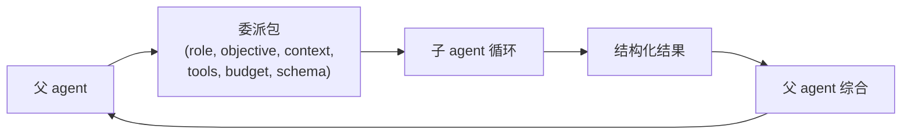
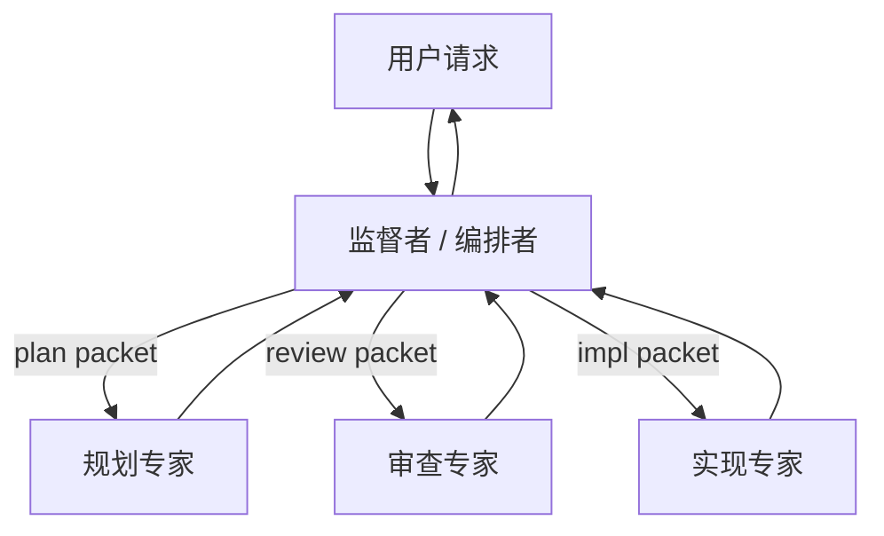

# 第 10 章 — 多 agent委派

## TL;DR

多 agent系统 (multi-agent system) 就是一个 agent (父 agent) 把另一个 agent (子 agent) 当作一个有边界的工作单元来运行。做得好，它能把一个子任务隔离开，让父 agent 的上下文保持干净，同时让子 agent 用上不同的工具集、模型或信任边界。做得砸，你得到的就是一句含糊的 *"调查一下这个"*——工具不设限、输出没有契约，然后你花一周时间去调试它。本章讲委派包 (delegation packet)、结果契约 (result contract)、同步 vs 异步与顺序 vs 并行这几种模式、递归上限和隔离模式、监督者 vs 专家两种拓扑，以及如何判断委派到底是不是该走的路，还是只是一次更贵的工具调用。

---

## 为什么这件事重要

第一次构建多 agent系统时，你会同时撞上三件事：子 agent 用掉的 token 比你预期的多，返回的文本比你想要的长，而且它做的决策你还没法审计。这三件每一件都是一次契约失败——委派包写得含糊、结果 schema 根本不存在、审计链路是隐式的。

但即便如此也值得学，原因在于第二次之后的回报：一次设计得当的委派，是让 agent 走向专门化的最便宜方式。父 agent 保持通用；子 agent 拿到一个收紧的角色、一个小工具集、一个适配任务的模型。整套系统会比一个无所不知的单 agent 更便宜，推理也更好。

---

## 概念

### 何时该委派 (何时不该)

下面这些条件至少满足一条，才考虑委派：

- 子任务需要 **自己的上下文** — 不同的 system prompt、不同的记忆、不同的关注点。
- 子任务应该 **隔离副作用** — 一个 worktree、一个 sandbox、一条独立的信任边界。
- 子任务想用 **不同的模型或工具集** — 便宜模型做一次窄查询，贵模型做深度推理。
- 子任务能跟其他子任务 **安全地并行** — 三个 review 并行跑，再做综合。

*不要* 委派的情况：

- 一个确定性工具就能回答这个问题。
- 一个 skill 就能教会父 agent 自己做。
- 子 agent 反正也需要父 agent 的全部上下文 (那等于上下文成本付了两遍)。
- 子任务太小，不值得再跑一遍模型循环 (委派本身有建立成本 — system prompt、工具列表、构造委派包)。

大多数团队都会跳过的、最划算的一项改进：问问自己，每次委派是不是在替代一次本来更便宜的工具调用。

### 委派包

父 agent 发给子 agent 的是一个 *包 (packet)*，而不是一整份对话记录：

```ts
type DelegationPacket = {
  role:            string;       // "researcher" | "reviewer" | "implementer" | ...
  objective:       string;       // the subtask, in prose
  context:         string;       // filtered slice, NOT the full parent transcript
  allowedTools:    string[];     // tighter than parent's
  constraints:     string[];     // "do not write outside /tmp", "max 10 file reads"
  maxSteps:        number;       // hard cap
  budget?:         { tokens?: number; cost?: number };
  outputSchema:    JsonSchema;   // what the result must look like
  remainingDepth:  number;       // delegation depth left (see Recursion caps)
};
```

几条来自生产实践的规则：

- **不要默认把父 agent 的对话记录整份倒过去。** 做个摘要，或者只挑出子 agent 真正需要的那几条消息。整份倒过去会推高 token 成本、扩大 prompt injection 的攻击面，也更容易让子 agent 偏离任务。
- **收紧工具列表。** reviewer 子 agent 只给只读工具。implementer 给写工具，但限定在某个 worktree 内。外部 researcher 给 web 工具，但不给 shell。
- **把剩余委派深度传下去。** 每 spawn 一次就减一。归零之后，不能再 spawn。



### 结果契约

返回的内容必须可校验。一段光秃秃的散文，就是一个迟早要炸的契约失败。生产系统通常会落到类似这样的形态：

```ts
type ResearchResult = {
  answer:       string;
  evidence:     Array<{ source: string; quote: string }>;
  uncertainty:  "low" | "medium" | "high";
  followups:    string[];
  toolsUsed:    string[];      // for audit (Ch.16)
  cost?:        number;        // for the parent's budget rollup
};

function validateAgainstSchema(result: unknown, schema: JsonSchema) {
  // Reject the subagent's output if it doesn't match.
  // Bad output is a recoverable error — the parent can retry
  // with a corrective prompt or fail loud.
}
```

结构化输出让父 agent 可以机械地处理它：校验 schema、给置信度打分、在多个兄弟结果之间比较、呈现给用户。非结构化输出则逼着父 agent 再调一次模型去解读 — 这就是每次委派背后那笔藏起来的第二份成本。

### 同步 vs 异步；顺序 vs 并行

两条正交的轴：

- **同步** — 父 agent 等着子 agent。多数生产部署都是这样 (OpenCode 的 `task` 工具、Hermes Agent 的 `delegate_task`)。
- **异步** — 子 agent 在后台线程或进程里跑。Hermes Agent 的 `spawn_background_review_thread` 是典型参考；Paperclip 的 heartbeat 调度在系统层面就是异步的。

- **顺序** — 父 agent 先委派 A，等它返回，再委派 B。A 的结果会塑造 B。
- **并行** — 父 agent 一次性 spawn A、B、C；三个各自独立跑；全部返回后父 agent 再做综合。

```ts
// Parallel, when inputs are truly independent.
const [api, ui, db] = await Promise.all([
  delegate(apiReviewPacket, ctx),
  delegate(uiReviewPacket, ctx),
  delegate(dbReviewPacket, ctx),
]);
const final = await synthesize([api, ui, db], ctx);

// Sequential, when one result shapes the next packet.
const investigation = await delegate(investigationPacket, ctx);
const patchPlan      = await delegate(buildPatchPlanPacket(investigation), ctx);
const final          = await synthesize([investigation, patchPlan], ctx);
```

并行省下的是实际耗时 (wall-clock time)；顺序保住的是推理的先后次序。两者混着用 — 收集阶段并行，综合阶段顺序。

### 递归上限与默认深度 1

一个能 spawn 自己子 agent 的子 agent，就是一场等着发生的栈溢出。生产里有三种模式：

- **默认深度 1** (生产里最常见的选择)：父 agent 可以 spawn 子 agent；子 agent 不能再往下 spawn。最安全、最简单，在没有具体需求逼你之前，就该从这里起步。
- **有界深度** (OpenClaw 取深度 5)：允许到一个小上限；耗尽就抛错。
- **拓扑上限** (Paperclip)：完全不允许在循环内 spawn；由调度器派发；agent 的父子关系作为数据来记录，而不是当成栈帧。

```ts
function assertCanSpawnChild(ctx: AgentContext) {
  if (ctx.remainingDelegationDepth <= 0) {
    throw new Error("Delegation depth exhausted; flatten or hand off via supervisor");
  }
}
```

一个微妙的坑：深度上限通常是按层数算的，但深度 N−1 上的两个子 agent 各自再 spawn 一个孩子，深度 N 上的实际工作量就翻倍了。如果你更在意成本而非嵌套层数，就改用 *基于成本* 的上限 — 算总共 spawn 出去的 token 数，而不是算嵌套层数。

### 隔离模式

每个 child 拿到的隔离级别：

| 模式 | 隔离的东西 | 成本 | 何时用 |
|---|---|---|---|
| **同一进程,共享内存** | 只有 system prompt 和工具集 | 最便宜 | 简短的专家查询 |
| **独立 session,共享 store** | Memory 命名空间、审计日志 | 低 | 多数子 agent 使用场景 |
| **Worktree** | 文件系统 (每个子 agent 一个 git worktree) | 中 | 不能动到主分支的代码编辑 |
| **Sandbox** | OS 级隔离 (Docker、Modal、Vercel) | 高 | 不受信任的执行 |
| **独立进程 / 适配器** | 完整进程边界 | 最高 | 不同 runtime;channel adapter 风格 |

OpenCode 支持 worktree 隔离。Hermes Agent 的工具环境 (`tools/environments/`) 在单个工具的粒度上支持 Docker、SSH、Modal、Vercel Sandbox。Paperclip 把每个 adapter 跑在独立进程里。这个选择本质上是信任与预算的权衡：隔离级别越高越贵，但也能兜住越多东西。

记忆和召回这一面 — 子 agent 能读到什么、能写入什么 — 由 Ch.06 (召回边界) 和 Ch.07 (write-back 边界) 覆盖。两边要选一致的答案；混合策略 (子 agent 什么都能读、但什么都不能写) 通常能跑通；反过来 (能写但不能读) 几乎从来跑不通。

### 在共享产物上并行工作

当多个子 agent 并行处理相关产物时 (三个 reviewer 同时看同一份代码库，两个 implementer 编辑同一份文档的不同段落)，要 *在 spawn 之前* 就选好协调形态。两种模式几乎覆盖了所有情况：

- **隔离编辑 + 综合时合并。** 每个子 agent 在自己的 worktree、sandbox 或命名空间里干活；父 agent 等所有人返回后再合并输出。冲突会以合并失败的形式浮现，并集中在单个点上解决 — 父 agent 的综合步骤 (编辑互不相交时做确定性合并)、reviewer 专家 (重叠但能干净合并时做语义合并)、或用户 (真有冲突时)。这是更安全的默认做法；它把冲突推到一个统一的解决点，而不是放任兄弟 agent 在共享状态上互相竞争。
- **共享 blackboard。** 一个小的结构化 store (一份 JSON 文件、一个 Redis hash、一行数据库记录)，兄弟 agent 在各自运行期间能读能写 — 用来做 *"我已经查过 `auth.ts` 了，跳过"* 这类协调很合适。blackboard 继承了 Ch.07 (原子写) 和 Ch.08 (CAS 转换) 的锁与 CAS 纪律；没有这些纪律的 blackboard，就是个伪装成协调模式的竞态条件。

专就编码 agent 而言，worktree 隔离 + 综合后合并这一步是已经确立的模式：每个子 agent 拿到自己的 checkout，父 agent 把各个 diff 并排检查，合并要么是确定性的 (没有重叠)，要么被抛出去等待解决 (检测到重叠)。放任并行子 agent 在同一份仓库状态上竞争，是多 agent编码里代价最高的一类 bug — 一堆局部的、互相矛盾的编辑，单看每个文件都合理，一集成就全炸。多开一个 worktree 的代价，远小于事后去拆这堆烂摊子的代价。

### 监督者 vs 专家拓扑

两种角色反复出现在各种系统里：

- **监督者 / 编排者 (supervisor / orchestrator)** 决定谁来跑，按什么次序，用什么输入。通常就是主 agent 循环本身。Paperclip 的 heartbeat 服务是控制面级别的监督者。
- **专家 (specialist)** 是一个职责范围收得很紧的子 agent，工具集窄、角色清晰 — `explore`、`review`、`summarize`、`extract`。专家不决定要做什么；那是监督者的事。



真正能扩展的模式：给你的专家起名字。每个专家有一个 system prompt、一个工具列表、一个结果 schema 和一句话描述。监督者按名字来挑。OpenCode 内置的 agent profile (`build`、`plan`、`general`、`explore`) 是典型参考；随着新的专家需求冒出来，通常你会按项目再加几个自定义 profile。

### 每个子 agent 的限制

父 agent 加在专家身上的每一条限制，同时也是 Ch.04 上的一次收益。只有三个工具的专家，system prompt 更短 (跨专家的 cache 复用就更多)。用便宜模型的专家，每次调用都更便宜。在大量委派累加之下，这些节省会复利滚动。

实务上：

- **工具。** 按角色给显式白名单；默认拒绝。(Ch.03 的元数据标志会告诉监督者，哪些工具对哪个专家是安全的。)
- **模型。** 窄任务用又便宜又快的；真正难的子问题才上推理模型。
- **记忆。** 按 Ch.06 来划定范围；通常读父 agent 的命名空间，写到自己的命名空间。
- **审批门。** 如果专家会做破坏性操作，它继承父 agent 的权限规则 — 这道门由 Ch.12 覆盖。

### 上下文交接

子 agent 最大的一笔成本，就是父 agent 传给它的那份上下文。三种模式，从最便宜到最丰富：

- **全新 system prompt + 仅传 objective。** 子 agent 从干净状态起步。最便宜。当 objective 本身就包含全部上下文时管用。
- **摘要式交接。** 父 agent 的压缩 (Ch.05) 把相关回合总结成一个 `<context>` 块。中等成本；多数情况下是对的选择。
- **过滤后的对话切片。** 父 agent 挑出最后 N 个回合，或所有匹配某个过滤条件的回合。最贵；留给子 agent 真的需要原始措辞的场景。

Ch.05 里有一条有用的规则：父 agent 那份 *压缩后的* 操作记录，通常比完整的审计日志更适合作为交接的起点 — 压缩这一步本身就已经替你选出了重要的东西。

### 子 agent 的输出纪律

一个本该一句话却写了好几段的专家，就是一处 token 泄漏。父 agent 要强制做到：

- **简短的最终答案。** 几句话，或者一个结构化对象。再长就是综合环节出了问题。
- **没有中间噪声。** 父 agent 默认不该在自己的 prompt 上下文里看到子 agent 的工具调用或推理过程 — 只看到最终答案。(OpenCode 的 `task` 工具就是这么做的；Hermes Agent 的 `StreamingContextScrubber` 把注入的记忆从父 agent 的视图里隐藏掉。) 这是一条 *prompt 上下文* 规则，不是 *审计* 规则：子 agent 的工具调用、推理和中间回合仍会被记录进审计日志 (Ch.05) 和 trace 管道 (Ch.16)，调试、回放、事后复盘都查得到。从父 agent 的 prompt 里隐藏，是为了省 token、让父 agent 保持专注；但永远不要对运维隐藏。
- **答案需要时附上证据引用。** 每一条承重的论断，都附上一个父 agent 能复核的来源。

那些被训练得言简意赅的专家，通常跟 Ch.05 的 summarizer 用的是同一套训练方式：system prompt 里写明目的、给出结构化输出 schema、综合步骤用低 temperature。模型做得到；前提是父 agent 得明确这么要求。

### 子 agent 的失败处理

子 agent 的失败可以分成三种、彼此可区分：

- **可恢复** (例如 schema 校验失败)。父 agent 用纠正性 prompt 重试，上限 1–2 次。
- **永久性** (例如工具不可用、凭据失效)。父 agent 把失败上报，要么换一个专家再试，要么向上抛给用户。
- **静默** (例如输出通过了校验，但答案是错的)。最难对付。防御手段藏在结果 schema 里 (置信度字段、引用、结构化字段)，以及交叉校验里 (派第二个子 agent 去 review 第一个)。

持续跟踪子 agent 的成功率。一个有 30% 时间在失败的专家，要么职责范围没设好，要么被指派到了不对的任务上；无论哪种，这都是一个 Ch.16 意义上、值得及早抓住的信号。

### 长跑控制面里的监督者

有一种模式值得单独拎出来讲，因为它看起来根本不像子 agent：一个 *活在* agent 循环 *之外* 的监督者，横跨多次运行。Paperclip 的 heartbeat 服务正是如此。它负责调度、重试、看护孤儿任务、强制预算，并把工作派给 agent。它监督的那些 "agent" 不是进程内子 agent — 而是可能持续数分钟到数小时的完整 agent 运行。

这种模式对那些工作寿命超过单次 agent 调用的生产系统很重要：长时运行的自动化、多步审批、异步用户交互。监督者是持久层；agent 是干活的 worker。Ch.08 的持久化和状态机就是它立足的地基。把监督者本身也当成一次 Ch.08 的运行来对待：状态机、原子认领、heartbeat、reaper。

### 后台子 agent

最简单的非阻塞委派：一个守护线程，在一次成功回合之后运行，把结果回写到记忆或 skill 里。Hermes Agent 的后台 review fork 是典型参考 (Ch.07 从记忆写入的角度覆盖了它)。用它来做 *"决定要不要从这次会话里记住点什么"* 或 *"在后台把今天的工作总结一下"* — 别拿它做用户正在等待的事。

要守住的约束：

- 后台子 agent 应该用不同的模型 (通常更便宜)。
- 受限的工具集 — 一般只给记忆和 skill 工具。
- 它们的结果在 *下一次会话* 才可见，而不是这一次。Ch.04 的 cache 规则在这里反向适用：不要从后台进程去改动正在运行的 prompt。

### 校验与交叉检查

一种较新的模式，在参考系统里还没普及，但值得点出来：spawn 一个 *第二个* 子 agent，它唯一的工作就是基于同一份上下文去 review 第一个 agent 的输出。reviewer 专家拿到原始 packet 加上第一个子 agent 的结果，返回 *approve* 或 *这个答案有问题*。这是对抗静默失败的一份便宜保险。

两点实务：reviewer 的工具集要比 worker 更收紧 (通常只读)，预算只给到 worker 的一小部分 — 一个比它所 review 的工作还贵的 reviewer，不值得这一次调用。

---

## 真实系统笔记

- **OpenCode** 给出了最干净的进程内委派参考：一个 `task` 工具，用过滤后的上下文 spawn 出子 session，再用一个 `Agent.Service.handleSubtask` 流程向父 agent 返回单一的结构化观察结果。内置的 `build` / `plan` / `general` / `explore` profile 展示了监督者/专家的分工。
- **Hermes Agent** 是两种风格的双重参考：同步的 `delegate_task` 做内联子 agent，异步的 `spawn_background_review_thread` 做后台子 agent，配一份收得很紧的工具白名单。
- **Paperclip** 是控制面模式的代表：一个监督者 (heartbeat 调度器) 把 issue 路由给各个 agent，跟踪 `parent_run_id` 血缘，并跨多次运行强制预算和审批。恢复任务可以通过 `assigneeAdapterOverrides` 申请一个更轻的模型 — 也就是在编排层为每个子 agent 单独做模型选择。
- **OpenClaw** 把 channel adapter 当成一种跨进程边界的委派形式：入站消息被派发到底层的 agent runtime；adapter 就是那条边界。对于 *"子 agent 是另一个进程"* 这种情形，它是个有用的参考。

---

## 与你的 agent 结对

几个在本章上效果不错的 prompt：

- *"对我现在调用的每一个工具，判断它该继续做一个工具，还是改成委派给某个专家子 agent。套用本章的四条标准，并解释每个判断。"*
- *"为我的项目设计两个专家子 agent：一个 `reviewer` (只读、便宜模型、简短结构化输出) 和一个 `implementer` (worktree 隔离、贵模型)。把两个 system prompt 和结果 schema 都写出来，再加上决定何时调用哪个的监督者逻辑。"*
- *"把本章的委派包接进我的代码库。加上 `remainingDepth` 字段和 `assertCanSpawnChild` 守卫。写一个测试，证明深度 2 的嵌套 spawn 会带着有用的错误信息干净地失败。"*
- *"挑一个我的多步研究任务，把它重构成并行委派加上末尾一个综合步骤。把它的实际耗时和总成本跟顺序版本对比一下。"*
- *"从上周挑三个我常见的子 agent 失败案例。把每个分类为可恢复 / 永久性 / 静默。针对每一类，写出父 agent 端的处理代码，并展示它产生的审计链路。"*
- *"加一个后台 review 子 agent，在每次成功回合之后运行，工具白名单为 `{memory, skill_manage}`。确保它写入的内容只在下一次会话才对父 agent 可见 (Ch.04 规则)。用前缀 fingerprint 来验证。"*
- *"为我的 agent，按专家维度记录过去一个月的子 agent 成功率。如果哪个专家的失败率超过 20%，就建议要么收紧职责范围，要么换模型。"*
- *"实现一个 reviewer 子 agent，在我的 `implementer` 专家的输出返回父 agent 之前先做一道双检。reviewer 的预算定在 implementer token 花费的 30%；如果 reviewer 不同意，就拒绝并重试。"*

---

## 接下来

现在你有了一个会做规划的父 agent，一套把子 agent 的工作表达成有界委派包的方式，以及让委派保持聚焦的纪律。Ch.11 会把 Ch.01–10 的所有东西拼成一个 harness — 循环、工具注册表、prompt 构建器、记忆层、持久化引擎、planner、委派面 — 拼进一个可以适配你技术栈的可组合架构里。
