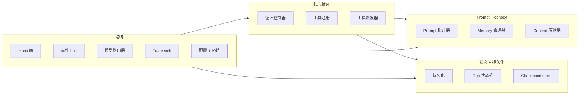
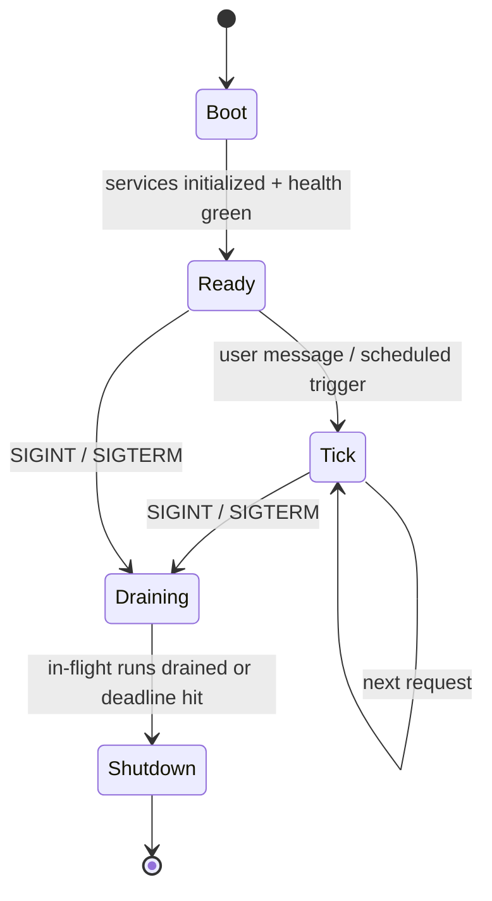
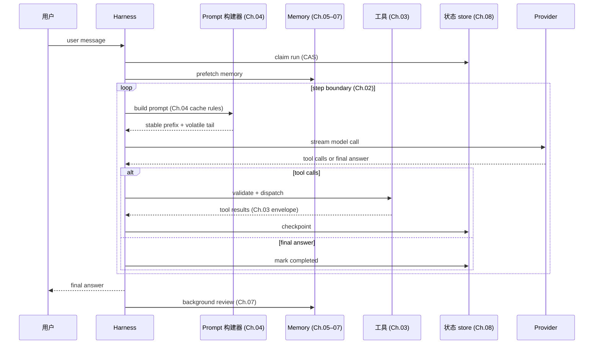

# 第 11 章 — Agent harness

## TL;DR

Harness 是模型周围的 runtime。Ch.01–10 的每一章都在讲它的一块：循环、工具、prompt、memory、持久化、规划、委派。本章是把这些块组合成一个单独的程序：清晰的生命周期 (bootstrap → tick → shutdown)、定义良好的 hook 扩展面、不会泄露密钥的配置模型，以及 harness 本身与使用它的应用代码之间的干净边界。模型带来判断；harness 带来结构。读完本章，你应该能看任何生产 agent 都能指出它的组件、生命周期，以及哪里能插进什么。

---

## 为什么这件事重要

知道什么是 harness，能让你避开三种失败模式。

第一种：你把 tool 派发器内联写进循环，把 prompt 构建器内联写进派发器，把 memory 层内联写进 prompt 构建器。六周之后,任何一块都没法在不破坏其他块的情况下扩展。Harness 存在,是为了让每一章的组件都有干净的接口和已知的归宿。

第二种：你有很棒的组件,却没有生命周期。DB 在第一次 tool call 之后才连上，plugin loader 在第一次模型调用之后才跑，heartbeat 在 migration 完成之前就启动了。Harness 定义启动顺序，让这些事不再是惊吓。

第三种 — Anthropic 在他们的 long-running-apps 文章里说得好：*harness 里每一个组件都编码了一种关于模型自身做不到什么的假设。* 没有这个框架，harness 会在底层模型早已不需要的功能上继续堆。Harness 不是永久的纪念碑;它是脚手架,应该随模型演进而演进。

---

## 概念

### 什么是 harness,什么不是

Harness 拥有：循环、prompt 构建器、工具注册和派发器、memory 管理器、持久化层、hook 系统、bus、模型路由器。再加上把它们都连起来的生命周期。

Harness *不* 拥有：agent 信什么、它积累哪些具体 skill、具体工具的 prompt、解决哪些任务的业务逻辑。那些是应用代码。同一个 harness 应当能今天托管一个 explore agent、明天一个客服 agent、下周一个分析师 agent — harness 本身一点都不用变。

一条有用的规则：如果移除某个特性会破坏 *这个系统能解决什么任务*,那是应用代码。如果移除会破坏 *这个系统怎么跑起来*,那是 harness。Paperclip 是这种拆分最干净的参考 — Paperclip 自己不调模型;它 spawn adapter 进程 (应用) 并编排它们。OpenCode 把 server / services (harness) 和 agent definitions (应用) 同样地拆开。

### 组件清单

每个生产 harness 都有的十个 service,再加几个可选的：



每一块都是你已经读过的一章。Ch.01 — 循环主体；Ch.02 — 循环控制器；Ch.03 — 工具注册 + 派发器；Ch.04 — prompt 构建器；Ch.05 — memory 管理器 + 压缩器；Ch.06–07 — memory store + writer；Ch.08 — 持久化 + run state + checkpoint store；Ch.09 — planner (在循环之上的一层)；Ch.10 — 委派 (监督者活在循环里,专家由它 spawn 出来)。Hook、bus、router、trace sink 和 config 是横切的管线 — 接下来讲。

Harness 就是这张图。各章是各块。

### 组合：service 如何接线

三种模式在生产 harness 里反复出现,大致按形式化程度递增：

- **闭包工厂。** 每个 service 是一个函数,接受它的依赖,返回一个带方法的对象。接线在 `main` / `app.ts` 里做一次。Paperclip 这么干 — 小、显式、用 fake 替换很容易测。
- **Service 注册。** 组件在启动时把自己注册到一个有类型的注册表;消费者按名字查找。当类似的东西很多 (工具、agent、provider) 时有用。
- **分层 DI。** 每个 service 通过类型签名声明依赖;runtime 按顺序解析。OpenCode 用 Effect 的 `Layer.effect` 就是干这个。

挑一种,坚持下去。最烂的 harness 是那种三种都掺 — 一些 service 注入、一些注册、一些当单例 import。service 在构造时是 async 还是同步同理：挑一个约定,守住。

```ts
// A typed harness — services as fields, all dependencies explicit.
type Harness = {
  config:        Config;
  bus:           EventBus;
  hooks:         HookRunner;
  tracer:        TraceSink;
  prompt:        PromptBuilder;     // Ch.04
  memory:        MemoryManager;     // Ch.05–07
  tools:         ToolRegistry;      // Ch.03
  loop:          LoopController;    // Ch.02
  state:         RunStateStore;     // Ch.08
  checkpoints:   CheckpointStore;   // Ch.08
  router:        ModelRouter;       // Ch.17 (forward)
};
```

### 生命周期：bootstrap、tick、shutdown



三个阶段,每个都有自己的规则。多数 harness bug 活在阶段边界上 — 在 boot 完成前使用 service、drain 开始后还接受请求、shutdown 不等 run 状态机 checkpoint。

### Bootstrap 顺序

启动顺序不是随意的 — 每一步依赖前一步。跨生产系统都能跑通的顺序：

1. 加载并解析配置文件 (带 env-var 覆盖)。
2. 校验 config schema;errors 早失败,把 *所有* error 一次性曝光。
3. 替换 env var,解析 `$secret:` 引用。
4. 打开数据库;跑任何挂起的 migration。
5. 初始化存储 service (session、对话记录、memory store)。
6. **发现 plugin**,从内置路径和用户路径;加载每个 plugin 的 *manifest* — 它贡献的工具、agent profile、hook handler 和命令 — 还不激活。
7. 按确定性顺序构建工具注册：内置、然后 plugin 贡献、然后 config 声明 (Ch.04 的 cache 规则适用 — 顺序在 boot 时固定,运行时不变)。
8. 同样地构建 agent 注册：内置 profile、然后 plugin profile、然后 config profile。
9. **激活 plugin hook**,基于现在稳定的注册;这是第二遍。
10. 启动可选子系统 (调度器、MCP server、WebSocket bus、cron)。
11. 跑健康检查 — DB 可达、模型 provider 可达、plugin 握手 OK。
12. 翻起 readiness 标志;开始接收流量。

两遍式结构是承重的细节。Plugin 给工具和 agent 注册做 *贡献*,所以注册不能在 plugin manifest 加载之前构建;但 plugin hook 需要 *面对一个稳定的注册* 触发,所以它们不能在注册构建之前激活。把 plugin 加载拆成 discover-manifest (第 6 步) 和 activate-hooks (第 9 步) 是解开这个依赖最简单的办法,也不至于让注册在运行时可变 (那会破坏 Ch.04 的 cache 稳定性)。

两个值得区分的标志：*liveness* (进程还活着吗?) 和 *readiness* (它在接受流量吗?)。它们是给负载均衡器或监督者看的不同信号。混淆它们是 agent 系统部署时一半故障的来源。

### 一次 tick,端到端

一次 tick = 一条用户消息 → 一个最终答案。每一章的贡献都出现：



每一个箭头都是 hook 点。Pre- 和 post-LLM hook 夹住模型调用。Pre- 和 post-tool hook 夹住派发。session-start 和 session-end hook 夹住整个 tick。Plugin 通过在这些点上注册 handler 来扩展 harness,而不需要改动循环。

### 优雅 shutdown

一个信号 handler — SIGINT 或 SIGTERM — 把 harness 翻进 draining 模式。Drain 期间：

- 拒绝新请求 (或排队,看策略)。
- 在飞行中的 run 拿到一个 deadline (通常几分钟) 来到达一个 step 边界并干净地 checkpoint。
- Deadline 过后,幸存的 run 在状态机里被标为 `cancelled` (Ch.08);它们的 lease 会被下个 instance 的 reaper 回收。
- 挂起的 background-review fork 要么 join,要么标记 abandoned。
- 数据库连接池排空;bus 关闭;进程退出。

跳过优雅 shutdown 的成本是看不见的,直到某天一次部署打断了十个长跑 agent session;下个 instance 还得搞清楚发生了什么。Ch.08 的 reaper 覆盖恢复;本章覆盖 *预防*。

### Hook 面

Hook 是 harness 的扩展 API。六个生命周期点能覆盖多数生产需求：

| Hook | 触发时机 | 用途 |
|---|---|---|
| `pre_session` | session 开始时一次 | 注入身份、设命名空间、启动预取 |
| `pre_llm_call` | 每次模型调用之前 | 最后一次 prompt 改动、门控、脱敏 |
| `post_llm_call` | 每次模型调用之后 | token 计数、脱敏、plan 抽取 |
| `pre_tool_call` | 每次工具派发之前 | 权限检查 (Ch.12)、参数变形 |
| `post_tool_call` | 每个工具返回之后 | 脱敏密钥、附加元数据、记录 |
| `post_session` | session 结束时一次 | 后台 review (Ch.07)、成本汇总、归档 |

Harness 按注册顺序触发每个 hook,传一个有类型的 context 对象。Plugin 返回一个指令 (`continue`、`modify`、`deny`) 和任何副作用 (日志、事件) — 这些通过 harness 走,而不是直接改共享状态。Hermes Agent 和 OpenClaw 都是这种方式注册 hook;OpenCode 的 bus-event 模型是近亲。

来自生产的两条规则：

- **Hook 必须幂等。** 重试的 step (Ch.08) 会再次触发同样的 hook。如果 hook 写 counter,用幂等 key 做递增。
- **Fail-open 还是 fail-closed 取决于 hook 的工作。** *观察型* hook (tracing、metrics、单纯日志、事后变形) 是 fail-open：失败被记录,循环继续。*门控型* hook — 安全 (Ch.18)、审批 (Ch.12)、脱敏、policy — 必须 fail-closed：审批 hook 失败意味着动作 *没* 被批准;脱敏 hook 失败意味着未脱敏的字节永远到不了下一阶段;policy hook 失败意味着操作被拒。注册时给每个 hook 标记它的失败语义;harness 按标记路由失败。把所有 hook 默认 fail-open 是一种伪装成韧性的漏洞。

### Provider 抽象 (以及它的泄漏)

Harness 把 provider 包在一个统一接口后面,让循环、工具和 prompt 不在意是哪个。实际上这是一个 *leaky* 抽象,有三个已知的洞：

- **工具 schema 格式** 因 provider 而异 (Anthropic 用 `input_schema`;OpenAI 用 `function.parameters`)。Adapter 在入口处规整。
- **流事件** 不同 (Anthropic 发 `content_block_delta` 和 `tool_use`;OpenAI 发 `choice.delta.tool_calls[i].function.arguments` 片段)。每个 provider 有自己的传输 adapter。
- **Cache control 语法** 因 provider 而异 (Ch.04 详细覆盖 Anthropic 的显式标记和 OpenAI 的自动前缀形态)。只在拥有它的 adapter 里应用;不支持标记的 provider 直接透传。

```ts
// A clean provider interface lives behind every harness's loop.
// metadata() is capability negotiation — the harness asks what the
// provider supports and adapts requests, rather than hard-coding it.
interface ModelProvider {
  stream(req: ModelRequest): AsyncIterable<ProviderEvent>;
  countTokens(text: string): number;
  metadata(): {
    contextWindow:             number;
    maxOutput:                 number;
    supportsCacheControl:      boolean;
    supportsParallelToolCalls: boolean;
    supportsStructuredOutputs: boolean;
    supportsHostedTools:       boolean;
    refusalShape:              "block" | "finish_reason" | "none";
  };
}
```

这就是 *capability negotiation*：不写死每个 provider 支持什么,harness 在 boot (以及配置 reload) 时读取 metadata,据此路由/适配。新的 provider 能力到来,不需要改代码;缺失的能力以 router 拒绝把请求路由到那个 provider 的形式浮出来,而不是在循环深处变成 runtime 错误。

Harness 通过模型路由器挑 provider (Ch.17 的领地);循环只看到接口。当一个 provider 失败,router 回退到下一个 *兼容的* — 同样的工具 schema 方言、至少能容下这一回合 context 的窗口、推理和 policy 的等价 (Ch.02 在循环错误处理规则里讲过这种纪律)。一个缺少主 provider 能力的回退不是回退;那是另一种失败模式。凭据池 (在 429 时轮换 API key) 也活在 router 里 — Hermes Agent 和 Paperclip 都实现了。

### 配置

Harness 的配置面通常这样：

- **文件。** YAML、JSON 或 TOML;启动时加载一次。热加载是可选的,而且有风险 — 它会通过中途改动工具描述破坏 cache (Ch.04)。
- **Env-var 覆盖。** 每个 key 都能被 env var 覆盖。Env 胜过文件。用有文档的前缀命名约定;随手不带前缀的 env var 会变成调试陷阱。
- **密钥引用。** 敏感值存别处 — 钥匙串、AWS Secrets Manager、加密文件。Config 里只放 `$secret:NAME` 指针,runtime 解析;密钥永远不出现在加载后的 config 对象里。
- **Schema 校验。** Pydantic、zod、JSON Schema — 挑一个。启动时校验失败就退出,把 *所有* error 一次性曝光。Config 无效时 agent 不该启动。
- **Plugin 贡献。** Plugin 能用自己的 key 扩展 schema,加载时合并。

一个值得提前防的常见 bug：把一个已解析过密钥的 config 值写回磁盘。Serializer 应该重新发射 `$secret:` 引用,绝不输出解析后的值。用单元检查测一下 — 序列化后去 grep 已知的密钥串。

### Session、run、subagent — 词汇

四个工作单元术语反复出现;把它们的含义钉死,让代码和文档对齐：

- **Session** — 一个工作区里、一个 channel 上、一个参与者的一次对话线。有稳定 ID;持久化对话记录 + 状态;可以恢复 (Ch.08)。
- **Run** — 循环的一次调用。有开始、结束、最终状态 (succeeded / failed / cancelled)。一个 session 在生命周期里包含很多 run。
- **Subagent** — 父 agent spawn 的子 run (Ch.10)。看到父 agent context 的过滤切片;返回单个观察。
- **Heartbeat** — 控制面用的唤醒 tick (Paperclip)：监督者定期醒来,看每个 session 有没有事做。一次 heartbeat 可能产生一次 run,也可能不产生。

OpenCode 的 `SessionID` 和 `RunID` branded type 是把这些区分清楚的最干净参考;Paperclip 的 `issues` / `heartbeat_runs` / `agent_task_sessions` schema 是最详尽的。

### Instance 状态与租户 scope

服务超过一个项目、用户或租户的 harness 需要 *instance 状态* — service 按项目而不是全局 scope。OpenCode 的 `InstanceState.make()` 是这个模式：service 按 `(project, agent)` 组合懒构造、缓存。Paperclip 的多租户走得更远 — 每张表都有 `company_id`,每次查询都带它。

能扩展的形态：在 harness 每次操作的边界,按当前 `(tenant, project, agent)` 查到 instance,然后通过它路由。永远不要从请求 handler 里直接探进全局 service。会反咬一口的泄漏是：因为一个全局单例被共享,A 用户看到了 B 用户的 memory。Ch.06 的命名空间规则和 Ch.08 的租户 scope 状态机都依赖这条纪律。

### Bus 与流式面

生产 harness 把这两个相邻的关注点分开：

- **内部事件 bus** 让 plugin 和可观测性订阅 harness 事件 (`session_started`、`tool_completed`、`run_failed`),而不改共享状态。多数 harness 跑一个简单的进程内 pub/sub;bus 默认 *不* 持久 — 需要在重启后存活的事件单独持久化 (Ch.08)。
- **流式面** 把 token、tool 事件、状态更新送到 UI (TUI、web、CLI)。Server-sent events 和 WebSocket 都常见。Harness 把 bus 事件按 session 过滤后扇出给连上来的客户端。

把两者分开。Bus 是进程内 pub/sub;流式面是网络面。混在一起会产生别扭的耦合 — 每个 UI 事件都变成一个全局 bus 事件,bus 在负载下变成序列化点。

### Health 与 readiness

从第一天就值得发布的两个 probe：

- **Liveness** — 进程整个还活着吗?便宜：一个不依赖任何东西的 HTTP 200。
- **Readiness** — harness 准备好服务真实流量了吗?检查 DB、模型 provider (用一个缓存一分钟的小测试调用,避免把它打挂)、plugin 握手,以及启动时任何关键 hook error。

第一个月就能赚回成本的三个 metric：活跃 run 数、队列深度、每分钟 error 率。这些属于 Ch.16 的 trace 管道,但从一开始就在 harness 层接好是值得的。

### 更简单的 harness 老得更好

Anthropic 的 *Harness design for long-running agentic applications* 文章给出了一条有用的规则：*harness 里每一个组件都编码了一种关于模型自身做不到什么的假设。* 模型变好,那些假设就变弱。上季度赢得位置的组件,这季度可能是不必要的开销。

两个实务后果：

- **每年审计你的 harness。** 对每个组件问：*现在的模型还需要它吗?* 移除那些不再值回票价的。Anthropic 提到他们移除了 "sprint" 分解层,因为更强的模型不需要它就能处理更长的连贯工作。
- **加复杂度也用同样的纪律。** 每个新 harness 组件应该解决一个 *测得到的* 失败模式,不是理论上的。投机加上去的组件几乎从来不会被移除。

目标不是最复杂的 harness。目标是能可靠承载你工作负载的最简 harness。本章的模式是一份 *可用* 清单,不是一份必须 *存在* 的清单。

---

## 真实系统笔记

- **OpenCode** 是端到端 embedded harness 最强的参考：用 Effect Layer 做类型化 service 组合,干净的 session/run 拆分,按 provider 家族的传输 adapter,SSE 事件 bus,以及每个项目一个 `InstanceState` 的模式。当作 coding agent 的 "默认" harness 形状来读。
- **Hermes Agent** 是 harness + gateway 拆分的参考：内核 agent 循环独立于 channel adapter (Telegram、CLI、cron),所以同一个 harness 能服务很多 surface。Plugin hook 面 (`pre_llm_call`、`post_tool_call` 及朋友们) 形态良好,值得借鉴。
- **Paperclip** 是控制面 harness：它不直接调模型;它通过 heartbeat 调度器编排 *其他* harness (adapter 进程),带显式 run-state 机、原子认领、reaper (Ch.08)。多租户、多进程生产部署最强的参考。
- **OpenClaw** 在个人助理 harness 之上交付了最干净的 channel-gateway 抽象 — gateway/harness 边界的特定研究值得读。

一个开源仓库之外的指针：Anthropic 的 *"Harness design for long-running agentic applications"* (anthropic.com/engineering) 是关于 context reset vs. compaction (Ch.05 的领地)、evaluator agent (Ch.10 的校验模式) 以及 "harness 复杂度应跟随模型能力" 这个原则的最佳短读。

---

## 与你的 agent 配对

几个对本章效果好的 prompt：

- *"画出我现在 agent 代码的组件图。指出每个组件实现的是 Ch.01–10 的哪一章,并标记任何在一个文件里实现两章关注点的地方。"*
- *"把我 agent 的启动代码重排成本章的 bootstrap 顺序。验证 health 和 readiness 能独立失败 — 给我看一个 readiness 检查失败但进程没死的例子。"*
- *"接通六个生命周期 hook (`pre_session`、`pre_llm_call`、`post_llm_call`、`pre_tool_call`、`post_tool_call`、`post_session`)。加一个样例 plugin,把每个事件带耗时记录下来。验证 plugin 加上不用改循环。"*
- *"实现优雅 shutdown：SIGINT 触发 drain 模式,在飞行 run 有最多 60 秒完成,还在跑的标记 cancelled (Ch.08)。用一个故意卡住的 run 验证。"*
- *"把我的 provider 集成重构成 `ModelProvider` 接口,每个家族一个 adapter。确认循环现在能基于一个无网络的 mock provider 编译。用 mock 跑单元测试。"*
- *"按 Anthropic 的规则审计我的 harness：'每个组件都编码了模型自身做不到的假设'。对每个组件,说出那个假设。基于当前前沿模型能可靠做到的事,提议一个可以移除或简化的组件。"*
- *"加上租户 scope：每个碰状态的 service 都接受一个租户 context。写一个测试证明租户 A 的请求碰不到租户 B 的 session、memory 或 run state。"*
- *"搭好 harness 的事件 bus 和一个监听它的 SSE 流式端点。给我看一个 session,其 token 实时流到浏览器,同时 plugin 在 bus 上订阅同样的事件。"*

---

## 接下来

你现在有了架构、生命周期和扩展面。剩下的章节加上生产 agent 出厂所需的层：human-in-the-loop 审批 (Ch.12)、connector 和 MCP (Ch.13)、把 skill 和 subagent 设计作为一个单元 (Ch.14)、后端基础设施 (Ch.15)、可观测性 (Ch.16)、成本与延迟策略 (Ch.17)、安全与对抗性输入 (Ch.18) 和运维 (Ch.19)。每一个都是一个组件或关注点,接在你现在拥有的 harness 形态之上。

Ch.12 接下来：在高风险动作之前,暂停循环并询问人的那道门。
