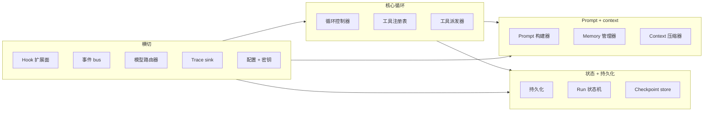
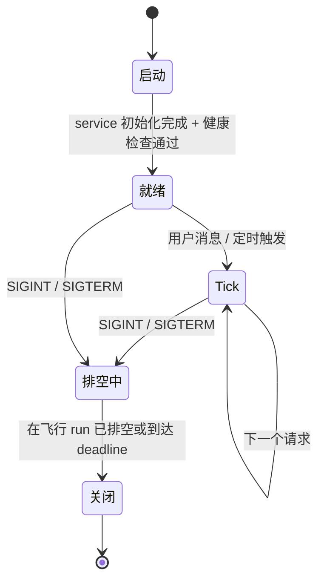
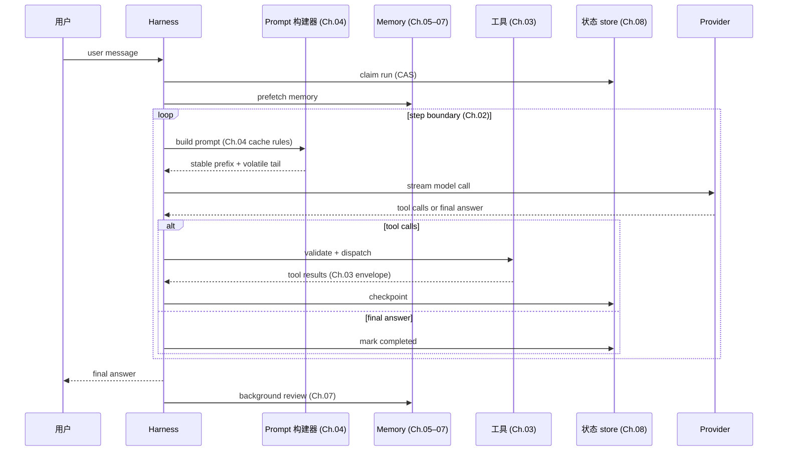

# 第 11 章 — Agent harness

## TL;DR

Harness 是包在模型外面的 runtime。Ch.01–10 的每一章讲的都是它的某一块：循环、工具、prompt、memory、持久化、规划、委派。本章要做的，是把这些块组合成一个完整的程序：有清晰的生命周期 (bootstrap → tick → shutdown)、定义良好的 hook 扩展面、不泄露密钥的配置模型，以及 harness 本身与使用它的应用代码之间一道干净的边界。模型负责判断，harness 负责结构。读完本章，你应该能拿任何一个生产 agent，说清它有哪些组件、生命周期是怎样的，以及什么东西插在什么地方。

---

## 为什么这件事重要

知道什么是 harness，能让你避开三种失败模式。

第一种：你把工具派发器内联写进循环，把 prompt 构建器内联写进派发器，再把 memory 层内联写进 prompt 构建器。六周之后，你想扩展其中任何一块，都绕不开破坏其他几块。Harness 存在的意义，就是让每一章的组件都有干净的接口和明确的归宿。

第二种：你有一堆很棒的组件，却没有生命周期。DB 直到第一次工具调用之后才连上，plugin loader 直到第一次模型调用之后才跑，heartbeat 却在 migration 还没完成时就启动了。Harness 定义出一套启动顺序，让这类事情不再冷不防地冒出来。

第三种 — Anthropic 在他们那篇 long-running-apps 文章里说得好：*harness 里每一个组件，都编码了一条关于"模型自己做不到什么"的假设。* 没有这层框架，harness 就会在底层模型早已不再需要的功能上不断堆砌。Harness 不是一座永久的纪念碑，它是脚手架，应该随着模型一起演进。

---

## 概念

### 什么是 harness,什么不是

Harness 拥有的是：循环、prompt 构建器、工具注册表和派发器、memory 管理器、持久化层、hook 系统、bus、模型路由器，以及把它们全都连起来的生命周期。

Harness *不* 拥有的是：agent 相信什么、它积累了哪些具体技能 (skill)、各个工具的 prompt、该解决哪些任务的业务逻辑。这些都属于应用代码。同一个 harness 应当能今天托管一个探索型 agent、明天托管一个客服 agent、下周再托管一个分析师 agent —— 而 harness 本身一点都不用改。

有一条好用的判断规则：如果移除某个特性会破坏 *这个系统能解决什么任务*，那它就是应用代码；如果移除它会破坏 *这个系统到底还能不能跑*，那它就是 harness。Paperclip 是这种拆分最干净的参考 —— Paperclip 自己根本不调模型，它 spawn 出 adapter 进程 (即应用) 并对它们做编排。OpenCode 也是同样的拆法，把 server / services (harness) 和 agent definitions (应用) 分开。

### 组件清单

每个生产 harness 都有的十个 service，外加几个可选的：



每一块都对应你已经读过的某一章。Ch.01 — 循环主体；Ch.02 — 循环控制器；Ch.03 — 工具注册表 + 派发器；Ch.04 — prompt 构建器；Ch.05 — memory 管理器 + 压缩器；Ch.06–07 — memory store + writer；Ch.08 — 持久化 + run state + checkpoint store；Ch.09 — planner (架在循环之上的一层)；Ch.10 — 委派 (监督者活在循环里，专家由它 spawn 出来)。Hook、bus、router、trace sink 和 config 则是横切的管线 —— 下面就讲。

Harness 就是这张图，而各章讲的是图里的各块。

### 组合：service 如何接线

有三种模式在生产 harness 里反复出现，大致按形式化程度由低到高排列：

- **闭包工厂 (closure factory)。** 每个 service 是一个函数，接收它的依赖，返回一个带方法的对象。接线只在 `main` / `app.ts` 里做一次。Paperclip 就是这么干的 —— 小、显式，传 fake 进去就能轻松测试。
- **Service 注册表。** 组件在启动时把自己注册到一个带类型的注册表，消费者按名字查找。当同类的东西很多 (工具、agent、provider) 时很有用。
- **分层 DI。** 每个 service 通过类型签名声明自己的依赖，runtime 按顺序逐层解析。OpenCode 用 Effect 的 `Layer.effect` 干的正是这件事。

挑一种，然后坚持到底。最烂的 harness 就是三种混着用的那种 —— 有的 service 靠注入、有的靠注册、有的当单例直接 import 进来。service 在构造时是异步还是同步，也是同一个道理：定下一个约定，守住它。

```ts
// A typed harness — services as fields, all dependencies explicit.
type Harness = {
  config:        Config;
  bus:           EventBus;
  hooks:         HookRunner;
  tracer:        TraceSink;
  prompt:        PromptBuilder;     // Ch.04
  memory:        MemoryManager;     // Ch.05–07
  tools:         ToolRegistry;      // Ch.03
  loop:          LoopController;    // Ch.02
  state:         RunStateStore;     // Ch.08
  checkpoints:   CheckpointStore;   // Ch.08
  router:        ModelRouter;       // Ch.17 (forward)
};
```

### 生命周期：bootstrap、tick、shutdown



三个阶段，每个都有自己的规则。多数 harness bug 都藏在阶段与阶段的边界上 —— 在 boot 还没完成时就用了某个 service、drain 已经开始却还在接受请求、shutdown 时不等 run 状态机做完 checkpoint。

### Bootstrap 顺序

启动顺序不是随便排的 —— 每一步都依赖前一步。下面这套顺序在各类生产系统里都能跑通：

1. 加载并解析配置文件 (带 env-var 覆盖)。
2. 校验 config schema；出错就尽早失败，并把 *所有* error 一次性全部曝光。
3. 替换 env var，解析 `$secret:` 引用。
4. 打开数据库；跑掉任何挂起的 migration。
5. 初始化存储类 service (session、对话记录、memory store)。
6. **发现 plugin**，扫描内置路径和用户路径；加载每个 plugin 的 *manifest* —— 也就是它贡献的工具、agent profile、hook handler 和命令 —— 但先不激活。
7. 按确定性顺序构建工具注册表：先内置、再 plugin 贡献、最后 config 声明 (这里适用 Ch.04 的 cache 规则 —— 顺序在 boot 时就定死，运行时不再变)。
8. 用同样的方式构建 agent 注册表：先内置 profile、再 plugin profile、最后 config profile。
9. **激活 plugin hook**，让它们面向现在已经稳定的注册表运行；这是第二遍。
10. 启动可选子系统 (调度器、MCP server、WebSocket bus、cron)。
11. 跑健康检查 —— DB 可达、模型 provider 可达、plugin 握手 OK。
12. 翻起 readiness 标志，开始接收流量。

这套"两遍式"结构是这里的承重细节。Plugin 要向工具注册表和 agent 注册表做 *贡献*，所以注册表不能在 plugin manifest 加载之前就构建好；但 plugin hook 又需要 *面向一个已经稳定的注册表* 来触发，所以它们也不能在注册表构建之前就激活。把 plugin 加载拆成"发现 manifest"(第 6 步) 和"激活 hook"(第 9 步) 两步，是解开这个依赖最简单的办法，而且不必让注册表在运行时变成可变的 (那会破坏 Ch.04 的 cache 稳定性)。

有两个值得区分的标志：*liveness* (进程还活着吗?) 和 *readiness* (它在接受流量吗?)。这是给负载均衡器或监督者看的两个不同信号。把它们混为一谈，是 agent 系统部署期间一半故障的根源。

### 一次 tick,端到端

一次 tick = 一条用户消息 → 一个最终答案。每一章的贡献都会在这里露面：



每一根箭头都是一个 hook 点。Pre-LLM 和 post-LLM hook 一前一后夹住模型调用，pre-tool 和 post-tool hook 夹住派发，session-start 和 session-end hook 则夹住整个 tick。Plugin 只要在这些点上注册 handler 就能扩展 harness，完全不用改动循环。

### 优雅 shutdown

一个信号 handler —— SIGINT 或 SIGTERM —— 把 harness 切进 draining 模式。Drain 期间：

- 拒绝新请求 (或排队，视策略而定)。
- 给在途的 run 一个 deadline (通常几分钟)，让它跑到一个 step 边界、干净地做完 checkpoint。
- Deadline 一过，还活着的 run 就在状态机里被标为 `cancelled` (Ch.08)，它们的 lease 会被下一个 instance 的 reaper 回收。
- 挂起的 background-review fork 要么 join 掉，要么标记为 abandoned。
- 数据库连接池排空，bus 关闭，进程退出。

省掉优雅 shutdown 的代价，平时一点都看不出来 —— 直到某天一次部署打断了十个长跑的 agent session，下一个 instance 还得费劲搞清楚到底发生了什么。Ch.08 的 reaper 负责的是事后恢复，本章负责的是 *事前预防*。

### Hook 扩展面

Hook 是 harness 的扩展 API。六个生命周期点足以覆盖多数生产需求：

| Hook | 触发时机 | 用途 |
|---|---|---|
| `pre_session` | session 开始时一次 | 注入身份、设命名空间、启动预取 |
| `pre_llm_call` | 每次模型调用之前 | 最后一次 prompt 改动、门控、脱敏 |
| `post_llm_call` | 每次模型调用之后 | token 计数、脱敏、plan 抽取 |
| `pre_tool_call` | 每次工具派发之前 | 权限检查 (Ch.12)、参数变形 |
| `post_tool_call` | 每个工具返回之后 | 脱敏密钥、附加元数据、记录 |
| `post_session` | session 结束时一次 | 后台 review (Ch.07)、成本汇总、归档 |

Harness 按注册顺序逐个触发 hook，并传入一个带类型的 context 对象。Plugin 返回一个指令 (`continue`、`modify`、`deny`)，以及任何副作用 (日志、事件) —— 这些副作用都经由 harness 走，而不是直接去改共享状态。Hermes Agent 和 OpenClaw 都是这样注册 hook 的；OpenCode 的 bus-event 模型则是它的近亲。

从生产中总结出的两条规则：

- **Hook 必须幂等。** 一个被重试的 step (Ch.08) 会再次触发同样这些 hook。如果某个 hook 要写 counter，就用幂等 key 来做递增。
- **采用 fail-open 还是 fail-closed，取决于这个 hook 的职责。** *观察型* hook (tracing、metrics、纯日志、事后变形) 走 fail-open：失败就记下来，循环照常继续。*门控型* hook —— 安全 (Ch.18)、审批 (Ch.12)、脱敏、policy —— 则必须 fail-closed：审批 hook 失败，就意味着这个动作 *没有* 被批准；脱敏 hook 失败，就意味着未脱敏的字节绝不会流到下一阶段；policy hook 失败，就意味着操作被拒。注册时就给每个 hook 标好它的失败语义，harness 按这个标记来决定失败时怎么走。把所有 hook 一律默认成 fail-open，是一个伪装成"韧性"的漏洞。

### Provider 抽象 (以及它的泄漏)

Harness 把 provider 包在一个统一接口后面，让循环、工具和 prompt 都不必关心底下到底是哪一家。但实际上这是一个 *会漏* 的抽象，有三个已知的窟窿：

- **工具 schema 格式** 因 provider 而异 (Anthropic 用 `input_schema`，OpenAI 用 `function.parameters`)。adapter 在入口处把它们规整成一致的形态。
- **流式事件** 各不相同 (Anthropic 发的是 `content_block_delta` 和 `tool_use`，OpenAI 发的是 `choice.delta.tool_calls[i].function.arguments` 这样的片段)。每个 provider 都有自己的一套传输 adapter。
- **Cache control 语法** 也因 provider 而异 (Ch.04 详细讲过 Anthropic 的显式标记形态和 OpenAI 的自动前缀形态)。只在拥有它的那个 adapter 里应用，对不支持该标记的 provider 直接透传。

```ts
// A clean provider interface lives behind every harness's loop.
// metadata() is capability negotiation — the harness asks what the
// provider supports and adapts requests, rather than hard-coding it.
interface ModelProvider {
  stream(req: ModelRequest): AsyncIterable<ProviderEvent>;
  countTokens(text: string): number;
  metadata(): {
    contextWindow:             number;
    maxOutput:                 number;
    supportsCacheControl:      boolean;
    supportsParallelToolCalls: boolean;
    supportsStructuredOutputs: boolean;
    supportsHostedTools:       boolean;
    refusalShape:              "block" | "finish_reason" | "none";
  };
}
```

这就是所谓的 *capability negotiation* (能力协商)：与其把每个 provider 支持什么写死，不如让 harness 在 boot (以及配置 reload) 时读取 metadata，据此做路由和适配。provider 新增了能力，不用改代码就能用上；而缺失的能力会以"router 拒绝把请求路由到那个 provider"的形式提前暴露出来，而不是在循环深处变成一个 runtime 错误。

Harness 通过模型路由器来挑 provider (这是 Ch.17 的地盘)，循环只看得到接口。当一个 provider 挂掉，router 会回退到下一个 *兼容的* provider —— 工具 schema 方言相同、context window 至少能装下这一回合的内容、推理能力和 policy 也对得上 (Ch.02 在循环的错误处理规则里讲过这种纪律)。一个达不到主 provider 能力的回退根本算不上回退，那只是换了一种失败方式。凭据池 (在 429 时轮换 API key) 同样活在 router 里 —— Hermes Agent 和 Paperclip 都实现了它。

### 配置

Harness 的配置面通常长这样：

- **文件。** YAML、JSON 或 TOML，启动时加载一次。热加载是可选的，而且有风险 —— 它可能中途改动工具描述，从而破坏 cache (Ch.04)。
- **Env-var 覆盖。** 每个 key 都能被 env var 覆盖，env 的优先级高于文件。用一套有文档、带前缀的命名约定；随手起的、不带前缀的 env var 迟早会变成调试时的坑。
- **密钥引用。** 敏感值存在别处 —— 钥匙串、AWS Secrets Manager、加密文件。Config 里只放 `$secret:NAME` 这样的指针，runtime 时才解析；密钥永远不会出现在加载后的 config 对象里。
- **Schema 校验。** Pydantic、zod、JSON Schema —— 挑一个。启动时一旦校验失败就直接退出，并把 *所有* error 一次性全部曝光。Config 无效时，agent 就不该启动。
- **Plugin 贡献。** Plugin 可以用自己的 key 扩展 schema，在加载时合并进来。

有一个值得提前预防的常见 bug：把一个已经解析出密钥的 config 值写回磁盘。Serializer 应当重新写出 `$secret:` 引用，绝不能输出解析后的真实值。写个单元检查测一下 —— 序列化之后，去 grep 一下已知的密钥串。

### Session、run、子 agent — 词汇

有四个表示工作单元的术语反复出现，把它们的含义钉死，才能让代码和文档对得上：

- **Session** —— 在一个工作区里、一条 channel 上、由一个参与者发起的一条对话线。它有稳定的 ID，会持久化对话记录和状态，可以被恢复 (Ch.08)。
- **Run** —— 循环的一次调用。有开始、有结束、有最终状态 (succeeded / failed / cancelled)。一个 session 在整个生命周期里会包含很多次 run。
- **Subagent** —— 由父 agent spawn 出来的子 run (Ch.10)。它只看到父 agent 上下文中经过过滤的一个切片，最后返回单个观察结果。
- **Heartbeat** —— 控制面使用的一种唤醒 tick (Paperclip)：监督者定期醒来，挨个看每个 session 有没有活要干。一次 heartbeat 可能触发一次 run，也可能什么都不触发。

OpenCode 的 `SessionID` 和 `RunID` 这类 branded type，是把这几个概念区分清楚的最干净参考；Paperclip 的 `issues` / `heartbeat_runs` / `agent_task_sessions` schema 则是最详尽的一份。

### Instance 状态与租户 scope

一个要服务多个项目、用户或租户的 harness，需要 *instance 状态* —— 也就是按项目而非全局来 scope 的 service。OpenCode 的 `InstanceState.make()` 就是这个模式：service 按 `(project, agent)` 组合懒构造并缓存。Paperclip 的多租户走得更远 —— 每张表都带一个 `company_id`，每次查询都带上它。

能扩展的形态是这样的：在 harness 每次操作的边界处，先按当前的 `(tenant, project, agent)` 查到对应的 instance，再通过它来路由。永远不要在请求 handler 里直接伸手去够某个全局 service。最终反咬你一口的那种泄漏是：因为共用了一个全局单例，A 用户看到了 B 用户的 memory。Ch.06 的命名空间规则和 Ch.08 的租户级 scope 状态机，都依赖这条纪律。

### Bus 与流式面

生产 harness 会把这两个相邻但不同的关注点分开：

- **内部事件 bus** 让 plugin 和可观测性能订阅 harness 的事件 (`session_started`、`tool_completed`、`run_failed`)，而不必去改共享状态。多数 harness 跑的是一个简单的进程内 pub/sub；这个 bus 默认 *不* 持久 —— 需要在重启后存活的事件，要单独做持久化 (Ch.08)。
- **流式面** 负责把 token、工具事件、状态更新送到各类 UI (TUI、web、CLI)。Server-sent events 和 WebSocket 都很常见。Harness 把 bus 事件按 session 过滤后，扇出给连上来的客户端。

要把这两者分开。Bus 是进程内的 pub/sub，流式面是面向网络的那一层。混在一起会产生别扭的耦合 —— 每个 UI 事件都变成一个全局 bus 事件，而 bus 在高负载下又会变成一个序列化瓶颈。

### Health 与 readiness

从第一天起就值得上线的两个 probe：

- **Liveness** —— 进程到底还活着吗？很便宜：一个不依赖任何东西的 HTTP 200。
- **Readiness** —— harness 准备好承接真实流量了吗？要检查 DB、模型 provider (用一个缓存一分钟的小型测试调用，免得把它打爆)、plugin 握手，以及启动时是否出现过任何关键 hook error。

有三个 metric，第一个月就能把成本赚回来：活跃 run 数、队列深度、每分钟 error 率。它们本属于 Ch.16 的 trace 管道，但从一开始就在 harness 层把它们接好，是值得的。

### 更简单的 harness 老得更好

Anthropic 那篇 *Harness design for long-running agentic applications* 给出了一条好用的规则：*harness 里每一个组件，都编码了一条关于"模型自己做不到什么"的假设。* 模型一变强，这些假设就随之变弱。上个季度还配得上一席之地的组件，到了这个季度可能就成了多余的开销。

两个实务上的推论：

- **每年审计一次你的 harness。** 对每个组件都问一句：*以现在的模型，还需要它吗?* 把那些不再值回票价的删掉。Anthropic 就提到，当一个更强的模型不靠它也能完成更长的连贯工作时，他们就移除了那层 "sprint" 分解逻辑。
- **加复杂度时也守同样的纪律。** 每加一个 harness 组件，都应该是为了解决一个 *实测到的* 失败模式，而不是一个理论上的。投机性加进去的组件，几乎从来都拿不出来了。

目标从来不是做出最复杂的 harness，而是做出能可靠扛住你这份工作负载的、最简单的那个 harness。本章列出的这些模式，是一份"有哪些选项 *可用*"的清单，而不是一份"哪些必须 *存在*"的清单。

---

## 真实系统笔记

- **OpenCode** 是端到端嵌入式 harness 最强的参考：用 Effect Layer 做类型化的 service 组合，干净的 session/run 拆分，按 provider 家族划分的传输 adapter，SSE 事件 bus，以及每个项目一份 `InstanceState` 的模式。可以把它当作 coding agent 的"默认" harness 形态来读。
- **Hermes Agent** 是 harness 与 gateway 拆分的参考：内核 agent 循环独立于各个 channel adapter (Telegram、CLI、cron) 之外，所以同一个 harness 能服务于很多种 surface。它的 plugin hook 扩展面 (`pre_llm_call`、`post_tool_call` 之类) 设计得很好，值得借鉴。
- **Paperclip** 是控制面型 harness：它不直接调模型，而是通过一个 heartbeat 调度器去编排 *其他* harness (即 adapter 进程)，配有显式的 run-state 机、原子认领和 reaper (Ch.08)。多租户、多进程生产部署最强的参考。
- **OpenClaw** 在个人助理型 harness 之上，做出了最干净的 channel-gateway 抽象 —— 想专门研究 gateway/harness 这道边界，它很值得一读。

一个开源仓库之外的指引：Anthropic 的 *"Harness design for long-running agentic applications"* (anthropic.com/engineering) 是一篇短读佳作，讲的是 context reset 与 compaction 之争 (Ch.05 的地盘)、evaluator agent (Ch.10 的校验模式)，以及"harness 的复杂度应当跟随模型能力"这条原则。

---

## 与你的 agent 结对

几个对本章效果不错的 prompt：

- *"画出我现在这套 agent 代码的组件图。指出每个组件对应实现的是 Ch.01–10 的哪一章，并标出任何把两章的关注点塞进同一个文件里的地方。"*
- *"把我 agent 的启动代码，重排成本章给的 bootstrap 顺序。验证 health 和 readiness 能各自独立地失败 —— 给我演示一个 readiness 检查失败、但进程并没有死的例子。"*
- *"接好这六个生命周期 hook (`pre_session`、`pre_llm_call`、`post_llm_call`、`pre_tool_call`、`post_tool_call`、`post_session`)。再加一个样例 plugin，把每个事件连同耗时一起记下来。验证加这个 plugin 不需要改动循环。"*
- *"实现优雅 shutdown：SIGINT 触发 drain 模式，在途的 run 最多有 60 秒收尾，仍在跑的就标记为 cancelled (Ch.08)。用一个故意卡住的 run 来验证。"*
- *"把我的 provider 集成重构成一个 `ModelProvider` 接口，每个家族配一个 adapter。确认循环现在能针对一个没有网络的 mock provider 通过编译，并用这个 mock 来跑单元测试。"*
- *"按 Anthropic 那条规则审计我的 harness：'每个组件都编码了一条关于模型自己做不到什么的假设'。对每个组件，把那条假设说出来。再基于当前前沿模型已经能可靠做到的事，提议一个可以移除或简化的组件。"*
- *"加上租户级 scope：每个会碰到状态的 service 都接收一个租户 context。写一个测试，证明租户 A 的请求碰不到租户 B 的 session、memory 或 run state。"*
- *"搭好 harness 的事件 bus，以及一个监听它的 SSE 流式端点。给我演示这样一个 session：它的 token 实时流到浏览器的同时，plugin 也在 bus 上订阅着同一批事件。"*

---

## 接下来

你现在已经有了架构、生命周期和扩展面。剩下的章节，会把生产 agent 出厂所需的各层逐一补上：人在回路 (human-in-the-loop) 审批 (Ch.12)、连接器与 MCP (Ch.13)、把技能 (skill) 与子 agent 设计当作一个整体来看 (Ch.14)、后端基础设施 (Ch.15)、可观测性 (Ch.16)、成本与延迟策略 (Ch.17)、安全与对抗性输入 (Ch.18)，以及运维 (Ch.19)。它们每一个，都是一个组件或一项关注点，往你现在已经搭好的 harness 形态上一拼即可。

下一章是 Ch.12：在执行高风险动作之前，先暂停循环、向人发问的那道门。
