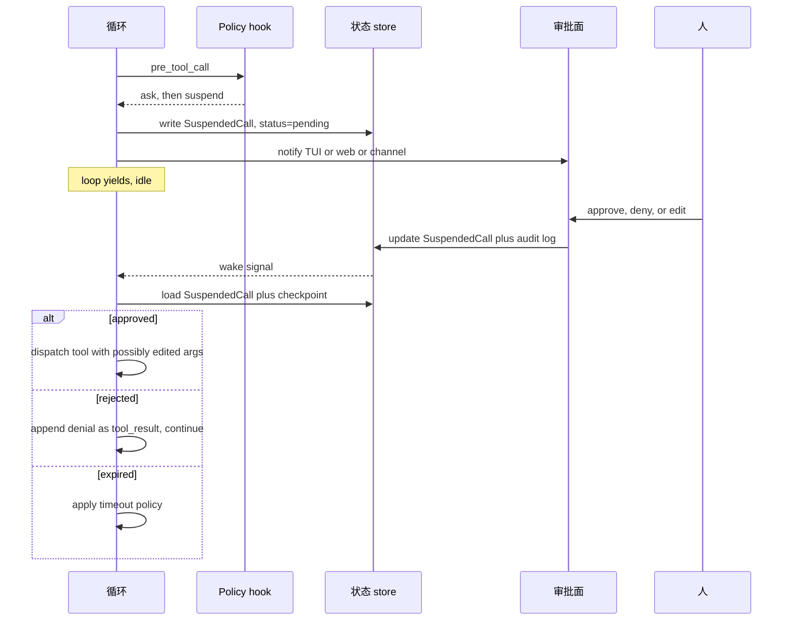

# 第 12 章 — Human in the loop

## TL;DR

Human-in-the-loop 不是 *"不确定就问用户"*。它是为高影响动作设计的结构化控制面：干净地暂停、持久化状态、呈现足够做决定的 context、收集那个决定、审计它、再从同一个点恢复。本章讲的是机制 — 三动作规则集 (allow / ask / deny)、审批面 (inline TUI、web dashboard、async channel)、与 Ch.08 `WaitingApproval` 状态绑定的 suspend-and-resume 协议、人实际看到的 payload、有时间限制的审批与超时策略、多审批者工作流、可信自动化的逃生口,以及当人说不行的时候发生什么。

---

## 为什么这件事重要

一个你可能见过的短场景。你的 agent 既有用又能干。它有读文件、写文件、发消息、部署代码的工具。某天模型发出一个 tool call,删错了目录。动作明确;调用语法合法;用户输入 *"清理一下 build 目录"*,模型把它解释得太宽。没有审批门。Agent 完全是在做你允许它做的事。

HITL 是这样一种设计：动作不全相等。读文件和删目录不是同一种操作;它们的审批面也不应该一样。模型可以对 *是什么* 很聪明;但 *应不应该做* 仍然是人类该拍板。

本章讲的是怎么做到这件事,又不把每个 tool call 都变成一个有摩擦的勾选框。

---

## 概念

### Allow / ask / deny — 三动作规则集

跨越 `references/` 里所有生产系统,审批原语都是同一种形态：一份规则列表,每条带一个 pattern 和三种动作之一。最后匹配的赢。

```ts
type PermissionRule = {
  match:   { tool: string; argsPattern?: Record<string, string> };
  action:  "allow" | "ask" | "deny";
  scope?:  "call" | "session" | "forever";
};

// Example ruleset: allow reads, ask before writes under src/, deny deletes.
const rules: PermissionRule[] = [
  { match: { tool: "read_file" },                                action: "allow" },
  { match: { tool: "write_file", argsPattern: { path: "src/**" } }, action: "ask"   },
  { match: { tool: "delete_*" },                                  action: "deny"  },
];
```

记三条规则：

- **最后匹配的赢。** 一条更晚、更具体的规则覆盖更早、更宽的。OpenCode 的 `Permission.evaluate` 就是这样。
- **`ask` 是任何破坏性动作的默认** — 交叉对照 Ch.03 的 `destructive: true` 元数据标志。Runtime 把任何标记为 destructive 的工具提升到 `ask`,除非有显式 `allow` 规则覆盖。
- **`deny` 在运行中的 session 内不可覆盖。** 用户可以改 config 重启,但运行中的循环对 `deny` 是绝对尊重的。

整个机制以 Ch.11 hook 面里的 `pre_tool_call` hook 形式存在。Hook 读规则集、做决定,要么放行调用,要么排队审批,要么把拒绝作为 tool result 返回。

### 审批面

决定 *审批什么* 是一回事。决定 *人在哪里看到它* 才让 HITL 实用。三种主要面：

| 面 | 延迟 | 最适合 | 失败模式 |
|---|---|---|---|
| **Inline TUI prompt** | 秒级 | 交互式编码、开发流 | 用户不在 — 循环无限阻塞 |
| **Web dashboard** | 秒–分钟 | 多用户系统、治理流 | 通知淹没在繁忙队列里 |
| **Async channel** (Slack、Telegram、邮件) | 分钟–小时 | 长跑自动化、下班时间工作 | 回复链混淆 agent 和人 |

生产系统通常支持不止一种。OpenCode 出厂 inline TUI + web;Hermes Agent 加 async channel,让一个长跑 cron job 可以请求审批,人几小时后回复时再继续;Paperclip 倾向 web dashboard + 邮件/Slack 通知。每个 agent 的选择：挑配合用户在询问时刻真实在场状态的那个面。

来自生产的一条规则：*延迟预算越长,payload 必须越富。* 一个 inline TUI prompt 可以靠用户记得刚刚发生什么。一封几小时后的邮件审批必须自包含。

### Suspend 协议

当循环为审批暂停,Ch.08 的 run 状态机走到 `WaitingApproval`。在暂停持久化之前,磁盘上必须有的东西：

- 待定的 tool call (名字、参数、派发的幂等 key)。
- 对 run、session、用户和决策 actor 的引用。
- 原因 — 模型试图做什么,一句话。
- 到期时间戳 (见下面 *时间限制审批*)。
- 工具产出的任何 dry-run 预览的快照。

```ts
// What the harness persists when it suspends. Ch.08's checkpoint extends with this.
type SuspendedCall = {
  approvalId:        string;
  runId:             string;
  sessionId:         string;
  actorId:           string;
  toolName:          string;
  proposedArgs:      unknown;
  dryRunPreview?:    string;
  reason:            string;
  riskTier:          "read" | "reversible" | "external" | "high_impact";
  createdAt:         string;
  expiresAt:         string;
  status:            "pending" | "approved" | "rejected" | "edited" | "expired";
};
```

Resume 是反过来的。审批到来时,harness 读取这一行,基于 schema 校验决定 (Ch.03),然后要么重新派发 (可能被编辑过的) 调用,要么把拒绝作为 tool result 返回循环。循环从它暂停的那个精确 step 边界继续 — Ch.08 的幂等 step 规则适用。



### 人实际看到什么

Payload 决定 *"好,我批准"* 还是 *"等等,什么?"*。每个审批面都应该展示：

- 拟议动作,一句话,白话。
- 精确参数,按面的格式呈现 (TUI 的 JSON、web 的表单、聊天的 code block)。
- 当工具支持时的 dry-run 预览 — *"将删除 `/workspace/build` (143 个文件、2.4 GB)。"* (Ch.03 的 dry-run 模式。)
- Agent 拟议它的原因 — 由模型显式生成,作为 *面向用户的解释*,与 tool call 一同发出,可选附加 plan step 名 (Ch.09) 和工具的确定性元数据 (Ch.03 描述和风险层)。*不要* 从模型的隐藏或最近推理里拉这个：有些 provider 不暴露;暴露出来的不一定与动作对齐;推理 trace 是攻击面 (Ch.18 — 来自先前 tool result 的 prompt injection 形状文本可能反映在那里)。人看到的 rationale 应当来自模型 *为人写的* 字段,而不是窥视它思考的窗口。
- 风险层以及任何把它提升到 `ask` 的标志。
- 审批到期前的剩余时间。

OpenCode 的审批对话框为 `edit_file` 渲染 diff;Paperclip 的包含发起 issue 和干系人列表;一些主流商业编码 agent 为昂贵操作显示估算的 token / 成本影响。挑适合你面的偷过来。

### 审批 scope

多数审批不是真的关于 *这一次调用*。它们是关于 *将来这类调用*。三种真实系统提供的 scope：

| Scope | 维持到 | 何时用 |
|---|---|---|
| **仅这一次调用** | 调用完成 | 真正一次性、高影响动作 |
| **这次 session** | session 结束或轮换 | 一项任务中的重复调用 |
| **永久 (有范围)** | 用户从单一界面撤销 | 受信工具,严密限定在安全用例 |

UI 通常是 *Approve* 下面一组按钮。存储：

- **这一次调用** — `SuspendedCall` 行更新;别的不变。
- **这次 session** — session 的 `permission_overrides` map 增加一项;后续调用先匹配它,再匹配全局规则集。
- **永久** — 用户的 config 增加一条新的 `allow` 规则,下一次 session 启动时生效。*Trust 是有范围的,不是一刀切*：规则被工具名、MCP server 与版本 (外部时 — Ch.13)、租户或工作区,以及一类参数 (具体路径 glob、枚举值、URL 上的域) 约束。在 `web_fetch` 上对 `docs.example.com` 点了 *trust* 的用户,并没有批准 `web_fetch` 对任何 URL。规则应该引用工具定义的 fingerprint,这样描述重写或版本升级会触发一次新询问,而不是悄悄继承旧的 trust。用户必须能从单一界面撤销任何 *永久* 规则,而不是去编辑 YAML — 可撤销性是让宽 scope 能存活的安全阀。

要避开的陷阱：因为 UI 默认到更宽 scope 而悄悄把 *这次 session* 升级到 *永久*。每个对话框上 scope 都要显式。默认偏窄;扩大是显式的一次点击。

### Plan-mode 审批 — 批一次,执行多次

Agent 在 plan mode 时 (Ch.09),最便宜的 HITL 是 *批准 plan,然后执行*。Plan 本身就是审批 payload — 用户看到步骤、批准工作形态,执行器无需逐步询问就推进。

机制：planner 产出一个 plan,每个步骤打上风险层 *标签和它打算用的具体参数* — 路径、标识符、目标资源、预期 diff。审批对话框显示 plan。批准时,harness 插入一条 session-scope 的 `allow`,*受 plan 参数约束*,不只是工具名。一个说 *编辑 `src/auth.ts`* 的 plan 产生一个 `edit_file` allow,`path = src/auth.ts` (以及对于 diff 形状的工具,一个 diff 大小或范围约束),而不是一条万能的 `edit_file` allow。执行器对 plan 没预料的任何事仍然要询问;通过把拟议调用的参数形状与约束对比来检测 drift — 同样的工具名带新参数是 *drift*,不是 *match*。

Paperclip 用 `executionPolicy = planning_mode` 实现;OpenCode 的 `plan` agent 写一个 `.opencode/plans/<name>.md`,用户批准后变成 build agent 匹配工具的参数受限 session-scope allow。

纪律：别让执行器从 plan 漂太远。如果 plan 说 *编辑 `src/auth.ts` 和 `src/db.ts`*,而执行器提议编辑 `src/payments.ts`,plan-scope 审批不覆盖它 — 升级回用户。参数约束是机械地强制这个;没有它,*"同一工具,不同文件"* 就溜过去了,审批变成许可证而不是契约。

### Edit 而不是 approve

通常人正确的回答既不是 *yes* 也不是 *no*,而是 *不太对,这样做*。生产系统把这变成一等动作。

```ts
type ApprovalDecision =
  | { kind: "approved" }
  | { kind: "rejected"; reason?: string }
  | { kind: "edited"; replacementArgs: unknown }
  | { kind: "expired" };

// On `edited`, validate against the tool's schema (Ch.03) before dispatch.
function applyEdit(decision: ApprovalDecision, tool: ToolDefinition) {
  if (decision.kind !== "edited") return decision;
  const parsed = tool.schema.safeParse(decision.replacementArgs);
  if (!parsed.ok) {
    return {
      kind: "rejected",
      reason: `Edited args failed schema: ${parsed.error}`
    };
  }
  return decision;
}
```

OpenCode 的审批对话框包含一个 *Edit* 按钮,打开 inline JSON 编辑器。Hermes Agent 的交互式 TUI 让用户在批准前重写拟议的 shell 命令。主流商业编码 agent 显示 diff 预览,允许用户在说 yes 之前调整拟议文件内容。

来自生产的两个模式：用同样的工具 schema 校验编辑 (一个模型发出的调用通过了校验;一个人编辑过的调用也应该),并把编辑与原始一起记录,审计链路同时显示两者。

### 危险默认检测

有时一个工具在 config 里标了 `allow`,但 *具体那次调用* 以一种模型不太可能注意到的方式有风险。Harness 基于启发式把 `allow` 提升到 `ask`：

- **大影响。** 删除 >100 个文件;写入 >1 MB;影响 >N 条记录的批操作。
- **危险路径。** 任何碰 `.git`、`.env`、`node_modules`、`/etc`、生产配置文件的。
- **下班时间执行。** 凌晨 3 点 cron 触发的破坏性操作获得额外审查。
- **跨租户或跨工作区操作** (Ch.06 命名空间规则)。
- **生产形状的凭据** 在环境里 (env var 包含 `PROD`、`LIVE`)。

```ts
// Promotes any matching call from allow → ask, regardless of config.
function dangerousDefault(call: ToolCall, ctx: AgentContext): boolean {
  if (call.name === "delete_files" && call.args.paths.length > 100) return true;
  if (touchesProtectedPath(call.args.path))                          return true;
  if (ctx.now.getUTCHours() < 6 && call.tool.destructive)            return true;
  if (looksLikeProductionEnv(ctx.env))                               return true;
  return false;
}
```

Hermes Agent 的 `ToolCallGuardrailController` 和 Paperclip 的 heartbeat 级检查都实现了各种变体。阈值会不一样;原则不变 — 这些是通过类型检查、通过 policy、但仍值得人扫一眼的调用。

### 时间限制审批

审批不能永远活着。Harness 必须实现并在三种策略中选一种：

- **过期自动拒绝。** 最安全。请求超时,模型拿到拒绝,循环不采取动作继续。
- **过期继续。** 阻塞比执行更糟的低风险操作里最务实。很少是正确的默认。
- **过期升级。** 治理形状：超时把请求路由给备用审批者或更高权限用户。Paperclip 的多审批者流是这样的。

正确默认是 **自动拒绝**,*继续* 只对运维显式选入的工具可用。默认 *继续* 是一个 footgun — 一个被忘掉的审批变成了静默执行。

一个有用的生产小细节：审批面显示倒计时。归零时,面本身显示结果 (denied / escalated)。审计日志把过期作为一等事件记录,而不是静默超时。

### 子 agent 的审批继承

当父 agent 委派时 (Ch.10),问题变成：父 agent 的审批覆盖子 agent 吗?三种 policy：

- **继承。** 子 agent 用父 agent 的 session-scope 审批运行。最便宜;子 agent scope 窄时安全。
- **只继承 `allow`。** 从父 agent 继承显式 allow;任何 `ask` 在子 agent 级别重新询问。多数生产系统默认这里。
- **不继承。** 子 agent 从规则集开始,就这样。最安全;最吵。

OpenCode 默认 *只继承 allow*;主流商业编码 agent 跟同样默认。挑选规则：子 agent 越隔离 (独立 worktree、新鲜 context),继承越合理;子 agent 越强大 (写、shell、网络),它越该重新询问。

### 多审批者工作流

对共享系统里的高风险动作,一个审批不够。模式 (Paperclip 的 `issue_approvals` 表最清楚)：

- 动作要求一组角色 (`author`、`project_lead`、`security`) 的签字。
- 每次签字带时间戳、角色、决定和可选评论被记录。
- 仅当所有必要签字都 `approved`,动作才推进。
- 任何一个 `rejected` 立即停止链。
- 任一单一签字超时升级给备用审批者。

这是治理,不是交互式 HITL。当筹码值得运维成本时是对的工具 — 部署、账户关闭、跨团队变更。其他所有都用错了工具;签字链如果对例行操作触发会被忽略。

### 自治模式 — 显式逃生口

某些工作负载完全不应该有人在 loop 里：cron 触发的例行工作、沙盒探索、CI 检查。Harness 应当 *显式* 支持这个,不要作为误配置的副作用：

```yaml
# Excerpt from a harness config.
permissions:
  mode: autonomous              # explicit; never inferred from missing TTY
  on_destructive: auto_deny     # never silently allow, never silently ask
  approval_log: enabled         # still audit, even with no human approving
```

三条规则：模式在 config 里 **显式** (不要因为没 TTY 就隐式 *"没有审批"*);破坏性动作仍有默认 (这里是 auto-deny),而不是悄悄允许;审计日志仍记录 *本该询问* 的事件,这样运维能 review 交互式跑会被询问的事。

诚实的框架：*自治模式是退出人类 review,不是退出问责。* 日志必须留下。

### 审批作为审计链路

每个审批 — granted、denied、edited、expired — 都是值得保留的事件。最小记录：

- **Who** — actor ID、reviewer ID、来源面 (TUI、web、channel)。
- **What** — 工具名、参数 (或如果参数含密钥的 hash)、风险层。
- **When** — 创建、决定、过期时间戳。
- **Why** — agent 拟议的原因、reviewer 给出 (如果给了) 的决定原因。
- **How** — 决定形态：approved / rejected / edited (带 diff)。

这是 Ch.16 将变成可观测性的同一份日志。也是事后事故复盘最先要的。Hermes Agent 写结构化 JSON 条目;Paperclip 持久化到专门的审批表;OpenCode 用下游 collector 可以持久化的 bus 事件。

### Approval-by-decline — 说不之后发生什么

拒绝是一次 turn,不是一次异常。Harness 向循环返回一个 tool result：

```ts
{
  ok: false,
  recoverable: true,
  code: "user_denied_action",
  message: "User denied this action.",
  hint: "Try a different approach, or ask the user what they would prefer.",
}
```

模型读取拒绝,决定下一步做什么 — 通常是其中之一：提议不同动作、向用户请求指引、总结尝试过的事并停下。交叉对照 Ch.03 的 `hint` 字段：一条有用的拒绝消息告诉模型 *哪种替代方案是可接受的*,而不只是 *不行*。

Agent 不该做的：默默放弃用户的目标。一个被拒绝的 step 几乎从不意味着一个被拒绝的 *任务*。循环应当提议另一条路或浮现僵局 — 永远别消失。

---

## 真实系统笔记

- **OpenCode** 是 inline 审批面最清晰的参考：带 `allow` / `ask` / `deny` 的权限规则集、最后匹配赢的求值、感知 scope 的审批 (call / session / forever),以及打开 JSON 编辑器的 *Edit* 按钮。Bus 事件模型把审批干净地集成进 Ch.11 的 harness。
- **Paperclip** 是多审批者和 async-channel 的参考：专用 `issue_approvals` 表、签字链、超时升级、web dashboard 加 Slack 和邮件通知。组织治理最强的参考。
- **Hermes Agent** 是个人助理 context 中 async-channel HITL 的参考：一个 Telegram 或 Slack 审批消息到达、等待,人回复时恢复 agent。`--quiet-mode` 标志加结构化日志展示如何设计自治模式而不丢问责。
- **OpenClaw** 出厂 channel-gateway 版本：通过聊天 channel 的审批与 dashboard 上的审批不同,channel adapter 为媒介塑造 payload。值得研究 surface-vs-payload 的拆分。

---

## 与你的 agent 配对

几个对本章效果好的 prompt：

- *"把我所有工具分类成风险层 (read / reversible / external / high_impact),为每个提议默认动作 (allow / ask / deny)。然后把权限规则集写成 YAML,基于我的实际工具注册校验它。"*
- *"实现 suspend 协议：审批触发时写一行 `SuspendedCall`,把 run 转到 `WaitingApproval` (Ch.08),通知审批面。在 approve / reject / edit / expire 时,从精确 step 边界恢复。用一个故意延迟的审批测试。"*
- *"通过 Slack 加 async-channel 审批。Agent 贴出审批 payload;人回复 *yes / no / edit*;回复到达时循环恢复。处理人几小时后才回复、session 已轮换的情况。"*
- *"实现危险默认启发式：大删除、保护路径、下班时间、生产形状 env var。每个把 `allow` 升级到 `ask`。给我看我历史里五个真实 tool call 本来会被升级的。"*
- *"加三种超时策略 (auto-deny / continue / escalate),让我按工具层配置。用一个故意过期的审批验证正确的策略触发,审计日志记录 *expired* — 不是静默的。"*
- *"接通审批审计日志：每个 approve / deny / edit / expire 写一条结构化行,带 who、what、when、why、how。把我上周的审批跑过它,告诉我哪些工具问太频繁 (UX 摩擦),哪些从不问 (可能风险错分)。"*
- *"重构我的子 agent spawn (Ch.10),让父 agent 的 session-scope `allow` 规则被 child 继承,但 `ask` 规则在子 agent 级别重新询问。用一个提议破坏性动作的子 agent 验证 — 确保父 agent 早先的 allow 不覆盖它。"*
- *"造一个 *永久信任此工具* 按钮,把显式 `allow` 规则写入我的用户 config。验证规则被写入、持久化,并在下一次 session 的权限求值里可见,对话框里有显式 scope 标签让用户知道他们将要选入什么。"*

---

## 接下来

你现在有了高影响动作的控制面：规则集、一组审批面、suspend-and-resume 协议、时间限制审批,以及事后回答 *who、what、when、why* 的审计日志。Ch.13 覆盖面下的层 — connector 和 MCP。第一次连第三方 MCP server 时,本章的审批门就是询问你是否信任它的那个。
