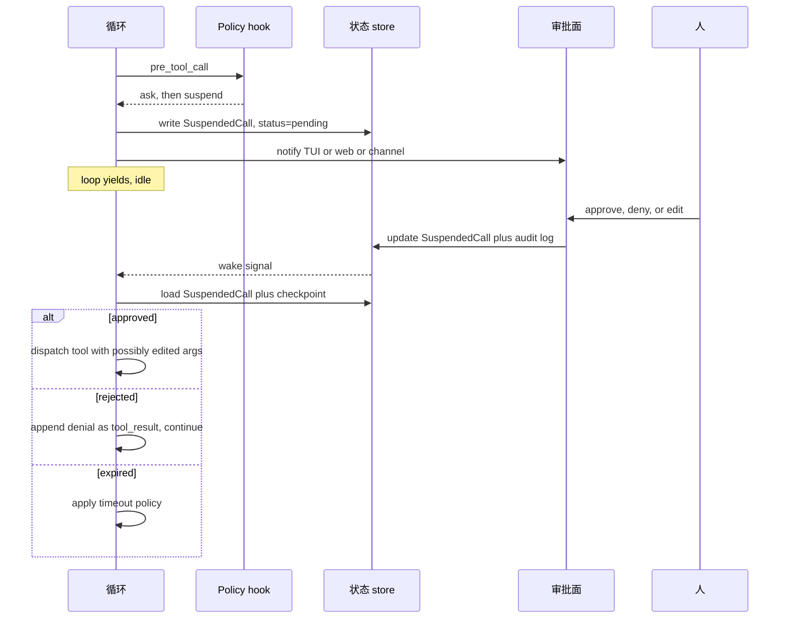

# 第 12 章 — Human in the loop

## TL;DR

人在回路(human-in-the-loop)不是 *"不确定就问用户"* 这么简单。它是为高影响动作设计的结构化控制面:干净利落地暂停、持久化状态、呈现足够做决定的上下文、收集这个决定、留下审计、再从同一个点恢复。本章讲的是它的机制 — 三动作规则集(allow / ask / deny)、几种审批界面(inline TUI、web dashboard、async channel)、与 Ch.08 `WaitingApproval` 状态绑定的暂停-恢复(suspend-and-resume)协议、人实际看到的 payload、带时限的审批与超时策略、多审批者工作流、给可信自动化留的逃生口,以及当人说"不行"时会发生什么。

---

## 为什么这件事重要

一个你大概见过的小场景。你的 agent 既好用又能干。它有读文件、写文件、发消息、部署代码的各种工具。某天模型发出一个工具调用,删错了目录。这个动作意图明确、调用语法合法 — 用户输入的是 *"清理一下 build 目录"*,模型把它理解得太宽泛了。当时没有审批关卡。Agent 做的恰恰就是你允许它做的事。

HITL 背后的设计理念是:动作并非生来平等。读文件和删目录不是同一种操作,它们的审批方式也不该一样。模型可以把 *是什么* 想得很聪明,但 *该不该做* 仍然得由人来拍板。

本章讲的就是怎么做到这一点 — 而又不把每个工具调用都变成一个磨人的勾选框。

---

## 概念

### Allow / ask / deny — 三动作规则集

在 `references/` 里的各个生产系统中,审批原语都是同一个形态:一份规则列表,每条规则带一个 pattern 和三种动作之一。最后匹配中的那条规则说了算。

```ts
type PermissionRule = {
  match:   { tool: string; argsPattern?: Record<string, string> };
  action:  "allow" | "ask" | "deny";
  scope?:  "call" | "session" | "forever";
};

// Example ruleset: allow reads, ask before writes under src/, deny deletes.
const rules: PermissionRule[] = [
  { match: { tool: "read_file" },                                action: "allow" },
  { match: { tool: "write_file", argsPattern: { path: "src/**" } }, action: "ask"   },
  { match: { tool: "delete_*" },                                  action: "deny"  },
];
```

有三条规则要记住：

- **最后匹配的规则说了算。** 越晚出现、越具体的规则会覆盖越早、越宽泛的规则。OpenCode 的 `Permission.evaluate` 正是这么做的。
- **任何破坏性动作默认走 `ask`** — 对照 Ch.03 的 `destructive: true` 元数据标志。除非有显式的 `allow` 规则覆盖,runtime 会把任何标记为 destructive 的工具提升到 `ask`。
- **`deny` 在运行中的 session 内无法被覆盖。** 用户可以改 config 再重启,但运行中的循环对 `deny` 是绝对照办的。

整个机制以 Ch.11 hook 体系里的 `pre_tool_call` hook 形式存在。Hook 读取规则集、做出决定,然后要么放行这次调用,要么把审批排进队列,要么把一条拒绝作为工具调用结果返回。

### 审批面

决定 *审批什么* 是一回事;决定 *人在哪里看到这次审批* 才是让 HITL 真正落地的关键。主流的有三种界面：

| 界面 | 延迟 | 最适合 | 失败模式 |
|---|---|---|---|
| **Inline TUI prompt** | 秒级 | 交互式编码、开发流程 | 用户不在 — 循环无限阻塞 |
| **Web dashboard** | 秒–分钟 | 多用户系统、治理流程 | 通知淹没在繁忙的队列里 |
| **Async channel** (Slack、Telegram、邮件) | 分钟–小时 | 长时间运行的自动化、下班时段的工作 | 回复链让 agent 和人互相搞混 |

生产系统通常不止支持一种。OpenCode 自带 inline TUI + web;Hermes Agent 加上了 async channel,让一个长时间运行的 cron job 能够请求审批,等用户几小时后回复时再继续;Paperclip 偏向 web dashboard 配邮件/Slack 通知。每个 agent 怎么选:挑那个与用户在询问那一刻是否真的在场相匹配的界面。

一条来自生产的经验:*延迟预算越长,payload 就必须越充实。* 一个 inline TUI prompt 可以指望用户还记得刚刚发生了什么;而一封几小时后才看到的邮件审批,内容必须自成一体。

### 暂停协议

当循环为了审批而暂停时,Ch.08 的 run 状态机会进入 `WaitingApproval`。暂停之前,磁盘上必须持久化好这些东西：

- 待定的工具调用(名称、参数、这次派发的幂等 key)。
- 指向 run、session、用户,以及需要由谁来决策的那个 actor 的引用。
- 原因 — 用一句话说明模型想做成什么。
- 到期时间戳(见下面的 *带时限的审批*)。
- 工具产出的任何 dry-run 预览的快照。

```ts
// What the harness persists when it suspends. Ch.08's checkpoint extends with this.
type SuspendedCall = {
  approvalId:        string;
  runId:             string;
  sessionId:         string;
  actorId:           string;
  toolName:          string;
  proposedArgs:      unknown;
  dryRunPreview?:    string;
  reason:            string;
  riskTier:          "read" | "reversible" | "external" | "high_impact";
  createdAt:         string;
  expiresAt:         string;
  status:            "pending" | "approved" | "rejected" | "edited" | "expired";
};
```

恢复则是反向的过程。审批到来时,harness 读取这一行记录,用 schema 校验这个决定(Ch.03),然后要么重新派发那次(可能被编辑过的)调用,要么把拒绝作为工具调用结果返回给循环。循环会从它暂停时的那个精确 step 边界接着往下走 — Ch.08 的幂等 step 规则在这里同样适用。



### 人实际看到的是什么

Payload 是 *"好,我批准"* 和 *"等等,这是什么?"* 之间的分水岭。每个审批界面都应该展示：

- 拟议的动作,一句话,用大白话说清。
- 精确的参数,按界面的格式来呈现(TUI 里用 JSON、web 里用表单、聊天里用 code block)。
- 工具支持时给出 dry-run 预览 — *"将删除 `/workspace/build`(143 个文件、2.4 GB)。"*(Ch.03 的 dry-run 模式。)
- agent 提出这个动作的理由 — 由模型显式生成,作为一段 *面向用户的说明*,与工具调用一起发出,还可以附上 plan step 的名称(Ch.09)和工具的确定性元数据(Ch.03 的描述与风险层级)。*不要* 从模型隐藏的或最近的推理里去取这段理由:有些 provider 根本不暴露推理;暴露出来的也不一定与动作对得上;而且推理 trace 本身就是一个攻击面(Ch.18 — 来自先前工具调用结果、形似 prompt injection 的文本可能被回显在那里)。人看到的理由应当来自模型 *专门写给人看* 的那个字段,而不是一扇窥探它思考过程的窗户。
- 风险层级,以及任何把它提升到 `ask` 的标志。
- 审批到期前还剩多少时间。

OpenCode 的审批对话框会为 `edit_file` 渲染 diff;Paperclip 的对话框会带上发起这件事的 issue 和干系人列表;一些主流商业编码 agent 则为昂贵操作显示估算的 token / 成本影响。哪个适合你的界面,就把哪个学过来。

### 审批的 scope

多数审批其实并不是关于 *这一次调用*,而是关于 *将来这一类调用*。真实系统提供三种 scope：

| Scope | 维持到 | 何时用 |
|---|---|---|
| **仅这一次调用** | 调用完成 | 真正一次性的高影响动作 |
| **本次 session** | session 结束或轮换 | 同一项任务中重复出现的调用 |
| **永久 (有范围)** | 用户从单一界面撤销 | 受信任的工具,且严密限定在安全用例上 |

UI 上通常是 *Approve* 下面的一组按钮。底层存储是这样的：

- **这一次调用** — 更新 `SuspendedCall` 这一行,其余不变。
- **本次 session** — session 的 `permission_overrides` map 里新增一项;后续调用先和它匹配,再匹配全局规则集。
- **永久** — 用户的 config 里新增一条 `allow` 规则,在下一次 session 启动时生效。*信任是有范围的,不是一刀切*:这条规则受工具名、MCP server 及其版本(若是外部工具 — Ch.13)、租户或工作区,以及某一类参数(具体的路径 glob、枚举值、URL 上的域名)的约束。一个针对 `web_fetch` 上的 `docs.example.com` 点过 *trust* 的用户,并不等于批准了 `web_fetch` 访问任意 URL。这条规则应当引用工具定义的指纹(fingerprint),这样一来,描述被改写或版本升级时就会触发一次新的询问,而不是悄无声息地继承旧的信任。而且用户必须能从单一界面撤销任何一条 *永久* 规则,而不是去手改 YAML — 可撤销性正是让宽 scope 还能用得安心的那道安全阀。

要避开的陷阱:因为 UI 默认选了更宽的 scope,就把 *本次 session* 悄悄升级成了 *永久*。每个对话框上的 scope 都要显式标出。默认偏窄,扩大范围必须是一次显式的点击。

### Plan-mode 审批 — 批一次,执行多次

当 agent 处于 plan mode 时(Ch.09),最省事的 HITL 就是 *批准 plan,然后执行*。Plan 本身就是审批 payload — 用户看到全部步骤、认可这项工作的整体形态,执行器随后无需逐步询问就一路推进。

机制是这样的:planner 产出一个 plan,每个步骤都标上风险层级 *以及它打算使用的具体参数* — 路径、标识符、目标资源、预期的 diff。审批对话框展示这个 plan。一旦批准,harness 就插入一条 session-scope 的 `allow`,且 *受 plan 中的参数约束*,而不只是按工具名放行。一个写着 *编辑 `src/auth.ts`* 的 plan,产生的是一条 `path = src/auth.ts` 的 `edit_file` allow(对于产出 diff 的工具,还附带一个 diff 大小或范围的约束),而不是一条万能的 `edit_file` allow。对于 plan 没有预料到的任何事,执行器仍然要询问;通过把拟议调用的参数形态和约束相比对来检测偏离(drift)— 工具名相同但参数是新的,算 *偏离*,不算 *匹配*。

Paperclip 用 `executionPolicy = planning_mode` 来实现这一点;OpenCode 的 `plan` agent 会写一个 `.opencode/plans/<name>.md`,用户批准后,它就变成 build agent 对应工具上参数受限的 session-scope allow。

要守的纪律:别让执行器从 plan 上漂得太远。如果 plan 说的是 *编辑 `src/auth.ts` 和 `src/db.ts`*,而执行器却提议编辑 `src/payments.ts`,那 plan-scope 的审批就管不到它 — 这时要升级回用户那里。是参数约束在机械地强制执行这一点;没有它,*"同一个工具,不同的文件"* 就蒙混过关了,审批也就从一份契约退化成了一张许可证。

### Edit,而不是 approve

很多时候,人正确的回应既不是 *yes* 也不是 *no*,而是 *不太对,改成这样做*。生产系统把这一项做成了头等动作。

```ts
type ApprovalDecision =
  | { kind: "approved" }
  | { kind: "rejected"; reason?: string }
  | { kind: "edited"; replacementArgs: unknown }
  | { kind: "expired" };

// On `edited`, validate against the tool's schema (Ch.03) before dispatch.
function applyEdit(decision: ApprovalDecision, tool: ToolDefinition) {
  if (decision.kind !== "edited") return decision;
  const parsed = tool.schema.safeParse(decision.replacementArgs);
  if (!parsed.ok) {
    return {
      kind: "rejected",
      reason: `Edited args failed schema: ${parsed.error}`
    };
  }
  return decision;
}
```

OpenCode 的审批对话框带一个 *Edit* 按钮,点开是一个 inline JSON 编辑器。Hermes Agent 的交互式 TUI 允许用户在批准前重写拟议的 shell 命令。主流商业编码 agent 则会显示 diff 预览,让用户在说 yes 之前调整拟议的文件内容。

两条来自生产的做法:用同一套工具 schema 来校验这次编辑(模型发出的调用要过校验,人编辑过的调用同样要过),并把编辑后的内容和原始内容一并记录下来,让审计链路把两者都呈现出来。

### 危险默认检测

有时一个工具在 config 里标的是 `allow`,但 *具体那一次调用* 以一种模型不太可能察觉的方式带有风险。这时 harness 会基于启发式规则把 `allow` 提升到 `ask`：

- **影响面大。** 删除 >100 个文件;写入 >1 MB;影响 >N 条记录的批量操作。
- **危险路径。** 任何碰到 `.git`、`.env`、`node_modules`、`/etc`、生产配置文件的操作。
- **下班时段执行。** 凌晨 3 点由 cron 触发的破坏性操作要受到额外审查。
- **跨租户或跨工作区的操作**(Ch.06 的命名空间规则)。
- 环境里有 **形似生产环境的凭据**(env var 中包含 `PROD`、`LIVE`)。

```ts
// Promotes any matching call from allow → ask, regardless of config.
function dangerousDefault(call: ToolCall, ctx: AgentContext): boolean {
  if (call.name === "delete_files" && call.args.paths.length > 100) return true;
  if (touchesProtectedPath(call.args.path))                          return true;
  if (ctx.now.getUTCHours() < 6 && call.tool.destructive)            return true;
  if (looksLikeProductionEnv(ctx.env))                               return true;
  return false;
}
```

Hermes Agent 的 `ToolCallGuardrailController` 和 Paperclip 的 heartbeat 级检查都实现了这类机制的各种变体。阈值各不相同,但原则不变 — 这些调用过了类型检查、过了 policy,却仍然值得让人扫一眼。

### 带时限的审批

审批不会永远有效。harness 必须实现以下三种策略,并在其中做选择：

- **过期即自动拒绝。** 最安全。请求超时,模型收到一条拒绝,循环不采取动作、继续往下走。
- **过期即继续。** 对那些"阻塞比直接执行更糟"的低风险操作最务实。但很少是正确的默认。
- **过期即升级。** 偏治理的做法:超时会把请求路由给备用审批者或更高权限的用户。Paperclip 的多审批者流程就是这么做的。

正确的默认是 **自动拒绝**,而 *继续* 只对运维显式选入的工具开放。把 *继续* 设成默认是一颗自伤的雷 — 一个被遗忘的审批就变成了静默执行。

一个有用的生产小细节:审批界面显示一个倒计时。归零时,界面本身就显示出结果(被拒绝 / 已升级)。审计日志把"过期"作为一等事件记录下来,而不是当成一次静默超时。

### 子 agent 的审批继承

当父 agent 进行委派时(Ch.10),问题就变成:父 agent 的审批能不能覆盖到子 agent?有三种 policy：

- **继承。** 子 agent 沿用父 agent 的 session-scope 审批来运行。最省事;在子 agent scope 收得很窄时是安全的。
- **只继承 `allow`。** 从父 agent 继承显式的 allow;任何 `ask` 都在子 agent 这一层重新询问。多数生产系统默认这一种。
- **不继承。** 子 agent 从规则集从头开始,没有例外。最安全,也最吵。

OpenCode 默认 *只继承 allow*;主流商业编码 agent 也是同样的默认。怎么挑:子 agent 越隔离(独立 worktree、全新的上下文),继承就越合理;子 agent 越强大(能写、能跑 shell、能联网),它就越该重新询问。

### 多审批者工作流

对共享系统里的高风险动作来说,一个审批是不够的。这个模式(在 Paperclip 的 `issue_approvals` 表里看得最清楚)：

- 动作需要一组角色(`author`、`project_lead`、`security`)逐一签字。
- 每次签字都连同时间戳、角色、决定和可选的评论一起记录下来。
- 只有当所有必需的签字都为 `approved` 时,动作才推进。
- 任何一个 `rejected` 都会立即中断整条链。
- 任一单个签字超时,就升级给备用审批者。

这是治理,不是交互式 HITL。当事情的分量足以抵得上这份运维成本时,它就是对的工具 — 部署、账户关闭、跨团队变更。其余场景都属于用错了工具;签字链如果对例行操作也触发,只会被人无视。

### 自治模式 — 显式逃生口

某些工作负载里根本就不该有人在回路里:cron 触发的例行工作、沙盒里的探索、CI 检查。harness 应当 *显式* 地支持这一点,而不是让它成为某次误配置的副作用：

```yaml
# Excerpt from a harness config.
permissions:
  mode: autonomous              # explicit; never inferred from missing TTY
  on_destructive: auto_deny     # never silently allow, never silently ask
  approval_log: enabled         # still audit, even with no human approving
```

三条规则:模式必须在 config 里 **显式** 声明(不要因为没有 TTY 就隐式认定 *"无需审批"*);破坏性动作仍然要有一个默认行为(这里是 auto-deny),而不是悄悄放行;审计日志仍然要记录那些 *本该询问* 的事件,这样运维就能回看,如果是交互式运行,哪些地方会被弹出询问。

说句实在话:*自治模式是放弃人类 review,而不是放弃问责。* 日志必须留下。

### 把审批当成审计链路

每个审批 — 批准、拒绝、编辑、过期 — 都是一桩值得留存的事件。最小的记录应包含：

- **Who** — actor ID、reviewer ID、来源界面(TUI、web、channel)。
- **What** — 工具名、参数(若参数含密钥则记其 hash)、风险层级。
- **When** — 创建、决定、过期的时间戳。
- **Why** — agent 提出该动作的原因,以及 reviewer 给出的决定理由(若有)。
- **How** — 决定的形态:approved / rejected / edited(带 diff)。

这和 Ch.16 将要变成可观测性的是同一份日志。它也是事后事故复盘时最先被翻出来的东西。Hermes Agent 写的是结构化 JSON 条目;Paperclip 持久化到专门的审批表;OpenCode 则用 bus 事件,由下游 collector 来做持久化。

### 拒绝即一种审批 — 说"不"之后会发生什么

一次拒绝是一个 turn,不是一次异常。Harness 会向循环返回一个工具调用结果：

```ts
{
  ok: false,
  recoverable: true,
  code: "user_denied_action",
  message: "User denied this action.",
  hint: "Try a different approach, or ask the user what they would prefer.",
}
```

模型读到这条拒绝,再决定下一步 — 通常是这几种之一:提出另一个动作、向用户征求指引、总结一下试过什么然后停下。对照 Ch.03 的 `hint` 字段:一条有用的拒绝消息会告诉模型 *什么样的替代方案是可以接受的*,而不只是丢下一句 *不行*。

agent 不该做的事:默默放弃用户的目标。一个被拒绝的 step 几乎从不意味着整个 *任务* 被拒绝。循环应当另提一条路,或者把僵局摆到台面上来 — 千万别就这么消失。

---

## 真实系统笔记

- **OpenCode** 是 inline 审批界面最清晰的参考:一套带 `allow` / `ask` / `deny` 的权限规则集、最后匹配者优先的求值、感知 scope 的审批(call / session / forever),以及一个点开 JSON 编辑器的 *Edit* 按钮。它的 bus 事件模型把审批干净利落地集成进了 Ch.11 的 harness。
- **Paperclip** 是多审批者和 async-channel 的参考:专门的 `issue_approvals` 表、签字链、超时升级、web dashboard 外加 Slack 和邮件通知。组织治理方面最强的参考。
- **Hermes Agent** 是个人助理场景下 async-channel HITL 的参考:一条 Telegram 或 Slack 审批消息发出后等在那里,等人回复时再恢复 agent。`--quiet-mode` 标志配上结构化日志,示范了如何设计自治模式而又不丢掉问责。
- **OpenClaw** 自带 channel-gateway 这一版本:通过聊天 channel 做审批,和在 dashboard 上做审批不是一回事,channel adapter 会按这个媒介来塑造 payload。它值得研究的地方在于把"界面"和"payload"清晰地分开。

---

## 与你的 agent 结对

几个在本章上效果不错的 prompt：

- *"把我所有的工具按风险层级分类(read / reversible / external / high_impact),并为每个工具提议一个默认动作(allow / ask / deny)。然后把这份权限规则集写成 YAML,并对照我实际的工具注册表校验它。"*
- *"实现暂停协议:审批触发时写一行 `SuspendedCall`,把 run 转到 `WaitingApproval`(Ch.08),并通知审批界面。在 approve / reject / edit / expire 时,从精确的 step 边界恢复。用一个故意延迟的审批来测试。"*
- *"通过 Slack 加上 async-channel 审批。agent 贴出审批 payload;人回复 *yes / no / edit*;回复到达时循环恢复。要处理人几小时后才回复、session 已经轮换过的情况。"*
- *"实现这套危险默认启发式规则:大批量删除、受保护路径、下班时段、形似生产环境的 env var。每一条都把 `allow` 提升到 `ask`。给我看看我历史记录里有哪五个真实的工具调用本来会被升级。"*
- *"加上三种超时策略(auto-deny / continue / escalate),让我能按工具层级来配置。用一个故意制造过期的审批来验证:正确的策略被触发,且审计日志记下的是 *expired* — 而不是静默处理。"*
- *"接通审批审计日志:每个 approve / deny / edit / expire 都写一条结构化记录,带上 who、what、when、why、how。把我上周的审批都跑一遍,告诉我哪些工具问得太频繁(造成 UX 摩擦),哪些从来不问(很可能是风险分错了类)。"*
- *"重构我的子 agent spawn(Ch.10),让父 agent 的 session-scope `allow` 规则被子 agent 继承,但 `ask` 规则在子 agent 这一层重新询问。用一个会提议破坏性动作的子 agent 来验证 — 确保父 agent 早先的 allow 覆盖不到它。"*
- *"做一个 *永久信任此工具* 按钮,把一条显式的 `allow` 规则写进我的用户 config。验证这条规则被写入、被持久化,并在下一次 session 的权限求值里可见;对话框里要带一个显式的 scope 标签,让用户清楚自己将要选入的是什么。"*

---

## 接下来

现在你有了一套针对高影响动作的控制面:一份规则集、一组审批界面、暂停-恢复协议、带时限的审批,以及一份能在事后回答 *who、what、when、why* 的审计日志。Ch.13 讲的是这些界面底下的那一层 — 连接器和 MCP。当你第一次连上一个第三方 MCP server 时,本章的审批关卡正是那个出来问你"是否信任它"的东西。
