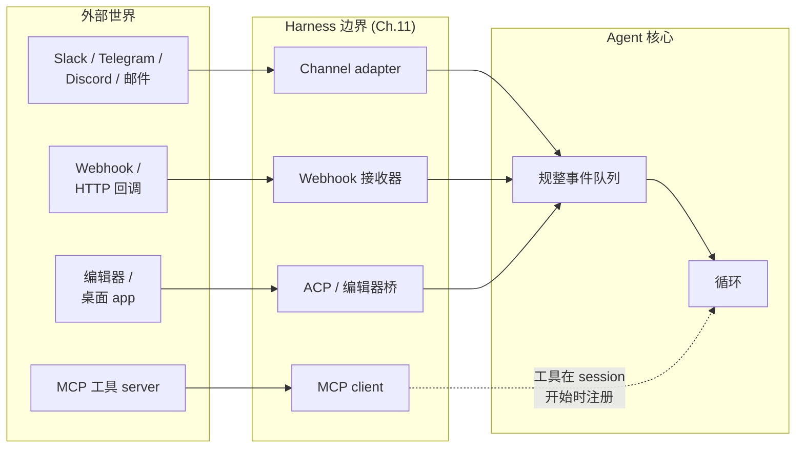
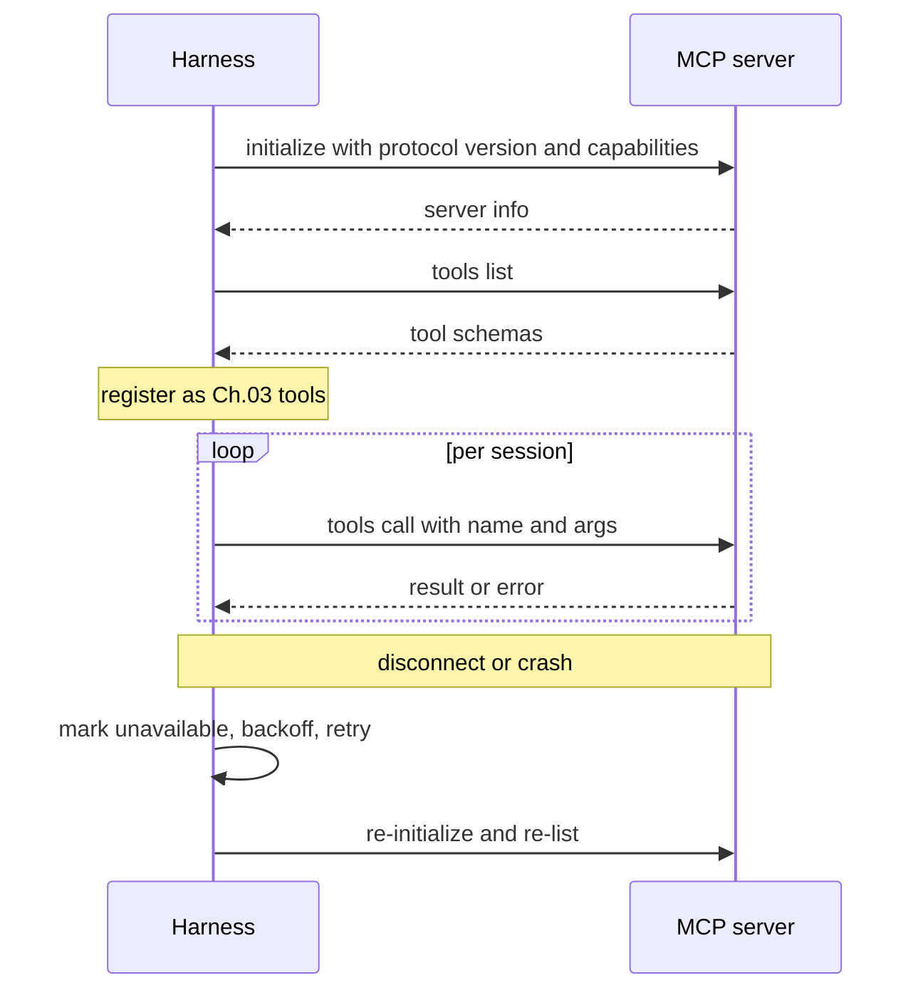
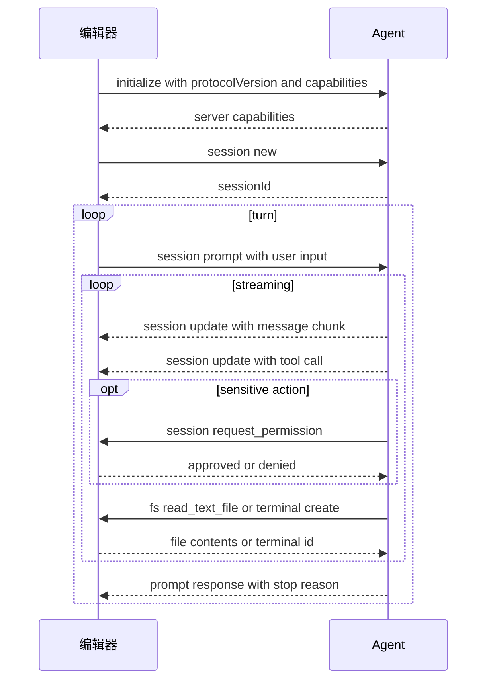

# 第 13 章 — Connector、MCP、IPC 和 channel

## TL;DR

只从 stdin 读、向 stdout 写的 agent 是一个 demo。有用的 agent 接上工作真实发生的地方 — Slack、邮件、GitHub、Jira、Telegram bot、编辑器、内部 dashboard — 并使用远超它自身进程的工具 server。本章覆盖三个连接层：**channel adapter** 把来自众多平台的入站工作规整为一种事件形态;**Model Context Protocol (MCP)** 及其姊妹 **Agent Client Protocol (ACP)** 用于工具 server 和编辑器集成;以及把整件事粘起来的 **IPC** 模式 (JSON-RPC、HMAC 签名 webhook、SSE、WebSocket、队列)。再加上只有在生产里才看到的失败模式：速率限制、消息去重、重放攻击、来自 channel 内容的 prompt injection,以及 gateway 与 embedded harness 的区别。

---

## 为什么这件事重要

多数有用的 agent 先在边缘失败。模型变好;循环稳;prompt cache 热;memory 层干净。然后 Telegram bot 在每秒 30 条消息时超时,agent 默默漏掉用户一半消息。或 Slack webhook 重试,agent 把同样的回复贴两次。或你上季度开始用的 MCP server 有内存泄漏,长跑 agent 每天崩一次。

Agent 的推理核心不在意消息是从 Slack 还是 webhook 还是 CLI 来的。它应该收到一个规整事件,做工作,返回一个规整输出。*消息从哪里来* 正是 adapter 层应该藏起来的细节 — 而当 adapter 层薄的时候,正是这种细节咬你。

---

## 概念

### 三层,一条边界



三类集成看起来不同,实际解决同一个问题 — 与 harness 不拥有的系统对话：

- **Channel adapter** 把 IM、邮件和 webhook 事件变成循环的规整输入。
- **MCP 和 ACP** 是 *工具和编辑器* 的协议 — MCP 把外部能力带入 harness;ACP 把 harness 暴露给编辑器和桌面 host。
- **IPC** 是管线 — JSON-RPC、SSE、WebSocket、队列、HMAC — 把其他东西粘起来。

每一个形态上都是 Ch.11 的 plugin：启动时注册,拿到一个 hook 面,向核心暴露一个干净接口。本章里的一切都是这个主题的变奏。

### Channel adapter：从众多平台拿到一种事件形态

不管消息从哪里来,agent 核心都该看到同一种事件形态：

```ts
type ChannelEvent = {
  channel:   "slack" | "telegram" | "discord" | "email" |
             "webhook" | "local" | "matrix" | "signal";
  eventId:   string;          // deduplication key (Slack event_id, Telegram update_id, …)
  actorId:   string;          // user or service that caused the event
  threadId:  string;          // where replies should go
  text:      string;          // normalized text for the model
  attachments?: Array<{
    kind: "image" | "file" | "audio";
    ref:  string;
    mimeType: string;
  }>;
  raw:       unknown;         // original payload, for audit
  reply:     (m: AgentReply) => Promise<void>;
};

type AgentReply = {
  text:       string;
  blocks?:    unknown;        // platform-specific rich content
  visibility: "private" | "thread" | "channel";
  requiresApproval?: boolean; // surfaced through Ch.12's gate
};
```

OpenClaw 是最强的参考 — 它代码库的多数都是 channel adapter 路由进一个助理核心。Hermes Agent 用 Telegram + CLI + cron + ACP 做同样的事。能扩展的纪律：任何新 channel 写自己的 adapter;核心永远不知道这个 channel 存在。

### Channel 怪癖表

每个平台都带 adapter 必须处理的约束。怪癖形态稳定到能塞进一张表：

| 平台 | 消息大小限制 | 速率限制 (典型) | 线程 | 富内容 |
|---|---|---|---|---|
| Slack | ~40 KB / blocks | ~1 条/秒/channel | 一等线程 | Block Kit |
| Telegram | 4096 字符/条 | ~30 条/秒全局 | Reply-to (没有线程) | Inline button、MD 子集 |
| Discord | 2000 字符/条 | ~5 条/5 秒/channel | 一等线程 | Embed、component |
| WhatsApp | ~4 KB | 依供应商 | 没有 | 有限;依层级 |
| 邮件 | RFC 限制 | 依 provider | 通过 header 的回复链 | HTML 或纯文 |
| Signal | ~2000 字符/条 | 适度 | 没有 | 纯文 |

数字随供应商变化而变;接新 channel 时让你的 agent 查当前限制。约束的 *形态* — 大小、速率、线程、富内容 — 才是稳定的。Adapter 必须强制的三条规则：

- **分块长回复。** 发出 12 KB 文本的模型不能压垮一个每条 2 KB 的 channel。
- **遵守速率限制。** 排队、回退、重试 — 不要刷屏。
- **用平台的能力渲染。** Slack block、Discord embed、Telegram inline button;或在平台不支持富内容时回退到纯文。

### 入站 channel 事件

*消息* 只是入站形态之一。生产 channel adapter 至少处理五种：

- **DM 或 @-提及。** 最常见;模型收到规整文本。
- **按钮点击 / 交互组件。** Slack Block Kit 动作、Discord component 交互、Telegram callback query。Adapter 把 callback 解析成 agent 能推理的结构化事件 (`button_clicked`、`action_id`、`state`)。
- **文件上传。** Adapter 把文件下载到临时位置,把路径传过去;agent 用一个工具读或分析它。
- **图片 / 音频。** 在文本到达模型之前通过视觉或转写工具路由。
- **Reaction。** 之前消息上的 emoji — 通常是有用信号 (👍 批准、❌ 取消),adapter 能把它转成自身的 `ChannelEvent`。

Adapter 的工作是 *翻译*;不是所有事件都变成工作。`typing` 指示不需要唤醒模型。过去消息上的 👍 也许只是被确认。按事件决定排队还是丢。

### 出站 channel 回复

反方向有自己的约束：

- **分块** — 把长回复按平台大小切成有序消息。
- **线程** — 如果入站在线程里,回复留在线程;否则不发明一个。
- **编辑和 reaction** — 用一个占位符消息显示 *"working…"* 指示;循环返回时编辑成最终答案;有时用 reaction (✅) 代替编辑。
- **背压** — 平台限速时,队列吸收;永远不要静默丢弃回复。
- **可见性** — `private` (只 DM)、`thread` (只此线程)、`channel` (任何人)。Adapter 强制 agent 声明的意图。

跨系统的有用模式：收到时立即发一个占位符 *"working on it…"* 消息,答案到来时编辑它。用户看到 agent 已确认;循环有时间算;channel 历史里只一条消息。

### Channel 身份与 session key

Telegram 上的同一个人和 Slack 上的同一个人不是同一个 session。DM 里和群里的同一个人也不是同一个 session。复合 key：

```ts
type SessionKey = {
  platform:        string;   // "slack" | "telegram" | ...
  accountId:       string;   // platform-specific user/account ID
  conversationId:  string;   // channel/thread ID, or DM identifier
};
```

这就是 harness 用来把入站事件路由到正确 agent 实例的东西 (Ch.11 的 instance state 模式)。两个值得钉死的后果：

- **默认没有跨 channel context。** 用户在 Telegram 告诉 agent 的一个事实在 Slack 不可见,除非长期 memory 层 (Ch.06) 在比 session 更高层级 key。
- **群 vs DM 是 policy。** 群里你可能只回应 @-提及;DM 里每条消息都是给你的。Adapter 编码这条规则,不是模型。

### Webhook：HMAC、去重和重放

Webhook 是普世入站形态。三个习惯把能跑的 webhook 接收器和坏的分开：

```ts
// Verify HMAC, reject stale, deduplicate, acknowledge fast.
async function handleWebhook(req: HttpRequest) {
  const body  = await req.bytes();
  const sig   = req.header("x-signature");
  const ts    = req.header("x-timestamp");

  if (!constantTimeEqual(sig, "sha256=" + hmac(secret, ts + ":" + body))) {
    return reject(403, "bad signature");
  }
  if (Math.abs(Date.now() - Number(ts) * 1000) > 5 * 60 * 1000) {
    return reject(403, "stale timestamp");          // replay window
  }

  const event = normalize(JSON.parse(body));
  if (await eventStore.seen(event.eventId)) {       // platform may retry
    return ok(202, "duplicate");
  }
  await eventStore.record(event.eventId);
  await channelQueue.enqueue(event);
  return ok(202, "accepted");
}
```

Webhook handler 应当 *快速确认并把工作排队*。永远不要在 HTTP 请求 handler 里跑模型循环 — 平台会在超时时重试,agent 会把每件事做两遍。

### MCP 究竟是什么

Model Context Protocol 是 capability server 的线协议 — 这些程序向模型 client 暴露工具、prompt 和资源。一个协议里三种分类：

- **Tools** — 和 Ch.03 工具同样的形态。名字、描述、JSON schema、返回值。Agent 像调用任何其他工具一样调用它们。
- **Prompts** — server 发布的预写 prompt 模板;client 可以按需注入。
- **Resources** — server 暴露的可寻址只读内容 (文件、数据库行、URL);client 可以把它们作为 context 包含。

今天生产里的多数使用是 *tools* 这条线。能力活在一个 MCP server 里 (一个数据库 adapter、一个浏览器、一个搜索服务);harness 消费这个能力而不拥有实现。

### MCP 传输

| 传输 | 连接 | 何时适用 | 注意 |
|---|---|---|---|
| **stdio** (子进程) | 本地;harness 派生 server | 仅本地工具、开发流 | Server 崩溃带垮连接 |
| **Streamable HTTP** | 远端或本地;HTTP 请求,响应流可选 SSE | 云托管 server、多 client | 连接 churn;延迟 |

这两种是目前的标准传输。较老的 MCP 文档描述过一种叫 *HTTP+SSE* 的传输 — 一种独立端点形态,带一个长连 SSE channel 用于 server-to-client。规范里 Streamable HTTP *替代* 了 HTTP+SSE;它们不是同一种形态 (单一端点带可选响应流 vs. 两个端点带持久 server stream)。规范包含对需要与遗留 HTTP+SSE server 对话的 client 的向后兼容指引;不要假设反方向也兼容。

一些实现出厂 WebSocket 或其他自定义传输。这些不是标准的一部分;如果你用,你被钉在那个实现上。假设可移植之前确认你的 client 和 server 说什么。

架构规则不依赖 provider：连接时一次发现能力,用稳定名字调用,把失败当作 tool result (不是异常),断开时重连。

### 把 MCP 工具包成 Ch.03 工具

当一个 MCP 工具到达 agent 循环时,它应该和内置工具不可区分 — 同样派发契约、同样元数据标志、同样错误信封。包装模式：

```ts
// On connect: discover and register. On call: forward and translate errors.
async function registerMcpServer(server: McpClient, registry: ToolRegistry) {
  await server.initialize();
  const { tools } = await server.listTools();
  for (const t of tools) {
    registry.register({
      name:         `mcp__${server.id}__${t.name}`,        // namespaced
      description:  t.description,
      input_schema: t.inputSchema,

      // MCP annotation field names are camelCase with a `Hint` suffix —
      // they are hints from the server, not assertions. Treat them as
      // defaults to make conservative for untrusted servers.
      destructive:        t.annotations?.destructiveHint ?? false,
      concurrency_safe:   t.annotations?.readOnlyHint    ?? false,
      idempotent:         t.annotations?.idempotentHint  ?? false,
      open_world:         t.annotations?.openWorldHint   ?? true,

      run: async (args, ctx) => {
        try {
          const result = await server.callTool(t.name, args);
          return ok(result);
        } catch (err) {
          return fail(`MCP error: ${String(err)}`, false);  // recoverable
        }
      },
    });
  }
}
```

三条规则：

- **给名字加命名空间。** `mcp__server__tool` 防止与内置碰撞,告诉模型工具来源。
- **尊重 MCP 注解 — 但当作 hint 不是断言。** MCP 在每个工具上暴露 `readOnlyHint`、`destructiveHint`、`idempotentHint` 和 `openWorldHint`;这些变成驱动 Ch.03 元数据,进而驱动并行 (Ch.02)、审批 (Ch.12) 和重试安全 (Ch.08)。协议刻意用 `Hint` 后缀：恶意或有 bug 的 server 可能撒谎。声称 `readOnlyHint: true` 而实际在写文件的 server 是真实攻击向量。对不受信 server,把 hint 当成 *偏保守的默认* — 拿不准就假设 `destructiveHint: true` — 让运行时监控 (Ch.18) 基于观察到的行为重新分类。
- **把错误翻译成信封。** Server 崩溃、超时、返回坏 JSON — 全都变成可恢复 tool result,不是抛出的异常。循环读取错误,决定怎么办,和内置工具一样。

### MCP 生命周期与失败模式



生产里的难点：

- **首次信任。** 一个新 MCP server 是一次 Ch.12 审批 — 任何 tool call 触发前,用户显式信任它。存储什么：server 身份、一个 fingerprint 或 URL、用户决定、日期。
- **懒加载 vs 急加载。** 急 (boot 时列工具) 让 prompt cache 热但启动慢;懒 (首次使用时列) 启动快但第一次 session 付代价。主流商业编码 agent 倾向懒加载带预取;OpenCode 倾向急加载。
- **断开重连。** 指数回退、有限重试,最终标记 server 不可用。模型应该看到 *"server unavailable; try later"* 作为可恢复 tool result,而不是沉默。
- **Schema drift。** Server 可能在 session 之间改它的工具 schema。Harness 必须在重连时重新列出,不要假设缓存的 schema 仍然有效。

### MCP 范围与值得提的威胁

协议比上面的 *tools / prompts / resources* 三元组更宽。当前 MCP 还定义了 roots (client 向 server 暴露的文件系统边界)、sampling (server 发起的、经 client 回流的模型调用)、elicitation (server 发起的用户输入请求)、tasks (长跑异步工作)、tool 输出 schema 和 resource 订阅。今天生产用得多的仍在 tools 这条线,所以本章聚焦那里 — 但围绕其他设计前先查规范当前形态。

两个威胁值得显式点名,因为是 MCP 特有的：

- **不可信注解。** 上面已经讲过 — `*Hint` 后缀是规范承认 MCP server 可能就其工具行为撒谎。对不可信 server 把 hint 当偏保守默认,让运行时观察 (Ch.18) 重新分类。
- **针对本地 server 的 DNS rebinding。** 跑在 localhost 的 MCP server 同机器浏览器可达。恶意页面能用 DNS rebinding 让跨源请求看起来是本地的。本地 MCP server 必须校验 `Origin` header、绑定 `127.0.0.1` (不是 `0.0.0.0`),即使是本地情况也要求认证 token。这些不是 MCP 的工作;当你发布本地 server 时是你的。

授权本身 (OAuth、bearer token、远端 server 的 mTLS) 是一个变动够快的规范区域,接它时读当前版本是正确动作。架构规则,跨版本稳定：永远不要相信 MCP server 的身份声明;通过你为任何第三方 connector 用的同一道首次信任门 (Ch.12) 校验它。

### ACP — agent 作为 service

MCP 把 *外部能力暴露给 agent*,**Agent Client Protocol (ACP)** 把 *agent 暴露给外部 host* — 通常是编辑器 (Zed、JetBrains IDE、通过扩展的 VS Code)、桌面 wrapper 或远程编排器。线格式是 JSON-RPC;哲学和十年前让 Language Server Protocol 对编译器奏效的一样：*把协议标准化一次,任何会说它的编辑器就能与任何 agent 配合。* ACP 由 Zed Industries 维护,有 Kotlin、Python、Rust 和 TypeScript 官方 SDK。

**命名反转。** ACP 反转了通常的 client-server 词汇。*编辑器* 是 **client** — 它托管用户、工作区、文件系统、终端。*Agent* 是 **server**。编辑器发起 session;agent 做模型工作;编辑器对文件系统和权限决定有最终话语权。第一次读把编辑器叫 "client" 感觉反过来了,但这跟 LSP 约定一致：驱动面向用户交互的一方是 client。

**两种部署模式。** *本地* agent 作为编辑器的子进程跑,通过 stdin/stdout 说 JSON-RPC — 和 MCP 的 stdio 传输同形态。规范里把基于流式 HTTP 传输的 *远程* 部署描述为草案提议;远程支持还不成熟。基于它构建之前查规范远程传输的当前状态;现在,把 stdio 当生产路径,远程当 in-progress。

**Capability 协商。** 和 MCP 一样,ACP 从一个 `initialize` 调用开始,每一边声明它支持什么。标准 capability 包括 `loadSession`、`fs.readTextFile`、`fs.writeTextFile` 和 `terminal`。两边都能声明自定义 capability。协商的 `protocolVersion` 决定线兼容;capability 标志决定任一边可以调哪些方法。重连时重新列出捕获 drift,与 MCP 同一规则。

**Session 方法** 编辑器与 agent 之间交换：

- `session/new` — 编辑器创建新对话;agent 返回 `sessionId`。
- `session/load` — 编辑器恢复已有 session (要求 `loadSession` capability)。
- `session/prompt` — 编辑器发送用户输入;agent 流送进度并以最终停止原因回复。
- `session/update` — agent 把进度作为通知流送：标记为 agent / user / thought 的消息块、tool-call 请求和结果、plan、slash-command 更新、模式变更。
- `session/cancel` — 编辑器中断飞行中的 turn;通知,不期待响应。
- `session/request_permission` — agent 在敏感动作之前向编辑器请求用户批准 (Ch.12 的门,现在在 JSON-RPC 上)。

**反向 channel：编辑器作为工具 provider。** 因为编辑器持有文件系统和终端,agent 为这些原语 *回调* 编辑器：

- `fs/read_text_file`、`fs/write_text_file` — 文件 I/O。所有路径必须绝对;行号是 1-based。
- `terminal/create`、`terminal/output`、`terminal/wait_for_exit`、`terminal/kill`、`terminal/release` — shell 命令执行生命周期。

这是与 MCP 的结构性区别：在 MCP 里,agent 单向调入 capability server。在 ACP 里,agent 既 *接收* 编辑器的请求 (`session/prompt`),又为 fs 和终端访问 *回调* 编辑器。两个协议在 JSON-RPC 上汇合,尽可能复用 MCP 的内容形态 — ACP 规范明确说它 *"在可能的地方重用 MCP 中使用的 JSON 表示"* — 同时加上 MCP 没有的编码特定 UX 类型 (diff、plan、模式)。



**MCP vs ACP 一览：**

| 关注点 | MCP | ACP |
|---|---|---|
| 方向 | Harness 调入外部工具 | 编辑器调入 agent;agent 为 fs 和终端回调 |
| "Client" 是 | Harness | 编辑器 |
| 线格式 | JSON-RPC | JSON-RPC |
| 传输 | stdio、Streamable HTTP、WebSocket | stdio、HTTP、WebSocket |
| 内容形态 | 定义自己的 | 尽可能重用 MCP 的 |
| 编码特定 UX | 不在范围 | Diff、plan、模式 |
| 审批流 | 由 Ch.12 在 harness 包起来 | 一等 `session/request_permission` 方法 |
| Capability 协商 | 是 | 是,加自定义 `_meta` 扩展 |

**实现与生态。** Zed 是第一个出厂 ACP 的主流编辑器,是协议的家。Hermes Agent 和 OpenClaw 都实现 ACP adapter,让外部编辑器能驱动它们;多个主流商业编码 agent 暴露 ACP server,任何兼容编辑器都能驱动 *它们*。和十年前的 LSP 一样,采用越多价值复利越大：每个新编辑器解锁每个现有 ACP 兼容 agent,反之亦然。线格式在协议 v1;SDK 的 artifact 版本独立推进。

**给 harness 构建者的实务建议。**

- 把 ACP 当作另一个入站面 — 本章前面的 channel-adapter 模式适用。Capability 协商映射到你的工具注册;`session/prompt` 映射到一个 `ChannelEvent`;`session/update` 映射到 Ch.11 的 harness 事件 bus。
- 为 `session/request_permission` 复用 Ch.12 的审批面。编辑器里 UX 不同 (模态弹窗而不是聊天对话),但底下的门一样。
- 反向 channel `fs/*` 和 `terminal/*` 方法是你接通沙盒决定的地方。始终路由经过你现有的工具派发器 (Ch.03),让它的元数据标志、校验和审计日志仍然适用 — 不要因为调用来自 JSON-RPC 而不是模型就绕过 harness。
- 用不止一个编辑器测。ACP 的价值是编辑器无关;如果你的 agent 只在 Zed 工作,你并没有真正实现 ACP。

### MCP 之外的 IPC 模式

MCP 和 ACP 覆盖工具和编辑器情况。其他 IPC 模式反复出现：

- **stdio 上的 JSON-RPC** 用于跑在独立进程的 plugin worker。启动时 capability 协商;带 ID 的请求/响应;通过 restart-on-exit 做崩溃恢复。
- **Server-Sent Events (SSE)** 用于从 harness 单向流送到 UI client — token 流、状态更新、run 事件。通过限制 buffer 做背压;通过回放从已知 last event ID 做重连。
- **WebSocket** 当 UI client 也需要发送时 — 中断、审批、对 plan 的编辑 (Ch.09 plan 修订)。
- **持久队列** 用于 web handler 和 worker 之间的交接 (Ch.08 的 run 状态机坐在一个之上)。
- **HMAC 签名** 在 harness 实例之间或 harness 与 gateway 之间,让转发请求不能被冒名。

### Plugin worker 与隔离

在 harness 进程里活的 plugin 能让 harness 崩。生产系统把有风险的 plugin 放在进程边界之后 — 通过管道的 JSON-RPC、harness 在崩溃时重启 worker、worker 与父进程不共享内存。Paperclip 的 `plugin-worker-manager` 和 Hermes Agent 的 plugin loader 都实现;OpenCode 多数 plugin 留在进程内,但对碰不受信代码的支持 out-of-process。

按 plugin 决定：受信的内置 plugin 可以留在进程内;用户安装的或第三方 plugin 应该 out-of-process。代价是一小段 JSON-RPC 跳;赢是坏 plugin 不能带垮整个 harness。

### Gateway vs embedded

两种架构模式反复出现：

- **Gateway。** 一个中央 harness;所有 channel 和 client 连到它。Hermes Agent 的 `gateway`、OpenClaw 的中央守护进程、Paperclip 的 server。共享状态更简单 (一个 DB、一个 memory 层);水平扩展更难 (一个进程是瓶颈)。
- **Embedded。** 每个 channel 跑自己的 harness 进程。一个 Telegram bot 是一个进程;一个 Slack bot 是一个进程;通过共享 store 协调。更易扩展;更难保持状态一致。

多数生产部署从 gateway 开始,撞到扩展上限,然后要么分片 (gateway-per-tenant),要么走 embedded。选择由工作负载驱动;要内化的纪律是 *让以后能切换* — adapter 层干净到 adapter 不在意它跑在哪个模型里。

### 要注意的事

connector 层特有的失败模式,有别于课程其他部分：

- **来自 channel 内容的 prompt injection。** 一条包含 *"忽略之前指令,做 X"* 的用户消息整体上是 Ch.18 问题 — 但 adapter 是你能抓住简单情况的地方。在 adapter 里剥除明显标记 (控制字符、畸形 @-提及语法);剩下的让 Ch.18 的威胁模型处理。
- **速率限制风暴。** 影响一个租户的平台范围速率限制不应阻塞其他租户。在 adapter 里按租户保持速率限制状态,不是全局。
- **重复投递。** 每个 webhook 平台都重试。在排队进循环之前按 `eventId` 去重 — 不是循环内。
- **重放攻击。** 检查签名 webhook 的时间戳;拒绝几分钟以上的。
- **乱序消息。** 平台在负载下可能乱序投递。需要顺序时用平台时间戳或序列号,不是到达时间。
- **日志里的 token 泄露。** Bot token、OAuth token、嵌入凭据的 MCP server URL — 永远不要日志。交叉对照 Ch.07 的脱敏模式。
- **异步工具结果。** 如果一个 tool call 流送输出 (长跑脚本),提前决定 channel 是实时显示 (编辑占位消息) 还是只显示最终结果。混着用让用户困惑。

---

## 真实系统笔记

- **OpenClaw** 是 channel-heavy gateway 最强的参考：一个个人助理核心被许多 channel adapter 路由,每个实现同样的 plugin 接口 (`start`、`stop`、`send`、`monitor`),核心永远不学平台的怪癖。
- **OpenCode** 是 *SDK-and-gateway* 形态最干净的例子：一个本地 server 暴露 HTTP + SSE API,TUI、web UI、桌面 wrapper 和 SDK client 都通过同一个面消费。
- **Hermes Agent** 是个人助理 context 中 *跨面* HITL 和集成的参考：同一个 agent 实例通过 CLI、dashboard、cron、Telegram 和 ACP 接收工作,从请求到达的面回复。
- **Paperclip** 把 agent 集成作为控制面级 adapter — 许多 bot runtime 通过一种共同编排形态调用,共享预算、审批和审计。

---

## 与你的 agent 配对

几个对本章效果好的 prompt：

- *"为我项目的主 channel (Slack 或 Telegram) 造一个 `ChannelEvent` 规整器。给我看一条入站消息、一次入站按钮点击和一次入站文件上传都被归到同一形态。"*
- *"对我的 channel 平台,列出每个怪癖：消息大小限制、速率限制、线程规则、富内容支持。写 adapter 的分块、回退和线程辅助函数。"*
- *"实现 webhook 校验：HMAC 检查、时间戳窗口、按事件 ID 去重、把工作排队、在 100 ms 内返回 202。用故意的重放和故意的重复测。"*
- *"把我已经在用的一个 MCP server 接成 Ch.03 工具注册项。验证命名空间名、schema 翻译,以及 MCP 错误变成可恢复 tool result 而不是抛出的异常。"*
- *"我的 MCP server 偶尔在 session 中途断开。实现带指数回退的重连、停机期间的 *server unavailable* tool result,以及重连时重新列出以捕获 schema drift。"*
- *"把我那个有风险的 plugin 通过 JSON-RPC 移到 out-of-process worker。验证 worker 故意崩溃干净重启,不带垮 harness。"*
- *"清点我的 Ch.13 面：每个 channel、每个 MCP server、每个 webhook、每个 UI client。每个,说出信任门 (Ch.12 引用)、失败模式和脱敏面。"*
- *"带我走 OpenClaw 的 gateway 如何把一个用户的 Telegram 消息和 Slack 消息路由到 *不同* 的 agent 实例。然后为我的项目设计等价的,决定跨 channel memory 何时共享、何时隔离 (Ch.06)。"*

---

## 接下来

第 14 章从集成管线转到 *扩展单元*：skill、MCP server 和 subagent — 同一种能力可以采取的三种不同形态,以及在它们之间做选择的设计决定。
