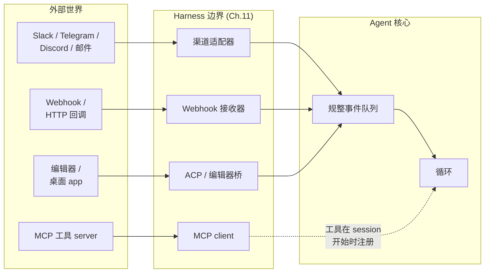
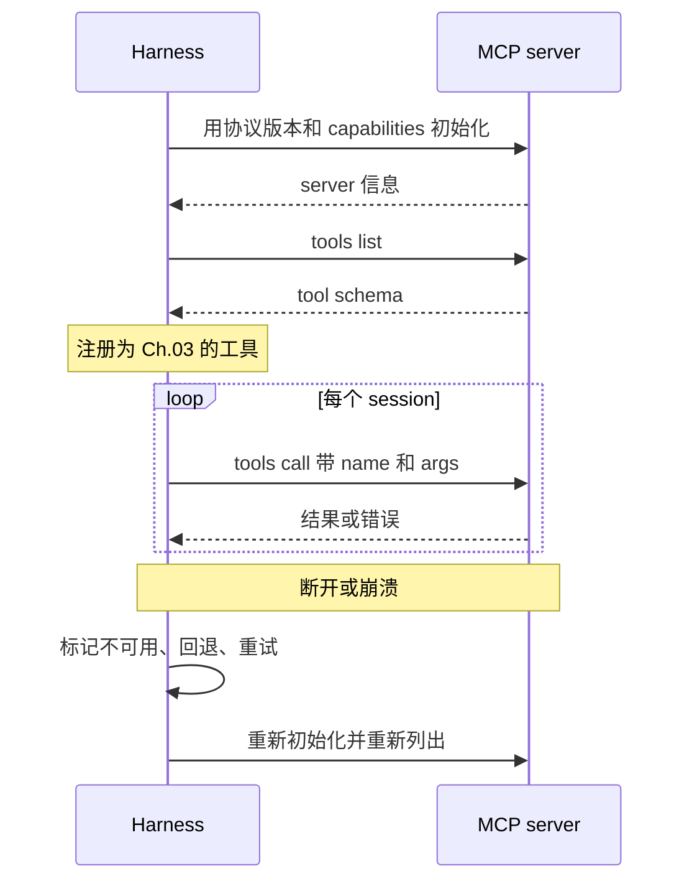
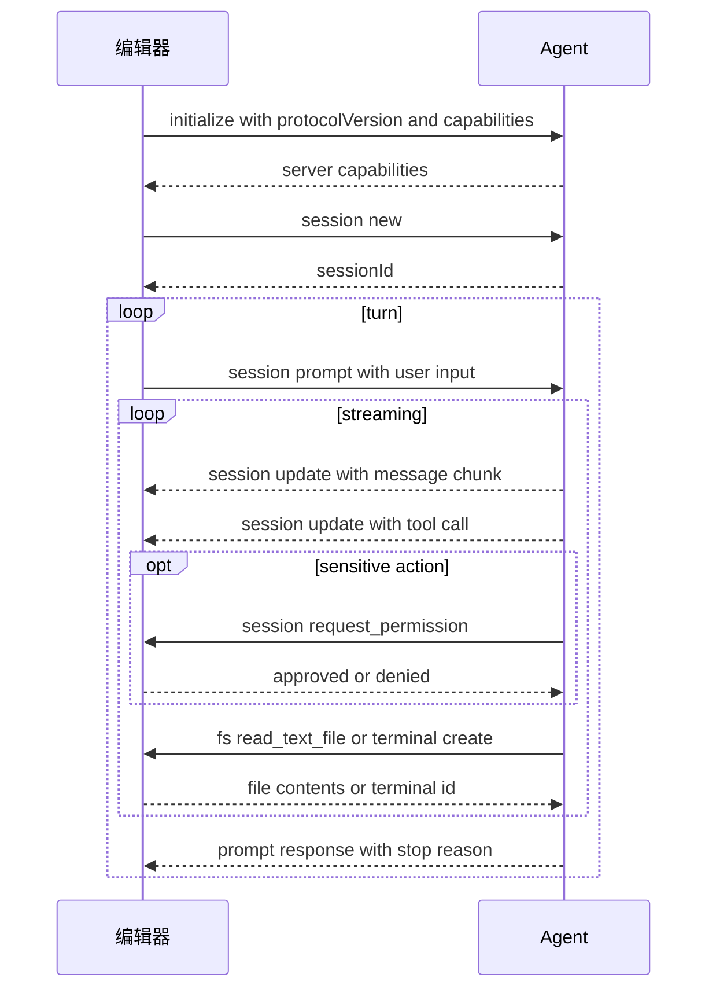

# 第 13 章 — 连接器、MCP、IPC 和渠道

## TL;DR

只会从 stdin 读、往 stdout 写的 agent，只是个 demo。真正有用的 agent 会接入工作真实发生的地方 — Slack、邮件、GitHub、Jira、Telegram 机器人、编辑器、内部 dashboard — 并使用远在自身进程之外的工具 server。本章覆盖三个连接层：**渠道适配器**把来自众多平台的入站工作规整成统一的事件形态;**Model Context Protocol (MCP)** 及其姊妹 **Agent Client Protocol (ACP)**，用于对接工具 server 和编辑器;以及把这一切粘合到一起的 **IPC** 模式 (JSON-RPC、HMAC 签名 webhook、SSE、WebSocket、队列)。还有那些只有在生产环境才会浮现的失败模式：速率限制、消息去重、重放攻击、来自渠道内容的 prompt injection，以及 gateway 与内嵌式 harness 之间的区别。

---

## 为什么这件事重要

多数有用的 agent 都是先在边缘崩掉。模型在变好;循环很稳;prompt cache 是热的;记忆层很干净。然后 Telegram 机器人在每秒 30 条消息的流量下超时，agent 悄无声息地漏掉了用户一半的消息。又或者 Slack webhook 重试了一次，agent 把同一条回复贴了两遍。再或者你上季度开始用的那个 MCP server 有内存泄漏，长时间运行的 agent 每天崩一次。

Agent 的推理核心并不关心消息究竟来自 Slack、webhook 还是 CLI。它应该收到一个规整后的事件，干完活，返回一个规整后的输出。*消息从哪里来*，恰恰是适配器层本该藏起来的那种细节 — 而当适配器层太薄时，恰恰也是这种细节反过来咬你一口。

---

## 概念

### 三层,一条边界



这三类集成看上去各不相同，实际上解决的是同一个问题 — 与 harness 自己不拥有的系统打交道：

- **渠道适配器**把即时通讯、邮件和 webhook 事件转换成循环可用的规整输入。
- **MCP 和 ACP** 是面向*工具和编辑器*的协议 — MCP 把外部能力引入 harness;ACP 把 harness 暴露给编辑器和桌面 host。
- **IPC** 是底层管线 — JSON-RPC、SSE、WebSocket、队列、HMAC — 把上面这些粘合起来。

它们在形态上都是 Ch.11 意义上的 plugin：启动时注册，拿到一组 hook，向核心暴露一个干净的接口。本章讲的一切，都是这个主题的变奏。

### 渠道适配器：把众多平台收敛成一种事件形态

不管消息从哪来，agent 核心都应该看到同一种事件形态：

```ts
type ChannelEvent = {
  channel:   "slack" | "telegram" | "discord" | "email" |
             "webhook" | "local" | "matrix" | "signal";
  eventId:   string;          // deduplication key (Slack event_id, Telegram update_id, …)
  actorId:   string;          // user or service that caused the event
  threadId:  string;          // where replies should go
  text:      string;          // normalized text for the model
  attachments?: Array<{
    kind: "image" | "file" | "audio";
    ref:  string;
    mimeType: string;
  }>;
  raw:       unknown;         // original payload, for audit
  reply:     (m: AgentReply) => Promise<void>;
};

type AgentReply = {
  text:       string;
  blocks?:    unknown;        // platform-specific rich content
  visibility: "private" | "thread" | "channel";
  requiresApproval?: boolean; // surfaced through Ch.12's gate
};
```

OpenClaw 是这方面最强的参考 — 它代码库的绝大部分就是把众多渠道适配器路由进同一个助理核心。Hermes Agent 用 Telegram + CLI + cron + ACP 做的是同一件事。真正能扩展的纪律是：每接入一个新渠道，就为它写一个独立的适配器;核心永远不必知道这个渠道的存在。

### 渠道怪癖对照表

每个平台都会带来适配器必须应对的约束。这些怪癖的形态足够稳定，稳定到能塞进一张表里：

| 平台 | 消息大小限制 | 速率限制 (典型) | 线程 | 富内容 |
|---|---|---|---|---|
| Slack | ~40 KB / blocks | ~1 条/秒/渠道 | 原生线程 | Block Kit |
| Telegram | 4096 字符/条 | ~30 条/秒全局 | Reply-to (无线程) | Inline button、MD 子集 |
| Discord | 2000 字符/条 | ~5 条/5 秒/渠道 | 原生线程 | Embed、component |
| WhatsApp | ~4 KB | 依供应商而定 | 无 | 有限;依层级而定 |
| 邮件 | RFC 限制 | 依 provider 而定 | 通过 header 维系回复链 | HTML 或纯文 |
| Signal | ~2000 字符/条 | 适中 | 无 | 纯文 |

这些数字会随供应商的变动而变;接入新渠道时，让你的 agent 去查当前的限制。真正稳定的是约束的*形态* — 大小、速率、线程、富内容。适配器必须强制执行的三条规则：

- **拆分过长的回复。** 模型一口气吐出 12 KB 文本，不能就此压垮一个每条上限 2 KB 的渠道。
- **遵守速率限制。** 排队、退避、重试 — 绝不刷屏。
- **用平台自身的能力来渲染。** Slack block、Discord embed、Telegram inline button;若平台不支持富内容，则回退到纯文本。

### 入站渠道事件

*消息*只是入站形态中的一种。生产级渠道适配器至少要处理五种：

- **私信或 @-提及。** 最常见的一种;模型收到的是规整后的文本。
- **按钮点击 / 交互组件。** Slack Block Kit 动作、Discord component 交互、Telegram callback query。适配器把这次 callback 解析成 agent 能据以推理的结构化事件 (`button_clicked`、`action_id`、`state`)。
- **文件上传。** 适配器把文件下载到临时位置，再把路径传进去;agent 用某个工具去读取或分析它。
- **图片 / 音频。** 先经过视觉或转写工具，转成文本后再送到模型。
- **Reaction（表情回应）。** 在某条历史消息上加的 emoji — 往往是个有用的信号 (👍 表示批准、❌ 表示取消)，适配器可以把它转成一个独立的 `ChannelEvent`。

适配器的职责是*翻译*;并非所有事件都要变成工作。`typing`（正在输入）这种指示不需要唤醒模型。某条旧消息上的一个 👍，也许确认一下就够了。要逐个事件地决定：是入队，还是丢弃。

### 出站渠道回复

反方向也有自己的一套约束：

- **分块** — 把长回复按平台允许的大小切成多条消息，并保持顺序。
- **线程** — 入站消息在某个线程里，回复就留在那个线程;入站不在线程里，就别凭空造一个。
- **编辑与 reaction** — 先用一条占位消息显示 *"working…"* 状态;循环返回结果时把它编辑成最终答案;有时也用一个 reaction (✅) 来代替编辑。
- **背压** — 平台限速时，由队列来吸收;绝不静默丢弃回复。
- **可见性** — `private` (仅私信)、`thread` (仅本线程)、`channel` (所有人可见)。适配器负责贯彻 agent 声明的意图。

一个在各类系统里都好用的模式：收到消息时立刻发一条 *"working on it…"* 占位消息，等答案到了再把它编辑掉。用户看到 agent 已经收到请求;循环也有时间去计算;而渠道历史里始终只有一条消息。

### 渠道身份与 session key

Telegram 上的某个人和 Slack 上的同一个人，不算同一个 session。同一个人在私信里和在群里，也不算同一个 session。要靠这个复合 key 来区分：

```ts
type SessionKey = {
  platform:        string;   // "slack" | "telegram" | ...
  accountId:       string;   // platform-specific user/account ID
  conversationId:  string;   // channel/thread ID, or DM identifier
};
```

harness 正是靠它把入站事件路由到正确的 agent 实例 (Ch.11 的实例状态模式)。有两点后果值得钉死：

- **默认不存在跨渠道上下文。** 用户在 Telegram 里告诉 agent 的某个事实，在 Slack 里是看不到的 — 除非长期记忆层 (Ch.06) 用比 session 更高的层级来做 key。
- **群聊 vs 私信是一条策略。** 群里你大概只回应 @-提及;私信里则每条消息都是冲你来的。编码这条规则的是适配器，而不是模型。

### Webhook：HMAC、去重与重放

Webhook 是最通用的入站形态。有三个习惯，把能用的 webhook 接收器和有问题的区分开来：

```ts
// Verify HMAC, reject stale, deduplicate, acknowledge fast.
async function handleWebhook(req: HttpRequest) {
  const body  = await req.bytes();
  const sig   = req.header("x-signature");
  const ts    = req.header("x-timestamp");

  if (!constantTimeEqual(sig, "sha256=" + hmac(secret, ts + ":" + body))) {
    return reject(403, "bad signature");
  }
  if (Math.abs(Date.now() - Number(ts) * 1000) > 5 * 60 * 1000) {
    return reject(403, "stale timestamp");          // replay window
  }

  const event = normalize(JSON.parse(body));
  if (await eventStore.seen(event.eventId)) {       // platform may retry
    return ok(202, "duplicate");
  }
  await eventStore.record(event.eventId);
  await channelQueue.enqueue(event);
  return ok(202, "accepted");
}
```

Webhook handler 应当*快速确认、把工作排队*。绝不要在 HTTP 请求的 handler 里直接跑模型循环 — 一旦超时，平台会重试，agent 就会把每件事都做两遍。

### MCP 究竟是什么

Model Context Protocol 是一种面向能力 server 的传输格式 — 这些程序向模型 client 暴露工具、prompt 和资源。一个协议里装着三类东西：

- **Tools（工具）** — 和 Ch.03 的工具是同一种形态。名字、描述、JSON schema、返回值。Agent 调用它们的方式，和调用任何别的工具没有区别。
- **Prompts** — server 发布的预写 prompt 模板;client 可以按需注入。
- **Resources（资源）** — server 暴露的可寻址只读内容 (文件、数据库行、URL);client 可以把它们作为上下文纳入。

如今生产环境用得最多的是 *tools* 这条线。能力本身住在一个 MCP server 里 (一个数据库适配器、一个浏览器、一个搜索服务);harness 消费这份能力，却不拥有它的实现。

### MCP 传输

| 传输 | 连接 | 何时适用 | 注意事项 |
|---|---|---|---|
| **stdio** (子进程) | 本地;harness 派生出 server | 仅限本地的工具、开发流程 | server 崩溃会一并带垮连接 |
| **Streamable HTTP** | 远端或本地;HTTP 请求，响应流可选用 SSE | 云托管 server、多 client | 连接频繁建立销毁;延迟 |

这两种是目前的标准传输。较老的 MCP 文档里描述过一种叫 *HTTP+SSE* 的传输 — 它是一种分离端点的形态，配一条长连的 SSE 通道做 server 到 client 的推送。规范中 Streamable HTTP *取代*了 HTTP+SSE;两者不是同一种形态 (单一端点 + 可选的响应流，对比两个端点 + 一条常驻的 server stream)。规范为那些需要对接遗留 HTTP+SSE server 的 client 提供了向后兼容的指引;但别指望反方向也能兼容。

有些实现自带 WebSocket 或其他自定义传输。这些都不属于标准的一部分;一旦使用，你就被绑死在那个具体实现上。在假定可移植之前，先确认你的 client 和 server 究竟说哪种传输。

架构层面的规则与具体 provider 无关：连接时一次性发现能力，用稳定的名字去调用，把失败当作 tool result 来处理 (而非抛异常)，断开时重连。

### 把 MCP 工具包装成 Ch.03 的工具

当一个 MCP 工具抵达 agent 循环时，它应该和内置工具难分彼此 — 同一套派发契约、同一套元数据标志、同一套错误信封。包装的模式是：

```ts
// On connect: discover and register. On call: forward and translate errors.
async function registerMcpServer(server: McpClient, registry: ToolRegistry) {
  await server.initialize();
  const { tools } = await server.listTools();
  for (const t of tools) {
    registry.register({
      name:         `mcp__${server.id}__${t.name}`,        // namespaced
      description:  t.description,
      input_schema: t.inputSchema,

      // MCP annotation field names are camelCase with a `Hint` suffix —
      // they are hints from the server, not assertions. Treat them as
      // defaults to make conservative for untrusted servers.
      destructive:        t.annotations?.destructiveHint ?? false,
      concurrency_safe:   t.annotations?.readOnlyHint    ?? false,
      idempotent:         t.annotations?.idempotentHint  ?? false,
      open_world:         t.annotations?.openWorldHint   ?? true,

      run: async (args, ctx) => {
        try {
          const result = await server.callTool(t.name, args);
          return ok(result);
        } catch (err) {
          return fail(`MCP error: ${String(err)}`, false);  // recoverable
        }
      },
    });
  }
}
```

三条规则：

- **给名字加上命名空间。** `mcp__server__tool` 既防止与内置工具撞名，也告诉模型这个工具从哪来。
- **尊重 MCP 注解 — 但把它当 hint，而非断言。** MCP 在每个工具上暴露 `readOnlyHint`、`destructiveHint`、`idempotentHint` 和 `openWorldHint`;这些会转成 Ch.03 的元数据，进而驱动并行 (Ch.02)、审批 (Ch.12) 和重试安全性 (Ch.08)。协议刻意用 `Hint` 后缀：恶意或有 bug 的 server 是会撒谎的。一个声称 `readOnlyHint: true`、实际却在写文件的 server，就是一条真实存在的攻击向量。对不受信的 server，把这些 hint 当作*偏保守的默认值* — 拿不准时就当 `destructiveHint: true` — 再让运行时监控 (Ch.18) 根据观察到的实际行为去重新分类。
- **把错误翻译成信封。** server 崩溃、超时、返回畸形 JSON — 这些统统变成可恢复的 tool result，而不是抛出的异常。循环读到这个错误，再决定下一步怎么办，和处理内置工具时一模一样。

### MCP 生命周期与失败模式



生产里的难点：

- **首次信任。** 接入一个新的 MCP server 本身就是一次 Ch.12 审批 — 在任何 tool call 能触发之前，用户要显式地信任它。需要存下来的是：server 身份、一个 fingerprint 或 URL、用户的决定，以及日期。
- **懒加载 vs 急加载。** 急加载 (启动时就列出工具) 能让 prompt cache 保持热，但拖慢启动;懒加载 (首次用到时才列) 启动快，但代价由第一个 session 承担。主流商业编码 agent 倾向于懒加载配预取;OpenCode 倾向急加载。
- **断开重连。** 指数退避、限定重试次数，最终把 server 标记为不可用。模型应当看到 *"server unavailable; try later"* 这样一个可恢复的 tool result，而不是一片沉默。
- **Schema drift（schema 漂移）。** server 可能在两次 session 之间改掉自己的工具 schema。harness 必须在重连时重新列出工具，不能想当然地认为缓存的 schema 还有效。

### MCP 的范围，以及值得点名的威胁

协议远不止上面那个 *tools / prompts / resources* 三元组。当前的 MCP 还定义了 roots (client 向 server 暴露的文件系统边界)、sampling (server 发起、经 client 回流的模型调用)、elicitation (server 发起的用户输入请求)、tasks (长时间运行的异步工作)、工具的输出 schema，以及 resource 订阅。今天生产里用得多的仍然集中在 tools 这条线，所以本章也聚焦于此 — 但要围绕其余部分做设计之前，先去查规范里它们当前的形态。

有两个威胁值得显式点名，因为它们是 MCP 特有的：

- **不可信的注解。** 上面已经讲过 — `*Hint` 后缀正是规范在承认：MCP server 可能就自己工具的行为撒谎。对不可信的 server，把 hint 当作偏保守的默认值，再让运行时观察 (Ch.18) 去重新分类。
- **针对本地 server 的 DNS rebinding。** 跑在 localhost 上的 MCP server，同一台机器上的浏览器是能够访问的。恶意页面可以利用 DNS rebinding，让跨源请求看起来像是本地发出的。本地 MCP server 必须校验 `Origin` header、绑定到 `127.0.0.1` (而非 `0.0.0.0`)，并且即便是本地场景也要求认证 token。这些都不是 MCP 替你做的事;当你发布一个本地 server 时，这是你自己的责任。

授权本身 (OAuth、bearer token、远端 server 的 mTLS) 是规范里变动很快的一块，所以接入它时去读当前版本才是正确做法。有一条架构规则跨版本稳定：永远不要相信 MCP server 自报的身份;用你对待任何第三方连接器都会用的那道首次信任门 (Ch.12) 去校验它。

### ACP — 把 agent 当作服务

如果说 MCP 是把*外部能力暴露给 agent*，那么 **Agent Client Protocol (ACP)** 就是把 *agent 暴露给外部 host* — 通常是编辑器 (Zed、JetBrains 系 IDE、通过扩展接入的 VS Code)、桌面 wrapper 或远程编排器。传输格式是 JSON-RPC;它的理念和十年前让 Language Server Protocol 在编译器领域奏效的那套一模一样：*把协议标准化一次，任何会说这套协议的编辑器，就能与任何 agent 配合。* ACP 由 Zed Industries 维护，提供 Kotlin、Python、Rust 和 TypeScript 的官方 SDK。

**命名是反着来的。** ACP 把常规的 client-server 称谓颠倒了过来。*编辑器*才是 **client** — 它托管着用户、工作区、文件系统和终端。*Agent* 反而是 **server**。编辑器发起 session;agent 做模型那部分工作;而对文件系统和权限的决定，最终拍板的是编辑器。第一次读到把编辑器叫 "client" 会觉得别扭，但这正是沿用了 LSP 的约定：谁驱动面向用户的交互，谁就是 client。

**两种部署模式。** *本地* agent 作为编辑器的子进程运行，通过 stdin/stdout 说 JSON-RPC — 和 MCP 的 stdio 传输是同一种形态。规范里把基于流式 HTTP 传输的*远程*部署列为草案提议;远程支持目前还不成熟。在它上面动工之前，先查规范里远程传输的当前状态;就现在而言，把 stdio 当作生产路径，把远程当作仍在推进中的东西。

**能力协商。** 和 MCP 一样，ACP 也从一次 `initialize` 调用开始，双方各自声明自己支持什么。标准能力包括 `loadSession`、`fs.readTextFile`、`fs.writeTextFile` 和 `terminal`。两边都可以声明自定义能力。协商出的 `protocolVersion` 决定传输层的兼容性;能力标志决定任一方可以调用哪些方法。重连时重新列出，以捕获漂移 — 这条规则与 MCP 一致。

**编辑器与 agent 之间交换的 session 方法：**

- `session/new` — 编辑器创建一段新对话;agent 返回一个 `sessionId`。
- `session/load` — 编辑器恢复一段已有的 session (需要 `loadSession` 能力)。
- `session/prompt` — 编辑器发来用户输入;agent 流式回传进度，并以一个最终停止原因作答。
- `session/update` — agent 以通知的形式流式回传进度：标记为 agent / user / thought 的消息块、tool-call 的请求与结果、plan、slash-command 更新、模式变更。
- `session/cancel` — 编辑器中断进行中的 turn;这是一条通知，不期待响应。
- `session/request_permission` — 在执行敏感动作之前，agent 向编辑器请求用户批准 (就是 Ch.12 那道门，只不过现在跑在 JSON-RPC 上)。

**反向通道：编辑器充当工具 provider。** 由于文件系统和终端握在编辑器手里，agent 要*回调*编辑器来使用这些原语：

- `fs/read_text_file`、`fs/write_text_file` — 文件 I/O。所有路径必须是绝对路径;行号从 1 开始。
- `terminal/create`、`terminal/output`、`terminal/wait_for_exit`、`terminal/kill`、`terminal/release` — shell 命令执行的完整生命周期。

这正是与 MCP 的结构性差异：在 MCP 里，agent 单向地调入能力 server。在 ACP 里，agent 既*接收*来自编辑器的请求 (`session/prompt`)，又为了访问 fs 和终端而*回调*编辑器。两个协议都汇聚到 JSON-RPC 上，并尽量复用 MCP 的内容形态 — ACP 规范明确说它 *"在可能之处复用 MCP 所用的 JSON 表示"* — 同时补上了 MCP 没有的、面向编码场景的 UX 类型 (diff、plan、模式)。



**MCP vs ACP 速览：**

| 关注点 | MCP | ACP |
|---|---|---|
| 方向 | harness 调入外部工具 | 编辑器调入 agent;agent 反过来为 fs 和终端回调编辑器 |
| 谁是 "client" | harness | 编辑器 |
| 传输格式 | JSON-RPC | JSON-RPC |
| 传输 | stdio、Streamable HTTP、WebSocket | stdio、HTTP、WebSocket |
| 内容形态 | 自己定义 | 尽量复用 MCP 的 |
| 面向编码的 UX | 不在范围内 | diff、plan、模式 |
| 审批流 | 由 Ch.12 在 harness 处包裹 | 原生的 `session/request_permission` 方法 |
| 能力协商 | 有 | 有，外加自定义 `_meta` 扩展 |

**实现与生态。** Zed 是第一个发布 ACP 的主流编辑器，也是这个协议的大本营。Hermes Agent 和 OpenClaw 都实现了 ACP 适配器，好让外部编辑器能驱动它们;多个主流商业编码 agent 则暴露了 ACP server，让任何兼容的编辑器都能反过来驱动*它们*。和十年前的 LSP 一样，采用得越多，价值越是复利式增长：每多一个编辑器，就解锁了所有现有的 ACP 兼容 agent，反之亦然。传输格式目前是协议 v1;各 SDK 的发行版本则各自独立演进。

**给 harness 构建者的实用建议。**

- 把 ACP 当作又一个入站面来对待 — 本章前面那套渠道适配器模式同样适用。能力协商对应到你的工具注册表;`session/prompt` 对应到一个 `ChannelEvent`;`session/update` 对应到 Ch.11 里 harness 的事件总线。
- 在 `session/request_permission` 上复用你 Ch.12 的审批面。编辑器里的 UX 不一样 (是个模态弹窗，而非聊天对话框)，但底下那道门是同一道。
- 反向通道的 `fs/*` 和 `terminal/*` 方法，正是你落实沙箱决策的地方。始终让它们走你现有的工具派发器 (Ch.03)，使其元数据标志、校验和审计日志依然生效 — 别因为这次调用来自 JSON-RPC 而不是模型，就绕开 harness。
- 别只在一个编辑器上测。ACP 的价值就在于编辑器无关;如果你的 agent 只能在 Zed 里跑，那你其实并没有真正实现 ACP。

### MCP 之外的 IPC 模式

MCP 和 ACP 覆盖了工具和编辑器这两类情况。还有一些 IPC 模式会反复出现：

- **stdio 上的 JSON-RPC**，用于运行在独立进程里的 plugin worker。启动时做能力协商;请求/响应带 ID;靠退出即重启 (restart-on-exit) 来做崩溃恢复。
- **Server-Sent Events (SSE)**，用于从 harness 单向流式推送到 UI client — token 流、状态更新、run 事件。靠限制 buffer 大小做背压;靠从已知的 last event ID 回放来做重连。
- **WebSocket**，用在 UI client 也需要往回发东西的场合 — 中断、审批、对 plan 的编辑 (Ch.09 的 plan 修订)。
- **持久队列**，用于 web handler 与 worker 之间的交接 (Ch.08 的 run 状态机就架在它之上)。
- **HMAC 签名**，用在 harness 实例之间、或 harness 与 gateway 之间，让转发的请求无法被伪造。

### Plugin worker 与隔离

一个活在 harness 进程内的 plugin，是能把整个 harness 拖崩的。生产系统会把有风险的 plugin 隔到一道进程边界之后 — 走管道上的 JSON-RPC、harness 在它崩溃时重启 worker、worker 与父进程不共享内存。Paperclip 的 `plugin-worker-manager` 和 Hermes Agent 的 plugin loader 都是这么实现的;OpenCode 则把多数 plugin 留在进程内，但对那些会碰到不受信代码的 plugin 提供进程外运行的支持。

逐个 plugin 来定夺：受信的内置 plugin 可以留在进程内;用户安装的或第三方的 plugin 则应当放到进程外。代价不过是一小段 JSON-RPC 往返;换来的是一个坏 plugin 不至于把整个 harness 一起拖垮。

### Gateway vs 内嵌式

有两种架构模式反复出现：

- **Gateway（网关）。** 一个中央 harness;所有渠道和 client 都连到它。Hermes Agent 的 `gateway`、OpenClaw 的中央守护进程、Paperclip 的 server 都是这一类。共享状态更简单 (一个 DB、一个记忆层);但水平扩展更难 (单个进程就是瓶颈)。
- **内嵌式（embedded）。** 每个渠道跑自己的 harness 进程。Telegram 机器人是一个进程;Slack 机器人是另一个进程;它们靠一个共享 store 来协调。更容易扩展;但更难保持状态一致。

多数生产部署都是从 gateway 起步，撞上扩展上限，然后要么分片 (一租户一 gateway)，要么转向内嵌式。这个选择由工作负载驱动;真正要内化的纪律是*让自己日后还能切换* — 把适配器层保持得足够干净，干净到一个适配器根本不关心自己跑在哪种模式里。

### 需要留心的事

下面这些是连接器层特有的失败模式，区别于课程其他部分讲过的：

- **来自渠道内容的 prompt injection。** 一条写着 *"忽略之前的指令，去做 X"* 的用户消息，整体上属于 Ch.18 的问题 — 但适配器正是你能拦下简单情况的地方。在适配器里剥掉明显的标记 (控制字符、畸形的 @-提及语法);剩下的交给 Ch.18 的威胁模型去处理。
- **速率限制风暴。** 影响某一个租户的平台级速率限制，不应连累其他租户。把速率限制的状态按租户存在适配器里，而不是全局共用一份。
- **重复投递。** 每个 webhook 平台都会重试。要在事件入队进循环*之前*就按 `eventId` 去重 — 而不是在循环内部去重。
- **重放攻击。** 检查签名 webhook 上的时间戳;凡是早于几分钟以前的，一律拒绝。
- **乱序消息。** 平台在高负载下可能乱序投递。需要保序时，用平台给的时间戳或序列号，而不是消息到达的时间。
- **日志里的 token 泄露。** 机器人 token、OAuth token、URL 里嵌着凭据的 MCP server 地址 — 这些永远不要写进日志。可交叉参照 Ch.07 的脱敏模式。
- **异步工具结果。** 如果某个 tool call 会流式输出结果 (比如一个长时间运行的脚本)，要事先决定：渠道是实时显示它 (编辑那条占位消息)，还是只显示最终结果。两者混着来会让用户犯迷糊。

---

## 真实系统笔记

- **OpenClaw** 是渠道密集型 gateway 最强的参考：一个个人助理核心，被许多渠道适配器路由进来，每个适配器都实现同一套 plugin 接口 (`start`、`stop`、`send`、`monitor`)，核心因此永远不必去学各平台的怪癖。
- **OpenCode** 是 *SDK 加 gateway* 这种形态最干净的范例：一个本地 server 暴露 HTTP + SSE API，TUI、web UI、桌面 wrapper 和 SDK client 全都通过同一个面来消费。
- **Hermes Agent** 是*跨面* HITL 与集成的参考：同一个 agent 实例通过 CLI、dashboard、cron、Telegram 和 ACP 接收工作，并从请求所到达的那个面回复回去。
- **Paperclip** 把 agent 集成当作控制面层级的适配器来处理 — 许多 bot 运行时通过一种共同的编排形态被调用，共用预算、审批和审计。

---

## 与你的 agent 结对

几个用在本章上效果不错的 prompt：

- *"为我项目的主渠道 (Slack 或 Telegram) 写一个 `ChannelEvent` 规整器。给我演示：一条入站消息、一次入站按钮点击、一次入站文件上传，是如何全部收敛到同一种形态的。"*
- *"针对我的渠道平台，把每个怪癖都列出来：消息大小限制、速率限制、线程规则、富内容支持。再写出这个适配器的分块、退避和线程处理辅助函数。"*
- *"实现 webhook 校验：HMAC 检查、时间戳窗口、按 event ID 去重、把工作排队、在 100 ms 内返回 202。用一次故意的重放和一次故意的重复来测它。"*
- *"把我已经在用的一个 MCP server 接成 Ch.03 工具注册表里的一项。验证命名空间化的名字、schema 的转换，以及一个 MCP 错误确实变成了可恢复的 tool result，而不是抛出的异常。"*
- *"我的 MCP server 偶尔会在 session 中途断开。实现带指数退避的重连、停机期间返回 *server unavailable* 的 tool result，以及重连时重新列出工具以捕获 schema 漂移。"*
- *"把我那个有风险的 plugin 通过 JSON-RPC 挪到一个进程外的 worker。验证：故意让 worker 崩溃，它能干净地重启，且不会拖垮 harness。"*
- *"清点我的 Ch.13 接触面：每个渠道、每个 MCP server、每个 webhook、每个 UI client。逐个说明它的信任门 (引用 Ch.12)、失败模式和脱敏面。"*
- *"带我走一遍：OpenClaw 的 gateway 是怎么把同一个用户的 Telegram 消息和 Slack 消息路由到*不同*的 agent 实例的。然后为我的项目设计一套等价方案，决定跨渠道的记忆何时该共享、何时该隔离 (Ch.06)。"*

---

## 接下来

第 14 章从集成管线，转向*扩展的单元*：skill、MCP server 和子 agent — 同一种能力可以采取的三种不同形态，以及在它们之间做取舍的设计决策。
