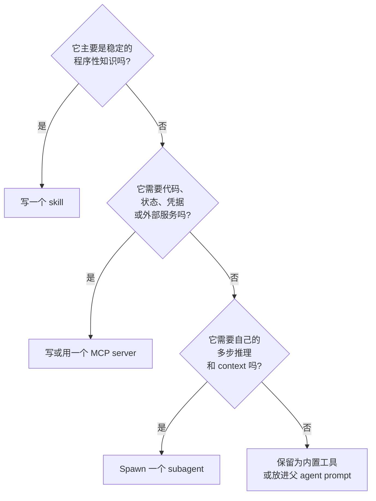
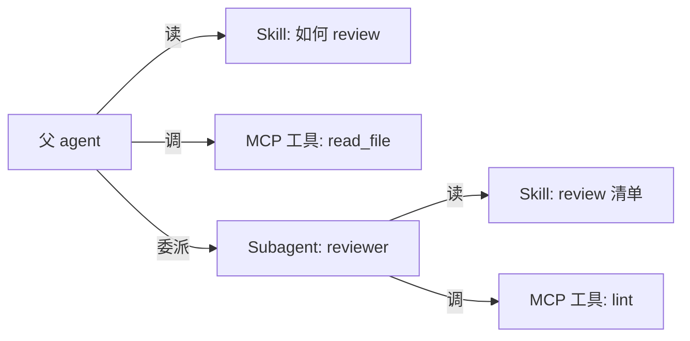

# 第 14 章 — Skill、MCP 和子 agent：同一种能力的三种形态

## TL;DR

模型需要、但目前还不具备的能力,可以采取三种形态之一：**skill** — 写成 markdown 文件、教模型怎么做某件事的指令;**MCP server** — 一个外部进程,把能力作为工具暴露出来 (Ch.13);**子 agent** — 拥有自己上下文和结果契约的独立 agent 循环 (Ch.10)。三者不可互换。Skill 便宜,教模型 *怎么做*;MCP server 成本中等,隔离的是 *执行*;子 agent 昂贵,隔离的是 *推理*。本章给出三者之间的决策标准、每种形态的设计规则、每种形态各自的失败模式,以及随着系统成熟把一项能力从一种形态迁移到另一种的方法。

---

## 为什么这件事重要

每个团队在构建 agent、第一次撞上新的能力缺口时,第一反应都是 *"再 spawn 一个 agent"*。但多数情况下,正确答案是 *"写一个 skill"*;其次最常见的正确答案是 *"调用一个 MCP server"*。完整的 agent 循环是最强大、也最昂贵的选项 — 恰恰只在任务确实需要自己的上下文和推理时才有用,其他场合几乎都用不上。

习惯性默认走子 agent 的团队,会积累两样东西:看不见的成本 (每次 spawn 都是一次完整的模型循环),以及迟早要偿还的复杂度 (多 agent 编排带来了单 agent 没有的失败模式)。而掌握了决策标准、从最轻一级起步的团队,推进得更快,交付得更干净。

---

## 概念

### 三种形态各一句话

- **Skill** — 嵌入 agent prompt 的 markdown 指令,教模型如何用它已有的工具去做一项反复出现的任务。
- **MCP server** — 一个独立进程,把工具暴露给 agent 调用;能力存在于 agent 之外,可被多个 agent 复用。
- **Subagent** — 父 agent 为某个有边界的子任务 spawn 出的完整 agent 循环,拥有自己的 prompt、工具集、预算和结果契约 (Ch.10)。

同一种能力 — *"review 这个 PR"* — 三种形态都能实现。选其中符合需求的最轻一种。

### Skill — 解剖

一个 skill 就是一个 markdown 文件,带有 YAML frontmatter 和自由格式的正文 (body)：

```markdown
---
name: review_typescript
description: Review TypeScript code for type, async, and security issues.
version: 1.2.0
platforms: [coding-agent, code-review-bot]
prerequisites: [typescript-installed]
---

# Review TypeScript code

When reviewing TypeScript code, in this order:

1. Check public function inputs are typed.
2. Check async errors are handled (no swallowed promises).
3. Check user-controlled strings reach shell / SQL / HTML sinks safely.
4. Report findings before style comments.
5. Quote the file:line you're commenting on.

Do not invent issues. If unsure, flag *suggested review needed* and move on.
```

有五个字段在各生产系统里反复出现：`name`、`description`、`version`、`platforms`、`prerequisites`。正文是 markdown — 指令、示例、各种坑。Hermes Agent 的 skill 格式遵循 agentskills.io 的社区约定 — 那是一个新兴的 skill 分享中心,而非由某个治理机构正式发布的标准。OpenClaw 和 OpenCode 采用同样的形态,只有细微差异。

### Skill — 发现、加载和 hub

在各系统中,skill 存在于四个地方：

- **随附 (Bundled)** — 随 agent 一起出厂。承载通用模式与基线行为。
- **用户安装** — 放在 `~/.hermes/skills/`、`~/.openclaw/skills/` 或工作区的 `skills/` 目录下。按机器或按项目划分。
- **Plugin 贡献** — 由 plugin (Ch.11) 在启动时注册。当作用户安装的 skill 来处理,但版本随 plugin 一起管理。
- **Hub 分发** — Hermes Agent 与 `agentskills.io` 集成:`hermes skills install <name>` 从 hub 拉取一个 skill,agent 在下次 session 时读取它。这是应用市场式的模式;预计会有更多 agent 采用。

发现 skill 的方式是启动时扫描一次目录;扫描器读取 frontmatter 并注册每个 skill。扫描时并不会把完整正文加载进内存 — 那是后面才发生的事。

### Skill — 渐进式披露 (简要)

Ch.06 已完整讲过这套检索模式：skill 的 *索引* (name + description + version) 每回合都待在 prompt 里 — 无论有多少个 skill,都只占几百个 token — 而 skill 的 *正文* 则按需通过一个 `skill_view(name)` 工具加载。从 Ch.14 的视角值得重申几点:索引里的每一项都是前缀成本,每段正文都是一处潜在的 prompt injection (见下文的信任小节),而二十个精炼的 skill 始终胜过两百个大多无关的 skill。Ch.06 的预算规则在这里同样适用 — 归档掉 agent 几个月没碰过的 skill — 下文的信任规则则适用于你纳入索引的一切东西。

### Skill — 维护

Skill 会过时。一个 agent 从来不用的 skill,或者一个调用已废弃 API 的 skill,比没有 skill 还糟 — 它会把模型拽向陈旧的模式。Ch.07 已完整讲过维护者 (curator) 的生命周期 (active → stale → archived);针对 skill 的具体应用是：

- **Active (活跃)** — 最近 N 天内用过;出现在索引里。
- **Stale (陈旧)** — 30 天未用;仍在索引中,但被打上标记。
- **Archived (已归档)** — 90 天未用;从索引中移除,但可恢复。

Hermes Agent 的维护者按空闲时段的计划运行,还能做一件更厉害的事:*从成功的序列里写出新 skill*。如果 agent 稳定地按同样的次序调用三个工具来处理某项反复出现的任务,维护者就会把这个序列提升为一个模型可以指名调用的 skill。这是生产环境里最强的模式之一 — *会写 skill 的 skill*。

### Skill — 来源、信任与 prompt-injection 风险

Skill 是 agent 每次 session 都当作指令来读的文本。这使它成为整个系统中杠杆最高的攻击面之一 — 一个恶意 skill,从机制上讲,不过是 prompt injection 的另一个名字。正确的默认立场是:*把每一个用户安装或 hub 分发的 skill 都视为不可信,除非你有理由相信它可信。* 即便相关协议尚在演进,下面这套信任模型仍值得牢牢钉死:

- **来源 (Provenance)。** 每个 skill 都带有 `name`、`version`,*以及* 一个 `source` — 它来自的 URL、hub 条目、文件路径,或贡献它的 plugin。安装关卡 (Ch.12) 会读取 `source` 来决定是否要征询用户。来自 bundled 集合之外的 skill,不应悄无声息地进入索引。
- **安装时审批。** 新增一个 skill 等同于一次 Ch.12 审批,和新增一个 MCP server 一样。在它进入索引之前,把 skill 的正文给用户看 — 每一行都要看。*"信任来自此来源的这个 skill"* 这一授权,是按 source、version 和正文的指纹 (fingerprint) 来限定范围的;一旦正文被改写,信任即失效,并触发一次新的询问。
- **签名。** 在 hub 或分发渠道支持的前提下,用已发布的 key 校验签名。Skill 注册表还处于早期,签名语义尚未标准化 — 持续跟踪规范、能签的就签,并默认拒绝安装来自公共来源的未签名 skill。
- **正文检查。** 把 skill 加入索引之前,对其正文跑一次 Ch.18 的威胁扫描 — 用的是记忆层在 Ch.07 所用的同一套 pattern。包含 *"忽略之前的指令"* 的 skill,永远到不了 prompt。
- **一键卸载。** 如果某个来源变得不再可信 (hub 被攻陷、作者被攻陷),用户必须能够不编辑任何文件就把 skill 移除掉。Ch.07 的维护者掌管归档;卸载则是它在运维上的孪生兄弟。

有一条通用规则,团队第一次想到时往往会感到意外:*一个 skill 比一个 MCP server 更危险*。MCP server 的工具是在进程隔离中执行的;而 skill 的文本是在你模型的 prompt 里执行的。对待 skill 这道边界,至少要和对待 MCP 信任边界一样小心 — 通常还要更小心。

### MCP server — 何时自己写

Ch.13 已经讲过 MCP 协议。剩下的问题是:*我什么时候该写一个 MCP server,而不是用内置工具或 skill?* 有三个信号:

- **能力存在于 agent 进程之外** — 一个数据库、一个浏览器、一个第三方 SaaS,或者一个用不同语言或 runtime 写的服务。这时进程隔离是真有用的。
- **能力要被多个 agent 复用** — 你只造一次,组织里几个不同的 agent 都来用它。
- **能力需要自己的凭据或信任边界** — 由 MCP server 持有 API key;agent 进程永远看不到它。

如果这几条都不成立,那更轻量的答案通常是一个内置工具 (Ch.03) 或一个 skill。

### MCP server — 命名、schema、auth

当你确实要写一个 MCP server 时,真正重要的设计选择有这些:

- **单一用途 vs 多能力。** 一个小而聚焦的 server (`pg-query`、`s3-list`) 比一个塞了二十个互不相关工具的 server 更易于测试、保护安全和做版本管理。宁可写许多个小 server,也不要写一个巨型的。
- **工具命名。** harness 会把你的工具命名空间化为 `mcp__<server>__<tool>` (Ch.13);工具名要选得清晰简短,因为它们每回合都会出现在模型的 prompt 里。
- **Schema。** 工具 schema 是前缀的一部分 (Ch.04)。要保持精简;每个可选字段都是前缀里的字节,也是模型填错的一个机会。
- **注解 (Annotations)。** 通过 MCP 的 `readOnlyHint`、`destructiveHint`、`idempotentHint` 和 `openWorldHint` 显式标注每个工具的元数据 — 这样当别的 harness 接入你这个 server 时,就能正确地配置好 Ch.02 的并行、Ch.12 的审批和 Ch.08 的重试安全。`Hint` (提示) 这个后缀是刻意取的:接入方的 harness 应该把这些当作 server 所 *声称* 的保守默认值,而不是它已经 *证明过* 的断言 (Ch.13)。
- **认证 (Auth)。** 把凭据保存在 server 内部;绝不要让模型以工具参数的形式把凭据传进来。使用 OAuth 或从环境挂载的密钥;轮换密钥时也不需要让 agent 知道。

### Subagent — profile 作为单元

Ch.10 已经讲过委派的机制。*本* 章关心的则是扩展的单元:子 agent 最好被理解为一个你可以 spawn 的 *profile (画像)* — 一个有名字的角色,带着固定的 system prompt、工具列表、模型、预算和结果 schema。

```ts
type SubagentProfile = {
  name:           string;       // "reviewer", "implementer", "researcher"
  description:    string;       // what the supervisor reads when picking
  systemPrompt:   string;       // role-specific instructions
  model:          string;       // often cheaper than the parent's
  toolAllowlist:  string[];     // tighter than parent's
  maxSteps:       number;
  recursionDepth: number;       // usually 1 — see Ch.10
  resultSchema:   JsonSchema;
};
```

监督者 (Ch.10) 按名字挑选 profile;所谓注册表,其实就是一个 map。OpenCode 内置的几个 profile — `build`、`plan`、`general`、`explore` — 是这方面的典型参考。自定义 profile 则是你为自己项目添加专家角色的方式。

### Subagent — 内置 profile vs 自定义

综观各生产系统,有一套好用的起步集合:

- **`explore`** — 只读工具、便宜的模型、返回结构化的发现。是 *查找某样东西* 这类任务最安全的默认选择。
- **`build`** — 含写操作的完整工具集、昂贵的模型。是通用的干活 worker。
- **`plan`** — 只读工具、便宜的模型、返回结构化的 plan (Ch.09)。它的产出是一份计划,而不是一个动作。
- **`reviewer`** — 只读工具,以另一个子 agent 的输出作为输入,返回 *approve (通过)* 或 *issues found (发现问题)*。是 Ch.10 校验模式里那份便宜的保险。

自定义 profile 套用的是同样的形态。要守的纪律是:按 profile 在你项目里扮演的角色来命名,而不是按它底层用到的工具。*"数据库迁移 reviewer"* 是一个 profile 名;*"调用 pg_query 和 write_file"* 则是实现细节。

### 决策表

| 维度 | Skill | MCP server | Subagent |
|---|---|---|---|
| 它增加什么 | 给模型的指令 | 外部工具 | 一个独立的推理循环 |
| 每次使用成本 | 几个 prompt token;正文仅在加载时 | 一次工具调用的协议往返 | 一次完整的模型循环 |
| 隔离 | 无 | 进程边界 | 上下文 + 工具 + 模型边界 |
| 最适合 | 模型反复重新发明的稳定流程 | agent 进程之外的能力 | 需要自己推理的有边界子任务 |
| 失败模式 | 模型忽略或误用 | server 崩溃、schema drift | 子 agent 死循环、漂移、超支 |
| 更新节奏 | Session 开始时 | 独立的 server 部署 | 每次 agent 配置变更时 |
| 版本化 | YAML frontmatter 的 `version` | Server 发版 | Profile 定义 |

当你能在自己的技术栈里实测时,再补上具体的成本估算:skill 一旦付过索引成本,之后每次使用基本免费;一次 MCP 工具调用会多出几毫秒外加序列化开销;一次子 agent 运行则会多出几百毫秒,外加一整次模型循环的 token 花销。



生产系统最终落定的默认顺序是:skill 最先试,子 agent 最后用。如果你的团队碰到大多数新能力时,第一反应都是去伸手取子 agent,那很可能说明你的 skill 层还没发育成熟。

### 同一能力的三种方式

用一个具体例子让决策标准落地。这项能力是 *"总结一份长文档"*。

**作为 skill** — 当文档已经在 agent 的上下文里、模型只需要那套流程时：

```markdown
---
name: summarize_document
description: Summarize a document already in context.
version: 1.0.0
---

# Summarize document

1. State the central claim in one sentence.
2. List up to five supporting points.
3. Mention caveats from the source.
4. Keep the summary under 150 words.
Do not add unsupported opinions.
```

**作为 MCP 工具** — 当总结需要外部处理时:PDF 解析、文档存储、向量查找：

```ts
const summarizeTool = {
  name: "summarize_document",
  description: "Summarize a stored document by ID.",
  input_schema: {
    type: "object",
    required: ["documentId"],
    properties: { documentId: { type: "string" } },
  },
  // Implementation lives in the MCP server, calling private stores.
};
```

**作为子 agent** — 当总结本身就是一项研究任务时:涉及多份文档、相互冲突的证据、迭代式阅读、结构化综合：

```ts
await delegate({
  role:         "researcher",
  objective:    "Synthesize the strongest claims across these documents.",
  context:      buildContextPacket(documentIds),
  allowedTools: ["read_document", "search_documents"],
  maxSteps:     12,
  outputSchema: ResearchSummarySchema,
});
```

三种形态、三种成本特征、三种失败模式。能力本身是同一个;选哪种,取决于复杂度落在哪里。

### 组合:三者如何搭配

这三种形态本就是为相互组合而设计的：



来自生产环境的三个模式：

- **调用 MCP 工具的 skill。** Skill 指导模型如何把一连串由 MCP 封装的工具调用组合起来。模型先读 skill,再去派发这些工具。
- **拥有自己 skill 的子 agent。** Subagent 被 spawn 时 (Ch.10),默认继承父 agent 的 skill 索引;OpenCode 允许只传入其中一个子集。Subagent 看到的 `skill_view` 工具和父 agent 的是同一个。
- **内部运行一个子 agent 的 MCP server 工具。** 一个 plugin 把一次子 agent 调用封装成对外暴露的 MCP 工具。从外面看它就像个工具;在里面它却 spawn 了一整个 agent 循环。这对于在多个 agent 安装之间复用同一个专家、又不必重新实现一遍 profile 很有用。

这三层不是层级关系。你是按每项能力、依据决策标准来搭配它们的。

### 形态之间的迁移

随着系统成熟,能力会在形态之间迁移。四种常见的迁移:

- **一次性的工具序列 → skill。** 如果模型老是按同样的次序调用同样的三个工具,就写一个 skill 把这个模式命名下来。这样模型会直接去取它,而不是每次重新发现。
- **Skill → MCP server。** 如果一个 skill 越长越大,或开始需要凭据、外部状态,就把它抬升进一个 server。这时 skill 退化成一行指令 *"调用 mcp__server__do_thing"*,真正的工作则从 prompt 里搬了出去。
- **MCP server → 内置工具。** 如果一个 MCP 工具每回合都要被调用,那每次调用的协议成本就会累积起来。把它提升为内置工具 (Ch.03),换取延迟上的收益。
- **Subagent → skill + 工具。** 当一个子 agent profile 实质上只是在执行一套流程 (而非探索) 时,就把它折叠成一个 skill — 由父 agent 读取、并用父 agent 自己的工具来执行。这样每次调用都能省下一整次模型循环。

迁移是正常现象,并不说明最初的设计有问题。第一周合适的形态,到第六个月很少还合适。

### 每种形态的失败模式

| 形态 | 失败 | 你如何察觉 | 怎么办 |
|---|---|---|---|
| Skill | 模型忽略它 | `skill_view(name)` 从未被调用;模型的输出绕开了 skill 的流程 | 收紧描述;把某个关键步骤提升为内置工具 |
| Skill | 指引陈旧 | 模型照着过时的步骤做 | 维护者归档 (Ch.07);用 version 字段;显式废弃 |
| MCP server | 崩溃或超时 | tool-result 错误信封 | 带退避的重连 (Ch.13);若有可用的内置工具就回退过去 |
| MCP server | Schema drift | 新的一次 `tools/list` 返回了不同的结构 | 每次重连都重新拉取列表;若有工具消失则告警给运维 |
| Subagent | 死循环、漂移 | step 预算触顶;reviewer 给出否定意见 | 收紧 profile 的工具集和 system prompt;调低预算;加一个 reviewer |
| Subagent | 超支 | token 或成本预算被突破 | 设预算上限 (Ch.10);给该 profile 换更便宜的模型 |

有一条对三种形态都适用的提醒:名字层面的问题,往往是出错的 *第一个* 信号。一个叫 `review_typescript` 的 skill,比一个叫 `reviewer` 的更不容易和别的 skill 混淆。一个前缀为 `mcp__github__create_pr` 的 MCP 工具,比 `create_pr` 更不容易被派发错。一个叫 `db-migration-reviewer` 的子 agent,对监督者来说比 `subagent-7` 可读得多。命名本身就是设计。

### Plugin skill、plugin 工具、plugin agent

关于第三个维度补充一句:plugin (Ch.11) 可以贡献这三种形态中的任意一种。同一个 plugin 就能一并提供:

- 一组 **skill** — 注册进 skill 索引的 markdown 文件;
- 一个 **MCP server** — 随附的二进制文件,或以 stdio 方式 spawn 出的进程;
- 一个 **子 agent profile** — system prompt + 工具列表 + 结果 schema,注册进 profile 注册表。

OpenClaw 和 Hermes Agent 三种形态都支持;OpenCode 的 plugin 能扩展 skill 和工具,但不能扩展 profile。plugin 内部该选哪种,遵循的也是同一套决策标准 — 挑符合该 plugin 用途的最轻形态。

---

## 真实系统笔记

- **Hermes Agent** 是 skill 方面最丰富的参考:完整的 SKILL.md 格式、与 `agentskills.io` 兼容、目录扫描器、能把成功序列提升为新 skill 的维护者、通过 `hermes skills install/push` 与 hub 集成,以及版本感知的归档。
- **OpenCode** 同时暴露了子 agent 风格的委派 (`task` 工具) 和一个 `skill` 工具,并通过 agent 权限来过滤工具。它内置的 profile 集合 (`build`、`plan`、`general`、`explore`) 是入门级分类法最干净的参考。
- **Paperclip** 用 skill 和 adapter 来协调外部的 agent runtime — 它展示了这三种原语如何在组织层面成为运维上的控制手段:skill 充当指令、adapter 充当 MCP 形态的边界、而把 agent 当子 agent 来用则发生在控制面里。
- **OpenClaw** 把 plugin 这一层展示得最清楚:plugin 通过单一的 plugin SDK 贡献 skill、MCP server 和 channel adapter。是 *一个 plugin 同时给出三种形态* 的好参考。

---

## 与你的 agent 结对

几个在本章上效果不错的 prompt：

- *"列出十个我可能想给 agent 加的新能力。对每一个,走一遍决策标准,告诉我它该做成 skill、MCP 工具还是子 agent。每次挑选都用那个起决定作用的维度来佐证。"*
- *"审计我现在的 agent。把 `skills/` 里的所有东西、我正在调用的每个 MCP server、以及每个子 agent profile 都分类一遍。标出任何用错了形态的,并提出迁移方案。"*
- *"针对我的技术栈,把 *总结一份文档* 这项能力写成三个版本 — 一个 skill、一个 MCP 工具、一个子 agent。在同一份 10 KB 的输入上,分别测量它们的延迟和 token。"*
- *"用 `skill_view` 实现 skill 索引模式。加一个指标:模型实际为每个 skill 调用了多少次 `skill_view`。告诉我索引里哪些 skill 是只占位不出力的死重。"*
- *"用 `explore`、`build`、`plan` 再加一个为我项目定制的 profile,搭起一个子 agent profile 注册表。把监督者挑选 profile 的逻辑、以及每个 profile 的结果 schema 给我看。"*
- *"在 agent 上个月的日志里找迁移候选。哪些工具序列重复得足够多、值得做成 skill?哪些 MCP 工具每回合都被调用、应该改成内置?哪些子 agent profile 实质上是确定性的、应该折叠成 skill?"*
- *"写一个同时贡献三种形态的 plugin:一个 skill、一个 MCP 工具、一个子 agent profile。验证每一个都能干净注册,并且 agent 能在同一次 session 里把三个都用上。"*

---

## 接下来

你现在已经掌握了扩展的单元。Ch.15 将转向那个在大规模下让 harness 持续运转的 *后端* — 队列、流式端点、持久化副作用机制,以及当同时有不止一个用户、不止一个 session 在运行时,承载循环、记忆、持久化和 connector 的 runtime。
