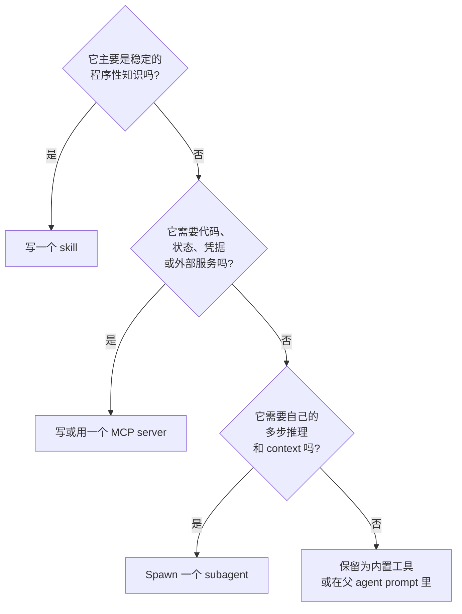
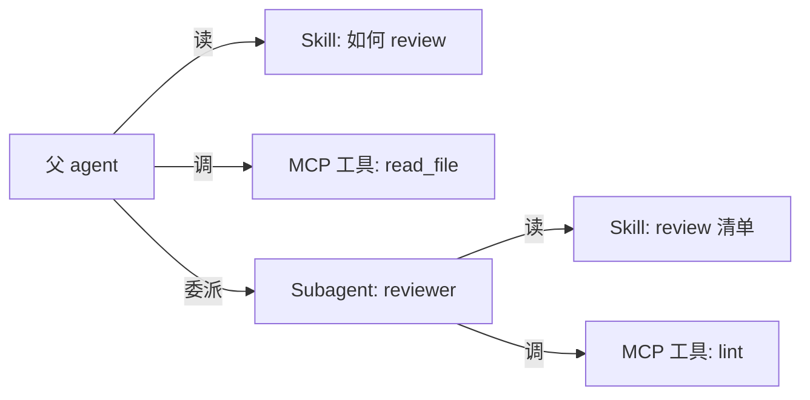

# 第 14 章 — Skill、MCP 和 subagent：同一种能力的三种形态

## TL;DR

模型需要但还没有的能力可以采取三种形态之一：**skill** — 写成 markdown 文件、教模型怎么做某件事的指令;**MCP server** — 一个外部进程,把能力作为工具暴露 (Ch.13);**subagent** — 带自己 context 和结果契约的独立 agent 循环 (Ch.10)。它们不可互换。Skill 便宜,教模型 *怎么做*;MCP server 中等成本,隔离 *执行*;subagent 昂贵,隔离 *推理*。本章是决策表、每种形态的设计规则、每种形态的失败模式,以及随系统成熟把能力从一种形态搬到另一种的方法。

---

## 为什么这件事重要

每个团队第一次碰到新能力缺口时的第一反应是 *"再 spawn 一个 agent"*。多数时候,正确答案是 *"写一个 skill"*。次多数时候,正确答案是 *"调一个 MCP server"*。完整 agent 循环是最强大、也最贵的选项 — 恰好在工作需要自己的 context 和推理时有用,其他情况几乎从不。

默认走 subagent 的团队积累了他们看不见的成本 (每次 spawn 都是一次完整模型循环) 和最终要还的复杂度 (多代理编排带来单代理没有的失败模式)。知道决策表、从最轻级别开始的团队走得更快、出货更干净。

---

## 概念

### 三种形态各一句话

- **Skill** — 烤进 agent prompt 的 markdown 指令,教模型如何用它已有的工具做一项重复任务。
- **MCP server** — 一个独立进程,暴露 agent 调用的工具;能力活在 agent 之外,跨多个 agent 复用。
- **Subagent** — 父 agent 为有边界子任务 spawn 的完整 agent 循环,带自己的 prompt、工具集、预算和结果契约 (Ch.10)。

同一种能力 — *"review 这个 PR"* — 三种形态都能采取。挑符合的最轻那个。

### Skill — 解剖

一个 skill 是带 YAML frontmatter 和自由形式 body 的 markdown 文件：

```markdown
---
name: review_typescript
description: Review TypeScript code for type, async, and security issues.
version: 1.2.0
platforms: [coding-agent, code-review-bot]
prerequisites: [typescript-installed]
---

# Review TypeScript code

When reviewing TypeScript code, in this order:

1. Check public function inputs are typed.
2. Check async errors are handled (no swallowed promises).
3. Check user-controlled strings reach shell / SQL / HTML sinks safely.
4. Report findings before style comments.
5. Quote the file:line you're commenting on.

Do not invent issues. If unsure, flag *suggested review needed* and move on.
```

五个字段在生产系统里反复出现：`name`、`description`、`version`、`platforms`、`prerequisites`。Body 是 markdown — 指令、例子、坑。Hermes Agent 的 skill 格式遵循 agentskills.io 社区约定 — 一个新兴的 skill 分享中心,不是带治理机构的正式发布标准。OpenClaw 和 OpenCode 用同样的形态,有微小变体。

### Skill — 发现、加载和 hub

Skill 跨系统活在四个地方：

- **Bundled** — 随 agent 出厂。普世模式、基线行为。
- **用户安装** — 在 `~/.hermes/skills/`、`~/.openclaw/skills/` 或工作区的 `skills/` 目录下。按机器或按项目。
- **Plugin 贡献** — 由 plugin (Ch.11) 在 boot 时注册。当作用户安装来处理,但与 plugin 一起做版本。
- **Hub 分发** — Hermes Agent 与 `agentskills.io` 集成：`hermes skills install <name>` 从 hub 拉一个 skill,agent 下次 session 读它。这是市场模式;预期更多 agent 采用。

发现是启动时一次目录扫描;扫描器读 frontmatter 并注册每个 skill。扫描时不把完整 body 加载进内存 — 那是后面的事。

### Skill — 渐进式披露 (简要)

Ch.06 完整覆盖了检索模式：skill *索引* (name + description + version) 每回合都在 prompt 里 — 不管 skill 有多少,几百个 token — 而 skill *body* 按需通过一个 `skill_view(name)` 工具加载。Ch.14 角度值得重申的：索引里每一项都是前缀成本,每个 body 都是潜在的 prompt injection (见下面信任小节),二十个清爽 skill 持续优于两百个多数无关的 skill。Ch.06 的预算规则适用 — 归档 agent 几个月没碰的 skill — 下面信任规则适用于你索引的一切。

### Skill — 维护

Skill 会老。Agent 从未用过的 skill,或调用废弃 API 的 skill,比没有 skill 更糟 — 它把模型拽向陈旧模式。Ch.07 完整覆盖了维护者生命周期 (active → stale → archived);skill 特定的应用：

- **Active** — 最近 N 天用过;在索引里。
- **Stale** — 30 天没用;仍在索引但标记。
- **Archived** — 90 天没用;从索引移除,可恢复。

Hermes Agent 的维护者在 idle 时间表上跑,能做更强的事：*从成功序列写新 skill*。如果 agent 可靠地按同样次序跑三个工具来处理一项重复任务,维护者把那个序列提升为一个模型能命名的 skill。这是生产里更强的模式之一 — *写 skill 的 skill*。

### Skill — 来源、信任与 prompt-injection 风险

Skill 是 agent 每次 session 当指令读的文本。这让它成为整个系统里最高杠杆的攻击面之一 — 一个恶意 skill,在机制上,就是另一种名字的 prompt injection。正确默认：*把每个用户安装或 hub 分发的 skill 当作不可信,直到有理由不这么认为。* 即使协议还在成熟,值得钉死的信任模型：

- **来源。** 每个 skill 带 `name`、`version` 和一个 `source` — 它来自的 URL、hub 条目、文件路径或贡献的 plugin。安装门 (Ch.12) 读 `source` 决定是否询问。来自 bundled 集合之外的 skill 不应静默进入索引。
- **安装时审批。** 一个新 skill 是一次 Ch.12 审批,和新 MCP server 一样。在它进入索引之前给用户看 skill 的 body — 每一行。*"信任来自此来源的此 skill"* 按 source、version 和 body fingerprint 限定;body 重写让信任失效并触发新询问。
- **签名。** 当 hub 或分发渠道支持时,用发布的 key 校验签名。Skill 注册还早,签名语义未标准化 — 跟踪规范、签你能签的、默认拒绝安装来自公共来源的未签 skill。
- **Body 检查。** 把 skill 加入索引前,对 body 跑一次 Ch.18 威胁扫描 — 与 memory 层在 Ch.07 用的同样 pattern。包含 *"忽略之前指令"* 的 skill 永远到不了 prompt。
- **一键卸载。** 如果来源变得不受信 (被攻陷的 hub、被攻陷的作者),用户必须能不编辑文件就移除 skill。Ch.07 的维护者拥有归档;卸载是其运维兄弟。

第一次想这件事时会让团队意外的一般规则：*一个 skill 比一个 MCP server 更危险*。Server 的工具在进程隔离里执行;skill 的文本在你模型的 prompt 里执行。把 skill 边界当作至少和 MCP 信任边界一样小心 — 通常更小心。

### MCP server — 何时自己写

Ch.13 覆盖了 MCP 协议。剩下的问题是：*我什么时候写一个 MCP server,而不是内置工具或 skill?* 三个信号：

- **能力活在 agent 进程之外** — 一个数据库、一个浏览器、一个第三方 SaaS、一个不同语言或 runtime 的服务。进程隔离真的有用。
- **能力跨多个 agent 复用** — 你造一次,组织里几个不同 agent 消费它。
- **能力需要自己的凭据或信任边界** — MCP server 持 API key;agent 进程从不见它。

如果这些都不成立,更轻答案通常是内置工具 (Ch.03) 或 skill。

### MCP server — 命名、schema、auth

当你确实写一个时,重要的设计选择：

- **单一目的 vs 多能力。** 一个小、聚焦的 server (`pg-query`、`s3-list`) 比一个带二十个无关工具的 server 更易测、更安全、更易做版本。多写小 server,少写一个巨型的。
- **工具命名。** Harness 会把你的工具命名空间化为 `mcp__<server>__<tool>` (Ch.13);选清晰短的工具名,因为它们每回合都在模型 prompt 里出现。
- **Schema。** 工具 schema 是前缀的一部分 (Ch.04)。保紧;每个可选字段都是前缀字节,也是模型填错的机会。
- **注解。** 通过 MCP 的 `readOnlyHint`、`destructiveHint`、`idempotentHint` 和 `openWorldHint` 显式标记每个工具的元数据 — 这样消费你的 harness 在消费时能正确接通 Ch.02 并行、Ch.12 审批和 Ch.08 重试安全。`Hint` 后缀是刻意的：消费 harness 应当把这些当作 server *声称* 的保守默认,而不是它 *证明过的* 断言 (Ch.13)。
- **Auth。** 把凭据保留在 server 内;永远不要从模型把它作为工具参数接收。用 OAuth 或环境挂载的密钥;轮换它们不需要 agent 知道。

### Subagent — profile 作为单元

Ch.10 覆盖了委派机制。*本* 章关心的是扩展单元：subagent 最好理解为一个你可以 spawn 的 *profile* — 一个命名角色,带固定 system prompt、工具列表、模型、预算和结果 schema。

```ts
type SubagentProfile = {
  name:           string;       // "reviewer", "implementer", "researcher"
  description:    string;       // what the supervisor reads when picking
  systemPrompt:   string;       // role-specific instructions
  model:          string;       // often cheaper than the parent's
  toolAllowlist:  string[];     // tighter than parent's
  maxSteps:       number;
  recursionDepth: number;       // usually 1 — see Ch.10
  resultSchema:   JsonSchema;
};
```

监督者 (Ch.10) 按名字挑 profile;注册就是一个 map。OpenCode 内置 profile — `build`、`plan`、`general`、`explore` — 是典型参考。自定义 profile 是为项目加专家的方式。

### Subagent — 内置 profile vs 自定义

跨生产系统,一个有用的起始集：

- **`explore`** — 只读工具、便宜模型、返回结构化发现。*find something* 任务最安全默认。
- **`build`** — 完整工具集带写、贵模型。通用 worker。
- **`plan`** — 只读工具、便宜模型、返回结构化 plan (Ch.09)。输出是 plan,不是动作。
- **`reviewer`** — 只读工具,把另一个 subagent 的输出当输入,返回 *approve* 或 *issues found*。Ch.10 校验模式的便宜保险。

自定义 profile 套同样形态。纪律：按它在你项目里扮演的角色命名 profile,不是按底下工具。*"数据库迁移 reviewer"* 是一个 profile 名;*"调 pg_query 和 write_file"* 是实现细节。

### 决策表

| 维度 | Skill | MCP server | Subagent |
|---|---|---|---|
| 它加什么 | 给模型的指令 | 外部工具 | 一个独立推理循环 |
| 每次使用成本 | 几个 prompt token;body 仅在加载时 | 一次工具调用协议跳 | 一次完整模型循环 |
| 隔离 | 无 | 进程边界 | Context + 工具 + 模型边界 |
| 最适合 | 模型不断重新发明的稳定流程 | Agent 进程之外的能力 | 需要自己推理的有界子任务 |
| 失败模式 | 模型忽略或误用 | Server 崩溃、schema drift | Subagent 死循环、漂移、超支 |
| 更新节奏 | Session 开始时 | 独立 server 部署 | 每次 agent-config 变更 |
| 版本化 | YAML frontmatter `version` | Server 发布 | Profile 定义 |

能在你自己技术栈里测时,加上具体成本估算：skill 在索引成本之后每次使用基本免费;一次 MCP 工具调用加上几毫秒加序列化;一次 subagent run 加上几百毫秒加一次完整模型循环的 token 花销。



生产系统落到的默认：skill 先试,subagent 最后。如果你团队对多数新能力都在伸手取 subagent,你的 skill 层可能没发育好。

### 同一能力的三种方式

一个具体例子让决策表落地。能力是 *"总结一份长文档"*。

**作为 skill** — 当文档已经在 agent context 里、模型只需流程时：

```markdown
---
name: summarize_document
description: Summarize a document already in context.
version: 1.0.0
---

# Summarize document

1. State the central claim in one sentence.
2. List up to five supporting points.
3. Mention caveats from the source.
4. Keep the summary under 150 words.
Do not add unsupported opinions.
```

**作为 MCP 工具** — 当总结需要外部处理时：PDF 解析、文档 store、向量查找：

```ts
const summarizeTool = {
  name: "summarize_document",
  description: "Summarize a stored document by ID.",
  input_schema: {
    type: "object",
    required: ["documentId"],
    properties: { documentId: { type: "string" } },
  },
  // Implementation lives in the MCP server, calling private stores.
};
```

**作为 subagent** — 当总结本身就是一个研究任务时：多个文档、冲突证据、迭代阅读、结构化综合：

```ts
await delegate({
  role:         "researcher",
  objective:    "Synthesize the strongest claims across these documents.",
  context:      buildContextPacket(documentIds),
  allowedTools: ["read_document", "search_documents"],
  maxSteps:     12,
  outputSchema: ResearchSummarySchema,
});
```

三种形态、三种成本特征、三种失败模式。能力相同;选择取决于复杂度活在哪里。

### 组合：三种如何混合

三种形态是为组合而设计的：



来自生产的三个模式：

- **调 MCP 工具的 skill。** Skill 指导模型如何组合一串 MCP 包装工具调用。模型读 skill,然后派发工具。
- **带自己 skill 的 subagent。** Subagent 被 spawn 时 (Ch.10),默认继承父 agent 的 skill 索引;OpenCode 允许传子集。Subagent 看到与父 agent 同一个 `skill_view` 工具。
- **内部跑 subagent 的 MCP server 工具。** 一个 plugin 把一次 subagent 调用包成 MCP 暴露工具。外部看像工具;内部 spawn 完整 agent 循环。对跨多个 agent 安装复用一个专家而不重新实现 profile 有用。

三层不是层级。你按能力混合,基于决策表。

### 形态之间的迁移

随系统成熟,能力在形态之间移动。四种常见迁移：

- **一次性工具序列 → skill。** 如果模型一直按同样次序调同样三个工具,写一个命名那个模式的 skill。模型直接伸手取它,而不是重新发现。
- **Skill → MCP server。** 如果一个 skill 变大或开始需要凭据或外部状态,把它抬进 server。Skill 变成一行指令 *"调 mcp__server__do_thing"*,工作从 prompt 里搬出。
- **MCP server → 内置工具。** 如果一个 MCP 工具每回合都被调,每次协议成本积累。把它提升为内置 (Ch.03) 拿延迟胜利。
- **Subagent → skill + 工具。** 当一个 subagent profile 实质上是在执行流程 (不是探索) 时,把它折叠成一个父 agent 读、用父 agent 自己工具执行的 skill。每次调用省一次完整模型循环。

迁移是正常的,不是初始设计差的迹象。第一周合适的形态在第六个月很少还合适。

### 每种形态的失败模式

| 形态 | 失败 | 你怎么注意到 | 怎么办 |
|---|---|---|---|
| Skill | 模型忽略它 | `skill_view(name)` 从未被调用;模型输出绕开 skill 的流程 | 收紧描述;把关键步骤提升为内置工具 |
| Skill | 陈旧指引 | 模型遵循过时步骤 | 维护者归档 (Ch.07);version 字段;显式废弃 |
| MCP server | 崩溃或超时 | Tool-result 错误信封 | 带回退的重连 (Ch.13);如有可用回退到内置 |
| MCP server | Schema drift | 一次新的 `tools/list` 返回不同形态 | 每次重连都重新列出;如有工具消失,警告运维 |
| Subagent | 死循环、漂移 | Step 预算到达上限;reviewer 不同意 | 收紧 profile 的工具 + system prompt;降低预算;加 reviewer |
| Subagent | 超支 | Token 或成本预算超出 | 预算上限 (Ch.10);profile 用更便宜模型 |

三种都适用的一个有用笔记：名字失败通常是 *第一个* 出错信号。一个叫 `review_typescript` 的 skill 比一个叫 `reviewer` 的更难和另一个 skill 搞混。一个前缀 `mcp__github__create_pr` 的 MCP 工具比 `create_pr` 更难派错。一个叫 `db-migration-reviewer` 的 subagent 比 `subagent-7` 对监督者更可读。命名就是设计。

### Plugin skill、plugin 工具、plugin agent

关于第三轴的一个笔记：plugin (Ch.11) 能贡献三种形态中任一种。一个 plugin 可以出厂：

- 一组 **skill** — 注册进 skill 索引的 markdown 文件;
- 一个 **MCP server** — bundled binary 或 stdio-spawned 进程;
- 一个 **subagent profile** — system prompt + 工具列表 + 结果 schema,注册进 profile 注册。

OpenClaw 和 Hermes Agent 三种都有;OpenCode plugin 扩展 skill 和工具但不扩展 profile。plugin 内的选择遵循同样决策表 — 挑符合 plugin 目的的最轻形态。

---

## 真实系统笔记

- **Hermes Agent** 是 skill 最丰富的参考：完整 SKILL.md 格式与 `agentskills.io` 兼容、目录扫描器、把成功序列提升为新 skill 的维护者、通过 `hermes skills install/push` 与 hub 集成,以及版本感知归档。
- **OpenCode** 暴露 subagent 风格委派 (`task` 工具) 和 `skill` 工具,加上通过 agent 权限过滤工具。内置 profile 集 (`build`、`plan`、`general`、`explore`) 作为入门分类的最干净参考。
- **Paperclip** 用 skill 和 adapter 协调外部 agent runtime — 它展示这三种原语如何在组织层成为运维控制：skill 作为指令、adapter 作为 MCP 形态边界、agent-as-subagent 在控制面里。
- **OpenClaw** 把 plugin 层展示得最清楚：plugin 通过一个 plugin SDK 贡献 skill、MCP server 和 channel adapter。*一个 plugin 里三种形态* 的好参考。

---

## 与你的 agent 配对

几个对本章效果好的 prompt：

- *"拿出十个我可能加到 agent 的新能力。对每个,走决策表,告诉我它应该是 skill、MCP 工具还是 subagent。用驱动它的维度证明每次挑选。"*
- *"审计我现在的 agent。把 `skills/` 里所有东西、每个我在调的 MCP server 和每个 subagent profile 分类。标记任何在错形态的,提议迁移。"*
- *"对我的技术栈,写 *总结一份文档* 能力的三个版本 — 一个 skill、一个 MCP 工具、一个 subagent。在同一份 10 KB 输入上测每个的延迟和 token。"*
- *"用 `skill_view` 实现 skill 索引模式。加一个 metric:模型实际每个 skill 调 `skill_view` 多少次。告诉我索引里哪些 skill 是死重。"*
- *"用 `explore`、`build`、`plan` 和一个为我项目的自定义 profile 搭起 subagent profile 注册。给我看监督者的 profile 挑选逻辑和每个的结果 schema。"*
- *"在 agent 上个月的日志里找迁移候选。哪些工具序列被重复到足以变成 skill?哪些 MCP 工具每回合都被调、应该是内置?哪些 subagent profile 实质上是确定性的、应该折叠成 skill?"*
- *"写一个贡献三种形态的 plugin:一个 skill、一个 MCP 工具、一个 subagent profile。验证每个干净注册,agent 能在一次 session 里用上三个。"*

---

## 接下来

你现在知道扩展单元。Ch.15 转到大规模时保持 harness 运转的 *后端* — 队列、流式端点、持久副作用机制,以及当用户和飞行中 session 不止一个时承载循环、memory、持久化和 connector 的 runtime。
