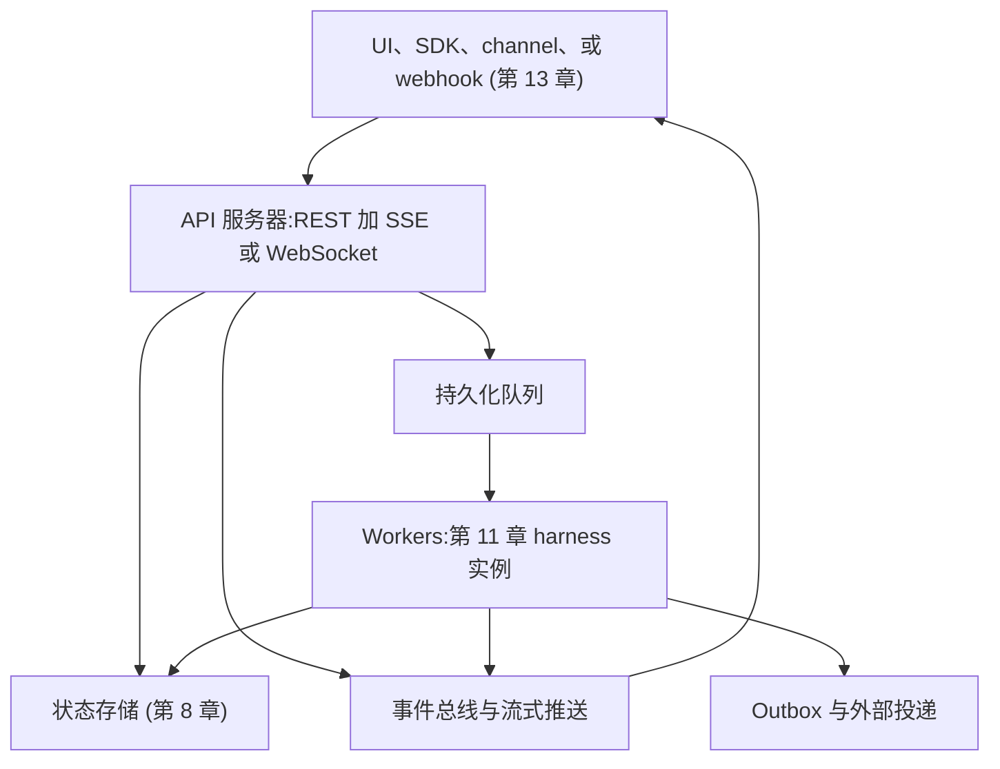
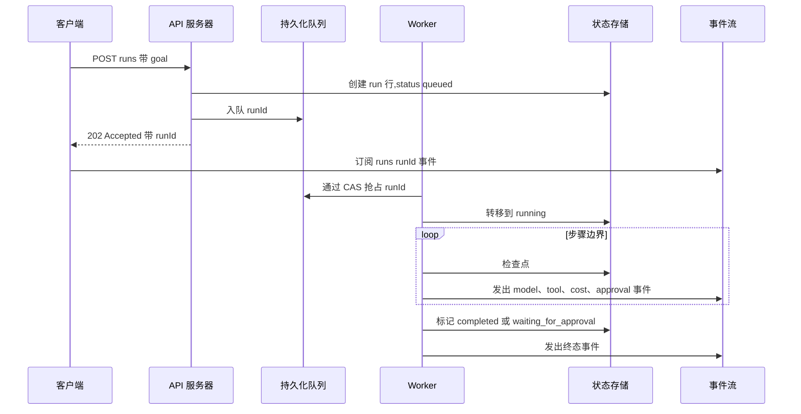
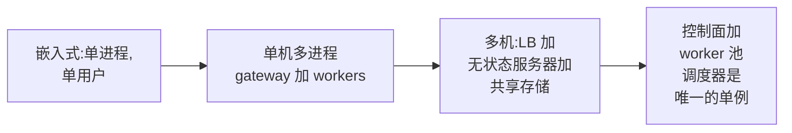

# 第 15 章 — Agent 的后端基础设施

## TL;DR

Web 请求的生命周期是毫秒级的,而一次 agent 运行可能持续数分钟、数小时,甚至跨越多次唤醒。因此生产级后端会把"请求受理"和"任务执行"分开:接收任务、入队、流式推送进度、保存检查点、让副作用具备幂等性。本章关注的是规模化的视角 — 第 11 章里的 harness 如何变成服务多个用户的服务:API 表面(REST + SSE + WebSocket)、队列与 worker 的形态、心跳式调度器如何唤醒到期任务、从嵌入式到多机部署的拓扑、多租户隔离、密钥、备份、限流、预算、运维界面,以及那些只跑在单机时一切安好、上了第二台机器就悄悄崩掉的"单用户假设"。

---

## 为什么这很重要

最简单的 agent 后端就是一个 HTTP 端点,同步调用模型,然后返回最终答案。这对单轮 demo 够用。但只要 agent 需要工具、审批、重试、长上下文,或者要做后台工作,这种架构就会立刻崩。三个问题马上会冒出来:

- **客户端超时。** worker 还在跑,请求那边已经超时了。
- **重复执行。** 客户端重试,可能两个副本都执行了副作用。
- **没有可见性。** 用户看到的是一个转圈圈的图标,而不是进度、工具调用、审批和报错。

解决办法不是把超时时间调长。解决办法是换一个架构 — 一个为"任务存活时间长于任何单次请求"而设计的架构。

---

## 概念

### 后端的形态

一个生产级 agent 后端通常分五层:



每一层你都已经见过。每个 worker 里跑的就是第 11 章的 harness。状态存储是第 8 章。总线和流式推送是第 11 章的管道。channel 适配器和 webhook 是第 13 章。本章讲的是当 *一个用户* 变成 *多个用户*、*一个进程* 变成 *多台机器* 时,这些已有的组件如何拼装到一起。

### API 表面

API 暴露三种操作形态:

- **变更类(Mutations)** — `POST /runs`、`POST /messages`、`POST /sessions`。短小的 HTTP 请求,改变状态后快速返回。它们绝不会在请求路径上调用模型。
- **实时流(Live streams)** — `GET /runs/:id/events`(SSE)或 `WS /runs/:id`(WebSocket)。长连接,把进度事件推送给客户端。SSE 适用于单向场景;客户端也要发消息(打断、中途审批、修改计划,见第 9 章)时用 WebSocket。
- **轮询读取(Polling reads)** — `GET /runs/:id`、`GET /runs/:id/transcript`。给那些没法维持长连接的客户端用。

OpenCode 暴露的正是这种形态:REST 变更、SSE 实时事件、一个把 HTTP API 包装成库的强类型 SDK。Paperclip 在上面再叠了一层控制面 API — issue 创建、agent 列表、审批路由 — 让运维有独立于 agent 自身的操作界面。Hermes Agent 更进一步,提供一个 OpenAI 兼容端点,这样现成的 OpenAI 客户端不用改动就能驱动它。

### 入队、流推、收尾

一次长时间 agent 运行的标准请求流程:



几条原则,前面都讲过:

- API handler **绝不调用模型。** 它写入持久状态并入队。100 ms 内返回 202。
- worker 用 CAS(第 8 章)抢占,两个 worker 不会跑同一个任务。
- 每一步的边界都写一次检查点(第 8 章),并向总线发一个事件。
- 流式推送通过总线与 worker 解耦,这样客户端断线重连后仍能看到 worker 的进度。

### 队列与 worker 模式

| 后端 | 最适合 | 主要限制 |
|---|---|---|
| 内存队列 | 本地 demo、单进程 | 重启即丢 — 别假装它是持久化的 |
| SQLite atomic UPDATE | 单机、单租户 | 单写者;无法跨机扩展 |
| Postgres `SELECT ... FOR UPDATE` | 多机、中等规模 | 随着 worker 数量增长,要留意锁争用和队列抢占策略;阈值取决于 schema 和负载 |
| Redis Streams 或 NATS JetStream | 更高吞吐,你自己运维 broker | 运维负担 — broker 本身就是要维护的服务 |
| SQS 或 Pub/Sub | 托管的持久化交接,云原生 | 云厂商锁定;语义随厂商而异 |
| Temporal、Restate、DBOS | 内置重试的分布式长任务工作流 | 概念更多;要承诺用一个平台 |

从简单开始。大多数生产 agent 在还远没到要上 Kafka 之前,跑在 SQLite 或 Postgres 上就够了。无论用哪个后端,模式是一样的:每个任务都是带 status 列的持久化行,worker 原子抢占(第 8 章的 CAS 模式),worker 写事件和检查点,worker 转移到终态。

```ts
// Worker loop. The control flow is the same regardless of queue backend.
async function workerLoop(ctx: WorkerContext) {
  for await (const job of ctx.queue.claimRuns()) {       // CAS-based claim
    try {
      await ctx.db.runs.update(job.runId, { status: "running" });
      await executeAgentRun(job.runId, ctx);              // the Ch.11 harness
      await ctx.db.runs.update(job.runId, { status: "completed" });
      await job.ack();
    } catch (err) {
      await ctx.db.runs.update(job.runId, { status: "failed" });
      await ctx.db.runEvents.insert({
        runId: job.runId,
        type:  "run.failed",
        payload: { message: String(err) },
      });
      await job.releaseOrDeadLetter(err);                 // bounded retries
    }
  }
}
```

worker 池的大小要按模型提供商的限流来调,不是按机器 CPU 来调。多数 agent 后端在模型 API 上是 I/O bound 的;一颗 CPU 跑十个 worker 完全没问题,只要模型那边跟得上。

### 心跳调度器

有些任务并不是由入站请求触发的 — cron 作业、定时复核、带退避的重试、周期性 agent 任务。各系统通用的模式是 *heartbeat*:一个调度器进程按间隔醒来,查询状态存储里到期的任务,然后入队。

```ts
// Single scheduler tick, every N seconds.
async function heartbeat(ctx: SchedulerContext) {
  const due = await ctx.db.query(`
    SELECT id FROM runs
     WHERE status = 'scheduled'
       AND wake_at <= now()
     LIMIT 100
  `);
  for (const row of due) await ctx.queue.enqueue(row.id);

  await ctx.reaper.reapOrphanedRuns();      // Ch.08
  await ctx.curator.maybeRunCurator();      // Ch.07
}
```

Paperclip 的心跳就是这种形态 — 查询到期的 `heartbeat_runs`,跑孤儿任务回收器,空闲时触发后台 curator。调度器是少数几个在大规模下必须 *单例(singleton)* 的组件:两个调度器一起跑,你会得到双倍派发,除非加一把分布式锁。多数团队用第 8 章相同的 CAS 行模式来选举调度器 leader(一张 `service_locks` 表,每隔几秒被抢占并刷新一次)。

### 部署拓扑光谱



选适合你流量的最左侧形态,不是同行在用的最右侧形态。迁移路径:

- **嵌入式** — Hermes CLI、OpenCode 本地。所有东西在一个进程里;SQLite 落盘。单用户完美契合。
- **单机多进程** — Hermes gateway、OpenClaw。一个父进程(gateway + scheduler),每个 agent 一个子进程。SQLite WAL 模式支持并发读。能撑到一颗 CPU 成为瓶颈为止。
- **多机** — Paperclip 的标准配置。多台无状态服务器在负载均衡器后面;共享 Postgres;一个选举出来的调度器。要更高吞吐就加机器。
- **控制面 + worker 池** — Paperclip 在大规模下的完整形态。控制面(API + scheduler)与 worker 池分离(可能位于不同区域,或归属不同团队)。worker 向控制面注册、抢占任务、上报状态。

两个反模式。*过早分布式*:只有一个租户就上多机 — 增加运维复杂度,但拿不到扩展收益。*困在嵌入式*:已经有五十个并发用户了还在用内存状态 — 状态在请求和 worker 之间漂移,出现静默的正确性 bug。

### 嵌入式数据库 vs 外部数据库

生产存储的选型与部署形态对齐:

- **SQLite + WAL**(OpenCode、Hermes CLI) — 嵌入式;数据就在进程旁边;备份就是复制文件。适合嵌入式和单机。Hermes Agent 的 `apply_wal_with_fallback` 专门应对 NFS/SMB 场景(这种场景下 WAL 不兼容):回落到 journal 模式。
- **嵌入式 Postgres**(Paperclip 的零配置选项) — 打包在内;不用安装外部服务;有 Postgres 风格的查询而不需要运维团队。在 SQLite 和完整 Postgres 之间是个有用的中间档。
- **外部 Postgres**(Paperclip 的生产配置) — 一旦有超过一台服务器就必须用。schema 在一处;多台服务器连过来;启动时跑迁移;通过定时 `pg_dump` 备份。

SQLite 和 Postgres 都承担得起真正的生产负载。从 SQLite 切到 Postgres 的正确时机 *不是* 一个用户数阈值 — 而是第二个写者需要协调的那一刻。在那之前,SQLite + WAL 更快、更简单,也更容易备份。

### 多租户隔离

三个隔离层级,各自有清晰的代价:

| 层级 | 隔离对象 | 代价 | 适用场景 |
|---|---|---|---|
| **行级隔离(Row scoping)** | 行带 `tenant_id` 标签 | 最低 | 多数 B2C 和小团队 B2B |
| **每租户独立数据库** | 一个租户一个 DB | 运维 | 严格的监管要求 |
| **每租户独立算力** | 一个租户一个 pod 或容器 | 最高 | 敏感数据或合规强制 |

Paperclip 在 `company_id` 这个层级用行级隔离 — 每张表都有 `company_id`,每个查询都按它过滤。风险:漏一个 `WHERE` 子句就跨租户泄露。缓解措施:

- **存储层默认拒绝。** 缺少租户上下文的查询应当报错,而不是返回全部数据。
- **生产里的合成租户测试。** 一个持续运行的测试,在租户 A 里创建假数据然后从租户 B 查询(期望零结果),能在用户发现之前很久就抓到泄漏。
- **审计日志也要按租户隔离。** 第 5 章的 append-only 日志要有自己的 `tenant_id` 列;运维视图默认是限定范围的,不是全局的。

行级隔离是默认值;每租户 DB 和每租户算力是阶梯式升级,只在监管或信任要求逼着你上的时候才用。

### 密钥管理

生产 agent 后端的密钥存在三个地方:

- **环境变量或本地文件**(OpenCode、Hermes CLI) — 单用户、单机场景下没问题。不适合多租户。
- **操作系统 keychain**(OpenCode 用它存凭证) — 系统级,静态加密,通过 OS API 访问。
- **Vault 或 secret manager**(Paperclip 配合 `local_encrypted` 或 `aws_secrets_manager`) — 多租户规模下必须。每个租户的密钥相互隔离;运行时解析;永不写入日志。

贯穿这三种方式的纪律:密钥在配置里只是 *被引用*(例如 `$secret:slack_token`),在运行时才 *被解析*,*绝不写入日志*。磁盘上的配置文件永远不应包含解析后的密钥 — 序列化器始终重新输出那个引用。第 7 章的脱敏层处理日志路径;密钥层处理存储路径。

轮换通常是手动的。Hermes Agent 的 `credential_pool` 在遇到限流错误时会在多把 API key 之间轮换,但它不生成新的;那是运维的活。

### 备份、恢复、灾难恢复

没备份的状态早晚会丢。三条实践:

- **定时快照。** Paperclip 默认提供周期性 `pg_dump`,保留 7 天。SQLite 后端的系统应该定期 `VACUUM INTO` 然后把文件复制出去。每天是底线;成本允许就每小时。
- **恢复演练。** 第一次从备份恢复不应该在事故现场。每季度做一次演练:停一个 staging 实例,恢复昨天的快照,验证状态机一致性(第 8 章)。
- **schema 迁移只能前向。** 第 8 章讲过规则;到了规模化阶段就是强制执行 — 生产环境永远不回滚 schema。增量迁移(新增带默认值的列)是安全的;破坏性迁移要等到所有消费者下线两个版本之后才执行。

### 后端层面的数据治理

多租户的行级隔离和加密密钥只是安全这件事的一部分,不是全部。后端一旦开始处理真实用户的真实数据,马上会冒出五个关注点:

- **API 认证与授权。** 每次 API 调用都需要身份(session token、API key、OAuth bearer)*以及* 一次授权检查(这个主体在这个租户、这次 run、这个资源上有没有权限?)。缺身份就默认拒绝。授权决策放在任何 handler 之前运行的中间件里,不要散落在路由函数体内 — 这才是防止漏检变成跨租户泄漏的关键。
- **加密。** 传输中(边缘要 TLS,*内部服务之间也要*,不只是在负载均衡器那一层)以及静态时(状态存储用数据库级加密;message 正文或记忆条目这类高敏感列用字段级加密)。磁盘级加密是底线,不是天花板。
- **数据驻留(Data residency)。** 有些用户受法规约束,数据必须留在特定区域(EU GDPR 是经典案例;很多行业监管也类似)。状态存储、模型提供商、对象存储都得在正确的区域。这个问题在部署拓扑层就要解决,不是运行时 — 一次需要跨区找 session 的请求,本身就已经不合规了。
- **模型厂商的数据控制条款。** 有些模型 API 默认拿你的输入去训练;有些允许 opt out;有些直接禁止你发送某些类别的数据。接入之前先读厂商的数据使用政策;按数据类别挑合适的端点(允许训练 vs 零保留),并在审计日志里和这次 run 一起记录这个选择。
- **存储层的保留与删除。** 第 7 章管的是 *写入端* 的机制(删除标记、supersedes 链);第 18 章管的是 *政策*(同意、被遗忘权、审计保留)。第 15 章的工作是在存储层兑现这两边:一个 `tenant_id` 删除要真的级联;备份保留策略不能在恢复时复活已删除数据(第 8 章的回放隐私规则);备份按区域隔离,确保灾难恢复时驻留要求依然成立。

这五条是后端对监管者、安全团队和用户立下的契约。第 18 章覆盖端到端的威胁模型;而 *实现* 这份契约所需的存储与路由决策,归属本章。

### 水平扩展 vs 垂直扩展

随着你成长,瓶颈会迁移。典型路径:

- **1 台服务器。** loop 和工具执行是 CPU 瓶颈。修法:给那台机器加 CPU。
- **10 台服务器(大致量级)。** Postgres 的争用会开始让你难受 — `SELECT ... FOR UPDATE` 锁等待、连接池饱和。具体阈值取决于 schema、索引策略、锁粒度、读写比例;有些负载更早就感受到,有些撑到几百台之前都没事。修法:连接池(PgBouncer)、把队列分区(按租户或队列名分片)、改用 `SELECT ... FOR UPDATE SKIP LOCKED` 让 worker 不会互相串行。
- **100 台服务器。** Postgres 当队列已经不够用了。修法:专用的分布式队列(Kafka、Redis Streams、NATS JetStream)。
- **1000+ 台服务器。** 调度器心跳自身成了扩展问题。修法:按租户或区域给调度器分片。

说句实话:多数 agent 后端永远到不了 10 台服务器。还没到 10 台就为 1000 台做优化,那是拿工程当消遣。

### 负载均衡与粘性 session

三种均衡策略:

- **轮询(Round-robin)。** 每个请求落到不同服务器。无状态、简单。代价:任何进程内缓存(系统提示词、工作集)在第二个请求都会 miss。如果走这条路,要配合数据库支持的缓存。
- **粘性 session(Sticky sessions)。** 按 session ID 哈希到某台服务器;同一个 session 的后续请求落到那里。保持缓存温热。代价:某台服务器挂了,所有粘到它的 session 都要先经历一次缓存 miss,等负载均衡器重新路由。
- **按租户哈希。** 租户 A 的所有流量到服务器 X,租户 B 的到服务器 Y。可预测;故障被限制在受影响的租户。当租户之间负载差异很大时是好选择。

第 4 章的缓存规则决定这个选择。如果你的 prompt cache 在 provider 那一侧(Anthropic 前缀缓存),任何重建相同 prompt 字节的服务器都能命中缓存 — 轮询就行。如果你的缓存在进程内,那你要粘性。

### 限流与准入控制

两层:

- **每租户限流**,在 API 边界。每个租户一个 token bucket,按订阅档位的速率回填。桶空时拒绝(429),而不是无限排队。bucket 要按租户,而不是全局 — 一个嘈杂的租户不应该阻塞一个安静的租户。
- **provider 限流级联**,在模型调用点。当 provider 返回 429 时,轮换 key、回退到不同的 provider,或回退到更小的模型(第 17 章管路由细节)。Hermes Agent 和 Paperclip 都实现了在 429 时轮换的凭证池。

一个有用的生产细节:把限流暴露为 *一等的 run 状态*,而不是悄悄的重试。用户应该在流式事件里看到 *"在等待限流"*,而不是空白的转圈。

### 后端的成本账本

每次 agent 运行都消耗 token,而 token 是钱。规模化下,成本账本是运维必备的,不是可选的:

- **每次运行的成本** 在 run 终止时记录 — 输入输出 token,按 provider 和模型分。
- **每租户汇总** — 按天和按月聚合,这样计费或分摊才能跑起来。
- **预算闸门。** 每次 run 之前检查租户剩余预算;如果会超就拒绝。Paperclip 的 `budgets.getInvocationBlock()` 是标准模式。
- **运维覆盖。** 管理员可以发放一次性额度或月中提升上限;该动作进审计。

账本是持久化的(第 8 章),所以即便 message log 被部分压缩,也不会丢失成本数据。把账本接到 trace 流水线上(第 16 章);成本是每租户层面最值得画成曲线观察的信号之一。

### 副作用的持久性:规模化下的 outbox

第 8 章介绍过 outbox 模式。规模化下,有三个细节要在意:

```ts
type OutboxRow = {
  id:              string;
  runId:           string;
  action:          string;        // "post_slack_message", "send_email", ...
  idempotencyKey:  string;
  payload:         unknown;
  status:          "pending" | "dispatching" | "dispatched" | "failed";
  attemptCount:    number;
  nextAttemptAt:   string;
};

async function checkpointWithOutbox(ctx, input) {
  await ctx.db.transaction(async (tx) => {
    await tx.checkpoints.upsert(input.checkpoint);
    await tx.outbox.insert({ ...input.row, status: "pending" });
  });
}

async function dispatchOutbox(ctx) {
  const rows = await ctx.db.outbox.claimPending({ limit: 50 });
  for (const row of rows) {
    try {
      await ctx.externalActions.dispatch(row.action, row.payload, {
        idempotencyKey: row.idempotencyKey,
      });
      await ctx.db.outbox.markDispatched(row.id);
    } catch (err) {
      await ctx.db.outbox.scheduleRetry(row.id, backoff(row.attemptCount));
    }
  }
}
```

- **在副作用之前先写 intent。** 检查点和 outbox 行在一个事务里提交;如果 worker 在副作用之前崩了,outbox 行还在,dispatcher 可以重试。
- **at-least-once 是现实语义;effectively-once 是目标。** 跨网络的真正 exactly-once 投递不是分布式系统能给的承诺 — worker 可能在副作用落地和写标记之间崩掉,没有协议能阻止这一点。你能造的是 *effectively-once*:dispatcher 在恢复时可能尝试副作用不止一次,但下游(Stripe、GitHub、多数现代 HTTP API、每个像样的队列)会用幂等 key 去重,所以 *观察到的* 效果只有一次。对于少数不尊重幂等 key 的下游,在你这边维护一张去重表,派发前查一下。
- **outbox 本身也是个扩展性问题。** outbox 里积压,说明下游 API 的处理速度跟不上你的 agent 吞吐。监控 outbox 的积压深度;一旦增长就告警。

### 在规模化下会崩的单用户假设

一份在单用户下挺好、在多用户下静默崩坏的模式清单:

- **模块级全局变量** — 一个单例的 `sessionState`、一个全局工具注册表。一旦两个请求共享进程,就共享全局。把状态搬进 `tenantContext` 参数或者每请求作用域。
- **顺序派发** channel 事件。*"一次处理一条 Slack 消息"* 在单用户下没问题;一百个租户的时候,你就有头部阻塞了。并行处理,但保留每租户内部的顺序。
- **一切都用基于文件的 session 存储。** 磁盘上的 JSON 文件挺好用,直到一万个文件挤在同一个目录、把文件系统索引器卡死。session 数量过了几千,就该上数据库。
- **进程内调度器。** 每台服务器跑自己的 `setInterval`;你得到 N 倍的工作量。选举一个单例调度器(第 8 章的 CAS 行),或者改用托管调度器。
- **进程内缓存。** 本地内存;跨服务器不共享;重启就丢。改用 Redis,或者接受每服务器各算各的代价。

每条在单用户下都是小 bug,到规模化阶段就是一类生产事故。上第二台服务器之前,把你的 harness 拉出来逐条审。

### 冷启动、温池、无服务器

三种延迟特性,各自有用武之地:

- **冷启动(Cold start)。** 请求到达时进程才启动 — schema 迁移检查、插件加载、首次模型调用。通常几秒,bundle 大的还要更久。cron 驱动的任务可以接受;交互式聊天会很难受。
- **温池(Warm pool)。** 保持 N 个空闲 worker 待命,准备抢任务。延迟降到大约一百毫秒。持续占用内存。Hermes Agent 用这种方式缓存 gateway agents;Paperclip 按需 spawn。
- **无服务器(Serverless)**(Lambda、Cloud Run 之类)。除非你预付并发,否则每次都冷启动。每个平台对执行时间都有自己的硬上限 — 远小于一小时,各厂商不同;设计前查当前文档。对于无状态的 tool server 有用;通常不是 agent loop 本身的正确形态,因为 loop 需要活得比单次函数调用更久。

按负载选合适的形态:交互式聊天要温池;cron 和批处理可以接受冷启动;tool server 可以走无服务器,挂在 MCP 后面(第 13 章)。

### 存储分层与缓存

生产系统会收敛到三层存储:

- **热(Hot)**(Postgres 或 SQLite):近期 session 状态、近期 transcript、run 表。读取耗时 <100 ms。
- **温(Warm)**(对象存储如 S3):大件 artifact、文件上传、超大的工具输出(第 5 章的 clip-and-stash 模式)。几百毫秒;每 GB 便宜。
- **冷(Cold)**(Glacier 或磁带):超过保留期的旧 run、审计归档。恢复要几小时;只为合规用。

外加一个缓存层(Redis、进程内),用于那些每个请求都要重算的东西:限流桶、session 元数据、第 4 章的 prompt fingerprint。缓存 *不是* 持久的;把 miss 当成正常,不是异常。

### 运维界面

并发用户超过几百之后,你需要一个面向运维的 UI。生产 agent 后端会收敛到五个视图:

- **Run inspector** — 某次具体运行的输入、完整事件流、调用的工具、成本、最终状态。回答 *"agent 为什么这么干?"* 必备。
- **Session viewer** — 跨 run 的对话历史:重试、审批、评论、谁做了什么。
- **审批队列** — 跨租户的待审批(运维视角)或某个用户的待审批(第 12 章)。
- **手动重试或取消** — 失败或卡住的 run 上有个按钮;动作进审计。
- **预算与额度视图** — 每租户的成本和剩余预算,带运维覆盖按钮。

Paperclip 的 web UI 把这五个都做了。模式:运维视图默认只读;任何会改状态的动作都写进审计日志,这样事后复盘能回答 *是谁点了这次 run 的重试?*。第 5 章的日志纪律和第 8 章的持久性,是让这件事可信的根基。

---

## 真实系统笔记

- **OpenCode** 是 SDK + 嵌入式服务器形态最干净的参考:本地服务器带 REST + SSE,一个 TypeScript SDK 包装它,SQLite + WAL 存储,每项目一个 `InstanceState`。读它来回答 *干净的单机后端长什么样*。
- **Hermes Agent** 是 gateway + scheduler 形态的参考:gateway 接收多 channel(第 13 章)的入站,进程内调度器 tick 处理 cron 和后台复核,agents 缓存在带 1 小时 TTL 的 LRU 里,SessionDB 持久化一切以便回放。
- **Paperclip** 是多租户控制面形态的参考:Postgres 加行级 company 隔离,带 reaper 的心跳调度器(第 8 章),`cost_events` 和 `budget_policies` 表,结构化的 run inspector UI,定时 `pg_dump` 备份,多 adapter 以子进程方式 spawn,`local_encrypted` 和 `aws_secrets_manager` 两种密钥提供方。
- **OpenClaw** 提供这些模式中重 channel 的 gateway 版本 — 当多数流量是入站 channel 事件时,gateway/harness 边界如何扩展,值得研究。

---

## 与你的 agent 结对

- *"把我当前后端的层级图画出来。指出每一层对应第 1–14 章的哪一章,标出缺失或重叠的部分(比如一个既是队列又是状态存储的东西,或者一个既是 worker 又是 scheduler 的东西)。"*
- *"把我代码里所有内存队列换成持久化队列(SQLite atomic UPDATE 或 Postgres `SELECT ... FOR UPDATE`)。加上 CAS 抢占和第 8 章的 reaper。用三次故意的 worker 崩溃做压力测试。"*
- *"用第 8 章的 CAS 模式选出一个单例调度器。跑两个我服务器实例;验证任意时刻只有一个在派发 cron 和心跳任务。杀掉 leader;验证另一个在 30 秒内接管。"*
- *"审一下我的代码,找出模块级全局变量、进程内缓存、基于文件的 session、进程内调度器。对每一条,提出多服务器替代方案(每请求 context、Redis、DB、选举出的调度器)。"*
- *"在我的 API 边界加每租户限流,用 token bucket。把 *等待限流* 暴露为 SSE 流里的一等 run 状态。"*
- *"为某个具体的破坏性副作用(发 Slack 消息)接上 outbox 模式。在事务提交和 outbox 派发之间故意让 worker 崩;验证消息在恢复时 *effectively once* 投递 — dispatcher 可能尝试两次,但下游 API 的幂等 key 必须保证用户只看到一条消息。如果下游不尊重幂等 key,在你这边加一张去重表,验证同样的属性。"*
- *"为我的 SQLite 数据库设置每小时一次的定时 `VACUUM INTO` 快照,保留 7 天。安排每季度一次恢复演练,现在就走一遍。"*
- *"加上运维界面:run inspector(事件、工具、成本、最终状态)、手动重试按钮、带运维覆盖的每租户成本视图。所有运维动作都进第 5 章的 append-only 日志。"*
- *"为某个高合规要求的租户从行级多租户切到每库多租户。给我看连接池、迁移、备份要改什么。"*

---

## 接下来

你现在有了一个能撑住多用户、多机器、以及"部署中断十个进行中 agent session"这种日子的后端。下一章加上 *可见性* — 第 16 章讲可观测性 (observability):trace、metrics、把审计日志作为信号,以及为了让事后复盘能回答你早晚要回答的问题,应该记些什么。
