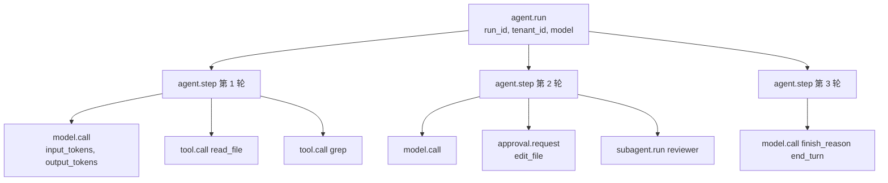
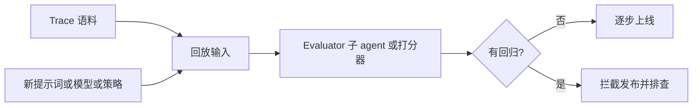

# 第 16 章 — 可观测性

## TL;DR

光靠日志很难调试 agent。你需要一棵 trace 树,看清哪次模型调用引出了哪次工具调用、哪个工具结果改变了下一次 prompt、用了多少 token、延迟出在哪里、run 为什么停下。本章覆盖 agent 可观测性(observability)的四大支柱(trace、指标、日志、eval)、针对 LLM 操作的 OpenTelemetry 属性约定、把一切串起来的关联 ID 链、把此前每一章埋下的观测信号整合到一处的指标目录、采样与脱敏规则,以及"关键 vs 可选"的取舍 — 哪些每个 agent 从第一天就必须埋,哪些等规模逼上来再说。

---

## 为什么这很重要

没有 trace,*"agent 糊涂了"* 这句话无从下手。有了 trace,你能打开某一次具体的 run,逐项检查:prompt 是怎么拼起来的、检索到了哪些记忆、工具参数是什么、工具输出多大、为什么停下、重试了几次、审批怎么决定的、花了多少钱。可观测性不会让 agent 变可靠,但它能让失败暴露到足以被修复。

另一个重要原因:此前的每一章(第 4 到第 15 章)都埋下了某个依赖这一层的指标。缓存命中率(第 4 章)。压缩方法直方图(第 5 章)。检索覆盖率(第 6 章)。Curator 动作直方图(第 7 章)。Run 状态转移计数(第 8 章)。重新规划率(第 9 章)。子 agent 成功率(第 10 章)。审批漏斗(第 12 章)。成本账本(第 15 章)。本章正是让这些散落的信号获得统一形态的地方 — 收集、关联、可查询。

---

## 概念

### 四大支柱,不是三大

经典的可观测性框架是三大支柱:trace、metrics、log。对 agent 而言,*eval* 是同等重要的第四根支柱 — 因为 *"agent 做对了吗?"* 这个问题,光看延迟和 token 是回答不了的。

| 支柱 | 它回答什么问题 | 体量 | 形态 |
|---|---|---|---|
| **Trace** | 这一次具体的 run 发生了什么? | 每 run 一棵 | span 树 |
| **Metrics** | 跨所有 run 的整体情况如何? | 持续 | 时间序列 |
| **Logs** | 系统在某个时刻说了什么? | 大 | 结构化行 |
| **Evals** | agent 是不是产出了对的结果? | 采样 | 通过/失败 加打分 |

在成熟的部署里,每根支柱面向不同的受众。Trace 给排查事故的工程师;指标给盯仪表盘的 SRE;日志给取证复盘和审计追溯(第 5 章);eval 给负责 agent 质量的团队。

### 一次 agent 运行的 trace 树

天然的单位就是 run。一次 run 对应一个 root span,它下面的一切都是子 span:



这棵树就是调试的单位。日志和指标都回指到某个 trace ID;出问题时,你打开的就是这棵 trace。

### OpenTelemetry 属性约定

OpenTelemetry GenAI 语义约定是目前最接近 agent 遥测标准的东西。其中不少字段还处在 OpenTelemetry 的 *Development* 稳定性等级 — 语义约定的说法就是 *预期会改名* — 但整体形态已经稳定到值得现在就采用、日后再迁移。相关属性:

| 属性 | 含义 |
|---|---|
| `gen_ai.provider.name` | `anthropic`、`openai`、`bedrock` 等 |
| `gen_ai.request.model` | 请求的模型 ID |
| `gen_ai.response.model` | 实际服务的模型 ID(可能因 fallback 而不同) |
| `gen_ai.usage.input_tokens` | 计费的输入 token |
| `gen_ai.usage.output_tokens` | 计费的输出 token |
| `gen_ai.usage.cache_read_input_tokens` | 缓存命中(第 4 章) |
| `gen_ai.usage.cache_creation_input_tokens` | 缓存写入(第 4 章) |
| `gen_ai.response.finish_reasons` | `end_turn`、`tool_use`、`max_tokens` 等 |
| `gen_ai.tool.name` | 模型调用的工具 |

在你自己的命名空间下追加 agent 专属属性:

```ts
function modelAttributes(call, result) {
  return {
    "gen_ai.provider.name":              call.provider,
    "gen_ai.request.model":              call.modelId,
    "gen_ai.response.model":             result.modelId,
    "gen_ai.usage.input_tokens":         result.usage.inputTokens,
    "gen_ai.usage.output_tokens":        result.usage.outputTokens,
    "gen_ai.usage.cache_read_input_tokens":     result.usage.cacheRead     ?? 0,
    "gen_ai.usage.cache_creation_input_tokens": result.usage.cacheCreation ?? 0,
    "gen_ai.response.finish_reasons":    [result.finishReason],
    "agent.profile":                     call.profile,
    "agent.run_id":                      call.runId,
    "agent.session_id":                  call.sessionId,
    "agent.tenant_id":                   call.tenantId,
    "agent.parent_run_id":               call.parentRunId,        // subagents
  };
}
```

把属性字符串集中放在一处。散落在代码库各处,将来改名会很痛 — 而改名一定会来。

### 关联 ID:把一切串起来的链

三个 ID 必须贯穿每一行日志、每个指标标签、每个 span:

- **`run_id`** — 这次 agent 运行。每次调用一个。整棵树里稳定。
- **`session_id`** — 对话线程(第 5 章)。一个进行中的 session 一个;一个 session 里多次 run。
- **`step_id`** — loop 的一次迭代(第 2 章)。区分同一次 run 里的第 3 轮和第 7 轮。

外加可选的几个:`tool_call_id`(对应第 1 章的往返)、`subagent_run_id`(委派时,第 10 章)、`parent_run_id`(反向)。

没有这条链,调试一次生产事故就得靠时间戳猜哪行日志属于哪次 run — 而一旦两次 run 时间重叠,这种猜法立刻垮掉。有了这条链,一次 `grep run_id=abc123` 就能召回这次 run 的全部日志、指标和 span。

### 给 loop、模型调用、工具调用埋点

值得各自开一个 span 的三个地方:

```ts
async function invokeAgent(input, ctx) {
  return ctx.tracer.startActiveSpan("agent.run", async (span) => {
    span.setAttributes({
      "agent.run_id":     input.runId,
      "agent.session_id": input.sessionId,
      "agent.tenant_id":  input.actor.tenantId,
    });
    try {
      const result = await runLoop(input, ctx);
      span.setAttribute("agent.status", "completed");
      return result;
    } catch (err) {
      span.setAttribute("agent.status", "failed");
      span.recordException(err);
      throw err;
    } finally {
      span.end();
    }
  });
}

async function callModel(call, ctx) {
  return ctx.tracer.startActiveSpan("model.call", async (span) => {
    const start = performance.now();
    let firstTokenAt;
    const result = await ctx.modelProvider.stream(call, {
      onToken: (token) => {
        if (firstTokenAt === undefined) {
          firstTokenAt = performance.now();
          span.addEvent("model.first_token", {
            ttft_ms: Math.round(firstTokenAt - start),
          });
        }
        ctx.stream.emit(call.runId, { type: "token", token });
      },
    });
    span.setAttributes(modelAttributes(call, result));
    return result;
  });
}

async function executeTool(call, ctx) {
  return ctx.tracer.startActiveSpan("tool.call", async (span) => {
    span.setAttributes({
      "gen_ai.tool.name":   call.name,
      "agent.tool.call_id": call.id,
      "agent.run_id":       call.runId,
    });
    const result = await ctx.tools.dispatch(call.name, call.input, ctx.toolContext);
    span.setAttributes({
      "agent.tool.ok":           result.ok,
      "agent.tool.fatal":        result.ok ? false : result.fatal,
      "agent.tool.result_chars": result.ok ? JSON.stringify(result.result).length : 0,
    });
    return result;
  });
}
```

对流式 agent 来说,首字延迟(time-to-first-token)是用户体验上最受关注的指标,总时长则是容量上最受关注的指标。两个都要记。

### 指标目录 — 组合此前每一章

前面每一章至少埋下了一个可观测信号。它们合起来,构成 agent 专属的指标目录:

| 指标 | 来源章节 | 它告诉你什么 |
|---|---|---|
| `cache_hit_ratio` | 第 4 章 | prompt cache 值不值这个钱?这跟负载有关 — 稳态多轮负载下,过半是个合理的起步目标,完整背景见第 4 章。 |
| `compaction_method_count{method}` | 第 5 章 | 哪种压缩方法在干活? |
| `compaction_compression_ratio` | 第 5 章 | 每次压缩省了多少? |
| `retrieval_empty_hand_rate` | 第 6 章 | 查询是不是返回空?要么记忆不行,要么查询不行。 |
| `retrieval_reach_rate` | 第 6 章 | 模型实际有没有用到我们注入的东西? |
| `memory_write_rejection_rate` | 第 7 章 | 安全过滤器是不是在拦截? |
| `curator_action_count{action}` | 第 7 章 | curator 有没有在剪枝? |
| `run_state_transition_count{from,to}` | 第 8 章 | run 的时间都耗在哪些状态上? |
| `replan_rate` | 第 9 章 | 计划多久需要更新一次? |
| `subagent_success_rate{role}` | 第 10 章 | 每个专家是不是都在出力? |
| `health_check_success_rate{probe}` | 第 11 章 | harness 健康吗? |
| `approvals{state}` | 第 12 章 | 按终态分类的审批漏斗。 |
| `channel_inbound_count{channel}` | 第 13 章 | 每个 channel 的流量。 |
| `cost_usd{tenant,model}` | 第 15 章 | 按租户按模型的开销。 |
| `outbox_depth` | 第 15 章 | 副作用投递延迟。 |
| `queue_depth{queue}` | 第 15 章 | 积压。 |
| `ttft_ms` | 本章 | 首字时间。 |
| `tokens_per_run` | 本章 | 每次 run 的成本驱动。 |

这不是一张愿望清单 — 而是前面各章里每一句 *"这也属于可观测性"* 的并集。只要你像上面那样把 trace 树埋好,这些指标都不难接上;而每当某个指标波动、你追问"为什么"的时候,它们就会连本带利地回报你。

### 把成本作为一等公民指标

成本既出现在 trace 里(每个 `model.call` span),也出现在指标里(按租户、按模型、按天)。公式直接由第 4 章的属性集机械推出:

```ts
function costFromUsage(usage, model) {
  const r = pricing[model];                  // ask your agent for current rates
  return (usage.inputTokens               * r.input)
       + (usage.cacheReadInputTokens      * r.cache_read)
       + (usage.cacheCreationInputTokens  * r.cache_creation)
       + (usage.outputTokens              * r.output);
}
```

按"每租户每天"聚合,在运维仪表盘(第 15 章)上呈现,再对照预算设闸门(路由决策归第 17 章管)。生产 agent 里最有用的单条告警,就是 *对各租户日成本做异常检测*。一个合理的起步规则:当某个租户的日成本超过滚动 7 天均值的 3 倍时,呼叫值班。Hermes Agent 和 Paperclip 的仪表盘里都呈现了这类信号;阈值跟负载有关,值得花工夫调。

### Logs vs metrics vs traces — 什么时候用哪个

三种角色:

- **Trace 是 *因果的*。** 用它回答 *这一次具体的 run 为什么这么干?* 它太冗长,撑不起一眼扫过的仪表盘。
- **指标是 *聚合的*。** 用它回答 *跨所有 run,我们整体表现如何?* 但个体的故事丢了。
- **日志是 *颗粒度的事件*。** 用于取证复盘(第 5 章的审计日志是典型例子),以及那些塞不进 span 的事情 — 启动错误、周期性后台任务、第 7 章 curator 的动作日志。

贯穿三者的规则:每行日志、每个指标数据点、每个 span 都带相同的关联 ID,这样你才能在支柱之间来回跳转。点一下指标尖峰,就拿到贡献这个尖峰的那些 trace ID;打开一条 trace,就能看到它时间窗内的日志。

### agent trace 的采样策略

到了规模化阶段,记录每个 span 会变得很贵。一个务实的采样策略:

- **永远开启(100%)** — 任何报错的 run、任何超预算的 run、任何带审批的 run、任何动过破坏性工具的 run、任何子 agent 的启动。
- **基于尾部(100%)** — 只要树里有任何一个 span 报错,就回溯捕获整棵树。这需要一个带缓冲的 collector(OpenTelemetry Collector 的 `tail_sampling_processor`)。
- **基于头部(10–25%)** — 其余的一切,在 session 启动时按 `run_id` 的确定性哈希来采样,这样同一个 session 里的 run 要么全采、要么全不采。

最大的错误是用一个很低的比率做均匀采样。值得看的 run 恰恰是那些异常值;1% 的均匀采样会把它们大部分丢掉。错误和昂贵的 run 永远开启,其余的走基于头部采样。

### 在 trace 边界做脱敏

遥测会泄露。有三类东西必须在抵达 trace 汇聚点 *之前* 完成脱敏:

- **密钥** — API key、OAuth token、第 15 章 `$secret:` 引用解析出来的值。用模式匹配识别,再替换成 `[REDACTED_<KIND>]`。
- **PII** — 邮箱、电话、社保号、支付信息。同样的做法;有些团队会维护一份按租户的字段白名单,声明哪些字段可以持久化。
- **模型输入与输出** — 默认在 span 上只记录 token *数量*,绝不记全文。全文要存进一个单独受控、带严格访问控制的审计存储(第 5 章那个 append-only 审计日志就是合适的归宿)。

Hermes Agent 的 `RedactingFormatter` 在日志格式化器这一层处理这件事;而在 trace 管线里,正确的位置是 *exporter*,或者 OpenTelemetry Collector 里的流内 processor。事后再脱敏 — 等 span 都发到第三方后端之后 — 就太晚了。

### 把 eval 当作可观测性

trace 可以变成一份回归数据集。在改动 system prompt、模型档位、工具 schema 或路由策略之前,先回放有代表性的 trace,再给结果打分。



架构很简单:收集生产 trace,拿候选变更回放它们,给结果打分(语义相似度、结构化字段比对,或第 10 章验证模式里那种 evaluator 子 agent),再据此给上线开闸门。eval 套件是你抵御静默回归的安全网 — 就是那种能通过测试、抽检时看着也合理、却要等一周后在生产里才暴露的回归。

想要更精细,可以持续跑一个小型 eval:每小时采样 50 次最近的生产 run,在基线配置下重跑一遍,一旦出现差异就告警。Hermes Agent 有一个专门做这件事的后台模式;Paperclip 则通过它的 `heartbeat_runs` 审计日志,具备了搭建这套机制的零件。

### Eval 方法 — 打什么分,怎么打

上一节讲的是 *闸门* — 回放、比较、放行。这一节讲 *方法* — 到底打什么分、用哪个 judge、输入从哪儿来。这是把 agent 发出去并持续迭代而不至于睁眼瞎,所需要的最小 eval 工具包。

**四个打分维度。** 多数 agent eval 都归结到这四个,大致按主观性由低到高排列:

- **功能正确性** — agent 做到要求它做的事了吗?闭式任务下这是二元的(测试通过、值匹配),允许部分给分时则是分级的。这是最重要的维度,也是任务有 ground truth 时最容易自动化的一个。
- **步骤效率** — 花了多少轮、多少次工具调用、多少 token?这是个成本代理,跟用户感知到的延迟和账单都相关。从上面那棵 trace 树里算出来很便宜。
- **输出质量** — 格式是否规范、是否准确、是否有用。通常需要一个 judge(能用确定性的就用确定性,否则就 LLM-as-judge)。
- **用户满意度** — 显式反馈(点赞点踩、接受或拒绝 diff),或隐式反馈(从给出到被接受的耗时、用户是否重试)。这是最要紧的信号,也是规模化时最难收集的。

能打的维度都打;然后按用户实际为之付费的东西来加权。

**三种 judge 模式。** 大致按偏好顺序:

- **确定性检查** — regex、JSON Schema 校验、代码执行、与已知答案做相等比较。最便宜、最快、最可靠。优先用它;凡是能做成确定性的都该做成确定性。
- **LLM-as-judge** — 用一个更便宜的模型,按 rubric 给 agent 的输出打分。这是非确定性任务的标准做法。要专门设计去对抗三种偏差:*冗长偏差*(judge 偏爱更长的输出)、*位置偏差*(judge 偏爱先看到的那个)、*自我偏好*(同一模型家族的 judge 给自家家族打更高分)。缓解办法:给 judge 配一份紧凑的 rubric、随机化选项位置、用一个与 agent 不同的模型家族。
- **成对比较** — 给 judge 看两份输出(baseline 对 candidate),问哪个更好。对模糊任务来说,这比绝对打分更可靠 — *"A 比 B 好吗?"* 这个问题,模型回答得比 *"这个好吗?"* 要一致得多。

高风险的 eval,可以集成两到三个 judge 再取多数。分歧本身就是个有用信号 — judge 们意见不一的那些案例,恰恰是值得人来看一眼的案例。

**eval 语料从哪来。** 三个来源,按对生产 agent 的有用程度排序:

- **生产 trace 语料。** 第 5 章的审计日志,加上本章前面那棵 trace 树,就是你手头最便宜、最贴近实际的 eval 集。采样 50–100 次最近的 run,拿候选回放,打分。它永远有代表性,因为它就是真实流量。
- **合成数据集。** 用一个更强的模型生成测试输入,去覆盖生产流量还没碰到的边角情况。对提升覆盖率有用;对还原真实分布则不那么可靠。
- **公开 benchmark。** 对找方向、跟同行交流有用,但不能直接当作生产闸门。用它们了解 SOTA 在哪儿,而不是用它们来决定要不要发布。

**值得知道、用于找方向的几个 benchmark。** 它们有助于你理解什么是难的、这个领域的门槛在哪儿。它们都替代不了在你自己工作负载上的评估,但花几分钟记住这些名字是值得的:

- **SWE-bench / SWE-bench Verified** — 编码 agent 解决真实 GitHub issue。回答 *"agent 到底能不能把修复发出去?"* 的头部参考。
- **τ-bench** — 真实领域(航空、零售)里的工具使用。考验多轮工具调用对目标的完成度。
- **GAIA** — 面向复杂真实问题的通用 AI 助手。检索 + 推理 + 工具使用,端到端。
- **WebArena** — 网页导航任务。浏览器类 agent 的参考。
- **AgentBench** — 横跨 OS、代码、网页、知识任务的综合能力 benchmark。

还有更多,而且每个季度都冒出新的。和你一起读这门课的 agent 能说出当前榜首是谁;上面这些名字则稳定到值得记下来,供你找方向用。

**能发布的最小 eval 工具包。** 上面这些,你一个都不需要就能起步。底线只要:

- 一个小而固定的语料 — 10 到 50 个真实负载输入,签进 repo。
- 一个打分函数 — 能确定性就确定性,不行就 LLM judge。
- 一个 baseline 对 candidate 的跑分器,每一侧各产出一个数字。
- 当这个数字回退超过某个阈值时告警。

就这些。再往上的一切 — judge 集成、接入公开 benchmark、合成生成、奖励模型 — 都是等工作负载值得了再慢慢长出来的。能发出最有用 agent 的团队,往往是那些拥有 *每次变更都真的会跑* 的最小 eval 工具包的团队,而不是那些有着最精致的 eval 框架、却从没拦下过一次发布的团队。

### Eval 治理 — 让 eval 流水线保持诚实

一条给生产 run 打分的 eval 流水线,它本身就是一套生产系统。运行它的团队要管四件事:

- **数据集版本控制。** eval 语料会变 — 你会加进边角案例、淘汰过时的、修正标签。锁定版本,并记录每个分数是由哪个数据集版本产出的;在 `eval_set@v3` 上算回归的,放到 `eval_set@v4` 上不一定还算。
- **rubric 版本控制。** LLM-as-judge 的 rubric 也是个动靶。给它们打版本,记录每次 run 是用哪个版本打的分。否则 *"模型退步了"* 和 *"我们把 rubric 收紧了"* 这两件事看起来一模一样。
- **evaluator 漂移。** 一换 judge 模型 — 换便宜的版本、换个家族、用新发布的版本 — 哪怕 agent 没动,绝对分也会跟着移。judge 一变就重新建立基线;尽量用 *相对* 打分(同一个 judge 下 baseline 对 candidate),而不是靠绝对阈值。
- **回放隐私。** trace 语料里含有用户数据。回放 trace 会重新处理那些可能受第 7 章删除标记、或第 8 章恢复隐私规则约束的内容。回放前先过滤语料;eval 流水线绝不能变成一条让用户已要求删除的内容"复活"的途径。

你给 agent 本身定的那套版本控制、审计、隐私纪律,要同样施加到评估它的 eval 流水线上。否则,这条流水线声称提供的闸门就是假的 — 一个动了的数字,谁也说不清它为什么动。

### Trace 回放调试界面

与指标仪表盘配套的、面向运维的工具,就是打开某一次 run、把它就地展开来看。

Paperclip 和 OpenCode 殊途同归收敛到的模式:

- 顶部是 root span,带上关键属性(模型、token、成本、状态、时长)。
- 下面是缩进的子 span 树 — step、模型调用、工具调用、子 agent 运行。
- 点开任意一个 span,就能看到它的属性、对应时间窗内的日志、错误和堆栈跟踪。
- 一个 *回放* 按钮,用相同的输入在当前代码上重跑那一轮。
- 一个时间线视图,显示 wall-clock 都花在了哪里(等模型 vs 工具执行 vs 队列等待)。

这是 agent 调试里最有价值的一件运维工具。底层的 trace 树建得好,这个 UI 就很容易做;建得糟,再好的 UI 也救不了你。

### 关键 vs 可选 — 第一天该埋什么

本章里并非每个指标都是必备。诚实的排序如下:

**关键 — 每个 agent 从第一天就要的:**

- 根 `agent.run` span,带 `run_id`、`tenant_id`、`status`、总 token、成本。
- 每次 LLM 调用一个 `model.call` span,带上 OpenTelemetry 的 token 属性。
- 每次派发一个 `tool.call` span,带上 name、ok/fatal、result_chars。
- 每行日志都带关联 ID。
- 每次未捕获异常都打一条错误日志。
- 缓存命中率(第 4 章 — 太便宜了,没理由跳过)。
- 按租户的日成本(第 15 章 — 运维必备,不是可选项)。

**早期就很有价值:**

- Run 状态转移计数(第 8 章)。
- 审批漏斗(第 12 章)。
- TTFT 和总时长直方图。
- 出错时的基于尾部采样。
- exporter 处的结构化脱敏。

**等规模逼上来再做的可选项:**

- 持续 eval 套件。
- 成本异常检测。
- 各工具的延迟直方图。
- trace 属性的 schema 版本控制。
- trace 回放 UI。
- 第 2 章运行时检测之外的死循环(doom loop)告警。

要避开的陷阱是:关键层还没做好,就先去建可选层。一个有二十张图却没人信的仪表盘,比一张能抓住每次事故的图还糟。从关键清单的最顶端开始,上一层稳了再加下一层。

### Trace 属性的 schema 版本控制

你今天发出的属性,迟早需要改。三个习惯:

- **给自定义属性加命名空间**(`agent.*`),这样改名的波及范围有边界。
- **新增属性;不要复用旧属性。** 含义变了,就给它一个新名字。
- **显式给 trace schema 打版本**,在 root span 上放一个 `trace_schema_version` 属性。查询就变成 *给我 `schema=v2` 且……的 run* — 老 run 不会把查询搞挂。

OpenTelemetry GenAI 约定本身也在演化。今天把它们当作正式名字用,一年后把它们当作待迁移的候选。

---

## 真实系统笔记

- **OpenCode** 从它的服务器流出结构化的 session 事件,把 session 和消息片段持久化到 SQLite,并把消息总线暴露给 SSE 客户端 — 既是编码 agent 一个务实的可观测性界面,也充当你接入任何 OTLP exporter 时的 trace 种子。
- **Paperclip** 记录 `heartbeat_run_events`、`cost_events`、`issue_approvals` 和 adapter 执行状态,给运维提供了一个直接对应本章指标目录的控制面视图。它是 trace 回放 UI 模式最强的参考。
- **Hermes Agent** 为结构化日志提供了 `RedactingFormatter`,通过 FTS5 提供用于审计的 session 搜索,还有一个能跑持续 eval 的后台模式 — 是源头脱敏和 eval-as-observability 两种模式的有用参考。
- **OpenClaw** 提醒你:trace 里必须带上 *channel* 和 *adapter* 元数据。同一段 agent 行为在不同平台上可能表现各异,而把 Slack 和 Telegram 混作一团的可观测性,会掩盖掉真实的失败。

---

## 与你的 agent 结对

- *"把 OpenTelemetry 接进我的 harness,采用 `gen_ai.*` 属性约定。验证每次模型调用、工具调用、审批都发出一个 span。在我的 OTLP 后端打开一次 run,确认 trace 树跟实际发生的吻合。"*
- *"给每行日志、每个 span、每个指标加上关联 ID(`run_id`、`session_id`、`step_id`、`tool_call_id`)。给我演示一次 `grep run_id=...`,让它跨三大支柱把一次 run 的完整故事召回来。"*
- *"把本章的指标目录实现成一套 Prometheus 或 OTLP 指标。每个租户建一个仪表盘:今日成本、缓存命中率、run 状态分布、审批漏斗、按错误率排序的 Top 工具。"*
- *"设置采样策略:错误和昂贵的 run(超过 $0.10)永远开启,任何报错 span 触发基于尾部 100%,其余基于头部 10%。用压力测试来验证。"*
- *"在 OTLP exporter 或 collector 加脱敏。参考 Hermes 的 `RedactingFormatter` 规则。在工具参数里故意注入一个密钥,验证它绝不到达 trace 后端。"*
- *"立起一个 eval-as-observability 循环:每小时采样 50 次生产 run,在当前配置下回放,用一个 evaluator 子 agent(第 10 章)打分,差异超过 5% 就告警。"*
- *"为某一次 run 搭一个 trace 回放 UI:span 树、属性、日志,再加一个 *回放* 按钮,用相同输入重跑那一轮。用我的 OTLP 后端 API。"*
- *"加上成本异常检测:某租户日成本超过其滚动 7 天均值 3 倍时呼叫值班。用一个月的历史数据来调这个倍数。"*
- *"带我过一遍本章目录里哪些指标在我的 agent 里 *还没* 接上。按关键 / 高价值 / 可选的划分来排优先级。"*

---

## 接下来

现在你能看见自己的 agent 在做什么了。下一章会用这些测量结果来决定 *用哪个模型*、*用哪个 provider*,什么时候 fallback,什么时候节流,以及如何实时地强制执行每租户预算。第 17 章讲的是成本与延迟策略。
