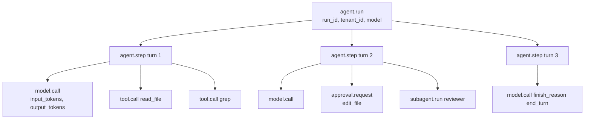
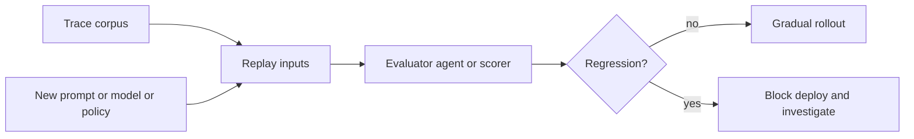

# 第 16 章 — 可观测性

## TL;DR

光看日志很难调试 agent。你需要一棵 trace 树,显示哪次模型调用导致了哪次工具调用、哪次工具结果改变了下一次的 prompt、用了多少 token、延迟出现在哪里、run 为什么停下来。本章覆盖 agent 可观测性 (observability) 的四大支柱(trace、metrics、log、eval)、针对 LLM 操作的 OpenTelemetry 属性约定、把所有东西串起来的关联 ID 链、整合此前每一章埋下的观测信号的指标目录,以及采样和脱敏规则,以及"关键 vs 可选"的取舍 — 每个 agent 从第一天就必须埋的,和等规模逼上来才埋的。

---

## 为什么这很重要

没有 trace,*"agent 糊涂了"* 不是一句可操作的话。有了 trace,你能打开某一次具体的 run,逐项检查:prompt 组装、检索到的 memory、工具参数、工具输出大小、停止原因、重试次数、审批决定、成本。可观测性不会让 agent 更可靠。它让失败可见到能被修。

另一个重要原因:此前的每一章(第 4 到第 15 章)都埋了某个依赖这一层的指标。缓存命中率(第 4 章)。压缩方法直方图(第 5 章)。检索覆盖率(第 6 章)。Curator 动作直方图(第 7 章)。Run 状态转移计数(第 8 章)。重新规划率(第 9 章)。子 agent 成功率(第 10 章)。审批漏斗(第 12 章)。成本账本(第 15 章)。本章是这些散落信号取得共同形态的地方 — 收集、关联、可查询。

---

## 概念

### 四大支柱,不是三大

经典的可观测性框架是三大支柱:trace、metrics、log。对 agent 而言,*eval* 是同等重要的第四根支柱 — 因为 *"agent 做对了吗?"* 这个问题,光看延迟和 token 是回答不了的。

| 支柱 | 它回答什么问题 | 体量 | 形态 |
|---|---|---|---|
| **Trace** | 这一次具体的 run 发生了什么? | 每 run 一棵 | span 树 |
| **Metrics** | 跨所有 run 的整体情况如何? | 持续 | 时间序列 |
| **Logs** | 系统在某个时刻说了什么? | 大 | 结构化行 |
| **Evals** | agent 是不是产出了对的结果? | 采样 | 通过/失败 加打分 |

在成熟部署里,每根支柱有不同的受众。Trace 给调试事故的工程师;metrics 给看仪表盘的 SRE;logs 给取证复盘和审计追溯(第 5 章);evals 给负责 agent 质量的团队。

### 一次 agent 运行的 trace 树

天然的单位是 run。一次 run 变成一个 root span;它下面的全是子 span:



这棵树就是调试的单位。Logs 和 metrics 都指回一个 trace ID;出问题时你打开的是这棵 trace。

### OpenTelemetry 属性约定

OpenTelemetry GenAI 语义约定是当前最接近 agent 遥测标准的东西。这里的很多字段还在 OpenTelemetry 的 *Development* 稳定性等级 — 语义约定的说法就是 *预期会改名* — 但形态已经稳定到值得现在就提交并稍后迁移。相关属性:

| 属性 | 含义 |
|---|---|
| `gen_ai.provider.name` | `anthropic`、`openai`、`bedrock` 等 |
| `gen_ai.request.model` | 请求的模型 ID |
| `gen_ai.response.model` | 实际服务的模型 ID(可能因 fallback 而不同) |
| `gen_ai.usage.input_tokens` | 计费的输入 token |
| `gen_ai.usage.output_tokens` | 计费的输出 token |
| `gen_ai.usage.cache_read_input_tokens` | 缓存命中(第 4 章) |
| `gen_ai.usage.cache_creation_input_tokens` | 缓存写入(第 4 章) |
| `gen_ai.response.finish_reasons` | `end_turn`、`tool_use`、`max_tokens` 等 |
| `gen_ai.tool.name` | 模型调用的工具 |

在你自己的命名空间下加 agent 专属属性:

```ts
function modelAttributes(call, result) {
  return {
    "gen_ai.provider.name":              call.provider,
    "gen_ai.request.model":              call.modelId,
    "gen_ai.response.model":             result.modelId,
    "gen_ai.usage.input_tokens":         result.usage.inputTokens,
    "gen_ai.usage.output_tokens":        result.usage.outputTokens,
    "gen_ai.usage.cache_read_input_tokens":     result.usage.cacheRead     ?? 0,
    "gen_ai.usage.cache_creation_input_tokens": result.usage.cacheCreation ?? 0,
    "gen_ai.response.finish_reasons":    [result.finishReason],
    "agent.profile":                     call.profile,
    "agent.run_id":                      call.runId,
    "agent.session_id":                  call.sessionId,
    "agent.tenant_id":                   call.tenantId,
    "agent.parent_run_id":               call.parentRunId,        // subagents
  };
}
```

属性字符串集中放在一个地方。散落在代码库里会让将来的改名很痛 — 而改名一定会来。

### 关联 ID:把一切串起来的链

三个 ID 必须贯穿每一行日志、每个指标标签、每个 span:

- **`run_id`** — 这次 agent 运行。每次调用一个。整棵树里稳定。
- **`session_id`** — 对话线程(第 5 章)。一个进行中的 session 一个;一个 session 里多次 run。
- **`step_id`** — loop 的一次迭代(第 2 章)。区分同一次 run 里的第 3 轮和第 7 轮。

外加可选的几个:`tool_call_id`(对应第 1 章的往返)、`subagent_run_id`(委派时,第 10 章)、`parent_run_id`(反向)。

没有这条链,调试一次生产事故需要靠时间戳猜哪行日志属于哪次 run — 两次 run 一重叠这种猜法就垮了。有了这条链,一次 `grep run_id=abc123` 就能召回这次 run 的全部 log、metric、span。

### 给 loop、模型调用、工具调用埋点

值得拥有自己的 span 的三个地方:

```ts
async function invokeAgent(input, ctx) {
  return ctx.tracer.startActiveSpan("agent.run", async (span) => {
    span.setAttributes({
      "agent.run_id":     input.runId,
      "agent.session_id": input.sessionId,
      "agent.tenant_id":  input.actor.tenantId,
    });
    try {
      const result = await runLoop(input, ctx);
      span.setAttribute("agent.status", "completed");
      return result;
    } catch (err) {
      span.setAttribute("agent.status", "failed");
      span.recordException(err);
      throw err;
    } finally {
      span.end();
    }
  });
}

async function callModel(call, ctx) {
  return ctx.tracer.startActiveSpan("model.call", async (span) => {
    const start = performance.now();
    let firstTokenAt;
    const result = await ctx.modelProvider.stream(call, {
      onToken: (token) => {
        if (firstTokenAt === undefined) {
          firstTokenAt = performance.now();
          span.addEvent("model.first_token", {
            ttft_ms: Math.round(firstTokenAt - start),
          });
        }
        ctx.stream.emit(call.runId, { type: "token", token });
      },
    });
    span.setAttributes(modelAttributes(call, result));
    return result;
  });
}

async function executeTool(call, ctx) {
  return ctx.tracer.startActiveSpan("tool.call", async (span) => {
    span.setAttributes({
      "gen_ai.tool.name":   call.name,
      "agent.tool.call_id": call.id,
      "agent.run_id":       call.runId,
    });
    const result = await ctx.tools.dispatch(call.name, call.input, ctx.toolContext);
    span.setAttributes({
      "agent.tool.ok":           result.ok,
      "agent.tool.fatal":        result.ok ? false : result.fatal,
      "agent.tool.result_chars": result.ok ? JSON.stringify(result.result).length : 0,
    });
    return result;
  });
}
```

对流式 agent 来说,首字延迟 (time-to-first-token) 是用户体验上最受关注的指标。总时长是容量上最受关注的指标。两个都要记。

### 指标目录 — 组合此前每一章

前面每一章至少埋了一个可观测信号。它们合起来构成 agent 专属的指标目录:

| 指标 | 来源章节 | 它告诉你什么 |
|---|---|---|
| `cache_hit_ratio` | 第 4 章 | prompt cache 值不值得?跟负载有关 — 一个合理的起步目标是稳态多轮负载下过半,但完整背景见第 4 章。 |
| `compaction_method_count{method}` | 第 5 章 | 哪种压缩方法在干活? |
| `compaction_compression_ratio` | 第 5 章 | 每次压缩省了多少? |
| `retrieval_empty_hand_rate` | 第 6 章 | 查询返回空了吗?要么 memory 不行,要么查询不行。 |
| `retrieval_reach_rate` | 第 6 章 | 模型实际有没有用到我们注入的东西? |
| `memory_write_rejection_rate` | 第 7 章 | 安全过滤器有没有在咬? |
| `curator_action_count{action}` | 第 7 章 | curator 有没有在剪枝? |
| `run_state_transition_count{from,to}` | 第 8 章 | run 都耗在哪些状态? |
| `replan_rate` | 第 9 章 | 计划多频繁需要更新? |
| `subagent_success_rate{role}` | 第 10 章 | 每个专家有没有出力? |
| `health_check_success_rate{probe}` | 第 11 章 | harness 健康吗? |
| `approvals{state}` | 第 12 章 | 按终态分类的审批漏斗。 |
| `channel_inbound_count{channel}` | 第 13 章 | 每个 channel 的流量。 |
| `cost_usd{tenant,model}` | 第 15 章 | 按租户按模型的开销。 |
| `outbox_depth` | 第 15 章 | 副作用投递延迟。 |
| `queue_depth{queue}` | 第 15 章 | 积压。 |
| `ttft_ms` | 本章 | 首字时间。 |
| `tokens_per_run` | 本章 | 每次 run 的成本驱动。 |

这不是愿望清单 — 而是前面所有章 *"这也是可观测性"* 节拍的并集。只要你像上面那样埋好 trace 树,这些都不难接;每次某个指标动了你问"为什么"的时候,它们都会还本。

### 把成本作为一等公民指标

成本既出现在 trace 里(每个 `model.call` span),也出现在 metrics 里(按租户、按模型、按天)。公式直接来自第 4 章的属性集:

```ts
function costFromUsage(usage, model) {
  const r = pricing[model];                  // ask your agent for current rates
  return (usage.inputTokens               * r.input)
       + (usage.cacheReadInputTokens      * r.cache_read)
       + (usage.cacheCreationInputTokens  * r.cache_creation)
       + (usage.outputTokens              * r.output);
}
```

按每租户每天聚合,在运维仪表盘(第 15 章)上呈现,对照预算闸门(第 17 章管路由决策)。生产 agent 里最有用的单一告警就是 *按租户日成本的异常检测*。一个合理起点:当某个租户的日成本超过滚动 7 天均值的 3 倍时呼叫。Hermes Agent 和 Paperclip 在仪表盘里都呈现了这类信号;阈值跟负载有关,值得调。

### Logs vs metrics vs traces — 什么时候用哪个

三种角色:

- **Trace 是 *因果的*。** 用它回答 *这次具体的 run 为什么这么干?* 在一眼仪表盘上太冗长。
- **Metrics 是 *聚合的*。** 用它回答 *跨所有 run 我们整体怎么样?* 个体故事丢了。
- **Logs 是 *颗粒事件*。** 用于取证复盘(第 5 章的审计日志是经典例子)和那些塞不进 span 的事情 — 启动错误、周期性后台任务、第 7 章 curator 的动作日志。

贯穿三者的规则:每行 log、每个 metric 数据点、每个 span 都带相同的关联 ID,这样你能在支柱之间跳转。点一下 metric 尖峰,得到贡献这个尖峰的 trace ID;打开一个 trace,看它时间窗内的 log。

### agent trace 的采样策略

规模化下,记录每个 span 会贵。一个务实的采样策略:

- **永远开启(100%)** — 任何报错的 run、任何超预算的 run、任何带审批的 run、任何动了破坏性工具的 run、任何 subagent spawn。
- **基于尾部(100%)** — 如果树里有任何 span 报错,回溯捕获整棵树。需要一个带缓冲的 collector(OpenTelemetry Collector 的 `tail_sampling_processor`)。
- **基于头部(10–25%)** — 其他一切,在 session 启动时按 `run_id` 的确定性哈希采样,这样一个 session 里的 run 要么全采要么全不采。

最大的错误是在低比率下做均匀采样。有意思的 run 是异常值;1% 均匀采样会把它们大部分扔掉。错误和昂贵 run 永远开启,其他基于头部。

### 在 trace 边界做脱敏

遥测会泄露。三类东西必须在到达 trace 汇之前 *脱敏*:

- **密钥** — API key、OAuth token、第 15 章 `$secret:` 引用解析出来的值。模式匹配后替换为 `[REDACTED_<KIND>]`。
- **PII** — 邮箱、电话、社保号、支付细节。同样的做法;有些团队维护一份每租户的字段白名单,说明哪些可以持久化。
- **模型输入输出** — 默认在 span 上只记录 token *计数*,绝不记全文。把全文存到一个单独受控的审计存储里,带严格访问控制(第 5 章的 append-only 审计日志是合适的归宿)。

Hermes Agent 的 `RedactingFormatter` 在日志格式化器层处理这件事;在 trace 管线里,正确的位置是 *exporter* 或 OpenTelemetry Collector 里的流内 processor。事后脱敏 — span 都发到第三方后端之后 — 太晚了。

### 把 eval 当作可观测性

trace 变成一份回归数据集。在改系统提示词、模型档位、工具 schema、路由策略之前,回放代表性 trace 然后打分。



架构很简单:收集生产 trace,对候选变更回放,给结果打分(语义相似度、结构化字段比较、第 10 章验证模式里那种 evaluator 子 agent),给上线开闸门。eval 套件是你抵御静默回归的安全网 — 那种通过测试、抽检看着合理、只在一周后到生产里才暴露的回归。

更精细的设置,持续跑一个小型 eval:每小时采样 50 次最近的生产 run,在基线配置下重跑,差异告警。Hermes Agent 有一个后台模式干这事;Paperclip 通过它的 `heartbeat_runs` 审计日志拥有这些建造模块。

### Eval 方法 — 打什么分,怎么打

上一节讲了 *闸门* — 回放、比较、放行。这一节讲 *方法* — 实际打什么分、用哪个 judge、输入从哪来。把 agent 发出去并迭代而不至于睁眼瞎,所需的最小 eval 工具包。

**四个打分维度。** 多数 agent eval 归结为这四个,大致按主观性递增的顺序:

- **功能正确性** — agent 做了被要的事吗?闭式任务下是二元的(测试过、值匹配),部分给分下是分级的。最重要的维度,也是当任务有 ground truth 时最容易自动化的。
- **步骤效率** — 用了多少轮、工具调用、token?一个跟用户感知延迟和账单相关的成本代理。从上面那棵 trace 树里算很便宜。
- **输出质量** — 格式好不好、准确、有用。通常需要 judge(尽量确定性的,不行就 LLM-as-judge)。
- **用户满意度** — 显式反馈(点赞点踩、接受/拒绝 diff),或隐式(到接受的时长、用户是否重试)。最重要的信号,也是规模化最难收集的。

能打的都打;按用户实际付费的东西来加权。

**三种 judge 模式。** 大致按偏好顺序:

- **确定性检查** — regex、JSON Schema 校验、代码执行、和已知答案做相等比较。最便宜、最快、最可靠。先用它;能确定性的都该确定性。
- **LLM-as-judge** — 用一个更便宜的模型按 rubric 给 agent 输出打分。非确定性任务的标准做法。要设计去对抗三种偏差:*冗长偏差*(judge 偏爱更长的输出)、*位置偏差*(judge 偏爱先看到的那个)、*自我偏好*(同模型家族的 judge 给自家打更高分)。缓解办法:judge 配一个紧致的 rubric、随机化位置、用跟 agent 不同的模型家族。
- **成对比较** — 给 judge 看两个输出(baseline vs candidate)问哪个更好。对模糊任务比绝对打分更可靠 — *"A 比 B 好吗?"* 模型回答得比 *"这个好吗?"* 一致得多。

高风险 eval,集成两到三个 judge,取多数。分歧本身就是个有用的信号 — judge 们意见不一致的案例就是值得人看的案例。

**eval 语料从哪来。** 三个来源,按对生产 agent 的有用程度排序:

- **生产 trace 语料。** 第 5 章的审计日志加上本章前面那棵 trace 树,是你拥有的最便宜也最相关的 eval 集。采样 50–100 次最近的 run;对候选回放;打分。总是有代表性的,因为是真实流量。
- **合成数据集。** 用更强的模型生成测试输入,覆盖生产流量还没触及的边角。对覆盖率有用;对分布不那么可靠。
- **公开 benchmark。** 对找方向和与圈内交流有用,不能直接当生产闸门。用它们了解 SOTA 在哪儿,不是用来决定要不要发布。

**值得知道用于找方向的 benchmark。** 用于理解什么难、领域门槛在哪儿。这些都不能替代你自己工作负载上的评估,但花几分钟知道这些名字是值得的:

- **SWE-bench / SWE-bench Verified** — 编码 agent 解决真实 GitHub issue。回答 *"agent 能不能把修复发出去?"* 的领头参考。
- **τ-bench** — 在真实领域(航空、零售)的工具使用。多轮工具调用对目标完成度的测试。
- **GAIA** — 在复杂真实问题上的通用 AI 助手。检索 + 推理 + 工具使用端到端。
- **WebArena** — 网页导航任务。浏览器 agent 的参考。
- **AgentBench** — 跨 OS、code、web、知识任务的综合能力 benchmark。

还有更多,每个季度都有新的。和你一起读这门课的 agent 能说出当前的榜首;上面这些名字稳定到值得记下来用于找方向。

**最小 eval 工具包。** 上面这些你不需要任何一个就能开始。底线是:

- 一个小固定语料 — 10 到 50 个真实负载输入,签进 repo。
- 一个打分函数 — 能确定性就确定性,不行就 LLM judge。
- 一个 baseline-vs-candidate 跑分器,每边产出一个数字。
- 数字回退超过某阈值时告警。

就这样。之外的一切 — judge 集成、公开 benchmark 接入、合成生成、奖励模型 — 都是工作负载需要时再长进去的。发出最有用 agent 的团队,通常是有 *每次变更都真的会跑* 的最小 eval 工具包的那些,而不是拥有最精致 eval 框架但从未拦过一次发布的那些。

### Eval 治理 — 让 eval 流水线保持诚实

一个给生产 run 打分的 eval 流水线本身就是一个生产系统。运行它的团队要管四件事:

- **数据集版本控制。** eval 语料会变 — 你加边角案例、淘汰过时的、修标签。锁版本,记录每个分数是哪个数据集版本产出的;`eval_set@v3` 上的回归不一定是 `eval_set@v4` 上的回归。
- **rubric 版本控制。** LLM-as-judge 的 rubric 也是动靶。给它们打版本,记录每次 run 是哪个版本打分的。*"模型退步了"* 和 *"我们把 rubric 收紧了"* 没这层就长得一模一样。
- **evaluator 漂移。** 换 judge 模型 — 便宜版本、不同家族、新版发布 — 即使 agent 没变,绝对分也会移。judge 一动就重新基线;倾向用 *相对* 打分(同一个 judge 下 baseline vs candidate),而不是绝对阈值。
- **回放隐私。** trace 语料含用户数据。回放 trace 会重新处理那些可能受第 7 章删除标记或第 8 章恢复隐私规则约束的内容。回放前先过滤语料;eval 流水线不能成为复活用户已要求移除内容的途径。

把你给 agent 用的版本控制、审计、隐私纪律,同样应用到评估 agent 的 eval 流水线上。否则它声称提供的闸门是假的 — 一个数字动了,谁都说不清为什么。

### Trace 回放调试界面

跟 metrics 仪表盘配套的面向运维的工具,是打开某一次 run 把它就地展开来看。

Paperclip 和 OpenCode 收敛到的模式:

- 顶部是 root span,带关键属性(模型、token、成本、状态、时长)。
- 下面是缩进的子 span 树 — step、模型调用、工具调用、子 agent 运行。
- 点任何 span 看属性、那个时间窗内的 logs、错误和堆栈跟踪。
- 一个 *回放* 按钮,用相同输入在当前代码上重跑那一轮。
- 一个时间线视图,显示 wall-clock 花在哪里(模型等待 vs 工具执行 vs 队列等待)。

这是 agent 调试里最有价值的单一运维工具。把底层的 trace 树建好,这个 UI 就很简单;建坏了,任何 UI 都救不了你。

### 关键 vs 可选 — 第一天该埋什么

本章里不是每个指标都是必备。诚实的排序:

**关键 — 每个 agent 从第一天就要的:**

- 根 `agent.run` span,带 `run_id`、`tenant_id`、`status`、总 token、成本。
- 每次 LLM 调用一个 `model.call` span,带 OpenTelemetry token 属性。
- 每次派发一个 `tool.call` span,带 name、ok/fatal、result_chars。
- 每行 log 都带关联 ID。
- 每次未捕获异常的错误日志。
- 缓存命中率(第 4 章 — 太便宜,跳过没道理)。
- 按租户日成本(第 15 章 — 运维必备,不可选)。

**早期高价值:**

- Run 状态转移计数(第 8 章)。
- 审批漏斗(第 12 章)。
- TTFT 和总时长直方图。
- 错误上的基于尾部采样。
- exporter 处的结构化脱敏。

**等规模逼上来再做的可选项:**

- 持续 eval 套件。
- 成本异常检测。
- 每工具延迟直方图。
- trace 属性的 schema 版本控制。
- trace 回放 UI。
- 第 2 章运行时检测之外的死循环告警。

要避开的陷阱:在关键的还没好之前就建可选层。一个有二十张图但没人信的仪表盘,比一张能抓住每次事故的图还糟。从关键清单顶端开始,只有当上一层稳了才加下一层。

### Trace 属性的 schema 版本控制

你今天发出的属性会需要改。三个习惯:

- **给自定义属性加命名空间**(`agent.*`),改名的影响就有边界。
- **添加新属性;不要复用旧属性。** 含义变了就给新名字。
- **显式给 trace schema 加版本**,在 root span 上放 `trace_schema_version` 属性。查询变成 *给我 `schema=v2` 且……的 run* — 老 run 不会让查询挂掉。

OpenTelemetry GenAI 约定本身也在演化。今天把它们当作正式名字,一年后把它们当作迁移的候选。

---

## 真实系统笔记

- **OpenCode** 从它的服务器流出结构化的 session 事件,把 session 和消息片段持久化到 SQLite,把总线暴露给 SSE 客户端 — 是编码 agent 一个务实的可观测性界面,同时给你接到任何 OTLP exporter 时作为 trace 种子。
- **Paperclip** 记录 `heartbeat_run_events`、`cost_events`、`issue_approvals`、adapter 执行状态,给运维提供直接对应本章指标目录的控制面视图。是 trace 回放 UI 模式最强的参考。
- **Hermes Agent** 提供 `RedactingFormatter` 用于结构化日志,通过 FTS5 提供 session 搜索用于审计,还有一个能跑持续 eval 的后台模式 — 是源头脱敏和 eval-as-observability 模式的有用参考。
- **OpenClaw** 提醒你 trace 必须包含 *channel* 和 *adapter* 元数据:同一个 agent 行为在不同平台可能不同,把 Slack 和 Telegram 混在一起的可观测性会掩盖真实失败。

---

## 与你的 agent 配对练习

- *"把 OpenTelemetry 接进我的 harness,用 `gen_ai.*` 属性约定。验证每次模型调用、工具调用、审批都发出一个 span。在我的 OTLP 后端打开一次 run,确认 trace 树和实际发生的吻合。"*
- *"给每行 log、span、metric 加关联 ID(`run_id`、`session_id`、`step_id`、`tool_call_id`)。给我看一个 `grep run_id=...` 能跨三大支柱召回一次 run 的全部故事。"*
- *"把本章的指标目录实现为一套 Prometheus 或 OTLP 指标。每租户建一个仪表盘:今日成本、缓存命中率、run 状态分布、审批漏斗、按错误率排序的 Top 工具。"*
- *"设置采样策略:错误和昂贵 run(超过 $0.10)永远开启,任何错误 span 触发基于尾部 100%,其他基于头部 10%。压力测试验证。"*
- *"在 OTLP exporter 或 collector 加脱敏。参考 Hermes 的 `RedactingFormatter` 规则。在工具参数里故意注入一个密钥,验证它绝不到达 trace 后端。"*
- *"立起一个 eval-as-observability 循环:每小时采样 50 次生产 run,在当前配置下回放,用 evaluator 子 agent(第 10 章)打分,差异超过 5% 告警。"*
- *"为某一次 run 建 trace 回放 UI:树、属性、logs,加一个 *回放* 按钮在相同输入上重跑那一轮。用我的 OTLP 后端 API。"*
- *"加成本异常检测:租户日成本超过其滚动 7 天均值 3 倍时呼叫。用一个月的历史数据调倍数。"*
- *"带我过一下本章目录里哪些指标在我的 agent 里 *还没* 接上。按关键 / 高价值 / 可选的划分排优先级。"*

---

## 接下来

你现在能看见你的 agent 在做什么了。下一章用这些测量去决定 *用哪个模型*、*用哪个 provider*,什么时候 fallback,什么时候节流,以及如何实时强制执行每租户预算。第 17 章是成本和延迟策略。
