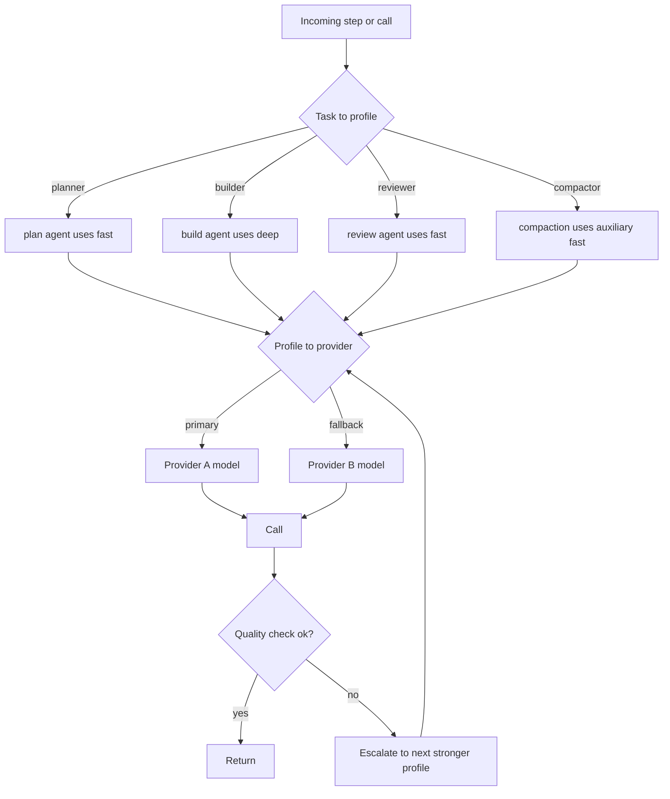
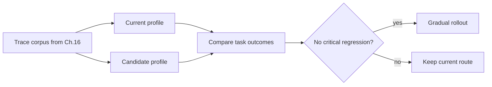

# 第 17 章 — 成本、延迟与模型策略

## TL;DR

模型选择是架构决策,不是文件顶部的一个常量。生产 agent 把工作路由到不同的模型档位(fast、balanced、deep、embedding),强制执行每租户预算,重试瞬态失败,只在质量真的需要时才升级。但最大的成本杠杆不是挑对模型 — 而是当一个确定性工具、一个正则、一个 BM25 索引、或一个经典 ML 库能更快、更便宜、更可靠地回答时,*根本不去叫模型*。本章覆盖路由级联、辅助模型层、"别叫 LLM"启发式、调用前 token 预算、流式 vs 批处理的权衡、把 prompt 缓存作为每租户摊销杠杆、eval 把关的发布、成本预测、异常响应策略,以及运维覆盖。

---

## 为什么这很重要

一次 agent loop 会乘起多次模型调用。一个工作流可能为规划、工具选择、检索合成、最终回复、评估 pass、memory 整理各调一次。如果每次都用最贵的模型,系统就经济脆弱。如果每次都用最便宜的,质量会以用户偏偏在错误时机才注意到的方式失败。如果这次调用本可以是个正则,你付了 LLM 的钱让它干 1980 年代文本处理器在微秒里免费干的活。

这门手艺是路由 — 而路由的开始是先问 *我们到底该不该叫模型?*,然后再问 *叫哪个?*

---

## 概念

### 三角权衡

每次模型调用都有三个力在不同方向拉扯:

- **质量** — 输出达标吗?
- **延迟** — 在请求形态允许的时间内回得来吗?
- **成本** — 租户的预算覆盖得了吗?

没有一个模型在三项上全赢。生产路由的纪律是 *每次调用* 在三角上选合适的点,而不是全局挑一个赢家。

### 模型档位,而不是模型名字

在你的代码和配置里用具名档位。把它们映射到具体的 provider 模型 ID,只在一个地方。课程能说 *"用 `fast` 档位做压缩"* 而不会因为底层模型变了就崩 — 价格快照也只存在一个带日期戳的文件里。

```ts
type ModelProfileName =
  | "fast"            // small, fast, cheap; routine classification and summarization
  | "balanced"        // the default workhorse
  | "deep"            // expensive, reasoning-capable; hard problems and final review
  | "embedding"       // retrieval indexes; not a chat model
  | "local-private";  // on-device or in-VPC; sensitive content

type ModelProfile = {
  name:                ModelProfileName;
  provider:            "anthropic" | "openai" | "bedrock" | "local" | string;
  modelId:             string;
  contextWindowTokens: number;
  maxOutputTokens:     number;
  pricingSnapshot?: {
    retrievedAt:                 string;       // date-stamped
    inputPerMillionTokens:       number;
    outputPerMillionTokens:      number;
    cacheReadPerMillionTokens?:  number;
    cacheWritePerMillionTokens?: number;
    sourceUrl:                   string;
  };
};
```

五个档位差不多覆盖所有情况。更多档位意味着团队更多认知负担,价格变化时也有更多地方会忘记改。

### 路由级联

生产系统在三个层级路由,按这个顺序:



- **Level 1 — 任务到档位。** 由 agent 或 step 类型挑档位。OpenCode 把模型绑定到 *agent*(build、plan、explore、compaction)。Paperclip 把 adapter 选择绑到 issue 类型;adapter 再有自己的模型。Hermes Agent 在 session 启动时挑好,之后不变。
- **Level 2 — 档位到 provider,带 fallback。** 每个档位有一个主 provider/模型和一条 fallback 链。遇到 429、配额错误、5xx 时,轮换 key(Hermes Agent 的凭证池)或回退到下一个 provider。这是第 15 章的限流级联。
- **Level 3 — 质量升级。** 如果便宜的调用产出过不了自动质量检查,用更强的档位重跑。把这当作和基础设施重试分开的事 — *质量升级* 和 *瞬态重试* 是不同的机制。

### 每次调用 vs 每步 vs 每次运行的选型

一个微妙但昂贵的陷阱:在 session 中途换模型通常会破坏第 4 章的 prompt 缓存。三种策略,按成本友好度大致递减:

- **每次运行(per-run)**(多数生产系统)。模型在 session 启动时选定,整次 run 不变。缓存命中跨多轮叠加。
- **每步(per-step)**(实际很少用)。每一步可以挑不同的模型。对辅助层有用(见下一节),用单独的便宜模型处理压缩或摘要;但如果 *主* 模型在每步轮换,每次都付缓存 miss。
- **每次调用(per-call)**(主 agent 很少用;router 和辅助层很正常)。每次单独调用独立路由。跨调用的缓存摊销基本没了,所以只有在架构明确把缓存换成路由灵活性时才合理 — 按请求分类路由的 LLM router 服务,或者那种调用短、缓存叠加本就不是目标的辅助层。

规则:**主 agent 模型每次运行不变;辅助模型和 router 形态的调用可以每步或每次调用变。** 让主 agent 模型每次调用都换,是 agent 系统里最常见的成本爆炸来源;治法通常是明确区分哪些调用是 *router 形态*(没缓存假设),哪些是 *session 形态*(缓存叠加)。

### 辅助模型层

生产系统不会把所有模型调用都过主 agent。它们留一个单独的 *辅助* 层给狭窄、便宜、无工具的任务:

- **压缩**(第 5 章) — Hermes Agent 的 `auxiliary_client` 用更便宜的模型跑 `ContextCompressor`;OpenCode 的专用 `compaction` agent 没有工具,带固定预算。
- **摘要** — 把长工具结果变成片段;把 50 轮 transcript 变成 handoff 块。
- **分类** — *"这是问题还是命令?"* — 一次便宜的调用配紧致的 schema。
- **标题和 slug 生成** — OpenCode 跑一个 `title` agent 生成 session 标签。
- **embedding 生成** — 根本不是聊天模型;形态完全不同。

辅助层是仅次于缓存的第二大成本杠杆。在和主 agent 同样的昂贵模型上跑压缩,可能让一个 session 的账单翻倍,而便宜模型干这活完全没问题。

### 根本不要叫 LLM

最大的成本杠杆同时也是最容易漏掉的:当确定性工具、库、或正则能回答的时候,LLM 就不该出现。生产系统对任何有 ground-truth 答案的查询都坚决用确定性手段。

| 任务 | 确定性选项 | 何时引入 LLM |
|---|---|---|
| 按文件名模式查找 | `glob`、`ripgrep` | 永不 |
| 按精确字符串找代码 | `ripgrep`、FTS5 | 永不 |
| 找语义相似文本 | embedding + ANN(`sqlite-vec`、`pgvector`) | 只在模糊查询需要 rerank 时 |
| 解析 JSON、YAML、CSV | parser 库 | 永不 |
| 抽取结构化字段 | 正则、查找表、经典 NER | 只在输入格式无界时 |
| 检测语言/意图 | 快速分类器(fastText、正则规则) | 只在模糊边角重要时 |
| 计算、计数、聚合 | 代码、SQL | 永不 — 模型算术很烂 |
| 渲染 diff | `diff` 库 | 永不 |
| 校验 schema | schema 校验器 | 永不 |
| 格式化输出(JSON、markdown) | serializer | 只在输出 schema 开放式时 |
| 摘要已知结构 | 模板、槽位填充 | 只对自由文本 |
| 从封闭列表挑类别 | 分类器或规则引擎 | 只对模糊边角 |

OpenCode 的工具层是最清晰的参考:文件搜索用 `ripgrep` 和 `glob`,从来不用 LLM。Hermes Agent 的 `session_search` 先用 FTS5,只在摘要结果时才调 LLM。Paperclip 的心跳本身 *不* 做 LLM 调用 — 它把任务路由给可能用也可能不用 LLM 的 adapter。

拇指规则:*查询有确定性答案就用确定性工具。LLM 是给主观判断用的。* 每次跳过的模型调用都是成本、延迟、和模型胡说概率上的节省。

```ts
// A router that prefers deterministic paths.
async function answer(query: Query, ctx: Context) {
  if (query.shape === "file_search")    return await ctx.tools.ripgrep(query);
  if (query.shape === "structured_get") return await ctx.db.get(query.key);
  if (query.shape === "parse_known")    return await ctx.parser.parse(query);
  if (query.shape === "classify_closed") {
    const result = ctx.classifier.predict(query.text);
    if (result.confidence > 0.9) return result.label;
    // fall through to LLM only on low confidence
  }
  return await ctx.llm.call(query, { profile: "balanced" });
}
```

### 发送前 token 估算

每次给模型打电话之前,先数 token。三件事就变得可能:

- **在账单之前拒绝。** 如果请求会超出租户预算,提前返回明确错误,而不是等 provider 已经计费完才发现。
- **在溢出前压缩。** 如果请求会超上下文窗口,先跑压缩(第 5 章) — 比抓 `prompt_too_long` 错误再重试便宜。
- **选对档位。** 如果请求是 200 token,`fast` 档位放得下;如果是 50 K token 且需要深推理,不管预算如何都得用 `deep`。

Hermes Agent 的 `model_metadata.py` 正是为这个调用前检查缓存了每模型的上下文上限和成本乘数。OpenCode 的 `usable()` 计算 `context_limit − max_output − safety_buffer`,在下次调用前触发压缩。两者都把 token 计数当作标准的调用前闸门。

### 流式 vs 非流式:不只是 UX,是成本杠杆

流式感觉像 UX 选择(token 实时给用户),但它也影响成本形态:

- **流式** — 部分输出毫秒内开始到达;用户可以中途打断。每 token 成本和非流式相同,但 *感知* 延迟低得多。交互聊天的正确默认。
- **非流式** — 一次往返,一次读取拿到完整响应。规模化下 HTTP 开销更低(相同 payload 一个连接 vs 很多个)。允许在给用户看之前对完整响应做后处理。批处理作业、cron、定时工作的正确默认。

Hermes Agent 用一个 `streaming=True/False` 标志显式表达。Paperclip adapter 按 adapter 选择。规则:*交互形态用流式;非交互形态不需要*。流式在规模上不是免费的 — 每个开着的连接占着一个 worker 线程(第 15 章)。

### Prompt 缓存作为多租户摊销

第 4 章讲过缓存机制;这里的成本视角不一样。缓存节省可以 *跨* session 叠加,不只是 session 内部 — *在* 一组条件成立时:

- 系统提示词建好一次跨多个 session 复用,会把它的缓存创建成本摊销到所有这些 session,前提是前缀字节稳定(第 4 章)、每次调用模型相同(上面说的每次运行不变的纪律)、provider 应用的租户或组织作用域一致、provider 的缓存保留窗口在两次使用之间没过期、请求节奏密到能让条目保持热。任何一条前提断了,摊销就停。在暴露显式缓存的 provider 上,缓存输入 token 通常按新鲜输入的一个比例计费;乘数因厂商而异且会变 — 看当前价格页,绝不硬编码比例。
- Hermes Agent 把渲染后的系统提示词存到 `SessionDB`,所以一次 gateway 驱逐后接一条新用户消息会回放字节相同的字节 — 缓存在驱逐后存活,*前提是* 保留窗口没过。
- OpenCode 的两部分 system 数组(模型家族规则 + agent 专属覆盖)是为了让模型家族那半在很多 agent 间缓存命中。

对路由的含义:能保留就把 session 内模型保持一致,跨 session 把系统提示词字节稳定下来(第 4 章规则)。在 session 中途换模型,或带时间戳重建提示词,跨 session 摊销就扔了。

### 重试 vs 升级

生产系统区分两类失败;它们不是同一种机制:

```ts
async function routeAndCall(step: AgentStep, ctx: ModelContext) {
  const profile = chooseProfile(step);

  // Transient: infrastructure retry with backoff.
  const result = await callWithRetry({ ...step, profile }, ctx);

  // Quality escalation: a different mechanism.
  if (await passesQualityCheck(step, result)) return result;

  const stronger = nextStrongerProfile(profile);
  if (!stronger) return result;

  await ctx.trace.event("model.escalated", {
    from: profile, to: stronger, reason: "quality_check_failed",
  });
  return callWithRetry({ ...step, profile: stronger }, ctx);
}
```

- **瞬态重试** 处理 429、5xx、网络错误。退避、重试、最终回退到不同 provider(第 15 章的级联)。模型输出的目标是相同的。
- **质量升级** 处理一次成功调用但其输出过不了下游检查(schema 校验、evaluator 子 agent、基本健全性)。用更强档位重跑。第二次模型输出 *更好*。

把质量失败当成重试是常见的 bug:用同样的便宜模型加同样的 prompt 重跑,得到同样不足的答案。

### 每租户成本预测

被动的预算闸门(第 15 章)在 run 开始之后才拒绝。预测在 run *之前* 把闸门,并据此路由:

- **从 session 形态估算每次 run 的成本。** 同租户类似任务的近期 run 给一个基线;乘以模型按 token 的成本。
- **和剩余预算比较。** 如果预测 > 剩余,响应取决于租户的 *预算策略*,不是硬编码的默认。有些租户 — 高风险法务复核工作流、监管数据部署 — 偏好 *阻塞* 并请求预算批准,而不是默默拿到便宜答案。其他的 — 交互聊天、探索式编程 — 偏好 *降级*:路由到便宜档位,启用更激进的压缩,在 UI 里呈现权衡。router 读策略;降级是 *一种* 有效策略,不是默认。在没有明确策略选择的情况下把质量契约和成本契约混在一起,正是 overrun-即降级 系统悄悄违反监管数据约定的方式。
- **在重要时把预测呈现给用户。** *"这个任务以当前设置预计花 $2.40;切到 fast 档预计 $0.30,要换吗?"* — 运维覆盖(下面)处理这个选择。

Paperclip 的 `budget_policies` 表保存租户档位;预测层在派发前读它。Hermes Agent 不做预测;它事后反应。预测模式是更便宜的可发布路径,只要你舍得花一次成本去埋它。

### 成本异常响应

第 16 章介绍了成本异常 *检测* — 3 倍滚动 7 天告警。第 17 章管 *响应策略*:

- **软响应。** 把这个租户接下来的 N 次 run 路由到便宜档位;启用更严的压缩;通知用户在不寻常地花钱。
- **硬响应。** 暂停该租户的新 run;需要运维确认才恢复;把任何进行中的 run 标为 `scheduled_retry`(第 8 章),让它们在人工复核后再继续。
- **分层响应。** 第一次尖峰:软。两天内持续尖峰:硬。手动覆盖:绕过两者。

生产里行得通的模式是 *自动软、手动硬*。软响应可逆,错了成本低;硬响应会挡住真活,需要人来定。

### 运维覆盖

路由必须有逃生口。两种模式:

- **每次 run 模型 bump。** *"这个任务任务关键;不管策略如何都在 `deep` 上跑。"* 进审计日志(第 5 章);成本记到运维自己的覆盖预算下。
- **每次 session 锁定。** 在调查或调试期间,把某个 session 锁到某个特定模型。

Paperclip 在 issue 上的 `assigneeAdapterOverrides` JSONB 正是这个 — 一个运维设的覆盖,心跳在派发时遵守。OpenCode 让用户通过 CLI 标志或 UI 在每个 session 选一个 agent(也就是模型)。两者都必须有;纯自动路由没有覆盖,会把一个坏决定变成一场长事故。

### Eval 把关的发布

在把一个 step 从 `balanced` 移到 `fast`(为省钱的 *降级*)或从 `balanced` 移到 `deep`(为质量的 *升级*)之前,回放代表性 trace,比较结果:



这是第 16 章的 eval-as-observability 模式应用到路由上。架构和 provider 无关:收集生产 trace(第 16 章),在候选档位上回放,用 evaluator 子 agent(第 10 章验证模式)或确定性比较给结果打分,给发布把关。可能的话按租户做 eval — 在一个工作负载上有效的档位可能在另一个上回退。

### 按请求类型的延迟预算

不同请求形态有不同的延迟容忍度。早早接进来,router 才知道往哪儿优化:

| 请求形态 | p50 预算 | p95 预算 | 兼容档位 |
|---|---|---|---|
| 交互聊天(TUI、web) | <2 秒首字 | <10 秒总时长 | `fast`、`balanced` 带流式 |
| 长时间编码任务 | <30 秒/步 | <2 分钟/步 | `balanced`、`deep` |
| 后台 curation(第 7 章) | n/a | <5 分钟 | `fast` 辅助 |
| Cron / 定时工作 | n/a | 分钟到小时 | 任意档位 |
| Eval batch | n/a | 小时 | 任意档位,通常 `fast` |

档位要匹配预算。在聊天请求上用 `deep` 是 UX 失败,哪怕答案对了。在难编码任务上用 `fast`,会浪费运维一个下午看烂输出。

### 缓存感知的成本计算

成本计算要把缓存输入 token 比新鲜的便宜这件事算进去:

```ts
// The cost formula expects a provider-normalized Usage shape.
// Each provider adapter (Ch.11) produces this; the cost layer never sees
// the raw provider response.
type NormalizedUsage = {
  freshInputTokens:       number;   // input billed at the full rate
  cacheReadInputTokens:   number;   // input billed at the cache-read rate
  cacheWriteInputTokens:  number;   // input billed at the cache-write rate, if any
  outputTokens:           number;
};

function estimateCost(profile: ModelProfile, usage: NormalizedUsage): number {
  const p = profile.pricingSnapshot;
  if (!p) return 0;
  return (usage.freshInputTokens      * p.inputPerMillionTokens        / 1e6)
       + (usage.cacheReadInputTokens  * (p.cacheReadPerMillionTokens  ?? p.inputPerMillionTokens) / 1e6)
       + (usage.cacheWriteInputTokens * (p.cacheWritePerMillionTokens ?? p.inputPerMillionTokens) / 1e6)
       + (usage.outputTokens          * p.outputPerMillionTokens       / 1e6);
}
```

provider 的用量上报对 `input_tokens` 包不包含什么各执一词 — 有些把缓存 token 算进 input 总和,有些单独上报,有些有额外的每请求项目(reasoning token、tool token)。*在 adapter 边界归一化*:第 11 章的每个 provider adapter 输出 `NormalizedUsage` 形态;成本公式从不见原始 provider 响应。跳过这一步,你会在一个 provider 上重复计数,在另一个 provider 上少算 — 然后每个下游成本决策都继承这个错误。pricingSnapshot 的每缓存字段故意是 stub:缓存乘数和特殊用途 token 费率因厂商而异且变得频繁,所以 snapshot 的活是 *带日期戳和源 URL 装当前数字*,而不是编码会悄悄过期的默认值。

### 超出每 token 的厂商经济学

每 token 的输入/输出价格是头条。生产路由还得考虑厂商提供的其他几条通道:

- **Batch / flex 档。** 很多 provider 为延迟更宽松的异步工作提供折扣通道 — 通常比同步价低相当一部分,代价是延迟的响应窗口。后台 curation(第 7 章)、持续 eval 批次(第 16 章)、隔夜 cron 工作是天然的契合点。把这个通道作为每工作负载的开关呈现,不是全局设置。
- **优先档。** 反向通道:为负载下保证吞吐或更短延迟付溢价。对带 SLA 的付费档流量有用;对免费档工作很少值。
- **重试成本是真的。** 一次你重试的 429 是两次计费调用,如果第一次失败之前已经流出了 token,成本会复合;如果重试落到更贵的 fallback,成本继续涨。把重试作为第 16 章指标目录里自己的一条,这样你能看到不健康 provider 的二阶成本,而不是把它埋在原调用里。
- **每 provider 的怪癖。** 有些 provider 在某些端点上对缓存输入完全不计费;有些收一笔缓存创建溢价,首次命中后消失;有些 embedding 相对于 chat 大幅折扣;有些按区域价格不同。成本 router 需要每 provider 的定价形态概念,不是通用的每模型费率。

把这些全作为路由层的策略旋钮呈现,不是硬编码常量。厂商格局每季度都变;router 的活是知道有哪些通道,让运维挑符合工作负载的那一个。

---

## 真实系统笔记

- **Paperclip** 通过 adapter manifest 暴露模型档位,在控制面用 `budget_policies` + `cost_events` 表。issue 上的 `modelProfileHint` 是运维覆盖模式;心跳在派发前查询它。是每租户成本预测和预算执行最强的参考。
- **OpenCode** 把模型绑定到 agent(build、plan、explore、compaction、title),每个有自己的权限集。compaction agent 是辅助模型的干净例子 — 无工具、便宜、专门干一件事。provider-family 专属系统提示词(`SystemPrompt.provider(model)`)按家族保住缓存稳定。
- **Hermes Agent** 维护一个模型元数据缓存(`model_metadata.py`)带上下文上限和成本乘数,为压缩调用 `auxiliary_client` 用比主 agent 更便宜的模型,并在 429 时通过 `credential_pool` 轮换 API key。是先查 token 别让预算炸掉这个模式最清晰的参考。
- **OpenClaw** 提醒你路由不只看价格:对个人助理 gateway 来说,channel、隐私、后端可用性同样重要。即使云模型更便宜,敏感内容用本地模型才是对的选择。

---

## 与你的 agent 配对练习

- *"盘点我的 agent 里每次模型调用。对每一个,告诉我它该用哪个档位(`fast`、`balanced`、`deep`、`embedding`、`local-private`)和为什么。标出当前用错档位的。"*
- *"过一遍我的工具注册表。对每个工具,判断它能不能用确定性库(`ripgrep`、FTS5、embedding、正则、schema 校验器)替换或短路。给我看流量最大的那几个的节省估算。"*
- *"加辅助模型层:给压缩(第 5 章)、摘要、分类用一个单独的便宜模型。验证主 agent 的模型每次运行不变,这样第 4 章的 prompt 缓存继续命中。"*
- *"实现调用前 token 预算:调用前数 token,超上下文上限就压缩,超租户剩余预算就拒绝,给用户返回干净错误。用三个故意超大的 prompt 测试。"*
- *"把本章的路由级联落成代码:Level 1 任务 → 档位,Level 2 档位 → provider 带 fallback 链,Level 3 检查失败时质量升级。接到我的 loop 里,记录每次升级事件。"*
- *"立起每租户成本预测。用我过去一个月的 `cost_events` 按任务类型估算每次 run 成本。预测超剩余预算时,路由到更便宜的档位而不是阻塞。给我看三次真实 run 和各自的路由决策。"*
- *"加运维覆盖:每次 run 一个 `assigneeAdapterOverrides` 风格字段,只在那次 run 提升模型。覆盖写进审计日志(第 5 章);成本记到单独的覆盖预算。"*
- *"立起 eval 把关的发布循环:每周采样 50 次生产 run,在下一个更便宜档位上回放,用 evaluator 子 agent(第 10 章)打分,无关键回退才发布。先在某一种 step 类型上跑。"*
- *"画出我过去一周按 fresh input、cache_read input、cache_write input、output 分的每轮成本。告诉我 prompt 缓存值不值得,以及我该在哪里收紧前缀来拉大差距。"*

---

## 接下来

你现在有了一层路由,每次调用挑对模型,知道什么时候根本不该叫模型,从 provider 失败中恢复,不会有意外账单地强制执行预算。下一章从成本控制转到伤害预防:第 18 章讲安全和对抗性输入 — prompt injection、memory 边界的威胁模型、工具作用域,以及防止 agent 被武器化对付用户的策略控制。
