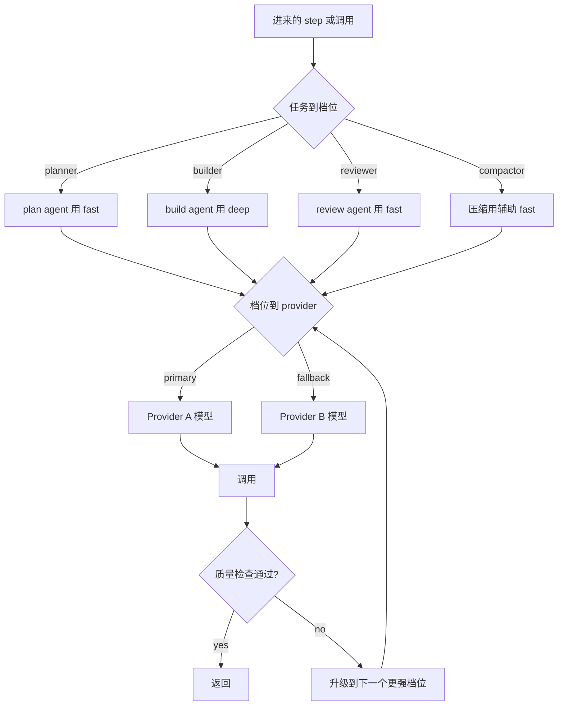
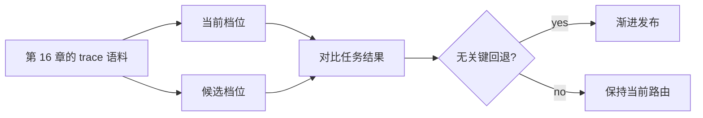

# 第 17 章 — 成本、延迟与模型策略

## TL;DR

模型选择是一项架构决策,而不是写死在文件顶部的一个常量。生产 agent 会把工作分发到不同的模型档位(fast、balanced、deep、embedding),按租户强制执行预算,重试瞬态失败,只在质量确有需要时才升级。但最大的成本杠杆并不是挑对模型 —— 而是当一个确定性工具、一个正则、一个 BM25 索引或一个经典 ML 库能更快、更便宜、更可靠地给出答案时,*干脆不调用模型*。本章涵盖路由级联、辅助模型层、"别调 LLM"启发式、调用前 token 预算、流式与批处理的权衡、把 prompt 缓存当作按租户摊销的杠杆、由 eval 把关的发布、成本预测、异常响应策略,以及运维人工干预(operator override)。

---

## 为什么这很重要

一次 agent loop 会把模型调用次数成倍放大。一个工作流可能为规划、工具选择、检索合成、最终回复、评估 pass、记忆整理各调用一次。如果每次都用最贵的模型,系统在经济上就很脆弱。如果每次都用最便宜的,质量就会以某种隐蔽的方式出问题——而用户偏偏总在最不该出问题的时候发现。而如果这次调用本可以交给一个正则,那你就是花了 LLM 的钱,让它去干一台 1980 年代的文本处理器在微秒内免费就能干完的活。

这门手艺的关键是路由 —— 而路由的第一步,是先问 *我们到底该不该调用模型?*,然后才问 *该调用哪一个?*

---

## 概念

### 三角权衡

每次模型调用都有三个力在不同方向拉扯:

- **质量** — 输出达标吗?
- **延迟** — 在请求形态允许的时间内回得来吗?
- **成本** — 租户的预算覆盖得了吗?

没有哪个模型能在三项上全赢。生产路由讲究的纪律是 *每次调用* 都在这个三角里选一个合适的点,而不是在全局挑一个固定赢家。

### 用模型档位,而不是模型名字

在代码和配置里用具名档位,并在唯一一处把它们映射到具体的 provider 模型 ID。这样课程才能说 *"用 `fast` 档位做压缩"* 而不会因为底层模型一换就失效 —— 价格快照也只集中存在一个带日期戳的文件里。

```ts
type ModelProfileName =
  | "fast"            // small, fast, cheap; routine classification and summarization
  | "balanced"        // the default workhorse
  | "deep"            // expensive, reasoning-capable; hard problems and final review
  | "embedding"       // retrieval indexes; not a chat model
  | "local-private";  // on-device or in-VPC; sensitive content

type ModelProfile = {
  name:                ModelProfileName;
  provider:            "anthropic" | "openai" | "bedrock" | "local" | string;
  modelId:             string;
  contextWindowTokens: number;
  maxOutputTokens:     number;
  pricingSnapshot?: {
    retrievedAt:                 string;       // date-stamped
    inputPerMillionTokens:       number;
    outputPerMillionTokens:      number;
    cacheReadPerMillionTokens?:  number;
    cacheWritePerMillionTokens?: number;
    sourceUrl:                   string;
  };
};
```

五个档位几乎能覆盖所有情况。档位越多,团队的认知负担越重,价格变动时也越容易漏改某个地方。

### 路由级联

生产系统按以下顺序,在三个层级上做路由:



- **Level 1 — 任务到档位。** 由 agent 或 step 的类型来挑档位。OpenCode 把模型绑定到 *agent*(build、plan、explore、compaction)。Paperclip 把 adapter 的选择绑到 issue 类型,adapter 再各自带自己的模型。Hermes Agent 在 session 启动时挑定,之后不变。
- **Level 2 — 档位到 provider,带 fallback。** 每个档位有一个主 provider/模型和一条 fallback 链。遇到 429、配额错误或 5xx 时,轮换 key(Hermes Agent 的凭证池),或回退到下一个 provider。这就是第 15 章的限流级联。
- **Level 3 — 质量升级。** 如果便宜的调用产出过不了自动质量检查,就换更强的档位重跑。要把它和基础设施层面的重试区分开 —— *质量升级* 和 *瞬态重试* 是两种不同的机制。

### 按调用、按步骤、还是按运行来选型

有个微妙但昂贵的陷阱:在 session 中途换模型,通常会破坏第 4 章讲的 prompt 缓存。下面三种策略,按对成本的友好程度大致递减:

- **按运行(per-run)**(多数生产系统采用)。模型在 session 启动时选定,整次运行不变。缓存命中会跨多轮累积。
- **按步骤(per-step)**(实际中很少用)。每一步都可以挑不同的模型。这对辅助层有用(见下一节),即用一个单独的便宜模型来处理压缩或摘要;但如果连 *主* 模型都在每一步轮换,那你每一步都得吃一次缓存未命中。
- **按调用(per-call)**(主 agent 很少用;但对 router 和辅助层很正常)。每次单独调用都独立路由。跨调用的缓存摊销基本就没了,所以只有当架构明确选择用缓存换路由灵活性时才划算 —— 比如按请求做分类路由的 LLM router 服务,又或者那种调用本就很短、缓存累积本来也不是目标的辅助层。

规则是:**主 agent 模型按运行固定;辅助模型和 router 形态的调用可以按步骤或按调用变。** 让主 agent 模型每次调用都换,是 agent 系统里最常见的成本爆炸源头;补救办法通常是明确区分哪些调用是 *router 形态*(不假设有缓存),哪些是 *session 形态*(缓存会累积)。

### 辅助模型层

生产系统不会把所有模型调用都走主 agent。它们会单独留一个 *辅助* 层,处理那些狭窄、便宜、不带工具的任务:

- **压缩**(第 5 章) —— Hermes Agent 的 `auxiliary_client` 用更便宜的模型跑 `ContextCompressor`;OpenCode 则有专用的 `compaction` agent,不带任何工具,且预算固定。
- **摘要** —— 把冗长的工具结果浓缩成片段;把 50 轮的 transcript 压成一段 handoff 块。
- **分类** —— *"这是一个问题还是一条命令?"* —— 一次便宜的调用,配上紧凑的 schema。
- **标题和 slug 生成** —— OpenCode 用一个 `title` agent 生成 session 标签。
- **embedding 生成** —— 它根本不是聊天模型,形态完全不同。

辅助层是仅次于缓存的第二大成本杠杆。在和主 agent 同样昂贵的模型上跑压缩,可能让一次 session 的账单翻倍,而这活交给便宜模型完全没问题。

### 干脆别调用 LLM

最大的成本杠杆,同时也最容易被忽视:当一个确定性工具、一个库或一个正则就能回答时,根本不该让 LLM 出场。对于任何存在 ground-truth 答案的查询,生产系统都会毫不留情地用确定性手段。

| 任务 | 确定性选项 | 何时引入 LLM |
|---|---|---|
| 按文件名模式查找 | `glob`、`ripgrep` | 永不 |
| 按精确字符串找代码 | `ripgrep`、FTS5 | 永不 |
| 找语义相似文本 | embedding + ANN(`sqlite-vec`、`pgvector`) | 仅当查询模糊、需要 rerank 时 |
| 解析 JSON、YAML、CSV | parser 库 | 永不 |
| 抽取结构化字段 | 正则、查找表、经典 NER | 仅当输入格式无界时 |
| 检测语言/意图 | 快速分类器(fastText、正则规则) | 仅当模糊的边界情形要紧时 |
| 计算、计数、聚合 | 代码、SQL | 永不 —— 模型不擅长算术 |
| 渲染 diff | `diff` 库 | 永不 |
| 校验 schema | schema 校验器 | 永不 |
| 格式化输出(JSON、markdown) | serializer | 仅当输出 schema 开放时 |
| 摘要已知结构 | 模板、槽位填充 | 仅对自由文本 |
| 从封闭列表挑类别 | 分类器或规则引擎 | 仅对模糊的边界情形 |

OpenCode 的工具层是最清晰的参考:文件搜索一律用 `ripgrep` 和 `glob`,从不动用 LLM。Hermes Agent 的 `session_search` 先用 FTS5,只在需要对结果做摘要时才调 LLM。Paperclip 的心跳本身 *不* 做任何 LLM 调用 —— 它只把任务路由给 adapter,至于 adapter 用不用 LLM 是另一回事。

经验法则:*查询若有确定性答案,就用确定性工具;LLM 是留给主观判断的。* 每省下一次模型调用,就同时省下了成本、延迟,以及模型凭空编造答案的概率。

```ts
// A router that prefers deterministic paths.
async function answer(query: Query, ctx: Context) {
  if (query.shape === "file_search")    return await ctx.tools.ripgrep(query);
  if (query.shape === "structured_get") return await ctx.db.get(query.key);
  if (query.shape === "parse_known")    return await ctx.parser.parse(query);
  if (query.shape === "classify_closed") {
    const result = ctx.classifier.predict(query.text);
    if (result.confidence > 0.9) return result.label;
    // fall through to LLM only on low confidence
  }
  return await ctx.llm.call(query, { profile: "balanced" });
}
```

### 发送前 token 估算

每次调用模型之前,先把 token 数清楚。这样三件事就成为可能:

- **在账单产生之前就拒绝。** 如果请求会超出租户预算,就提前返回一个清晰的错误,而不是等 provider 计费之后才发现。
- **在溢出之前先压缩。** 如果请求会超出 context window,就先跑一遍压缩(第 5 章) —— 这比等到 `prompt_too_long` 报错再重试更便宜。
- **挑对档位。** 如果请求只有 200 token,`fast` 档位就装得下;如果是 50 K token 且需要深度推理,那不管预算如何都得上 `deep`。

Hermes Agent 的 `model_metadata.py` 缓存了每个模型的上下文上限和成本乘数,正是为了这道调用前检查。OpenCode 的 `usable()` 计算 `context_limit − max_output − safety_buffer`,在下次调用前触发压缩。两者都把 token 计数当作标准的调用前闸门。

### 流式 vs 非流式:不只是 UX,是成本杠杆

流式看起来像是个 UX 选择(token 实时推给用户),但它同样会改变成本的形态:

- **流式** —— 部分输出在毫秒级就开始返回,用户可以中途打断。每 token 成本和非流式相同,但 *感知* 上的延迟低得多。交互式聊天就该默认用它。
- **非流式** —— 一次往返,一次读取就拿到完整响应。规模化时 HTTP 开销更低(同样的 payload,一个连接对很多个连接)。还能在展示给用户之前先对完整响应做后处理。批处理作业、cron、定时工作就该默认用它。

Hermes Agent 用一个 `streaming=True/False` 标志把这一点显式化。Paperclip 则由各个 adapter 自行选择。规则是:*交互形态用流式,非交互形态不必用*。流式在规模上并不免费 —— 每个开着的连接都占着一个 worker 线程(第 15 章)。

### Prompt 缓存作为多租户摊销

第 4 章讲过缓存机制;这里的成本视角不一样。缓存带来的节省可以 *跨* session 累积,而不只在单个 session 内部 —— 但前提是一组条件同时成立:

- 一个 system prompt 建好一次、在多个 session 间复用,就能把它的缓存创建成本摊销到所有这些 session 上,前提是:前缀字节稳定(第 4 章)、每次调用用的是同一个模型(上面说的"按运行固定"那条纪律)、provider 据以作用的租户或组织作用域一致、provider 的缓存保留窗口在两次使用之间没有过期、且请求的节奏足够密集、能让缓存条目保持热。任何一条前提断掉,摊销就到此为止。在提供显式缓存的 provider 上,缓存输入 token 通常按新鲜输入的某个比例计费;这个乘数因厂商而异、且会变动 —— 要看当前的价格页,绝不硬编码一个比例。
- Hermes Agent 把渲染后的 system prompt 存进 `SessionDB`,这样在一次 gateway 驱逐之后再来一条新用户消息,回放出来的字节是完全相同的 —— 缓存能熬过这次驱逐,*前提是* 保留窗口还没过。
- OpenCode 把 system 数组拆成两部分(模型家族规则 + agent 专属覆盖),正是为了让模型家族那一半能在众多 agent 之间命中缓存。

这对路由的含义是:尽可能让同一 session 内的模型保持一致,并让 system prompt 跨 session 保持字节稳定(第 4 章的规则)。一旦在 session 中途换模型,或带着时间戳重建 prompt,跨 session 的摊销就白白扔掉了。

### 重试 vs 升级

生产系统会区分两类失败,它们不是同一种机制:

```ts
async function routeAndCall(step: AgentStep, ctx: ModelContext) {
  const profile = chooseProfile(step);

  // Transient: infrastructure retry with backoff.
  const result = await callWithRetry({ ...step, profile }, ctx);

  // Quality escalation: a different mechanism.
  if (await passesQualityCheck(step, result)) return result;

  const stronger = nextStrongerProfile(profile);
  if (!stronger) return result;

  await ctx.trace.event("model.escalated", {
    from: profile, to: stronger, reason: "quality_check_failed",
  });
  return callWithRetry({ ...step, profile: stronger }, ctx);
}
```

- **瞬态重试** 处理 429、5xx、网络错误。退避、重试,最终回退到另一个 provider(第 15 章的级联)。它追求的模型输出是同一个。
- **质量升级** 处理的是:一次成功的调用,但其输出过不了下游检查(schema 校验、evaluator 子 agent、基本的合理性检查)。换更强的档位重跑。第二次的模型输出会 *更好*。

把质量失败当成重试来处理,是个常见的 bug:用同一个便宜模型、同一个 prompt 再跑一遍,只会得到同样不够格的答案。

### 每租户成本预测

被动的预算闸门(第 15 章)是在 run 已经开始之后才拒绝。预测则在 run *开始之前* 把好闸门,并据此路由:

- **从 session 形态估算每次 run 的成本。** 同一租户近期跑过的类似任务给出一个基线;再乘以模型按 token 的成本。
- **和剩余预算比较。** 如果预测值 > 剩余预算,该怎么响应取决于租户的 *预算策略*,而不是某个硬编码的默认值。有些租户 —— 高风险的法务复核工作流、受监管数据的部署 —— 宁愿 *阻塞* 并请求预算批准,也不愿默默拿到一个更便宜的答案。另一些 —— 交互式聊天、探索式编程 —— 则偏好 *降级*:路由到便宜档位、启用更激进的压缩、在 UI 里把这个权衡摆出来。router 负责读取策略;降级只是 *一种* 有效策略,而非默认。在没有做出明确策略选择的情况下,把质量契约和成本契约混为一谈,正是一个"超支即降级"的系统悄悄违反受监管数据约定的根源。
- **在事关重大时,把预测呈现给用户。** *"按你当前的设置,这个任务预计花费 $2.40;切换到 fast 档位预计 $0.30,要换吗?"* —— 这个选择由运维人工干预(见下文)来处理。

Paperclip 的 `budget_policies` 表保存着租户档位,预测层在派发前会读取它。Hermes Agent 不做预测,而是事后反应。预测这种模式是更省钱的可落地路径 —— 只要你愿意花一次成本把它埋好。

### 成本异常响应

第 16 章介绍了成本异常的 *检测* —— 那个滚动 7 天、3 倍阈值的告警。第 17 章管的是 *响应策略*:

- **软响应。** 把该租户接下来 N 次 run 路由到便宜档位;启用更严格的压缩;提醒用户他正在异常地花钱。
- **硬响应。** 暂停该租户的新 run;需运维确认才能恢复;把任何进行中的 run 标记为 `scheduled_retry`(第 8 章),让它们在人工复核之后再接着跑。
- **分层响应。** 第一次尖峰:软。连续两天持续尖峰:硬。手动干预:两者都绕过。

生产里真正行得通的模式是 *软响应自动、硬响应手动*。软响应可逆,即便判断错了代价也低;硬响应会挡住真实的工作,需要由人来拍板。

### 运维人工干预

路由必须留一个逃生口。有两种模式:

- **单次 run 的模型上调。** *"这个任务事关成败,不管策略怎么定,都给我用 `deep` 跑。"* 记入审计日志(第 5 章);成本记在运维自己的干预预算下。
- **单个 session 的模型锁定。** 在一次调查或调试期间,把某个 session 锁定到某个特定模型。

Paperclip 在 issue 上的 `assigneeAdapterOverrides` JSONB 字段正是这个 —— 一个由运维设定的干预,心跳在派发时会遵守它。OpenCode 则让用户通过 CLI 标志或 UI 为每个 session 选定一个 agent(也就是选定模型)。两者缺一不可;纯自动路由若没有人工干预的口子,一个糟糕的决定就会演变成一场漫长的事故。

### Eval 把关的发布

在把某个 step 从 `balanced` 调到 `fast`(为省钱而 *降级*)或从 `balanced` 调到 `deep`(为质量而 *升级*)之前,先回放有代表性的 trace,比较结果:



这就是把第 16 章"eval 即可观测性"的模式应用到路由上。它和具体 provider 无关:收集生产 trace(第 16 章),在候选档位上回放,用 evaluator 子 agent(第 10 章的验证模式)或确定性比较给结果打分,以此为发布把关。条件允许时按租户分别做 eval —— 在一个工作负载上奏效的档位,可能在另一个上发生回退。

### 按请求类型设定延迟预算

不同的请求形态有不同的延迟容忍度。早早把这一点接进系统,router 才知道该往哪个方向优化:

| 请求形态 | p50 预算 | p95 预算 | 兼容档位 |
|---|---|---|---|
| 交互聊天(TUI、web) | <2 秒出首字 | <10 秒总时长 | `fast`、`balanced` 配流式 |
| 长时编码任务 | <30 秒/步 | <2 分钟/步 | `balanced`、`deep` |
| 后台 curation(第 7 章) | n/a | <5 分钟 | `fast` 辅助 |
| Cron / 定时工作 | n/a | 分钟到小时 | 任意档位 |
| Eval batch | n/a | 小时 | 任意档位,通常 `fast` |

档位要和预算匹配。在聊天请求上用 `deep` 是一种 UX 失败,哪怕答案是对的;在棘手的编码任务上用 `fast`,则会让运维盯着一堆烂输出白白浪费一个下午。

### 缓存感知的成本核算

成本核算必须把"缓存输入 token 比新鲜的更便宜"这件事算进去:

```ts
// The cost formula expects a provider-normalized Usage shape.
// Each provider adapter (Ch.11) produces this; the cost layer never sees
// the raw provider response.
type NormalizedUsage = {
  freshInputTokens:       number;   // input billed at the full rate
  cacheReadInputTokens:   number;   // input billed at the cache-read rate
  cacheWriteInputTokens:  number;   // input billed at the cache-write rate, if any
  outputTokens:           number;
};

function estimateCost(profile: ModelProfile, usage: NormalizedUsage): number {
  const p = profile.pricingSnapshot;
  if (!p) return 0;
  return (usage.freshInputTokens      * p.inputPerMillionTokens        / 1e6)
       + (usage.cacheReadInputTokens  * (p.cacheReadPerMillionTokens  ?? p.inputPerMillionTokens) / 1e6)
       + (usage.cacheWriteInputTokens * (p.cacheWritePerMillionTokens ?? p.inputPerMillionTokens) / 1e6)
       + (usage.outputTokens          * p.outputPerMillionTokens       / 1e6);
}
```

各家 provider 的用量上报对 `input_tokens` 到底包含什么,口径并不一致 —— 有的把缓存 token 算进 input 总数,有的单独上报,有的还有额外的每请求项目(reasoning token、tool token)。*要在 adapter 边界做归一化*:第 11 章的每个 provider adapter 都输出 `NormalizedUsage` 形态,成本公式永远看不到原始的 provider 响应。跳过这一步,你就会在一个 provider 上重复计数、在另一个上漏算 —— 而每一个下游的成本决策都会继承这个错误。pricingSnapshot 里各个缓存相关字段被特意留成占位(stub):缓存乘数和特殊用途 token 的费率因厂商而异、且变动频繁,所以这份快照的职责是 *带着日期戳和源 URL 记下当前的数字*,而不是写死一组会悄悄过期的默认值。

### 每 token 价格之外的厂商经济学

每 token 的输入/输出价格只是头条。生产路由还得把厂商提供的其他几条通道算进去:

- **Batch / flex 档。** 很多 provider 为延迟要求更宽松的异步工作提供折扣通道 —— 通常能比同步价便宜相当一截,代价是响应窗口会被延后。后台 curation(第 7 章)、持续的 eval 批处理(第 16 章)、隔夜 cron 工作都是天然契合的场景。把这条通道做成按工作负载的开关,而不是全局设置。
- **优先档。** 反方向的通道:为负载下保证吞吐或更短延迟而付的溢价。对带 SLA 的付费档流量有用;对免费档工作则很少值得。
- **重试成本是真实存在的。** 你重试一次的 429,其实是两次计费调用;如果第一次在失败前已经流出了部分 token,成本就会叠加;如果这次重试又落到更贵的 fallback 上,成本还会继续往上走。把重试单列为第 16 章指标目录里的一条,这样你才能看清一个不健康 provider 带来的二阶成本,而不是把它埋在原始调用里。
- **各家 provider 的怪癖。** 有的 provider 在某些端点上对缓存输入完全不计费;有的会收一笔缓存创建的溢价,但首次命中之后就消失;有的 embedding 相对 chat 大幅打折;有的按区域定价不同。成本 router 需要的是一套"按 provider 区分定价形态"的概念,而不是通用的"按模型一刀切"费率。

把这些全部做成路由层上的策略旋钮,而不是硬编码常量。厂商格局每个季度都在变;router 的职责是知道有哪些通道存在,并让运维挑出与工作负载相匹配的那一条。

---

## 真实系统笔记

- **Paperclip** 通过 adapter manifest 暴露模型档位,并在控制面用 `budget_policies` + `cost_events` 两张表。issue 上的 `modelProfileHint` 就是运维人工干预模式,心跳在派发前会查询它。它是按租户做成本预测和预算执行最强的参考。
- **OpenCode** 把模型绑定到 agent(build、plan、explore、compaction、title),每个都有自己的权限集。compaction agent 是辅助模型的干净范例 —— 无工具、便宜、专做一件事。它按 provider 家族区分的 system prompt(`SystemPrompt.provider(model)`)能逐家族保住缓存稳定。
- **Hermes Agent** 维护着一份模型元数据缓存(`model_metadata.py`),含上下文上限和成本乘数;它为压缩调用 `auxiliary_client`,用比主 agent 更便宜的模型;并在遇到 429 时通过 `credential_pool` 轮换 API key。它是"先查 token、别让预算炸掉"这一模式最清晰的参考。
- **OpenClaw** 提醒我们:路由不只看价格。对一个个人助理 gateway 来说,channel、隐私、后端可用性同样重要。即便云端模型更便宜,处理敏感内容时用本地模型才是对的选择。

---

## 与你的 agent 结对

- *"盘点我的 agent 里每次模型调用。对每一个,告诉我它该用哪个档位(`fast`、`balanced`、`deep`、`embedding`、`local-private`)和为什么。标出当前用错档位的。"*
- *"过一遍我的工具注册表。对每个工具,判断它能否被确定性库(`ripgrep`、FTS5、embedding、正则、schema 校验器)替换或短路掉。给我看流量最大的那几个的节省估算。"*
- *"加上辅助模型层:给压缩(第 5 章)、摘要、分类配一个单独的便宜模型。验证主 agent 的模型在每次运行内保持不变,好让第 4 章的 prompt 缓存继续命中。"*
- *"实现调用前的 token 预算:调用前先数 token,超 context window 就压缩,超租户剩余预算就拒绝,并给用户返回一个干净的错误。用三个故意超大的 prompt 来测试。"*
- *"把本章的路由级联落成代码:Level 1 任务 → 档位,Level 2 档位 → provider 带 fallback 链,Level 3 在检查失败时质量升级。把它接进我的 loop,并记录每一次升级事件。"*
- *"搭一套按租户的成本预测。用我过去一个月的 `cost_events`,按任务类型估算每次 run 的成本。当预测超过剩余预算时,路由到更便宜的档位而不是直接阻塞。给我看三次真实的 run 以及各自的路由决策。"*
- *"加上运维人工干预:在每次 run 上加一个 `assigneeAdapterOverrides` 风格的字段,只在这一次 run 里上调模型。把这次干预写进审计日志(第 5 章);成本记在单独的干预预算下。"*
- *"搭一套由 eval 把关的发布循环:每周采样 50 次生产 run,在下一个更便宜的档位上回放,用 evaluator 子 agent(第 10 章)打分,只有在没有关键回退时才发布。先从某一种 step 类型开始跑。"*
- *"把我过去一周的每轮成本画出来,按 fresh input、cache_read input、cache_write input、output 拆分。告诉我 prompt 缓存值不值,以及我该在哪里收紧前缀来拉大差距。"*

---

## 接下来

你现在有了一层路由:它为每次调用挑对模型,知道什么时候根本不该调用模型,能从 provider 失败中恢复,还能在不产生意外账单的前提下强制执行预算。下一章将从成本控制转向伤害预防:第 18 章讲安全与对抗性输入 —— prompt injection、记忆边界处的威胁模型、工具作用域,以及那些防止 agent 被武器化、反过来对付用户的策略控制。
