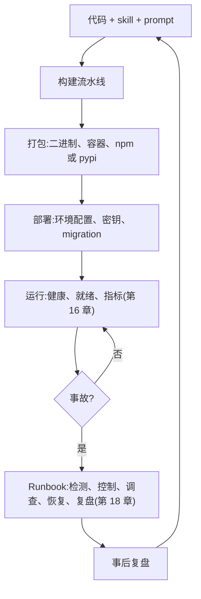
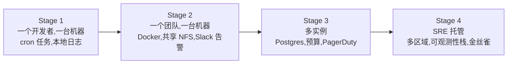

# 第 19 章 — 运维与前向部署(forward-deployed)型 agent

## TL;DR

发布一个 agent,只是开始运维它的起点。真实部署要扛住重启、密钥、队列、备份、模型下线、成本飙升,还有客户各自的运行环境。本章讲清让这一切能撑下来的运维纪律：打包与分发、跨环境配置、部署时的 schema 迁移、优雅停机、runbook 目录、为 agent 量身设定的 SLO、prompt 与 skill 改动的变更管理,以及 *前向部署(forward-deployed)* 模式 —— 运维工程师随系统一起交付,近到能就地修复。读完本章,你应该清楚每个运维者都希望在第一次凌晨三点被告警叫醒之前就接好的那些线。

---

## 为什么这件事重要

Agent 演示跑在一个终端里、一把 API key 上。真实部署要服务很多用户,要扛重启,要管密钥、队列、日志、审批、预算和数据边界。运维设计决定了一个有用的原型能否扛过真实流量的第一次冲击 —— 也决定了团队能否在不每周救火的前提下持续迭代它。

它之所以重要还有另一个原因:agent 的运维跟普通 Web 服务运维有本质区别。模型是个第三方依赖,它的行为说变就变,几乎不打招呼。成本会随用量非线性飙升。*bug* 可能藏在 prompt、skill、tool、配置里,也可能出在一次模型升级上 —— 而修复往往是改一个 markdown 文件,而不是发一次代码。Runbook 和值班的形态必须能反映这一点。

---

## 概念

### 运营 agent 的整体形态



把它当成一个闭环来读。代码变成包;包变成部署;部署跑起来、发出信号;事故触发 runbook;事后复盘再反哺回代码。每个方框都有专属的章节负责 —— 第 19 章的任务,是把它们串起来的那套 *运维纪律*。

### 打包与分发

一个正经的 agent 通常以三种形态之一发布:

- **单文件二进制** —— Bun 打包 (OpenCode)、可 pip 安装的 wheel (Hermes Agent)、npm 打包 (OpenClaw)。安装体积最小;对不想跑 Docker 的运维者最友好。
- **容器镜像** —— Hermes Agent、OpenClaw、Paperclip 都提供了多阶段构建的 Dockerfile。服务器端部署的合理默认;运行时可预测;升级方便。
- **桌面端外壳** —— Electron、Tauri 或 SwiftUI 包一个本地 server。OpenCode 的桌面应用和 OpenClaw 的 iOS/macOS 客户端是参考。适合终端用户安装。

跨平台这件事比你以为的更重要。Hermes Agent 专门处理了 Windows (打包 MinGit、做 UTF-8 修补);OpenCode 支持 macOS、Linux 和 Windows。合适的打包方式取决于工作负载 —— 静态链接的单文件二进制很适合 Go 和 Rust 写的 agent;对那些需要把运行时一起带上的 Python 或 Node agent,容器通常是更合理的默认;桌面外壳则适合终端用户安装。包的形态要去匹配运维者所处的环境,而不是去追求一个放之四海皆准的 *最快*。

更新机制 —— Sparkle (Mac 桌面)、`npm publish`、容器镜像仓库或 `pip` —— 要和安装方式对得上。混着用会让运维者犯懵 (*"我到底该 `apt upgrade` 还是 `pip install -U`?"*)。

### 跨环境配置

三层结构,按加载顺序:

```ts
type AppConfig = {
  environment:        "local" | "staging" | "production";
  databaseUrl:        string;
  queueUrl:           string;
  modelProfilesPath:  string;
  traceExporterUrl?:  string;
  secretsProvider:    "env" | "local_encrypted" | "cloud_secret_manager";
};

function loadConfig(env: Record<string, string>): AppConfig {
  // 1. Defaults baked in.
  // 2. File-based: config.yaml or config.json from a known path.
  // 3. Env vars override.
  // Validate with a schema; fail-fast on missing required fields (Ch.11 bootstrap).
  return ConfigSchema.parse({
    environment:       env.NODE_ENV ?? "local",
    databaseUrl:       env.DATABASE_URL,
    queueUrl:          env.QUEUE_URL,
    modelProfilesPath: env.MODEL_PROFILES_PATH ?? "./model-profiles.json",
    traceExporterUrl:  env.OTLP_ENDPOINT,
    secretsProvider:   env.SECRETS_PROVIDER ?? "env",
  });
}
```

纪律是这样的:每个必填字段都有 schema,校验在启动时失败就直接挂掉 (第 11 章的启动顺序),配置文件里永远不出现明文密钥 —— 只放 `$secret:` 引用,运行时再解析 (第 15 章)。Paperclip 的 `secret_access_events` 表会记录每一次解析,这样运维者就能审计 *谁在什么时候读了什么*。

按环境做覆盖:把各自独立的配置文件 (`config.staging.yaml`、`config.prod.yaml`) 入版本控制,真正涉密的那几项用环境变量覆盖。覆盖链是 *默认值 → 文件 → 环境变量*,按这个顺序,最后再跑一遍 schema 校验。

### 部署时的 schema 迁移

第 8 章讲过数据纪律。部署时,三件事必须按顺序发生:

- 跑完待执行的 migration (幂等;同一版本重跑是安全的)。
- 验证最终的 schema 跟正在运行的代码所预期的一致 (启动时检查,而不是运行时假设)。
- 在部署 *之前* 拍快照,而不是之后。恢复一个快照很容易;在一个破坏性 migration 之后再恢复就不容易了。

Drizzle 风格的工具 (OpenCode、Paperclip) 和 Alembic 风格的工具 (Hermes Agent) 殊途同归:migration 文件做版本化,按顺序应用,记录在 `migrations` 表里,每个文件用一个原子事务包住。增量式 migration 是安全的;破坏性的要一直等到最后一个消费者下线之后再过两个 release 才执行 (第 15 章)。

### 优雅停机

一个信号 (SIGTERM、SIGINT) 把 worker 切到 drain 模式 —— 第 11 章讲了生命周期,第 15 章讲了多机版本:

```ts
class WorkerRuntime {
  private shuttingDown = false;

  async start() {
    onSignal(["SIGTERM", "SIGINT"], () => { this.shuttingDown = true; });

    while (!this.shuttingDown) {
      const job = await this.queue.claim({ timeoutMs: 5_000 });
      if (!job) continue;
      await this.runJobWithCheckpointing(job);
    }

    await this.flushPendingWrites();
    await this.releaseAllLeases();
    await this.closeConnections();
  }
}
```

来自生产环境的两条规矩:优雅 drain 要有一个截止时间 (通常是几分钟);超过截止时间还没跑完的任务,在状态机里标成 `cancelled` (第 8 章),好让 reaper 干净地把它收走。另外,每次停机都要写入同一种结构化的 *"停机原因"* 事件,这样事后复盘才能回答 *进程是因为我们叫它停才退出的,还是崩溃退出的?*

### Runbook —— 目录

运维 agent 时用得最多的单一产物就是 runbook。六类反复出现的事故,以及它们对应的 runbook 形状:

| 事故 | 首先检查 | 可能的修复 | 回滚 |
|---|---|---|---|
| Provider 限流或配额耗尽 | 按租户的成本看板 (第 16 章);凭证池状态 (第 15 章) | 轮换 API key;切到 fallback 模型 (第 17 章);为该租户提升速率上限 | 没有 —— 是外部因素 |
| 模型下线公告 | Provider 的 release notes;新模型上的 eval 结果 | 重新 pin 到具体版本;跑 eval gate;5% 流量金丝雀 (第 17 章) | 在配置里 pin 回上一个版本 |
| 租户成本飙升 (第 16 章异常告警) | 按租户的成本 trace;近期工具直方图 | 按租户限速或降级模型 (第 17 章);如果持续就暂停新 run | 恢复之前的上限;退款 |
| MCP server 挂了或被入侵 | MCP 连接日志;reaper 状态 | 把 server 标记为不可用;告知用户;轮换凭证 (第 13 章) | 在配置里禁用该 MCP server |
| Schema migration 失败 | Migration 日志;DB 快照时间戳 | 回滚部署;从快照恢复 (第 8 章) | 恢复部署前的快照 |
| 怀疑记忆被投毒 | Trace 回放 (第 16 章);审计日志 (第 5 章);supersedes 链 | 还原受影响的记忆条目 (第 7 章);用更新后的威胁模式重新扫描 (第 18 章) | 通过 `supersedes` 链回滚记忆 |

每一行对应 `RUNBOOK/` 目录下紧挨着代码的一个 markdown 文件。每个文件都链接到能确认症状的看板查询、能拉出受影响 run 的 trace 查询,以及具体的回滚命令。到最后,runbook 目录会变成运维者除了代码之外编辑得最频繁的文件。

### 前向部署(forward-deployed)工程

agent 运维里最被低估、讨论得最少的模式:*运维者跟 agent 一起交付。* 不同于 SaaS 团队远远地跑服务,这里有一位工程师直接嵌在客户身边 —— 负责改 runbook、加 skill、处理成本飙升,以及打理系统日常的方方面面。Anthropic 和 Palantir 把这个词捧红,但这个模式比它们任何一家都更广。

当运维者前向部署到现场时,agent 的设计会随之发生哪些变化:

- **Local-first 默认值。** OpenCode、Hermes Agent、OpenClaw 都在运维者本机上跑一个单用户守护进程 —— 没有云账户,没有外部状态。运维者从自己的文件系统就能恢复、检查、回退。
- **Runbook 跟代码放在一起入版本控制。** `RUNBOOK.md`、`SOUL.md`、`AGENTS.md` —— 凌晨三点拿来读,第二天动手改。运维者的 repo *就是* 部署本身。
- **Skill 和记忆沉淀在磁盘上** (第 6、7 章)。运维者用得越多,agent 越聪明,而且不依赖外部知识库。等运维者把系统交给同事时,skill 目录就是现成的交接产物。
- **配置就是运维者 repo 里的一个文件** (或一个私密 gist),密钥放在操作系统的 keychain 或本地加密存储里。没有云端配置 UI,也没有要单独保持同步的部署看板。
- **可观测性是可配置的,不是默认假定就有。** 涉密的部署自托管 trace (第 16 章);离线模式优雅降级。哪些信息离开机器,由运维者说了算。
- **运维者盯的是行为,而不是基础设施。** 云上 SRE 看 CPU 和内存;前向部署的运维者看 *agent 做了什么* —— agent 卡住时改 skill,事故复发时加 runbook,API key 轮换时刷新 auth token。

这个模式适用于这些情形:客户看重控制权胜过便利性、数据不能离开客户边界、或者工作流定制到一刀切的 SaaS 根本跑不通。大多数内部工具部署都符合,很多企业部署也符合。多租户的消费类应用通常不符合 —— 那种场景下,第 15 章 Paperclip 的控制面形态才是对的模型。

### Agent 运维者角色

谁来盯 agent?他们需要哪些技能?这个角色没法干净利落地对应到 *SRE* 或 *开发* 上。一份有用的岗位描述:

- **能流畅地读日志和 trace** (第 16 章) —— 看懂 agent 尝试了什么、为什么停了下来。
- **不发版就能改 prompt、skill 和配置** —— agent 的行为大部分是 *配出来的*,不是 *写* 出来的。
- **管理密钥和 API key** (第 15 章) —— 轮换、审计、吊销。
- **懂任务所在的业务域** —— 判断 agent 干的活对不对,而不只是有没有干完。
- **盯成本、设预算** (第 17 章) —— 防止花钱失控;跟干系人重新谈上限。
- **分流事故** —— 收集复现步骤,附上 session JSONL,写事后复盘。

这个角色更接近 *领域型 SRE*,而不是经典 SRE。多数团队要么从一位喜欢 agent 的资深工程师里培养出这个角色,要么直接招一位本来就懂业务域的人。最行不通的拆分是:一个通用运维团队盯着 CPU 看板,另一个 ML 团队盯着模型 —— 两边都没看到 agent 实际 *做了什么*。

### 运维成熟度阶段

大多数 agent 部署会走过四个阶段,有时一个团队内部就把这四步走完了:



阶段之间的迁移本身就是信号:

- *Stage 1 → 2:* 需要不止一个人才能可靠地运维这套系统。该把它装进容器、把 runbook 加上了。
- *Stage 2 → 3:* 需要不止一台机器 (第 15 章的部署拓扑光谱开始起作用)。Postgres 取代 SQLite;预算变成硬门槛;告警接入一套真正的值班轮值。
- *Stage 3 → 4:* 系统对业务而言已经事关存亡。多区域、可观测性栈、金丝雀部署、专职 SRE 兜底。

大多数 agent 部署待在 Stage 1 或 2,而且活得很好。工作负载还撑不起的时候就硬推到 Stage 3,是一种常见的"为折腾而折腾"。

### Agent 行为的变更管理

Prompt、skill 和工具的改动跟代码改动的发布方式不同:

- **Prompt 改动** 会让 Anthropic 的 prefix cache 失效 (第 4 章)。成本影响的估算应当成为变更评审的一部分。
- **Skill 新增** 通常没什么代价 —— 模型会在下一次 session 通过索引模式自动发现它 (第 6 章)。可以零停机推送。
- **Tool 改动** 可能跟正在进行中的 session 不兼容 (老 run 期望的是旧 schema)。要么把进行中的 session 归档,要么在切换窗口期内同时支持两种 schema (第 8 章的增量式 migration 原则)。
- **模型升级** 必须先过 eval gate (第 16 章) 才能放行 —— 拿最近一段时间生产 run 里那些便宜的 trace 在新模型上回放一遍,对照旧模型打分。
- **回滚纪律。** 每个改动都要做到不发版就能回退:prompt、skill、tool 全都放在 repo 里 (或版本化的配置里),`git revert` 一下就能把 agent 退回原样。

### 模型生命周期

你 agent 底下跑的那个模型是个第三方依赖,它按 vendor 的时间表老去,不按你的。纪律:

- **把版本 pin 死。** 配置里引用具体的模型 snapshot —— 带日期后缀或锁定版本的 ID —— 而不是没 pin 的 alias。一个 alias 悄悄切到新 snapshot,跟 Docker 镜像用 `latest` 是同一类 bug:一次你根本没部署过的行为变化。"行为说变就变、不打招呼" 对 alias 来说是事实;但在你的生产配置里,它不该是事实。
- **盯住下线日历。** Provider 会公布下线时间表。一个没人盯的下线公告,会在 endpoint 某天返回 final-call 错误的凌晨三点变成一场事故。写一个每周跑一次的小作业,把 provider 的模型列表跟你配置里用的模型对一遍,对 60 天内即将下线的条目发出告警 —— 这种代码就几行,是 agent 运维里性价比最高的几件事之一。
- **模型变更要走 eval gate。** 一次模型版本号的提升是一次部署事件,不是一次配置编辑。在候选 snapshot 上跑一遍 eval suite (第 16 章),跟当前版本对比,以 "无关键回退" 作为放行的门槛。本章前面 runbook 表里的"模型下线"那一行是这套纪律的一半;eval gate 是另一半。
- **先金丝雀,再全量。** 把新模型先放给一小部分流量 —— 按租户、按 agent profile,或者随机抽样 —— 然后盯着第 16 章的指标目录看。没有回退就提升占比;一旦有任何指标变动就回滚。

把模型当成任何一个有 release 周期的依赖来对待:pin 死、监控、设门槛、金丝雀。

### Agent 的 SLO 与错误预算

对 agent 来说,真正值得度量的 SLO 是 *agent 形态* 的,不是 web 形态的。下面这些数字是 *起始示例*,不是默认值 —— 目标要从你自己工作负载的基线测量里挑 (*目标 = 基线 + 改进*,而不是 *目标 = 教科书上的某个数字*):

| SLO | 度量什么 | 起始目标示例 |
|---|---|---|
| **任务成功率** | 跑到最终答案的 run / 总 run | 交互式负载下稳态维持的一个较高百分比;具体数值从你自己的基线数据来定 |
| **任务完成时间** | p50 / p95 单轮耗时 | 视工作负载而定 |
| **单任务成本** | 每个已完成任务的平均 token 花费 | 设定后按月复盘 |
| **缓存命中率** | 缓存读取 / 总输入 (第 4 章) | 视工作负载而定 —— 第 4 章有完整图景 |
| **审批漏斗完成率** | 通过 / 提出 (第 12 章) | 一旦急剧下降,就说明 agent 问得太频繁了;健康的系统会趋于高位 |
| **可用性** | 已执行的心跳 / 应执行的心跳 (第 15 章) | 你的交互用户对同类 SaaS 期待多少,就定多少 |

错误预算跟普通服务一个道理:给每个季度的失败 run 数定一个预算,由事故来扣减。预算一旦用完,功能开发就暂停,直到可靠性工作把账补上。会把团队拖垮的那种做法是:把 SLO 设在基础设施指标 (CPU、内存) 上,而面向用户的指标 (任务成功率) 却没人盯。

### 从生产环境回流的反馈

信号通过五条路径反馈给开发团队:

- **用户反馈。** 运维者把问题连同 session JSONL 一起拎回来。最便宜,信号最强。
- **Eval suite 出现偏差** (第 16 章)。持续运行的 eval 会在生产 trace 偏离基线时报警。
- **成本趋势** (第 17 章)。成本账本标出花费正在爬升的租户或模型。
- **Trace 异常** (第 16 章)。新的报错模式、新的工具失败、新的死循环特征 (第 2 章)。
- **Skill 与记忆方面的洞察** (第 7 章)。curator 会浮现出值得提升为 skill 的动作序列,以及该归档的记忆条目。

纪律:每条通道都汇入同一个队列,由开发团队按固定节奏 review —— 每周是个不错的起点。从多条通道分头分流、却不做汇总,正是回归问题明明就在眼前却没人发现的典型成因。

### 凌晨三点会被读的 runbook 格式

真正管用的 runbook,是有人被告警叫起来、值班当口真的会去读的那一份。来自生产环境的五条规矩:

- **Markdown,不是 PDF。** 跟代码一起在 agent 的 repo 里;可 grep;运维者的编辑器能直接渲染。
- **决策树,不是段落。** *"如果症状是 X,检查 Y;Y 是问题就修 Z。"*
- **可粘贴的命令。** Runbook 应该让一个疲惫的运维者粘贴,而不是阅读。
- **链接,不要重复。** 链到看板查询、trace 查询、回滚脚本。不要把会过时的上下文复制一份。
- **不归咎语气。** *"限流是设计的一部分,不是危机。"* Runbook 也是新运维者学习系统失败模式的方式。

一个有用的测试:在工作时间把 runbook 交给一位新同事,让他处理一次模拟事故。任何让他困惑的地方,凌晨三点也一样会让值班的人困惑。

一个符合上述规矩的具体模板:

```markdown
# Runbook: <short symptom-shaped title>

**Severity:** P0 / P1 / P2 — what user impact justifies the page.

**Detection:** the alert or dashboard panel that paged you. Include the
exact query so you can verify the symptom in one click.

**First checks:** three to five concrete steps with copy-paste commands
or dashboard links. Decision tree, not paragraph.

**Likely fixes:** two or three most common causes and how to fix each.
*"Tried this; still broken"* routes back to the first checks.

**Rollback:** the explicit command or PR that puts the system back to
the last known good state, if the fix above does not hold.

**Comms:** who is told what, on which channel, on what clock. Includes
internal (engineering, on-call) and — for user-visible incidents — the
customer-facing status update. Privacy incidents have additional clocks
(regulator notification, affected-user notification); the runbook for
those names the deadlines explicitly so the on-call is not deriving
them mid-incident. See Ch.18 for the threat model that triggers them.

**Post-mortem trigger:** the threshold above which this incident gets a
written post-mortem rather than just a runbook execution.
```

这七个字段,是每个 runbook 都应该回答的;模板足够短,疲惫的运维者一坐下就能为一个新事故类别填完。纪律不在模板本身 —— 而在于 *有这么一个模板,并且每次都用它*。不一致的 runbook 比没有还糟:值班的人会慢慢学会不信任它们,从此干脆不看。

---

## 真实系统笔记

- **Paperclip** 是运维分量最重的参考:Postgres + 定时 `pg_dump`、带 `secret_access_events` 审计的加密密钥、插件 worker 隔离、adapter 级别的配置与预算、兼作审计轨迹的 run log,以及用于检查 run 的控制面 UI。想看 *一个运维级别的 agent 服务到底长什么样*,就读它。
- **OpenCode** 展示了 local-first 的分发方式:内嵌 server、桌面外壳、TUI、启动时跑 Drizzle migration。是前向部署、单用户形态的有力参考。
- **Hermes Agent** 是无人值守运营的参考:cron 触发的工作、消息通道触发、一个可以装可选 extras (gateway、MCP、web) 的 Python wheel,以及显式的 Windows 处理。
- **OpenClaw** 是自托管通道运营的参考:插件与配置管理、可在不重启的情况下按通道启用或禁用的 adapter,以及运维者可以在单个 VPS 上跑起来的个人助理 gateway 模式。

---

## 跟你的 agent 一起做

- *"把我的 agent 所有的运维面都盘一遍:打包、配置、密钥、部署、迁移、停机、runbook、SLO、反馈环。每一项标出我已经有的、我缺的,并为每个缺口提出最小可行的第一步。"*
- *"把本章的 runbook 目录写成 `RUNBOOK/` 下的 markdown 文件。每个文件:症状、首要检查、可能的修复、回滚。链到我 OTLP 后端里真实的看板或 trace 查询。"*
- *"把变更管理的纪律搭起来:每个 prompt、skill 或 tool 改动都要走一次评审,包含 eval gate 检查 (第 16 章) 和成本影响估算 (第 17 章)。给我 PR 模板。"*
- *"为我的 agent 定 SLO:任务成功率、任务完成时间、单任务成本、缓存命中率。用我上个月的生产数据设目标。给每一个接上告警,在 SLO 当季有风险被打破时报警。"*
- *"按前向部署模式审计我的部署:skill 和记忆在不在运维者的机器上?配置在不在他们的 repo 里?密钥在不在 keychain 而非配置文件里?如果这个模式对我的工作负载合适,提出最小的改动让它符合这个模式。"*
- *"带我走一遍四阶段的运维成熟度进阶。指出我当前所处的阶段,以及下一步 *最值得做的那一步* 迁移。"*
- *"搭一个反馈环聚合器:用户反馈、eval 偏差、成本飙升、trace 异常、skill curator 建议,全部汇入一个每周 review 队列。把上周的队列作为样例给我看。"*
- *"压力测试我的优雅停机:一个 run 进行中、有两个待执行的 tool call 和一次只写了一半的 outbox 写入时收到 SIGTERM。验证下一个实例能通过第 8 章的 reaper 干净接管,而不会重发副作用。"*

---

## 接下来

你现在已经能让 agent 在生产环境里长期运行,按写好的动作从事故中恢复,并把信号反馈回 agent 的行为里。第 20 章会探讨一个紧密相关的角度:*agent 主动出手行动。* 主动型 agent (proactive agents) —— cron 调度的工作、事件驱动的唤醒、watchdog、后台 curation —— 会改变失败模式的集合,也带来它们各自的设计纪律 (opt-in 语义、升级阶梯、*没有用户在看时* 的规则)。第 21 章再接着讲 *agent 在两次 run 之间改进自身行为* —— 自演进的记忆、skill、prompt 和权重。第 22 章用一张设计画布收尾,帮你判断自己的项目究竟需要什么形态的 agent。
