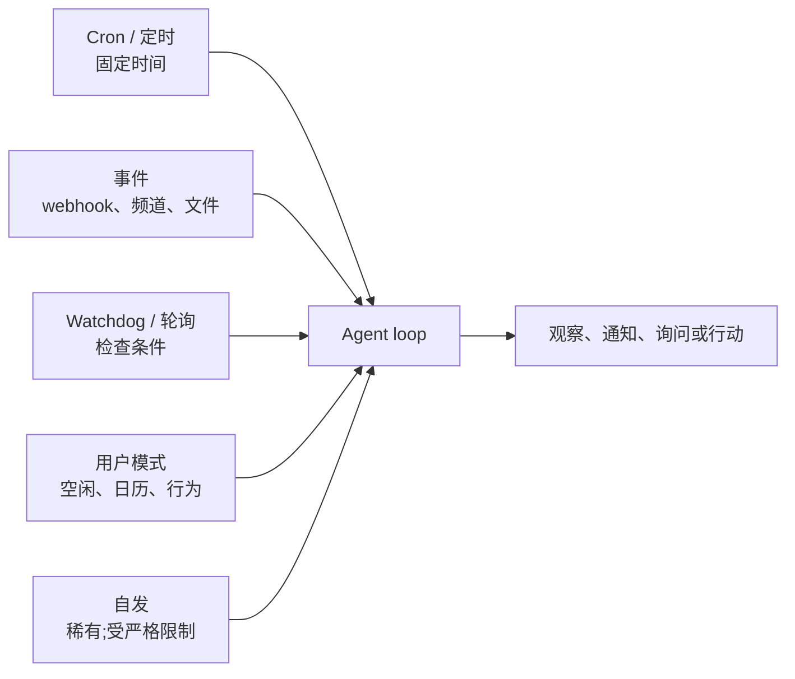
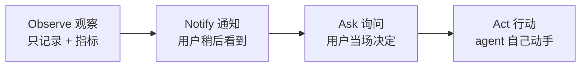

# 第 20 章 — 主动型 agent

## TL;DR

本课程绝大部分假设的是一个反应式 (reactive) 形态:用户发来消息,agent loop 跑起来,响应回去。主动型 agent (proactive agents) 做的是 *没人开口* 的活 —— 定时 cron、事件驱动的唤醒、对外部状态变化做出反应的 watchdog、后台 curation,以及偶尔的自发任务。机制大多在前面章节里见过 (第 8 章的 run 状态机、第 13 章的通道 adapter、第 15 章的心跳调度器),但设计纪律是真正新的:何时打断、何时入队、何时归集成摘要 (digest);如何设计 opt-in 语义让主动性是帮助而不是骚扰;从通知到询问到行动的升级阶梯;在没有人看着时跑活儿独有的失败模式;以及 *主动性是用户按类别授予的权限,绝不是默认值* 这条规矩。

---

## 为什么这件事重要

一个反应式 agent 最糟的失败是给了错答案。一个主动型 agent 最糟的失败是三件事之一:一个 *没人拦住* 的错误动作、一个 *没人看着* 的成本失控,或者一波把用户训练到无视 agent 一切消息的 *通知洪水*。每一项都是同步请求-响应系统不会出现的事故类别;每一项都是你在不学本章纪律的情况下发布主动功能时的可预测失败模式。

另一个原因:主动功能是 *用户记起来才打开的工具* 和 *已经成为用户工作方式一部分的 agent* 之间的分界线。每天早上 9 点的简报、部署失败时报警的 watchdog、汇总本周 PR 的 cron 任务 —— 这些时刻让 agent 挣到了自己的位置。做得好,会累积用户的信任。做得糟,一周就把信任挥霍干净。

---

## 概念

### 反应式 vs 主动式 —— 各自的场景

大多数 agent 起步就是反应式,也一直保持反应式。只有满足下列条件之一时才加主动形态:

- 用户有一项 **重复需求**,但不需要每次都亲自关注 —— 日报、周报、定期健康检查。
- 世界上发生了某个 **变化**,用户需要在几分钟内知道,而不是几小时 —— 部署失败、某指标越过阈值、来自被关注的发件人的邮件到了。
- 这件事最好在用户 *不在场* 时做 —— 后台 curation、eval 跑批、空闲窗口训练 (第 21 章接这块)。

如果以上都不成立,就别加主动形态。*主动性是一个功能;空转是一笔成本。*

### 触发器分类

五种触发器类型几乎覆盖了所有生产环境的主动工作:



- **Cron / 定时。** 固定时间 —— 每个工作日早上 9 点、每个整点。最简单、最可预测;适合常规的重复任务。
- **事件驱动。** 平台触发一个 HTTP 回调 (第 13 章)、一条频道消息到达、一个文件变化、一个日历事件触发。响应最快;由于它对世界做出反应而不是对时钟做出反应,会显得有 *智能*。
- **Watchdog / 轮询。** Agent 定期检查一个条件 (一个价格、一个队列深度、一个状态页),只在条件满足时才动手。源系统不发事件时有用。
- **用户模式触发。** Agent 观察到一个行为模式 —— 用户空闲了、日历有空挡、N 小时没回消息 —— 然后主动提供帮助。最难做对;最容易做得烦人。
- **自发触发。** 稀有。Agent 自己决定有事值得做,没有外部触发。只为受严格限制、低风险的动作保留这种 (第 7 章的后台 curator 是其中之一)。

大多数真实系统会组合两种或以上。*Cron + 事件* 是最常见的搭配:一个 cron 作业去检查某件事,加上事件 handler 在某个具体事件发生时触发。

### Cron —— 主力

把能用的 cron 和坏掉的 cron 分开的,有三件事:

- **持久化的作业定义。** Hermes Agent 把 cron 作业存在 `~/.hermes/cron/jobs.json` 这个文件里,调度器每个 tick 读一遍。Paperclip 把例行任务 (routine) 存在 Postgres 的 `routines` 表里,熬过重启。OpenClaw 放在配置里。存储必须能熬过进程重启 —— 否则你重新部署一次就会丢掉已经排好的工作。
- **错过点火 (missed-fire) 策略。** 进程挂的时候到点了怎么办?三个选项 —— *恢复时点一次* (现在跑)、*跳过* (当它跑过了)、*把每个错过的窗口都点一次* (按错过的次数补跑)。明确地挑一种;很多 cron 库的默认行为是依实现而定,让人糊涂。
- **幂等性。** 一个 cron 任务在执行中崩溃后再次点火,不应该把活儿干两次。用从 cron 表达式加上计划时间派生出来的 run key,在执行前去重。第 8 章的 outbox 模式直接拿来用,原样适用。

```ts
// Cron job shape that survives restarts and avoids double-fire.
type CronJob = {
  id:           string;
  agent:        string;          // which agent profile runs the job
  schedule:     string;          // cron expression
  missedFire:   "skip" | "once_on_recovery" | "fire_each";
  payload:      unknown;         // what the agent should do
  enabled:      boolean;
  createdAt:    string;          // anchor for the first scheduled window
  lastFiredAt?: string;
  ownerUserId:  string;          // for tenant scoping and audit (Ch.05, Ch.15)
};

function runKey(job: CronJob, scheduledFor: Date): string {
  return sha256(`${job.id}:${scheduledFor.toISOString()}`).slice(0, 32);
}

async function maybeFireCron(job: CronJob, now: Date, ctx: SchedulerCtx) {
  // Anchor next from the last fired window or — for a never-fired job —
  // from createdAt. Computing from `now` here would silently skip every
  // window that should have fired between creation and now, which is
  // wrong for any missed-fire policy except "skip".
  const anchor = job.lastFiredAt ?? job.createdAt;
  const next   = nextScheduledTime(job.schedule, anchor);
  if (next > now) return;

  const key = runKey(job, next);

  // Atomic claim: the dedup record, the queue insert, and the lastFiredAt
  // update commit in one transaction. Without atomicity, a crash between
  // enqueue and record re-fires the job on recovery — double execution
  // of a side effect that may not be safe to repeat (Ch.08's outbox
  // pattern is the same shape, generalised).
  await ctx.db.transaction(async (tx) => {
    const claimed = await tx.dedup.tryClaim(key);   // false if key already seen
    if (!claimed) return;
    await tx.runs.enqueue({ agent: job.agent, payload: job.payload, runKey: key });
    await tx.cron.markFired(job.id, next);
  });
}
```

Anchor 跟 missed-fire 策略联动:`fire_each` 从 `createdAt` 往前走,每个错过的窗口都领一把 key;`once_on_recovery` 不管错过了多少窗口都只领一次;`skip` 把 `lastFiredAt` 推到最近一个过去的窗口而不触发。按租户隔离在这里同样重要:租户 A 的 cron 作业用租户 A 的数据跑,计费到租户 A 的预算 (第 15 章),审计到租户 A 的日志 (第 5 章)。一个租户的失控 cron 永远不应该卡住另一个的。

### 事件驱动的唤醒

事件触发器搭在第 13 章的 connector 层上。三种形态:

- **Webhook 触发。** 平台在事件发生时触发一次 HTTP 回调 —— 一条 Slack 消息、一个 Stripe 事件、一次 GitHub push。第 13 章的 webhook handler (HMAC + 去重 + 202-then-queue) 把事件交给 agent loop。Agent 把它当作一个 `ChannelEvent` —— 跟用户消息同一个形状,只是语义不同。
- **频道事件订阅。** Discord WebSocket、Slack events API、IMAP push 通知。通道 adapter 维持一个长连接,事件到了就入队。
- **文件系统或存储 watcher。** `inotify`、S3 bucket 通知、云存储触发器。Watcher 在文件被创建或修改时触发;agent 检查并决定要不要动手。

三种形态共同遵守的纪律:事件走跟用户消息一样的队列 (第 15 章),这样 agent 的 loop、可观测性、预算控制都是同一套。*事件就是一条用户没打字的消息。*

### Watchdog 和轮询

源系统不发事件时,agent 就轮询。三条规矩:

- **节奏匹配波动率。** 每秒轮一次的价格 watcher 是浪费;每小时轮一次的部署状态 poller 又太慢。挑一个跟源端变化速率、跟消费方延迟预算都匹配的节奏。
- **稳态时退避。** 被监视的值一段时间没变了,就拉长轮询间隔。变了,就回到基线节奏。给源系统省掉不必要的负载。
- **把这次监视本身当成一个指标暴露出来。** 第 16 章的可观测性模式适用 —— poller 每次检查都发一条 span、*值发生变化* 计数器、轮询延迟直方图。一个静默的 poller 是一个你不能信任的 poller。

Paperclip 的 `scanSilentActiveRuns` (第 15 章) 就是 watchdog 应用在 agent *自己* 上 —— 检查超过阈值没有输出的 run 并升级。同一个模式向外应用:agent 看一个系统,出现漂移就升级。

### Opt-in 语义 —— 主动性是一种权限

最重要的一条:*主动性是用户按类别授予的权限,不是默认值。* 用户不应该需要 mute 他们的 agent;他们应该需要 opt-in 才会被打断。

```ts
// A coarse-grained permission record. Per category, not per message.
type ProactivePermission = {
  category:       string;        // "daily_brief", "deploy_alerts", "weekly_summary"
  enabled:        boolean;
  channel:        "inline" | "email" | "slack" | "push";
  frequencyCap?:  { count: number; per: "hour" | "day" | "week" };
  quietHours?:    { start: string; end: string; timezone: string };
  snoozeUntil?:   string;
};

// Before sending a proactive notification, check all gates.
async function shouldNotify(
  user: User,
  category: string,
  now: Date,
  ctx: ProactiveCtx,
): Promise<boolean> {
  const perm = await ctx.permissions.get(user.id, category);
  if (!perm?.enabled)                                           return false;
  if (perm.snoozeUntil && now < new Date(perm.snoozeUntil))    return false;
  if (perm.quietHours && isInQuietHours(now, perm.quietHours)) return false;
  if (perm.frequencyCap) {
    const sent = await ctx.notifyLog.countRecent(
      user.id, category, perm.frequencyCap.per,
    );
    if (sent >= perm.frequencyCap.count) return false;
  }
  return true;
}
```

类别是粗粒度的,不是按消息 —— 用户为 *部署告警* 这个类别 opt-in 一次,不是为每次部署逐条同意。Channel 是按类别的 —— 紧急的走 inline,摘要类走 email。频率上限和静默时段防止 agent 在一个已启用类别里违反隐式期望。

诚实的说法:每个主动功能都 *默认禁用* 发布,这个功能上线后 agent 的第一件事就是问用户要不要开。*惊喜是信任的敌人。*

### 时机智能 —— 打断、入队还是摘要

对每一个主动事件,有三种时机选择:

| 模式 | 何时使用 | 成本 | 示例 |
|---|---|---|---|
| **马上打断** | 紧迫、价值有时效 | 用户注意力 | 生产部署失败 |
| **排队到下一次会话** | 很快有用但不紧急 | 少量认知积压 | 周一要 review 的新 PR |
| **摘要** | 聚合起来有用,单条价值低 | 单条几乎为零 | 每日邮件总结 |

大多数主动功能的默认应当是 *摘要*。只有用户明确说过 "这类值得打断" 的事情才打断。哪怕在同一次会话里,也把相关的通知合批 —— 五条 PR 评论一起送达,比五次分开提醒打扰更小。

MetaClaw 的空闲窗口调度器 (第 21 章的自演化章节会讲得更深) 是把时机智能用在训练上:重活儿在睡眠时间、键盘空闲、日历空挡里跑。同一条原则适用于任何主动工作 —— *在用户没有在专注别的事情的时候做*。

### 升级阶梯

对任何一类主动行动,agent 有四级可选:



- **Observe (观察)。** 只是记录事件。没有面向用户的呈现。用于积累指导后面几级的数据。
- **Notify (通知)。** 在摘要或低优先级通道里浮现。用户看到了;没人代他动手。
- **Ask (询问)。** 以一个活跃的 prompt 呈现。用户决定是否要动手;agent 的工作是让这个决定容易做。
- **Act (行动)。** Agent 直接动手。只有当用户之前已经为这个类别 opt-in 了自主行动、动作可逆,并且审计日志记下来 (第 5 章) 才有效。

一条好用的规则:*从 observe 起步,自己挣到往上爬的资格。* 一个新主动功能上线时只到 observe,直到你有数据证明用户想要下一级。然后到 notify。然后到 ask。然后 —— 只有在明确 opt-in 加可回滚纪律的前提下 —— 才到 act。

### 通知设计与洪水问题

主动型 agent 最可预测的失败是通知洪水。三道防线:

- **按类别的频率上限。** 一小时五条 Slack 提醒令人烦;一条则受欢迎。设上限,其余的合到摘要里。
- **自适应节奏。** 用户连续忽略 N 条通知,就慢下来。明确问他要不要继续开着这个类别。
- **把 snooze 和 mute 作为头等动作。** 每条通知都自带一个 *暂时安静到稍后* 的开关。用户选择 snooze 本身就是信息 —— 记下来,让它影响节奏。

成熟的通知系统 (Slack、GitHub、Linear) 都遵守一个模式:用户每次没参与,该类通知就少一份注意力。一个能从未参与中学习的主动型 agent,用户会留着;不能的,用户会 mute 然后忘掉。

### 无人值守工作的权限和审批

第 12 章的审批门假设有用户在场点按钮。主动工作打破了这个假设。三条策略:

- **预批准的类别。** 用户已经显式启用的任何类别 (上面的 opt-in) 不需要每次执行再审批 —— *前提是* 动作有边界、不破坏性、可逆。一个类别级别的 *yes* 永远不绕过第 12 章对破坏性动作 (删除、发送、扣款、部署) 的审批门;这些即便在一个预批准的类别里也是每次都问。下面 *什么不能改成主动的* 列了始终升级的残留集合。
- **异步审批。** Agent 提出动作,通过一个允许延迟响应的通道呈现 (Slack、email、移动推送),等批准后再动手。有时间边界 —— 超过 N 小时没回,就默认 *不执行* 并把超时记录下来。
- **默认拒绝。** 不在预批准类别里且没有问过-答过的,一概不跑。就这样。

要躲开的陷阱是 *隐式同意* —— *"用户已经一周忽略我的主动邮件了,那说明没事。"* 不是。没有反对不等于批准。一个类别如果挣不回它的位置,就把这件事浮现给用户,问要不要禁用它。

### "没人在看" 时独有的失败模式

主动工作独有的三类失败:

- **静默错误。** 一个 cron 作业已经连续失败两周;没人察觉是因为没人手动跑它。防线:每次主动 run 都发一条 span (第 16 章),连续失败要告警。
- **成本失控。** 一个 watchdog 每 30 秒轮一次,跑了一年;没人看见账单直到账单来了。防线:按租户的预算门 (第 15 章) *跟交互式 run 一样* 适用于主动 run。把趋势在成本看板里暴露出来 (第 16 章)。
- **失控的 loop。** 一个自发触发的 agent 派生 subagent,subagent 又派生 subagent。第 10 章的递归上限和第 2 章的步数上限照样生效,但对主动工作,这些上限应当 *比交互式更紧* —— 用户不在那里打断。

一个有用的生产小习惯:每次主动 run 在它的 trace 上挂一个 tag (`triggered_by: cron | event | watchdog | pattern | self`)。看板按触发类型分组。出事时,你知道是用户点的,还是系统自己启动的。

### 什么不能改成主动的

反向清单,按风险分类:

- **破坏性动作。** 凡删除、发送、扣款、部署。永远要每次单独由用户决定,哪怕在一个预批准的类别里。
- **跨租户操作。** 租户 A 的主动 run 永远不应该碰到租户 B 的数据。第 6 章的命名空间规则不可商量。
- **不可逆的副作用。** 如果回滚不了,就别让 agent 自己做。
- **用户从没见过的事。** 如果一个类别从没被向用户演示过、用户没明确说过 *是的,可以让它自己跑*,它就不能自己跑。

一条有用的规则:*如果用户看到结果会说 "等等,什么?",那这件事就不应该是主动跑出来的。*

---

## 真实系统笔记

- **Hermes Agent** 是基于文件的 cron 和后台 curator 模式的最强参考:`~/.hermes/cron/jobs.json` + 带文件锁的 tick 调度器、用于回合后主动 curation 的 `spawn_background_review_thread`、用于空闲时间 skill 生命周期管理的 `maybe_run_curator`。Cron 作业在执行前会被扫描 prompt-injection 模式 —— 主动 run 比交互式有更紧的安全门 (第 18 章)。
- **Paperclip** 是编排层主动调度的参考:心跳调度器每 30 秒 tick,`routineService.tickScheduledTriggers` 触发到期的 cron 例行任务,`scanSilentActiveRuns` watchdog 检测卡住的 agent,重试间隔从 2 分钟升级到 2 小时。按公司的预算门对所有 run 适用,不分触发类型。
- **OpenClaw** 是通道-事件驱动主动工作的参考:通道插件各自维持订阅 (Discord WebSocket、Slack events、Telegram 轮询),事件走跟用户消息一样的 gateway。Cron 作业默认带完整工具权限 —— 作为一个反面对照很有用,告诉你主动 run 需要更紧的信任边界时 *不* 该怎么做。
- **OpenCode** 大体上是反应式的 (用户发起的编码会话),但它的 session-event SSE 流和快照系统对学习如何把主动行为浮现给已连接 UI 很值得研究。

---

## 接下来

你现在有了主动设计的框架 —— 触发器分类、opt-in 纪律、升级阶梯、时机模式,以及没人在看时工作独有的失败模式。第 21 章接上一个相关的角度:不是 *agent 主动行动*,而是 *agent 主动自我改进* 怎么样?自演化的 agent —— memory 整合、skill 学习、prompt 改写、LoRA 个性化 —— 是主动调度的自然补充,带有相同的门控纪律,以及对第 7 章中回滚路径同样的需要。
