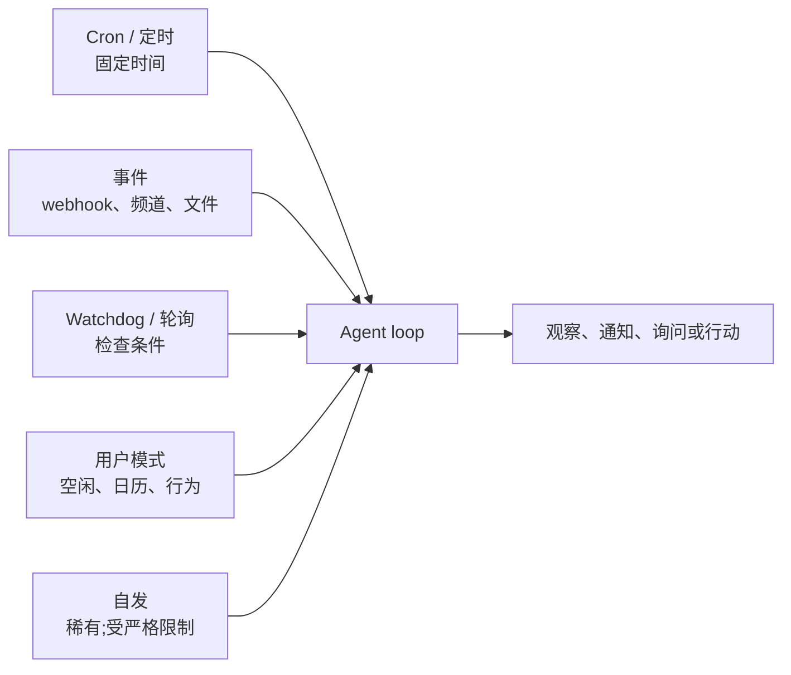
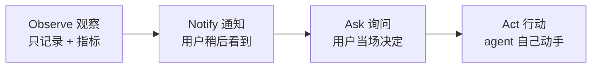

# 第 20 章 — 主动型 agent

## TL;DR

本课程绝大部分内容都假设了一种反应式 (reactive) 形态:用户发来消息,agent loop 跑起来,响应回去。主动型 agent (proactive agents) 做的是 *没人开口* 时的活 —— 定时 cron、事件驱动的唤醒、对外部状态变化做出反应的 watchdog、后台 curation,以及偶尔的自发任务。机制大多在前面章节里见过 (第 8 章的 run 状态机、第 13 章的通道 adapter、第 15 章的心跳调度器),但设计纪律是真正全新的:何时打断、何时入队、何时归集成摘要 (digest);如何设计 opt-in 语义,让主动性成为帮助而非骚扰;从通知到询问再到行动的升级阶梯;在无人看管时干活独有的失败模式;以及 *主动性是用户按类别授予的权限,绝非默认值* 这条铁律。

---

## 为什么这件事重要

反应式 agent 最糟的失败是给出错误答案。主动型 agent 最糟的失败则是三者之一:一个 *没人拦得住* 的错误动作、一笔 *没人盯着* 的失控成本,或者一波把用户训练得对 agent 的所有消息都视而不见的 *通知洪水*。这三类事故在同步的请求-响应系统里都不会出现;而你若不遵循本章的纪律就发布主动功能,这三类正是可以预见的失败模式。

还有一个原因:主动功能是 *用户想起来才打开的工具* 和 *已经融入用户工作方式的 agent* 之间的分水岭。每天早上 9 点的简报、部署失败时报警的 watchdog、汇总本周 PR 的 cron 任务 —— 正是这些时刻让 agent 挣得了自己的位置。做得好,信任会层层累积;做得糟,一周就把信任挥霍殆尽。

---

## 概念

### 反应式 vs 主动式 —— 各自的场景

大多数 agent 起步是反应式,也一直保持反应式。只有满足下列条件之一时,才加入主动形态:

- 用户有一项 **重复需求**,但不需要每次都亲自关注 —— 日报、周报、定期健康检查。
- 外部世界发生了某个 **变化**,用户需要在几分钟内、而不是几小时后知道 —— 部署失败、某项指标越过阈值、某个被关注的发件人来了邮件。
- 这件事最好在用户 *不在场* 时做 —— 后台 curation、eval 跑批、空闲窗口训练 (第 21 章会接着讲)。

以上都不成立,就别加主动形态。*主动性是一项功能;空转则是一笔成本。*

### 触发器分类

五种触发器类型几乎覆盖了所有生产环境的主动工作:



- **Cron / 定时。** 固定时间 —— 每个工作日早上 9 点、每个整点。最简单、最可预测;适合常规的重复任务。
- **事件驱动。** 平台触发一次 HTTP 回调 (第 13 章)、一条频道消息到达、一个文件发生变化、一个日历事件触发。响应最快;因为它响应的是外部世界而非时钟,所以显得有 *智能*。
- **Watchdog / 轮询。** Agent 定期检查某个条件 (一个价格、一个队列深度、一个状态页),只在条件满足时才动手。源系统不发事件时很有用。
- **用户模式触发。** Agent 察觉到某种行为模式 —— 用户空闲了、日历有空档、N 小时没回消息 —— 于是主动提供帮助。最难做对,也最容易做得烦人。
- **自发触发。** 罕见。Agent 自己判断有件事值得做,没有任何外部触发。只为那些受严格限制、低风险的动作保留这种方式 (第 7 章的后台 curator 就是一例)。

大多数真实系统会组合两种或更多。*Cron + 事件* 是最常见的搭配:一个 cron 作业去检查某件事,再加上事件 handler 在某个具体事件发生时触发。

### Cron —— 主力

把能用的 cron 和坏掉的 cron 区分开来的,有三件事:

- **持久化的作业定义。** Hermes Agent 把 cron 作业存在 `~/.hermes/cron/jobs.json` 这个文件里,调度器每个 tick 读一遍。Paperclip 把例行任务 (routine) 存在 Postgres 的 `routines` 表里,可以扛过重启。OpenClaw 放在配置里。存储必须能扛过进程重启 —— 否则重新部署一次就会丢掉已经排好的工作。
- **错过点火 (missed-fire) 策略。** 进程宕机期间过了计划时间,该怎么办?有三个选项 —— *恢复时点一次* (现在就跑)、*跳过* (当作已经跑过了)、*每个错过的窗口都点一次* (按错过的次数逐个补跑)。明确地挑定一种;很多 cron 库的默认行为是由实现决定的,叫人摸不着头脑。
- **幂等性。** 一个 cron 任务在执行中途崩溃、之后又再次点火,不应该把活干两遍。用 cron 表达式加上计划时间派生出一个 run key,在执行前据此去重。第 8 章的 outbox 模式可以原样照搬过来。

```ts
// Cron job shape that survives restarts and avoids double-fire.
type CronJob = {
  id:           string;
  agent:        string;          // which agent profile runs the job
  schedule:     string;          // cron expression
  missedFire:   "skip" | "once_on_recovery" | "fire_each";
  payload:      unknown;         // what the agent should do
  enabled:      boolean;
  createdAt:    string;          // anchor for the first scheduled window
  lastFiredAt?: string;
  ownerUserId:  string;          // for tenant scoping and audit (Ch.05, Ch.15)
};

function runKey(job: CronJob, scheduledFor: Date): string {
  return sha256(`${job.id}:${scheduledFor.toISOString()}`).slice(0, 32);
}

async function maybeFireCron(job: CronJob, now: Date, ctx: SchedulerCtx) {
  // Anchor next from the last fired window or — for a never-fired job —
  // from createdAt. Computing from `now` here would silently skip every
  // window that should have fired between creation and now, which is
  // wrong for any missed-fire policy except "skip".
  const anchor = job.lastFiredAt ?? job.createdAt;
  const next   = nextScheduledTime(job.schedule, anchor);
  if (next > now) return;

  const key = runKey(job, next);

  // Atomic claim: the dedup record, the queue insert, and the lastFiredAt
  // update commit in one transaction. Without atomicity, a crash between
  // enqueue and record re-fires the job on recovery — double execution
  // of a side effect that may not be safe to repeat (Ch.08's outbox
  // pattern is the same shape, generalised).
  await ctx.db.transaction(async (tx) => {
    const claimed = await tx.dedup.tryClaim(key);   // false if key already seen
    if (!claimed) return;
    await tx.runs.enqueue({ agent: job.agent, payload: job.payload, runKey: key });
    await tx.cron.markFired(job.id, next);
  });
}
```

Anchor 会跟 missed-fire 策略联动:`fire_each` 从 `createdAt` 向前推进,每个错过的窗口都领取一个 key;`once_on_recovery` 无论错过多少窗口都只领一个;`skip` 把 `lastFiredAt` 直接推到最近一个过去的窗口而不触发。按租户隔离在这里同样重要:租户 A 的 cron 作业跑在租户 A 的数据上,计费记到租户 A 的预算 (第 15 章),审计记到租户 A 的日志 (第 5 章)。一个租户失控的 cron 永远不该卡住另一个租户的。

### 事件驱动的唤醒

事件触发器搭在第 13 章的 connector 层上。三种形态:

- **Webhook 触发。** 平台在事件发生时触发一次 HTTP 回调 —— 一条 Slack 消息、一个 Stripe 事件、一次 GitHub push。第 13 章的 webhook handler (HMAC + 去重 + 202-then-queue) 把事件交给 agent loop。Agent 把它当作一个 `ChannelEvent` —— 与用户消息形状相同,只是语义不同。
- **频道事件订阅。** Discord WebSocket、Slack events API、IMAP push 通知。通道 adapter 维持一个长连接,事件一到就入队。
- **文件系统或存储 watcher。** `inotify`、S3 bucket 通知、云存储触发器。文件被创建或修改时 watcher 触发;agent 检查后决定要不要动手。

三种形态都遵守同一条纪律:事件走跟用户消息一样的队列 (第 15 章),这样 agent 的 loop、可观测性、预算控制全都共用一套。*事件不过是一条用户没亲手打出的消息。*

### Watchdog 和轮询

源系统不发事件时,agent 就轮询。三条规矩:

- **节奏要匹配波动率。** 每秒轮询一次的价格 watcher 是浪费;每小时才轮一次的部署状态 poller 又太慢。挑一个既匹配源端变化速率、又匹配消费方延迟预算的节奏。
- **稳定时退避。** 被监视的值一段时间没变化,就拉长轮询间隔;一旦变化,就退回基线节奏。这能给源系统省掉不必要的负载。
- **把这次监视本身也当成一个指标暴露出来。** 第 16 章的可观测性模式在这里适用 —— poller 每次检查都发出一条 span、一个 *值已变化* 计数器、一个轮询延迟直方图。一个静默无声的 poller,是一个你无法信任的 poller。

Paperclip 的 `scanSilentActiveRuns` (第 15 章) 就是把 watchdog 用在 agent *自己* 身上 —— 检查那些超过阈值仍无输出的 run 并升级处理。同一个模式向外应用就是:agent 盯着一个系统,一旦出现漂移就升级。

### Opt-in 语义 —— 主动性是一种权限

最重要的一条:*主动性是用户按类别授予的权限,而不是默认值。* 用户不该被迫去 mute 自己的 agent;应该是他们主动 opt-in,才会被打断。

```ts
// A coarse-grained permission record. Per category, not per message.
type ProactivePermission = {
  category:       string;        // "daily_brief", "deploy_alerts", "weekly_summary"
  enabled:        boolean;
  channel:        "inline" | "email" | "slack" | "push";
  frequencyCap?:  { count: number; per: "hour" | "day" | "week" };
  quietHours?:    { start: string; end: string; timezone: string };
  snoozeUntil?:   string;
};

// Before sending a proactive notification, check all gates.
async function shouldNotify(
  user: User,
  category: string,
  now: Date,
  ctx: ProactiveCtx,
): Promise<boolean> {
  const perm = await ctx.permissions.get(user.id, category);
  if (!perm?.enabled)                                           return false;
  if (perm.snoozeUntil && now < new Date(perm.snoozeUntil))    return false;
  if (perm.quietHours && isInQuietHours(now, perm.quietHours)) return false;
  if (perm.frequencyCap) {
    const sent = await ctx.notifyLog.countRecent(
      user.id, category, perm.frequencyCap.per,
    );
    if (sent >= perm.frequencyCap.count) return false;
  }
  return true;
}
```

类别是粗粒度的,不是逐条消息 —— 用户为 *部署告警* 这个类别 opt-in 一次,而不是为每次部署逐条同意。Channel 也是按类别区分的 —— 紧急的走 inline,摘要类的走 email。频率上限和静默时段,则防止 agent 即便在一个已启用的类别里也违反用户的隐式期望。

老实说:每个主动功能都应当 *默认禁用* 发布,而这个功能上线后 agent 要做的第一件事,就是问用户要不要开启。*意外是信任的敌人。*

### 时机智能 —— 打断、入队还是摘要

对每一个主动事件,有三种时机选择:

| 模式 | 何时使用 | 成本 | 示例 |
|---|---|---|---|
| **马上打断** | 紧迫、价值有时效 | 用户注意力 | 生产部署失败 |
| **排队到下一次会话** | 很快有用但不紧急 | 少量认知积压 | 周一要 review 的新 PR |
| **摘要** | 聚合起来有用,单条价值低 | 单条几乎为零 | 每日邮件总结 |

大多数主动功能的默认选择应当是 *摘要*。只有用户明确表示过 "这类事值得打断" 的事情,才去打断。哪怕在同一次会话里,也要把相关的通知合批 —— 五条 PR 评论一起送达,远比五次分开提醒来得不那么扰人。

MetaClaw 的空闲窗口调度器 (第 21 章的自演进章节会讲得更深) 就是把时机智能用在训练上:重活儿放到睡眠时段、键盘空闲、日历空档里跑。同一条原则适用于任何主动工作 —— *趁用户没有在专注别的事情时去做*。

### 升级阶梯

对任何一类主动行动,agent 有四级可选:



- **Observe (观察)。** 只记录事件,不向用户呈现任何东西。用于积累数据,为后面几级提供依据。
- **Notify (通知)。** 在摘要或低优先级通道里露出。用户看得到;但没人代他动手。
- **Ask (询问)。** 以一个需要响应的 prompt 呈现。由用户决定是否动手;agent 的职责是让这个决定容易做出。
- **Act (行动)。** Agent 直接动手。只有同时满足以下条件才成立:用户此前已为这个类别 opt-in 了自主行动、动作可逆、且有审计日志记录在案 (第 5 章)。

一条好用的规则:*从 observe 起步,逐级挣得向上爬的资格。* 一个新的主动功能上线时只停在 observe,直到你有数据证明用户想要下一级。然后才升到 notify,再升到 ask,最后 —— 只有在明确 opt-in 并配上可回滚纪律的前提下 —— 才升到 act。

### 通知设计与洪水问题

主动型 agent 最可预测的失败是通知洪水。三道防线:

- **按类别设频率上限。** 一小时五条 Slack 提醒令人厌烦;一条则受欢迎。设好上限,其余的归集到摘要里。
- **自适应节奏。** 用户连续忽略 N 条通知,就放慢下来,并明确问他要不要继续开着这个类别。
- **把 snooze 和 mute 当作头等动作。** 每条通知都自带一个 *暂时安静、稍后再说* 的开关。用户选择 snooze 这件事本身就是信息 —— 记下来,让它去影响节奏。

成熟的通知系统 (Slack、GitHub、Linear) 都遵循一个模式:用户每次不参与,该类通知就少分到一份注意力。能从用户的不参与中学习的主动型 agent,用户会留着;不能的,用户则会 mute 掉再忘个干净。

### 无人值守工作的权限和审批

第 12 章的审批门假设有用户在场点按钮。主动工作打破了这个假设。三条策略:

- **预批准的类别。** 用户已经显式启用的任何类别 (即上面的 opt-in) 不需要每次执行再审批 —— *前提是* 动作有边界、非破坏性、且可逆。类别级别的一个 *yes* 永远不会绕过第 12 章针对破坏性动作 (删除、发送、扣款、部署) 的审批门;这些动作即便落在一个预批准的类别里,也仍然每次都要逐项询问。下面的 *什么不该改成主动的* 列出了那一批始终需要升级的动作。
- **异步审批。** Agent 提出动作,通过一个允许延迟响应的通道呈现出来 (Slack、email、移动推送),等到批准后再动手。这要设时间边界 —— 超过 N 小时没回应,就默认 *不执行*,并把这次超时记录下来。
- **默认拒绝。** 既不在预批准类别里、又没经过问-答确认的,一概不跑。没有例外。

要躲开的陷阱是 *隐式同意* —— *"用户已经一整周无视我的主动邮件了,那说明没问题。"* 不对。没有反对不等于批准。一个类别如果挣不回自己的位置,就把这件事摆到用户面前,问他要不要禁用。

### "没人在看" 时独有的失败模式

主动工作独有的三类失败:

- **静默错误。** 一个 cron 作业已经连续失败两周;没人察觉,因为没人会去手动跑它。防线:每次主动 run 都发出一条 span (第 16 章),连续失败时告警。
- **成本失控。** 一个 watchdog 每 30 秒轮询一次,跑了整整一年;直到账单寄来,才有人看见。防线:按租户的预算门 (第 15 章) 要 *像对待交互式 run 一样* 同等地施加于主动 run,并把成本趋势暴露在成本看板上 (第 16 章)。
- **失控的 loop。** 一个自发触发的 agent 派生出子 agent,子 agent 又派生出子 agent。第 10 章的递归上限和第 2 章的步数上限照样生效,只是对主动工作,这些上限应当 *比交互式更紧* —— 毕竟用户不在场,无法随时打断。

一个有用的生产小习惯:每次主动 run 都在它的 trace 上挂一个 tag (`triggered_by: cron | event | watchdog | pattern | self`)。看板按触发类型分组。一旦出事,你立刻就能知道是用户启动的,还是系统自己启动的。

### 什么不该改成主动的

反向清单,按风险类别划分:

- **破坏性动作。** 凡涉及删除、发送、扣款、部署的。永远要每次单独由用户决定,哪怕是在一个预批准的类别里。
- **跨租户操作。** 租户 A 的主动 run 永远不该碰到租户 B 的数据。第 6 章的命名空间规则没有商量余地。
- **不可逆的副作用。** 回滚不了的事,就别让 agent 自己去做。
- **用户从没见过的事。** 如果一个类别从未向用户演示过、用户也没明确说过 *好,可以让它自己跑*,那它就不能自己跑。

一条好用的规则:*如果用户看到结果会脱口而出 "等等,这怎么回事?",那这件事就不该是主动跑出来的。*

---

## 真实系统笔记

- **Hermes Agent** 是基于文件的 cron 和后台 curator 模式的最强参考:`~/.hermes/cron/jobs.json` 配上带文件锁的 tick 调度器、用于回合后主动 curation 的 `spawn_background_review_thread`、以及用于空闲时段 skill 生命周期管理的 `maybe_run_curator`。Cron 作业在执行前会被扫描 prompt-injection 模式 —— 主动 run 比交互式拥有更紧的安全门 (第 18 章)。
- **Paperclip** 是编排层主动调度的参考:心跳调度器每 30 秒 tick 一次,`routineService.tickScheduledTriggers` 触发到期的基于 cron 的例行任务,`scanSilentActiveRuns` 这个 watchdog 检测卡住的 agent,重试间隔从 2 分钟逐级升到 2 小时。按公司划分的预算门对所有 run 一律适用,不分触发类型。
- **OpenClaw** 是通道-事件驱动主动工作的参考:通道插件各自维持自己的订阅 (Discord WebSocket、Slack events、Telegram 轮询),事件走跟用户消息一样的 gateway。Cron 作业默认带完整工具权限 —— 这作为一个反面教材很有用,提醒你当主动 run 需要更紧的信任边界时 *不* 该怎么做。
- **OpenCode** 基本上是反应式的 (用户发起的编码会话),但它的 session-event SSE 流和快照系统,对于研究如何把主动活动呈现给一个已连接的 UI 很有借鉴价值。

---

## 接下来

现在你已经有了一套主动设计的框架 —— 触发器分类、opt-in 纪律、升级阶梯、时机模式,以及无人看管时工作所独有的失败模式。第 21 章会从一个相关的角度接着讲:不是 *agent 主动采取行动*,而是 *agent 主动自我改进* 又会怎样?自演进的 agent —— 记忆整合、技能 (skill) 学习、prompt 改写、LoRA 个性化 —— 是主动调度的自然延伸,遵循相同的门控纪律,也同样需要第 7 章那套回滚路径。
