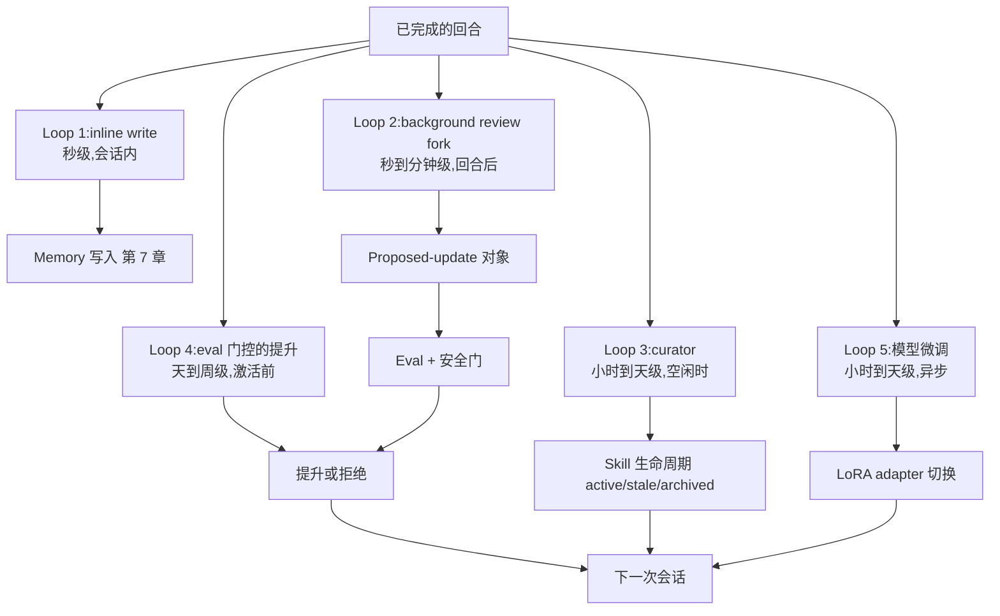
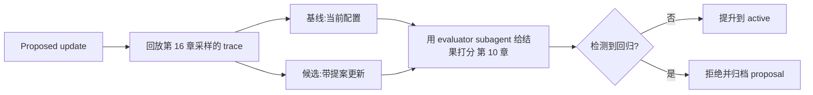
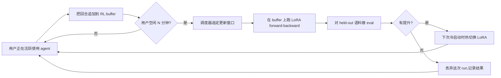

# 第 21 章 — 自演化的 agent

## TL;DR

一个自演化的 agent 会在 run 之间更新自己的 memory、skill、prompt、tool 描述,甚至模型权重 —— 把昨天的经验变成明天的能力。做得好,agent 不需要人参与每次改动,就在稳步变锐。做得糟,它会漂移、给自己 memory 投毒,或者悄悄把自己的安全控制改写掉。让这件事安全的纪律,完全是由前面章节的模式拼出来的:用 proposed-update 对象代替直接写入、由 evaluator subagent 审查 proposal、supersedes 链回滚、eval 门控的提升,以及一条严格的边界 —— *什么允许演化* 和 *什么必须在人工变更管控下*。本章覆盖完整的环路、近期的研究面 (MetaClaw、Tinker、agentskills.io 联合 hub,以及基于 LoRA 的个性化),以及让演化不滑成突变 (mutation) 的那些规矩。

---

## 为什么这件事重要

一个永不学习的 agent 会重复同样的错误 —— 每次会话都重新发现项目约定,每次都重新搞砸同样的 tool 调用,每次都重新跑同样的搜索。一个不带护栏自我更新的 agent 更糟:它能给自己的 memory 投毒、削弱工具、从单次糟糕的对话里学到错误的教训,或者悄悄积累一堆相互冲突的 skill。

目标是 *受控的适应,不是自主突变*。Hermes Agent 的 background review fork 是受控版本最清晰的生产参考 —— 下面的 Loop 1–3,今天就在跑。MetaClaw (一个 2025 年的框架,用持续 LoRA 微调和 skill 演化来包装个人 agent) 是更激进版本的最早参考之一 —— 下面的 Loop 5,研究级,目前在少数系统里上线。两者都能跑 —— 它们能跑,是因为每次更新都要经过一道人工或 harness 控制的门。

---

## 概念

### 演化到底是什么意思

Agent 有五层可以演化,每层有自己的节奏、自己的门。前两层在生产中是通用的;后三层在 2026 年是研究级的,在少数系统里上线。

| 层 | 改的是什么 | 节奏 | 门 | 示例 |
|---|---|---|---|---|
| **Memory** | `MEMORY.md`、`USER.md`、结构化事实 | 单次会话内或后台 | 安全过滤 (第 7 章);curator | Hermes Agent 的 background review |
| **Skill** | 模型可调用的命名过程 (第 14 章) | 后台 curator | Curator 生命周期 (第 7 章) | Hermes 的 `skill_manage`;MetaClaw 的 skill bank |
| **Prompt 节** | 项目上下文、术语表、偏好 | 人工或 curator 提案 | Eval gate (第 16、17 章) | OpenCode 的 `plan.md`;agent profile override |
| **Tool 描述** | 措辞、示例、"不要用于" 说明 | 人工;少数自动 | 缓存失效 (第 4 章);变更评审 (第 19 章) | 每个工具的描述编辑 |
| **模型权重** | LoRA adapter、RL 微调的权重 | 小时到天,异步 | Eval suite + 金丝雀 | MetaClaw + Tinker;on-policy 蒸馏 |

其余的一切 —— 安全策略、tool 注册表组成、密钥访问、审批阈值 —— 都留在显式人工变更下 (第 19 章变更管理)。边界很清晰:*低爆炸半径、可逆的输出可以演化;任何放宽权限的东西都不行*。

### 五环演化架构

自演化不是一个环路,是五个在不同时间尺度上交叠的环路。生产系统刻意地组合它们。



- **Loop 1 — inline write。** Agent 会话中途调用 `memory.write`。最便宜,也最危险。只用于用户刚陈述的事实。
- **Loop 2 — background review fork。** 一个 daemon subagent (Hermes Agent 的标志性模式) review 刚结束的对话记录,并提出 memory 或 skill 更新。非阻塞;写入 *下一次会话* 才可见。
- **Loop 3 — curator。** 一个独立进程在空闲时跑,梳理 skill 仓库 (第 7 章的 active → stale → archived),合并重复条目,修剪索引。
- **Loop 4 — eval 门控的提升。** Loop 2 或 3 产生的任何 proposal,必须通过一个小 eval suite 才能被激活。这道门防止 *看上去合理但其实错* 的更新上线。
- **Loop 5 — 模型微调。** 最新的环路。对话变成训练样本;一个 LoRA adapter (Tinker、MinT、Weaver) 更新模型权重本身。异步;在空闲窗口里跑。

你不需要全部五个。多数 agent 上 Loop 1–3。Loop 4 是把生产级演化跟聪明 demo 演化区分开的那一层。Loop 5 是前沿。

### Background review fork —— 标志性模式

Hermes Agent 的 `spawn_background_review_thread` 是 Loop 2 最清晰的参考。在一次成功、没被打断、且达到 nudge 阈值的回合之后,harness fork 出一个带三条约束的 daemon subagent:

- **受限的 tool 白名单** —— 通常只是 `{memory, skill_manage, skills_list, skill_view}`。Review fork 不能 exec、不能写 memory 之外的位置、不能调外部 API。
- **接收完成的对话记录** 外加一个 review prompt (Hermes 的 `_MEMORY_REVIEW_PROMPT` 和 `_SKILL_REVIEW_PROMPT`)。
- **写入原子地落到磁盘,且只在下次会话可见,这一次不可见** —— 又是第 4 章的缓存规则,这次用在写上:正在进行的 prompt 不能中途变。

```ts
// Background review fork — non-blocking; writes visible next session.
async function spawnBackgroundReview(completed: CompletedTurn, ctx: HarnessContext) {
  if (!completed.successful || completed.interrupted)            return;
  if (!ctx.policy.meetsNudgeThreshold(completed))                return;

  spawnDaemon(async () => {
    const reviewer = ctx.subagents.fork({
      profile:        "memory_curator",                          // Ch.10/Ch.14
      tools:          ["memory", "skill_manage", "skills_list", "skill_view"],
      model:          "auxiliary_cheap",                          // Ch.17
      systemPrompt:   ctx.prompts.memoryReviewPrompt,
      maxSteps:       5,
    });
    const proposals = await reviewer.run({ transcript: completed.transcript });
    for (const p of proposals) await ctx.evolution.submitProposal(p);
  });
}
```

这个模式 *从构造上就是低爆炸半径*。哪怕 reviewer 把每个 proposal 都搞错,harness 在应用前还会逐个把门。哪怕 proposal 通过了门,也能经过 supersedes 链回滚。而且主 loop 不被阻塞 —— 用户永远不等演化。

### Skill 编译 —— 把观察到的过程变成命名的 skill

当 agent 反复以同样的顺序调三四个工具来处理一个反复出现的任务,那串顺序就是 *一个等着被命名的 skill*。这个模式现在在编码 agent 和助理 agent 里已经是标准做法:

- 跨多个 run 观察到一个成功的过程。
- 给它命名:一个清晰的 `name`、`description`、有序的步骤、前置条件。
- 存为带 YAML frontmatter 的 markdown skill 文件 (第 14 章的形状)。
- 在下次会话的 skill 索引里被加载;模型需要时调 `skill_view(name)` 把正文读进来。

Hermes Agent 的 curator 做的正是这件事 —— 它从观察到的序列里提出新 skill,然后 eval 门决定要不要把它推到 active 索引。MetaClaw 的 *Skills Injection & Evolution* 模块是同一个环路,加上显式的每会话总结:每次对话都贡献潜在 skill 候选,一个 evolver LLM 把它们合成进 library。

让这件事安全的纪律:skill 是 *加上去* 的,不是 *改* 的。如果 agent 想改一个已有的 skill,它提交一个版本号递增的新版本;前一个版本归档,不覆盖。第 7 章的 supersedes 链直接适用。

### Proposed-update 对象

自演化里最重要的单一模式:*agent 提议;harness 决断。* Agent 不直接写 memory 或 skill —— 它发出结构化的 proposal,由 harness 校验、把门,然后要么应用要么拒绝。

```ts
type ProposedUpdate = {
  id:                string;
  kind:              "memory" | "skill" | "prompt_section" | "tool_description" | "lora_weight";
  targetId?:         string;                            // existing entry to update
  patch:             string;                            // diff or new content
  rationale:         string;                            // why the agent proposed this
  proposedByRunId:   string;                            // Ch.05 audit log link
  proposedByLoop:    "inline" | "background_review" | "curator" | "fine_tune";
  risk:              "low" | "medium" | "high";
  reversibility:     "instant" | "next_session" | "requires_redeploy";
  evalRequired:      boolean;
  evalResults?:      { baseline: number; candidate: number; delta: number };
  status:            "proposed" | "evaluating" | "approved" | "rejected" | "applied" | "rolled_back";
};
```

这条纪律重要,有三个理由:

- **原子审计。** 每个改动都是一个显式对象,带着源 run、理由和可逆性等级。事后 review 可以一查就回答 *是谁提出的,为什么?*
- **可组合的门。** 同一个 proposal 流过安全过滤 (第 7 章)、eval 门 (第 16/17 章)、审批门 (第 12 章),每道门彼此不需要知道对方存在。
- **从构造上就可逆。** 回滚就是 "把 `status` 设为 `rolled_back`,把前一个版本重新激活" —— 不用考古,不用猜。

### Eval 门控的提升

一个被提案的更新激活之前,跑一个小 eval suite 把候选配置跟基线对比。这是第 16 章 *eval 即可观测性* 模式针对自演化的具体应用。



来自生产的三条规矩:

- **用 evaluator subagent** (第 10 章的验证模式) 在一个固定的 eval 语料上跑,不要在产生这个 proposal 的同一批 trace 上跑。否则你是在用提议者自己的例子给它打分。
- **渐进提升。** 一个 skill 更新通过 eval 之后,先在 5% 的会话里激活;一天信号干净后扩到 25%;再过一周才全量。
- **回归时自动回滚。** 第 16 章的成本异常模式同样适用于质量:提升之后 eval 分数比基线掉 5% 以上,就回退并把 proposal 上交给人工 review。

这个模式把 agent 的自我提升和那条管模型升级、prompt 修改的 eval 管线对齐 (第 17、19 章)。复用同一条管线,是让演化在运营层面可行的根本原因。

### 版本化和回滚 —— supersedes 链

每个被应用的更新都拿到一个版本号、一个源 proposal ID,以及一个指向前一个版本的指针。第 7 章给 memory 引入了 supersedes 链;同样的形状适用于 skill、prompt 节,甚至 LoRA 权重。

```ts
type VersionedArtifact = {
  artifactId:        string;          // stable across versions
  version:           number;          // monotonic
  content:           string;          // the actual skill body, memory entry, prompt section
  createdAt:         string;
  createdBy:         "user" | "agent" | "curator" | "fine_tune";
  sourceProposalId?: string;          // links back to the ProposedUpdate
  supersedes?:       string[];        // versions this one replaces
  status:            "active" | "stale" | "archived";
};
```

回滚是机械化的:把前一个版本重新激活,把当前的标 `archived`,记下这个动作。不动刀、没有特例、不会留下一个不一致的存储。*如果一个更新你回滚不了,你就不能让 agent 自动提议它。*

### RL 个性化 —— 新前沿

2025–2026 年让自演化真正强大的进展:从生产对话里做 LoRA 微调,放在活跃会话之间异步跑。参考系统:

- **Tinker** (Thinking Machines Lab,2025) —— 一个用于 parameter-efficient fine-tuning 的 API,提供 `forward_backward` 和 `sample` 原语。多个训练 run 通过 LoRA 共享算力。支持带多轮工具调用的自定义 RL 循环。
- **MetaClaw** (Aiming Lab,2025) —— 一个透明代理,放在用户和个人 agent 之间。三种模式:仅 skill (无 GPU)、RL (持续微调)、auto (RL 加上空闲窗口调度)。一个 Process Reward Model 异步给响应打分;LoRA adapter 热切换、无需重启。
- **On-Policy Distillation (OPD)** —— 把一个更大的 teacher 模型逐 token 的 log 概率蒸馏到一个更小的 LoRA student 里,MetaClaw 用它做廉价的质量提升。

每个 RL 个性化系统都会收敛到同一个架构:

- **对话变成训练样本。** 每个回合 —— 输入、输出、工具调用、结果 —— 都记录到一个缓冲里。
- **异步 judge 给响应打分。** 一个独立的 evaluator (通常是更强的模型) 给每个样本打上奖励信号标签。
- **LoRA adapter 离线微调。** 调度器定期从缓冲里拉一批,跑 `forward_backward`,写出更新后的 adapter 权重。
- **Adapter 在会话边界热切换。** Agent 下次冷启动时加载新 adapter;进行中的会话保留当前权重。

两条跨这些系统都成立的安全规矩:

- **微调过的 adapter 必须经过跟其他 proposed update 同样的 eval 门。** Eval 分下降就把 adapter 退回 —— 跟 skill 和 memory 用同一条 supersedes 链。
- **基座模型不动。** 个性化发生在 adapter 层;你随时可以退回基座。想保留这种控制权的运维者应该用 LoRA,而不是全参数微调。

还有两个 consent 和合规层面的关注点对任何 Loop 5 的生产部署来说都是承重墙 —— 它们不是架构问题,但它们不可选:

- **用户对训练的同意。** 上面每个个性化方案都会把生产对话变成训练数据。用户必须 —— 法律意义上的 —— 显式同意,他们的内容才能被这么用。第 20 章的类别级 opt-in 框架是承担这件事的架构脊柱;法律解释 (在你所在的司法区什么算同意,是否需要细粒度,是否需要可撤回并删除) 是第 18 章的领地。把 "我们会用你的对话来改进 agent" 当成第 12 章那种显式询问来处理,不要把它埋在条款里。
- **Provider 条款。** 一些模型 API 禁止用它们的输出去训练别的模型 —— 包括从这些输出派生出来的 LoRA adapter。在围绕 Loop 5 做设计之前先读底层模型的服务条款;违反上游 provider 条款的个性化栈,离被关掉只差一次政策更新,这不是你想在发布之后才发现的失败模式。

### 元学习调度器 —— 在空闲窗口更新

MetaClaw 最有意思的贡献是 *元学习调度器*:微调发生在睡眠时段、键盘空闲期或排好的日历空挡里。这样用户不用等训练,也避免了一直开着 GPU 的成本。



对运行在用户机器上的 agent (前置部署,第 19 章),空闲窗口调度是 RL 个性化能实际跑的唯一办法 —— GPU 是用户的,训练不能阻塞他的工作。对云上托管的 agent,同一个模式控制成本:在非高峰时段训练,既便宜,又少跟服务争抢资源。

### 联合 skill 库 —— agentskills.io 和市场

Skill 就是带 frontmatter 的 markdown 文件。它们极其适合分享。把这件事变成真正模式的是 2024–2025 年的一项进展:`agentskills.io`,一个发布和拉取版本化 skill 的 hub,基于 GitHub App 鉴权,带 semver 风格的版本锁定。

Hermes Agent 提供了一等公民集成:`hermes skills install <name>` 从 hub 拉;`hermes skills push <name>` 把本地 skill 推回去。让这件事安全可用的纪律:

- **从 hub 导入的 skill 依然是 proposed update。** 它们走跟 agent 自己提议的同一道门 —— 激活前在新 skill 上跑 eval suite。
- **版本钉死,不浮动。** 安装时写 `version: 1.2.0`,不是 `version: latest`。Hub 端的回滚是一回事;你本地装的那个版本才是真相。
- **来源信息在导入后保留。** Skill 自带它来自哪里的元数据;审计日志 (第 5 章) 记下安装这一动作;curator (Loop 3) 后续可以在它失活时归档它。

同一套 hub 模式延伸到 evaluator subagent、计划模板,以及 (当 LoRA adapter 可以通过 hub 分发时) 个性化权重本身。

### 什么不该自动化

自演化应该让 agent 把它的工作做得更好,而不是默认变得更强大。把这些放在人工变更下 (第 19 章的变更管理纪律):

| 层 | 为什么不能自演化 |
|---|---|
| 安全与防御策略 | 自我修改约束就是要防范的失败模式 (第 18 章的 agentic misalignment) |
| Tool 注册表组成 | 加工具改的是能力面;需要人工 review |
| 权限规则和审批阈值 | 放宽这些正是攻击者想要的 |
| 密钥访问模式 | 哪怕只是读权限也改变了威胁模型 |
| 生产部署规则 | 在 agent 的爆炸半径之外 |
| 模型 provider 选择或 fallback 链 | 这是运营决策,不是可学习的项 |
| 成本预算执行 | Agent 永远想要更高的预算 |

一条好用的规则:*如果改动让 agent 更谨慎、更窄、更透明,自动化没问题。如果改动让 agent 更宽、更自信、更难审计,就留在人工。*

### 漂移问题和漂移检测

一个自演化了 1000 次会话的 agent,跟最初的那个不是同一个 agent。它的 memory 整合过了,skill 增殖了,prompt 累积了上下文。没有检测,你要等到用户抱怨才知道。

三条具体防线,全是早先章节的拼接:

- **在 agent 初始化时拍 eval 基线快照。** 在全新的 agent 上跑 eval suite (第 16 章);把分数存下来。每 N 次会话重跑一次;掉过阈值就告警。
- **给 skill 和 memory 的增长设上限。** Curator (Loop 3) 把 30/90 天没用过的条目归档 (第 7 章)。Memory 大小预算 (第 6 章) 把存进 prefix 的 memory 总量上限定在 10-20 KB。任意一个上限触发,运维者 review 就启动。
- **定期基线重置选项。** 运维者应该有一条单命令的 *重置 memory,只重新导入 pin 过的 skill* 路径。很少用;没版本化做不到。Hermes Agent 的 curator 状态文件让这件事成了单次归档操作。

诚实的说法:漂移不是一个要修的 bug,是一个要管的属性。一部分漂移是 agent 在学你的项目;一部分漂移是 agent 在忘记自己该做什么。Eval 门和快照是你分清两者的办法。

### 影子演化 —— 提升前的并行测试

eval 门控提升的更保守版本:把候选配置跟生产 agent *并行* 跑 N 次真实会话,对比结果,只在结论一致时才提升。这是 eval 门在离线上做的事;影子演化是在线上做。

OpenCode 的 session-fork 原语给你提供了基本砖块:fork 这个 session,跑候选,跟实时 agent 的输出打分对比 (具体 API 这几年有挪动;在项目的 session 模块里查当前的方法名)。Hermes Agent 和 OpenClaw 可以在同一个 gateway 后面起平行的 agent 实例。这个模式今天在生产里少见 —— 运维复杂度不轻 —— 但对高风险演化来说,它就是离线 eval 门之后自然的下一步。

### 种群演化 —— 罕见,但值得了解

光谱的另一端:维护一个 agent 变种的 *种群* —— 不同 prompt、不同 skill 集合、不同微调 adapter —— 让它们在真实负载上竞争。分数好的变种繁衍;分数差的退役。研究论文如 ADAS 和更广义的 "agent as a genome" 文献探索过这件事;生产系统还没实现它,主要是因为对当前负载来说运营复杂度大过收益。

值得了解,作为第 22 章设计画布的输入 —— 如果你的负载真的多样,而且你有那份工程预算,种群演化能跑赢单 agent 演化。对其他人来说,上面的五环架构就是实际的视野尽头。

---

## 真实系统笔记

- **Hermes Agent** 是 Loop 1–3 加 skill hub 集成最强的生产参考:`spawn_background_review_thread` 用于回合后 review fork、`agent/curator.py` 用于空闲时间 skill 生命周期管理、`agentskills.io` hub 集成做联合 skill、memory 边界的威胁模式扫描 (第 7 章),以及钉版本号的 skill 安装。它目前 *没有* 出货 Loop 5 (模型权重演化);那个前沿在 MetaClaw 和 Tinker-类栈里。
- **MetaClaw** (Aiming Lab,2025;查项目 README 看当前状态) 是 Loop 5 最早的开源参考之一:在个人 agent 前面做透明代理、三种模式 (仅 skill / RL / auto)、通过 Tinker/MinT/Weaver 风格后端做 LoRA 微调、用 On-Policy Distillation 做廉价质量提升、元学习调度器把训练推到空闲窗口。值得读,作为受脑启发的持续学习目前最完整的表达 —— 但要把它当成研究级架构,而不是生产默认。
- **OpenCode** 出货了基础原语 —— 用于影子演化的 session-fork、带父会话链的会话压缩 (第 5 章)、用于版本化 schema 的 Drizzle migration —— 但默认不跑自演化环路。一个适合在上面搭一套的强底子。
- **Paperclip** 是治理角度:每个自提议的更新都是一个 `issue` 加 `approval` 流程,审计了、可逆,在运维者看板里可见。对于自演化需要明确签字、而不只是 eval 门的组织来说,这是正确的形状。

一个 open-source repo 之外的指针:Anthropic 关于 *post-training* 的写作,以及 Thinking Machines Lab 公布 *Tinker* 的文章,是了解 LoRA 个性化走向最好的短读物。

---

## 跟你的 agent 一起做

- *"盘点一下我的 agent 现在哪些东西在演化,哪些是硬编码。对五环架构的每一层 (memory、skill、prompt 节、tool 描述、模型权重),告诉我我有哪些、缺哪些、哪些我应该明确 *不* 自动化。"*
- *"实现 Hermes Agent 的 background review fork 模式:每次成功且达到 nudge 阈值的回合之后,fork 一个工具白名单 `{memory, skill_manage, skills_list, skill_view}` 的 daemon subagent,让它提议更新,通过本章的 proposed-update 对象提交。"*
- *"把 proposed-update 对象的所有字段实现:id、kind、patch、rationale、源 run ID、风险、可逆性、eval 结果、状态。把安全过滤 (第 7 章)、eval 门 (第 16 章)、审批门 (第 12 章) 作为可组合的中间件接到 proposal 流上。"*
- *"接上 eval 门控提升:每个 proposal 上,从我第 16 章的语料里回放 20 条 trace,分别走基线配置和候选配置。用 evaluator subagent (第 10 章) 打分。只有回归不超过 5% 才提升。渐进 rollout (5% → 25% → 100%),质量下降就自动回滚。"*
- *"把 supersedes 链加到 skill 和 prompt 节上。验证回滚是一次操作。端到端跑一次 *提议 / 应用 / 检测回归 / 回滚* 的演练。"*
- *"接上漂移检测:agent 初始化时拍 eval 基线快照,每 50 次会话重跑,近期平均低于基线 5% 就告警。把 *重置 memory,只重新导入 pin 过的 skill* 暴露为运维者的单命令动作。"*
- *"如果我想试 Tinker 或 MetaClaw 的 LoRA 个性化,带我走一遍集成:对话怎么进缓冲、judge 怎么打分、调度器怎么挑空闲窗口、adapter 怎么在会话边界热切换。展示一下那道防止坏 adapter 被提升的 eval 门。"*
- *"审计一下我准备让 agent 自我修改的东西。对每一层,套上 *更谨慎、更窄、更透明 vs 更宽、更自信、更难审计* 的规则。失败的标记出来。"*

---

## 接下来

你现在拥有了完整的 agent + 集成 + 扩展 + 可视化 + 经济性 + 安全 + 运维 + 主动 + 演化 的脊柱。二十一章下来,问题变成:你自己的 agent 需要发布什么形状?第 22 章用一张设计画布给课程收尾 —— 一个结构化的方法,把第 01–21 章的所有东西翻译成你项目的具体形状:archetype、有界的 tool 集合、规划模式、memory 层、部署拓扑、安全控制、主动触发器、演化策略。少读;多做决定。
