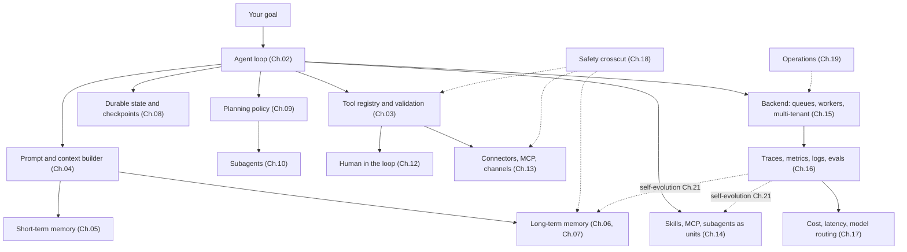

# 第 22 章 — 设计你自己的 agent

你读完了二十一章。这一章不是又一章。它是一张设计画布 —— 一种把第 01 到 21 章里的所有东西,翻译成 *你的* 项目具体形状的方法。先有意图,再谈架构:用例、目标、范围、预算、用户、成功标准、最糟的错误。意图清晰之后,架构基本就是挑前面章节里哪些组件是承重墙、哪些可以等的事。

教程项目通常让所有人造同一个东西。这对判分有用;但对培养品味、所有权,或者真正发布你在乎的东西,没用。Agent 系统的领域很宽 —— 个人助理、编码 agent、研究 agent、工作流控制面、内部工具、企业自动化,还有一些目前没有名字的类别。课程给了你拼装的零件;这一章帮你判断你的项目实际需要哪几块。

这一章还做了一件刻意的事:不再写代码。前面每一章都是地图;这一章是罗盘。最小可信的第一版有一个清晰的工作、几个工具、基础的可观测性,和一个停止条件。代码会从你跟自己 agent 的对话里、在你自己的问题上长出来。

---

## 概念

### 整个系统装在一张图里

把它当成一个 *什么可能是承重墙* 的清单,而不是 *什么必须存在* 的蓝图。你的第一版可能只会用到这里的四五个方框 —— loop、几个工具、基础 memory、一个 trace sink。其他的多半是当负载证明必要时才加上去的层。第 11 章是把所有这些粘起来的组合层;第 19 章是让它长期跑下去;第 20 章覆盖 agent 主动行动;第 21 章把可观测性回流到 memory 和 skill 那条边给闭上,让下一次会话能用上。

如果你能给每个方框命名,并向一个朋友讲清它做什么,你就可以动手了。

### 先讲意图 —— 项目画布

任何架构决定之前,先回答这些问题。这份画布里没有一个问题是关于 *怎么做* 的;全是关于 *是什么* 和 *为什么*。

- **用例。** 用一句话讲清:这个 agent 反复在做什么具体任务?*"它给进来的客服工单分流并起草人工 review 的回复"* 是用例。*"它是个 AI 助手"* 不是。
- **目标。** 用户眼里成功长什么样?省下时间?更快周转?更少错误?要具体。
- **范围。** 第一版的范围里有什么、范围外有什么?狠下心来。范围外的都是 *下一版*。
- **预算。** 每次 run 能花多少?每个用户每个月多少?如果你回答不出来,agent 会用一张你没预料到的账单告诉你答案。
- **用户。** 多少人?谁?支持模式是什么?一个运维者带着五个同事,跟一万个陌生人,是两种系统。
- **成功标准。** 你怎么知道它在起作用?指标是什么?谁来度量?
- **最糟的错误。** Agent 可能做的最糟糕但又合理的事是什么?*"发了一封错邮件"* 可以恢复;*"删了客户的数据"* 不行。这里的答案决定你第 12 章的审批和第 18 章的控制。

七个问题,十分钟的写作。如果有任何一个含糊,后面的架构决定也会含糊。如果它们都清晰,架构基本会自己组合出来。

### 架构画布 —— 跟你的 agent 一起走一遍

意图锁定之后,坐下来跟你的 agent 一起走这些条目。每一项都指向那一章的完整内容;agent 可以跟你一起读那些章节。目标不是现在回答完所有问题 —— 是你知道你已经回答了哪些、推迟了哪些。

- **Loop 形状 (第 2、9 章)。** 任务是一次性的、多步的,还是长跑的?需要一个显式 plan,还是选工具就够了?哪个停止条件能证明这次 run 完成了?
- **工具与权限 (第 3、12 章)。** Agent 需要哪些工具?哪些是只读的、破坏性的、幂等的?哪些需要审批门?
- **Memory 层 (第 5、6、7 章)。** 需要记用户偏好、项目事实、之前的失败吗?用文件、结构化、向量,还是混合?谁能查看、编辑或删除 memory?
- **持久化 (第 8 章)。** Run 需要熬过崩溃或一次部署吗?恢复故事是什么?
- **Connector (第 13 章)。** 哪些通道 —— Slack、Telegram、web、CLI、MCP server、自定义?你需要写哪些 adapter?
- **扩展形态 (第 14 章)。** Agent 学到的东西哪些应该变成 skill (markdown)、哪些变成 MCP tool (外部),哪些变成 subagent (自己的 loop)?
- **后端拓扑 (第 15 章)。** 内嵌单进程、gateway,还是多机?10× 用量时长什么样?
- **可观测性 (第 16 章)。** 哪些指标重要?一条成功的 trace 长什么样?你发布时最小的 eval 套件是什么?
- **成本策略 (第 17 章)。** 哪里可以用一个确定性工具替掉一次 LLM 调用?模型 profile 是什么?预算门在哪里?
- **安全 (第 18 章)。** 每个输入源归哪一档信任?哪些攻击对你的用例重要?纵深防御长什么样?
- **运维 (第 19 章)。** 运维者是谁?前置部署还是托管?第一天就有哪些 runbook?
- **主动触发器 (第 20 章)。** Agent 在没人发请求时做事吗 —— cron、webhook、watchdog?哪些类别是 opt-in 的?升级阶梯长什么样?
- **自演化 (第 21 章)。** 允许什么自动演化?什么留在人工变更下?回滚路径是什么?

你不需要回答所有这些。你需要知道哪些已经决定、哪些已经推迟、哪些根本还没想过。跟你一起读这一章的 agent,可以按需带你深入任何一项。

### 选一个 archetype

五个 archetype 在生产级 agent 系统里反复出现。挑离你项目最近的那一个;它的承重章节列在旁边。

- **个人助理 gateway** —— 多个入口通道喂给一个自托管 agent。参考:OpenClaw、Hermes Agent。承重:connector (第 13 章)、memory (第 5–7 章)、安全 (第 18 章)、可观测性 (第 16 章)、前置部署运维 (第 19 章)、主动触发器 (第 20 章)、自演化 (第 21 章)。
- **编码 agent** —— 读、改、测试、对代码做推理。参考:OpenCode。承重:工具校验 (第 3 章)、loop 和停止条件 (第 2 章)、状态和恢复 (第 8 章)、权限和审批 (第 12 章)、可观测性 (第 16 章)、成本策略 (第 17 章)。
- **工作流控制面** —— 编排许多 agent、任务、审批、预算、工作区。参考:Paperclip。承重:后端基础设施 (第 15 章)、HITL 和治理 (第 12 章)、connector (第 13 章)、可观测性 (第 16 章)、持久化状态 (第 8 章)、多租户安全 (第 18 章)。
- **知识与研究 agent** —— 检索、综合、引用,把知识库保持新鲜。参考:Hermes Agent 的 memory 模式、OpenCode 的压缩。承重:长期召回 (第 6 章)、上下文与缓存 (第 4、5 章)、工具校验 (第 3 章)、带显式 eval 的可观测性 (第 16 章)、给知识库做自演化 (第 21 章)。
- **前置部署的企业 agent** —— 定制、local-first,工程师跟系统一起交付。参考:Hermes Agent、OpenClaw,以及 OpenCode 的一部分。承重:运维 (第 19 章)、带严格信任边界的安全 (第 18 章)、memory 隐私 (第 6、7 章)、runbook 纪律 (第 19 章)、无人值守工作的主动触发器 (第 20 章)、自演化门 (第 21 章)。

这些是透镜,不是规定的造法。多数真实项目混两个 —— 一个编码 agent 加上工作流控制面的编排,一个个人助理 gateway 加上知识库检索。挑离得近的那个,等你超出第一个时第二个再进来。

---

## 最后的话

这门课的意义从来不是让你照搬别人的产品或背一个框架。它是给你一张系统地图。一旦你能给 loop、边界、prompt、memory、持久化、planner、委派、harness、审批门、connector、skill、后端、trace、路由、安全策略、runbook、演化反馈边各自命名,你设计自己的东西时直觉会好得多 —— 剩下的让你的 agent 来填。

去造一个你真心希望它存在的东西。跟你一起读这一章的 agent,你准备好了它就准备好了。
