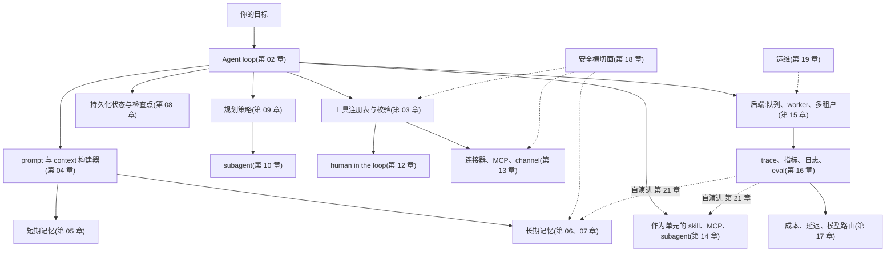

# 第 22 章 — 设计你自己的 agent

你读完了二十一章。这一章不是又一章。它是一张设计画布 —— 一种把第 01 到 21 章里的所有东西,落到 *你的* 项目具体形态上的方法。先有意图,再谈架构:用例、目标、范围、预算、用户、成功标准、最糟的错误。意图清晰之后,架构基本就只剩一件事:挑出前面章节里哪些组件是承重的、哪些可以暂缓。

教程项目通常让所有人做同一个东西。这对判分有用;但对培养品味、对建立归属感,或者对真正发布一个你在乎的东西,都没用。Agent 系统的领域很宽 —— 个人助理、编码 agent、研究 agent、工作流控制面、内部工具、企业自动化,还有一些目前没有名字的类别。课程给了你各种零件;这一章帮你判断你的项目究竟需要哪几块。

这一章还刻意做了一件事:不再写代码。前面每一章都是地图;这一章是罗盘。最小可信的第一版有一个明确的职责、几个工具、基础的可观测性,和一个停止条件。代码会从你跟自己 agent 的对话里、针对你自己的问题生长出来。

---

## 概念

### 整个系统装在一张图里

把它当成一份 *什么可能是承重的* 的清单,而不是 *什么必须存在* 的蓝图。你的第一版可能只会用到这里的四五个方框 —— loop、几个工具、基础记忆、一个 trace sink。其余的大多是负载增长到一定程度、确实有必要时才加上去的层。第 11 章是把这一切粘合起来的组合层;第 19 章讲它如何长期运转;第 20 章讲 agent 主动行动;第 21 章把从可观测性回流到记忆和 skill 的那条反馈边闭合,让下一次会话能用上这些反馈。

如果你能说出每个方框的名字,并向一个朋友讲清它是做什么的,你就可以动手了。

### 先讲意图 —— 项目画布

在做任何架构决定之前,先回答这些问题。这份画布里没有一个问题是关于 *怎么做* 的;全都是关于 *是什么* 和 *为什么*。

- **用例。** 用一句话讲清:这个 agent 反复在做的那个具体任务是什么?*"它给进来的客服工单分流,并起草供人工 review 的回复"* 是用例。*"它是个 AI 助手"* 不是。
- **目标。** 在用户眼里,成功是什么样子?省下时间?更快周转?更少出错?要具体。
- **范围。** 第一版里哪些在范围内、哪些在范围外?狠下心来定。凡是范围外的,都是 *下一版* 的事。
- **预算。** 每次 run 能花多少?每个用户每个月多少?如果你答不上来,agent 会用一张你没预料到的账单替你给出答案。
- **用户。** 多少人?他们是谁?支持模式是什么?一个运维者带着五个同事,和面向一万个陌生人,是两种完全不同的系统。
- **成功标准。** 你怎么知道它起了作用?指标是什么?谁来度量?
- **最糟的错误。** Agent 有可能做出的、最糟又确实可能发生的事是什么?*"发了一封错邮件"* 可以挽回;*"删掉客户的数据"* 不行。这里的答案,决定了你第 12 章的审批和第 18 章的控制。

七个问题,写下来十分钟。只要有任何一个含糊,随后的架构决定也会跟着含糊。它们全都清晰了,架构基本就会自己组合出来。

### 架构画布 —— 跟你的 agent 一起走一遍

意图锁定之后,坐下来,跟你的 agent 一起把这些条目过一遍。每一项都指向有完整论述的那一章;agent 可以陪你一起读。目标不是现在就把所有问题回答完 —— 而是让你清楚自己已经回答了哪些、又推迟了哪些。

- **Loop 形状 (第 2、9 章)。** 任务是一次性的、多步的,还是长时间运行的?它需要一个显式的 plan,还是选对工具就够了?哪个停止条件能证明这次 run 已经完成?
- **工具与权限 (第 3、12 章)。** Agent 需要哪些工具?哪些是只读的、破坏性的、幂等的?哪些需要加一道审批门?
- **记忆层 (第 5、6、7 章)。** 它需要记住用户偏好、项目事实、过往的失败吗?用文件、结构化存储、向量,还是混合?谁能查看、编辑或删除记忆?
- **持久化 (第 8 章)。** 一次 run 需要扛过崩溃或一次部署吗?它的恢复方案是怎样的?
- **Connector (第 13 章)。** 接哪些通道 —— Slack、Telegram、web、CLI、MCP server,还是自定义?你需要写哪些 adapter?
- **扩展形态 (第 14 章)。** Agent 学到的东西里,哪些应该变成 skill(markdown)、哪些变成 MCP tool(外部),哪些变成子 agent(自带一个 loop)?
- **后端拓扑 (第 15 章)。** 内嵌单进程、gateway,还是多机?用量涨到 10 倍时是什么样子?
- **可观测性 (第 16 章)。** 哪些指标重要?一条成功的 trace 长什么样?你上线时要带的最小 eval 套件是什么?
- **成本策略 (第 17 章)。** 哪里可以用一个确定性工具替掉一次 LLM 调用?有哪些模型 profile?预算门设在哪里?
- **安全 (第 18 章)。** 每个输入源归在哪一档信任级别?哪些攻击对你的用例真正重要?纵深防御长什么样?
- **运维 (第 19 章)。** 谁来当运维者?是前向部署还是托管?第一天就要备好哪些 runbook?
- **主动触发器 (第 20 章)。** Agent 会在没有用户发请求时主动做事吗 —— cron、webhook、watchdog?哪些类别是 opt-in 的?升级阶梯长什么样?
- **自演进 (第 21 章)。** 允许哪些东西自动演进?哪些必须留在人工变更之下?回滚路径是什么?

你不需要回答全部这些问题。你需要的是清楚:哪些已经决定、哪些已经推迟、哪些根本还没想过。陪你一起读这一章的 agent,可以按需带你深入其中任何一项。

### 选一个范型(archetype)

有五种范型(archetype)在生产级 agent 系统里反复出现。挑离你项目最近的那一个;它对应的承重章节列在旁边。

- **个人助理 gateway** —— 多个入口通道汇入一个自托管 agent。参考:OpenClaw、Hermes Agent。承重:connector (第 13 章)、记忆 (第 5–7 章)、安全 (第 18 章)、可观测性 (第 16 章)、前向部署运维 (第 19 章)、主动触发器 (第 20 章)、自演进 (第 21 章)。
- **编码 agent** —— 读代码、改代码、跑测试、对代码做推理。参考:OpenCode。承重:工具校验 (第 3 章)、loop 与停止条件 (第 2 章)、状态与恢复 (第 8 章)、权限与审批 (第 12 章)、可观测性 (第 16 章)、成本策略 (第 17 章)。
- **工作流控制面** —— 编排众多 agent、任务、审批、预算、工作区。参考:Paperclip。承重:后端基础设施 (第 15 章)、HITL 与治理 (第 12 章)、connector (第 13 章)、可观测性 (第 16 章)、持久化状态 (第 8 章)、多租户安全 (第 18 章)。
- **知识与研究 agent** —— 检索、综合、引用,并让知识库保持新鲜。参考:Hermes Agent 的记忆模式、OpenCode 的压缩。承重:长期召回 (第 6 章)、上下文与缓存 (第 4、5 章)、工具校验 (第 3 章)、带显式 eval 的可观测性 (第 16 章)、面向知识库的自演进 (第 21 章)。
- **前向部署的企业 agent** —— 定制、local-first,工程师与系统一起交付。参考:Hermes Agent、OpenClaw,以及 OpenCode 的部分内容。承重:运维 (第 19 章)、带严格信任边界的安全 (第 18 章)、记忆隐私 (第 6、7 章)、runbook 纪律 (第 19 章)、面向无人值守工作的主动触发器 (第 20 章)、自演进的把关门 (第 21 章)。

这些是观察问题的透镜,不是规定好的造法。多数真实项目会把两种混在一起 —— 一个编码 agent 配上工作流控制面的编排,一个个人助理 gateway 配上知识库检索。先挑离得更近的那个;等你做着做着超出了它的范围,第二个再补进来。

---

## 最后的话

这门课的意义,从来不是让你照搬别人的产品,或者背下某个框架。它要给你的是一张系统地图。一旦你能为 loop、边界、prompt、记忆、持久化、planner、委派、harness、审批门、connector、skill、后端、trace、路由、安全策略、runbook、演进反馈边一一命名,你在设计自己的东西时,直觉就会好得多 —— 其余的,交给你的 agent 来补。

去造一个你真心希望它存在的东西吧。陪你一起读完这一章的 agent,只等你准备好。
